学过Python数据分析的朋友都知道，在可视化的工具中，有很多优秀的三方库，比如matplotlib，seaborn，plotly，Boken，pyecharts等等。这些可视化库都有自己的特点，在实际应用中也广为大家使用。<br />plotly、Boken等都是交互式的可视化工具，结合Jupyter notebook可以非常灵活方便地展现分析后的结果。虽然做出的效果非常的炫酷，比如plotly，但是每一次都需要写很长的代码，一是麻烦，二是不便于维护。<br />在数据的分析阶段，更多的时间应该放在分析上，维度选择、拆解合并，业务理解和判断。如果既可以减少代码量，又可以做出炫酷可视化效果，那将大大提高效率。当然如果有特别的需求除外，此方法仅针对想要快速可视化进行分析的人。<br />介绍一个非常棒的工具，**cufflinks**，可以完美解决这个问题，且效果一样炫酷。
<a name="NTcCJ"></a>
## cufflinks介绍
就像seaborn封装了matplotlib一样，cufflinks在plotly的基础上做了一进一步的包装，方法统一，参数配置简单。其次它还可以结合pandas的dataframe随意灵活地画图。可以把它形容为**"pandas like visualization"**<br />毫不夸张地说，画出各种炫酷的可视化图形，只需一行代码，效率非常高，同时也降低了使用的门槛儿。<br />cufflinks的github链接如下：[https://github.com/santosjorge/cufflinks](https://github.com/santosjorge/cufflinks)
<a name="uzS3K"></a>
## cufflinks安装
直接pip install即可。
```bash
pip install cufflinks
```
<a name="ZkqCb"></a>
## cufflinks使用
cufflinks库一直在不断更新，目前最新版为V0.14.0，支持plotly3.0。首先看看它都支持哪些种类的图形，可以通过help来查看。
```python
import cufflinks as cf
cf.help()

Use 'cufflinks.help(figure)' to see the list of available parameters for the given figure.
Use 'DataFrame.iplot(kind=figure)' to plot the respective figure
Figures:
  bar
  box
  bubble
  bubble3d
  candle
  choroplet
  distplot
  heatmap
  histogram
  ohlc
  pie
  ratio
  scatter
  scatter3d
  scattergeo
  spread
  surface
  violin
```
使用方法其实很简单，总结一下，它的格式大致是这样的：<br />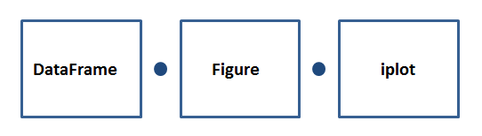

- **DataFrame：**代表pandas的数据框；
- **Figure：**代表上面看到的可绘制图形，比如bar、box、histogram等等；

- **iplot：**代表绘制方法，其中有很多参数可以进行配置，调节符合自己风格的可视化图形；
<a name="fb2uQ"></a>
## cufflinks实例
通过几个实例感受一下上面的使用方法。使用过plotly的朋友可能知道，如果使用online模式，那么生成的图形是有限制的。所以，这里先设置为offline模式，这样就避免了出现次数限制问题。
```python
import pandas as pd
import cufflinks as cf
import numpy as np

cf.set_config_file(offline=True)
```
然后需要按照上面的使用格式来操作，首先需要有个DataFrame，如果手头没啥数据，那可以先生成个随机数。cufflinks有一个专门生成随机数的方法，叫做datagen，用于生成不同维度的随机数据，比如下面。
<a name="YQzd1"></a>
### lines线图
```python
cf.datagen.lines(1,500).ta_plot(study='sma',periods=[13,21,55])
```
1）cufflinks使用datagen生成随机数；<br />2）figure定义为lines形式，数据为(1,500)；<br />3）然后再用ta_plot绘制这一组时间序列，参数设置SMA展现三个不同周期的时序分析。<br />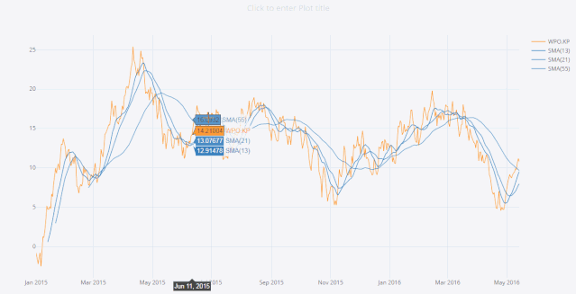
<a name="SC0tV"></a>
### box箱型图
还是与上面用法一样，一行代码解决。
```python
cf.datagen.box(20).iplot(kind='box',legend=False)
```
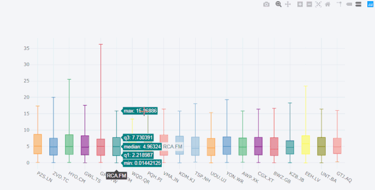<br />可以看到，x轴每个box都有对应的名称，这是因为cufflinks通过kind参数识别了box图形，自动为它生成的名字。如果只生成随机数，它是这样子的，默认生成100行的随机分布的数据，列数由自己选定。<br />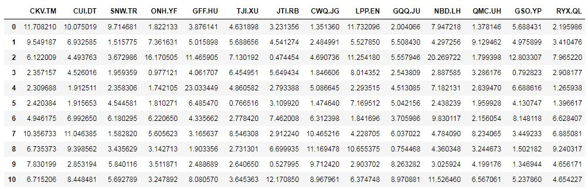
<a name="Q02Ku"></a>
### histogram直方图
```python
cf.datagen.histogram(3).iplot(kind='histogram')
```
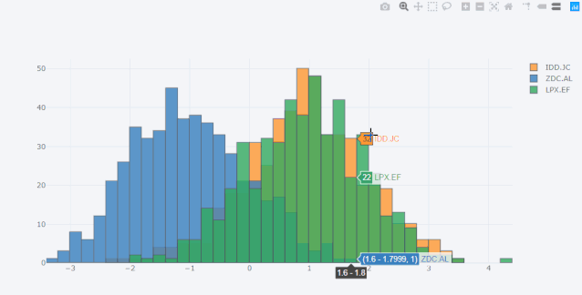<br />和plotly一样，可以通过一些辅助的小工具框选或者lasso选择来区分和选定指定区域，只要一行代码。<br />当然了，除了随机数据，任何的其它dataframe数据框都可以，包括自己导入的数据。
<a name="Tq5kU"></a>
### histogram条形图
```python
df=pd.DataFrame(np.random.rand(10, 4), columns=['a', 'b', 'c', 'd'])
df.iplot(kind='bar',barmode='stack')
```
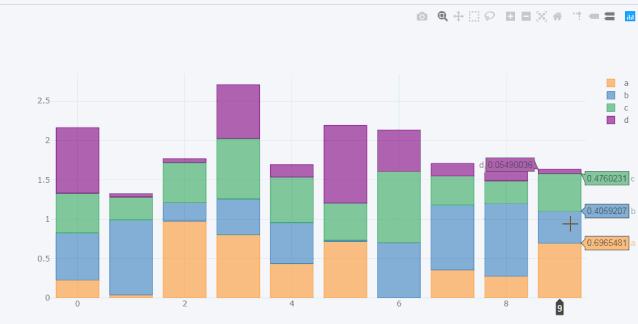<br />上面生成了一个(10,4)的dataframe数据框，名称分别是a,b,c,d。那么cufflinks将会根据iplot中的kind种类自动识别并绘制图形。参数设置为堆叠模式。
<a name="yqUQZ"></a>
### scatter散点图
```python
df = pd.DataFrame(np.random.rand(50, 4), columns=['a', 'b', 'c', 'd'])
df.iplot(kind='scatter',mode='markers',colors=['orange','teal','blue','yellow'],size=10)
```
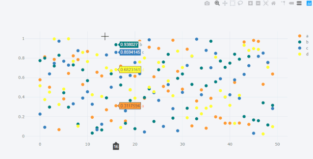
<a name="ndLjR"></a>
### bubble气泡图
```python
df.iplot(kind='bubble',x='a',y='b',size='c')
```
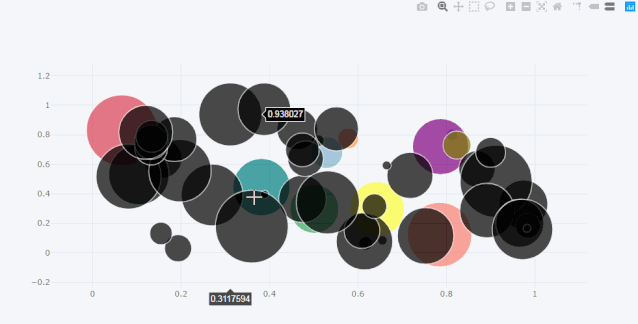
<a name="PEuJk"></a>
### scatter matrix 散点矩阵图
```python
df = pd.DataFrame(np.random.randn(1000, 4), columns=['a', 'b', 'c', 'd'])
df.scatter_matrix()
```
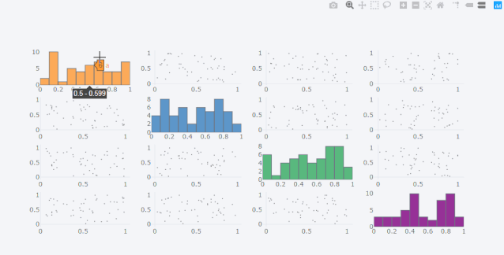
<a name="g0Qki"></a>
### subplots 子图
```python
df=cf.datagen.lines(4)
df.iplot(subplots=True,shape=(4,1),shared_xaxes=True,vertical_spacing=.02,fill=True)
```
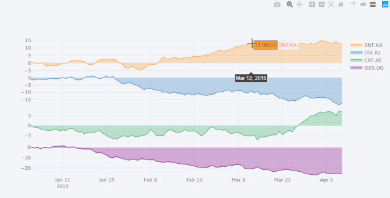
```python
df.iplot(subplots=True,subplot_titles=True,legend=False)
```
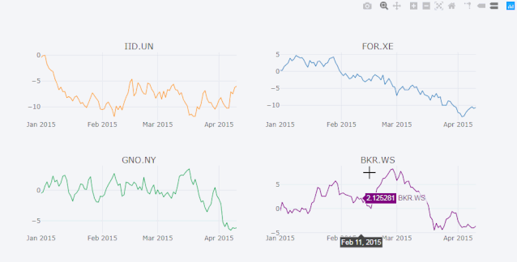<br />再比如复杂一点的。
```python
df=cf.datagen.bubble(10,50,mode='stocks')
figs=cf.figures(df,[dict(kind='histogram',keys='x',color='blue'),
                    dict(kind='scatter',mode='markers',x='x',y='y',size=5),
                    dict(kind='scatter',mode='markers',x='x',y='y',size=5,color='teal')],asList=True)
figs.append(cf.datagen.lines(1).figure(bestfit=True,colors=['blue'],bestfit_colors=['pink']))
base_layout=cf.tools.get_base_layout(figs)
sp=cf.subplots(figs,shape=(3,2),base_layout=base_layout,vertical_spacing=.15,horizontal_spacing=.03,
               specs=[[{'rowspan':2},{}],[None,{}],[{'colspan':2},None]],
               subplot_titles=['Histogram','Scatter 1','Scatter 2','Bestfit Line'])
sp['layout'].update(showlegend=False)
cf.iplot(sp)
```
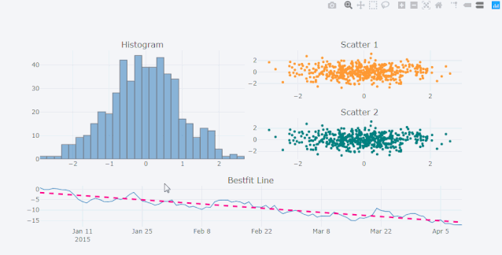
<a name="y6Lsl"></a>
### shapes 形状图
如果想在lines图上增加一些直线作为参考基准，这时候可以使用hlines的类型图。
```python
df=cf.datagen.lines(3,columns=['a','b','c'])
df.iplot(hline=[dict(y=-1,color='blue',width=3),dict(y=1,color='pink',dash='dash')])
```
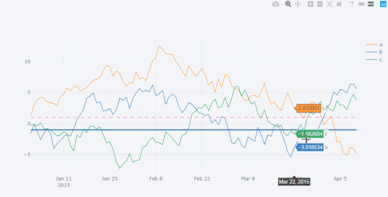<br />或者是将某个区域标记出来，可以使用hspan类型。
```python
df.iplot(hspan=[(-1,1),(2,5)])
```
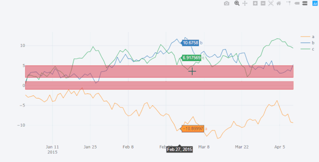<br />又或者是竖条的区域，可以用vspan类型。
```python
df.iplot(vspan={'x0':'2015-02-15','x1':'2015-03-15','color':'teal','fill':True,'opacity':.4})
```
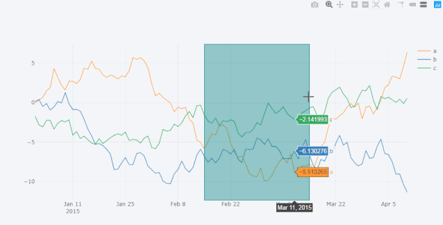<br />如果对iplot中的参数不熟练，直接输入以下代码即可查询。
```python
help(df.iplot)
```
