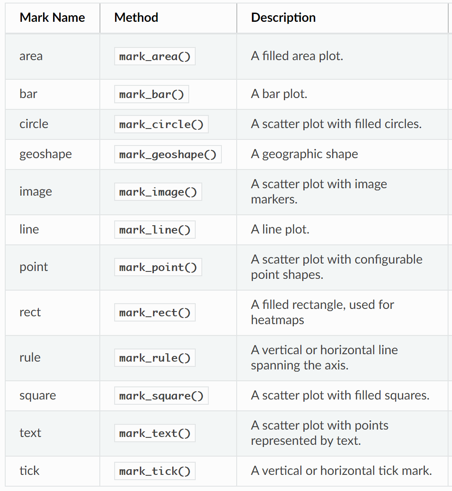
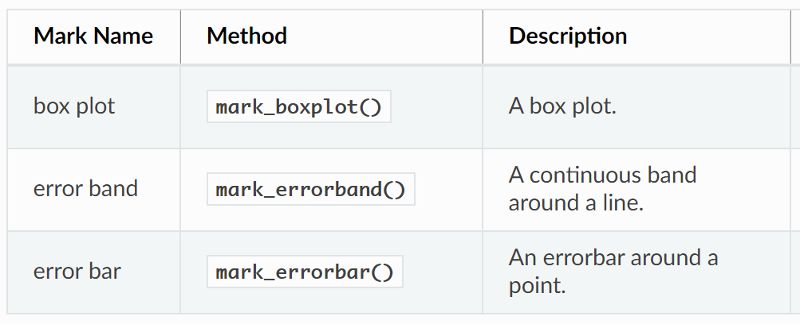
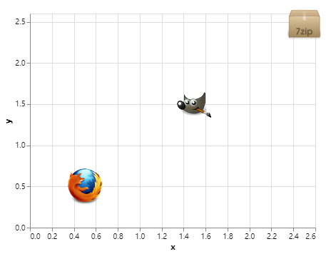
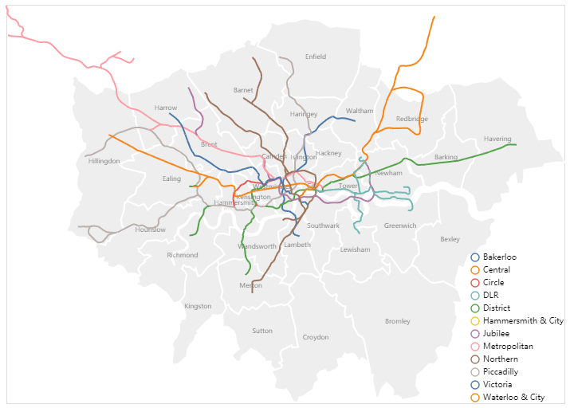
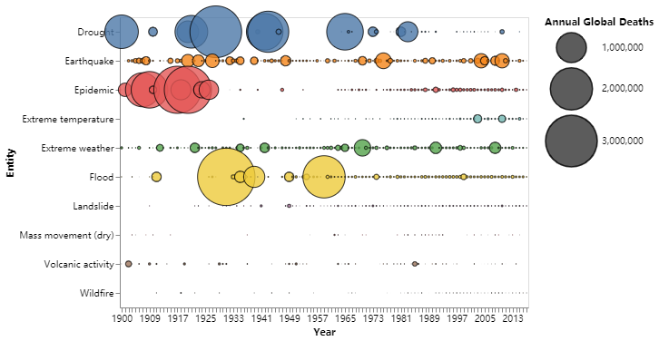
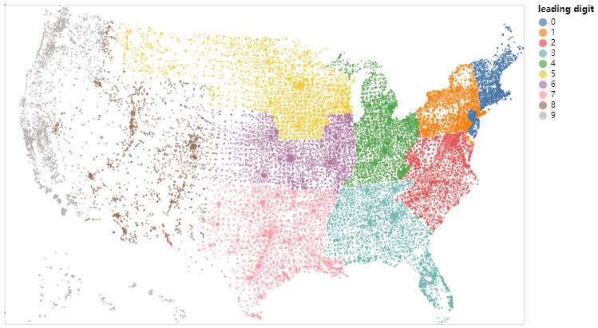

Python Altair<br />Altair是基于Vega和Vega-Lite的Python数据统计可视化库，其优秀的交互、数据统计功能和清新的配色。系统介绍下Altair包的基本绘图流程。主要内容如下：

- Altair绘图三大主要步骤
- Altair样例
<a name="LjTUV"></a>
## Altair绘图三大主要步骤
在绘制可视化作品之前，需要导入绘图所需的数据，Altair库的数据导入格式是标准的`Pandas.Dataframe`类型，这也很大程度上完善了Python 数据可视化流程化过程，省去了数据转换的过程。介绍完所需要的数据类型，接下里就详细介绍Altair可视化主要的**「三大步骤」**。
<a name="UJZl5"></a>
### `Chart(Object)`对象转换
在进行Altair可视化绘制时，要将之前读取的的数据转换成可被Altair接受的绘图对象，这时候，需要调用Altair库的`Chart()`方法将数据转换成Altair的Chart对象。这一步骤也是必须和操作的，下面是一个参考样例：
```python
import altair as alt
chart = alt.Chart(data) # data为要绘制的数据，Dataframe类型
```
<a name="bJ3un"></a>
### Encodings and Marks
在生成图表对象之后，就可以根据数据指定希望绘制的可视化作品。Altair库通过图表对象(Chart Object)的`mark`属性完成的，即可以通过`Chart.mark_ *`方法获取多种图表格式。可以使用`mark_point()`来绘制点图，代码如下：
```python
alt.Chart(data).mark_point()
```
除了`mark_point()`绘图函数外，Altair提供的其他表格类型如下表：<br /><br />除此之外，Altair还提供给了组合图，即熟悉的统计类图表，如下：<br /><br />当然，最喜欢的一个绘图功能是下面这一个：直接填充图片(根据赋值的x、y坐标信息)，就可以实现图片的填充效果图了，生成例如男女比例小头像的的统计图表就会更加立体形象，举例如下：
```python
import altair as alt
import pandas as pd

source = pd.DataFrame.from_records([
      {"x": 0.5, "y": 0.5, "img": "https://vega.github.io/vega-datasets/data/ffox.png"},
      {"x": 1.5, "y": 1.5, "img": "https://vega.github.io/vega-datasets/data/gimp.png"},
      {"x": 2.5, "y": 2.5, "img": "https://vega.github.io/vega-datasets/data/7zip.png"}
])

alt.Chart(source).mark_image(
    width=50,
    height=50
).encode(
    x='x',
    y='y',
    url='img'
)
```
可视化结果如下：<br /><br />要想对各类mark进行定制化操作，Altair也提供了大量可以进行定制化操作的Mark Properties (属性)，除了比较常见的*颜色(color)、填充(fill)、大小(size)、透明度(opacity)、形状(shape)*外，还提供大量的其他属性，用于灵活构建自己的可视作品，更多详细的内容，可以参考其官网，如下：[https://altair-viz.github.io/user_guide/marks.html](https://altair-viz.github.io/user_guide/marks.html)<br />在选择完mark对象后，接下来要做的就是如何将数据进行映射，比如，绘制散点图，需要将数据中的哪一列映射到X轴，哪一列映射到Y轴呢？这时候就需要用到Altair的`Chart.encode()`方法。<br />`Encode()`方法可直接将如坐标轴(x，y)，颜色，形状，大小等图表属性通过`pandas dataframes`数据中的列名建立映射关系。比如下面这个例子就是将a列映射到X轴，b列y映射到Y轴的散点图：
```python
alt.Chart(data).mark_point().encode(
    x='a',
    y='b'
)
```
更多`encode()`方法，可以参照以下网址进行了解：[https://altair-viz.github.io/user_guide/encoding.html](https://altair-viz.github.io/user_guide/encoding.html)<br />在完成以上步骤后，就可以使用Altair库进行基本图表的绘制了，当然，如果想进行更加快速绘图(包括数据处理)，Altair也提供了用于数据处理转换的`Aggregation`方法，该方法可以在绘制图表过程中直接对数据进行如求平均、求和等聚合数据操作。比如，还是上边的例子，希望将b列的均值映射到Y轴上，常规操作是先对数据进行转换计算再进行 可视化绘制，这里可以直接通过以下代码完成数据处理-绘图操作：
```python
alt.Chart(data).mark_bar().encode(
    x='a',
    y='average(b)'
)
```
还可以通过以下方式来添加刻度轴名称、图例等绘图属性：
```python
alt.Chart(data).mark_bar(color='firebrick').encode(
    alt.Y('a', title='category'),
    alt.X('average(b)', title='avg(b) by category')
)
```
其中:`alt.Y`、`alt.X`方法则可以添加title、label等属性。
<a name="DhzVw"></a>
### 保存结果(Saving Altair Charts)
由于Altair为交互式的可视化库(基于JS)，其保存绘制结果的格式也相对较多，这里列举一下即可：
```python
import altair as alt

chart = alt.Chart(data.cars.url).mark_point().encode(
    x='',
    y='',
    color=''
)
# 保存json格式
chart.save('chart.json')
# 保存HTML 网页格式
chart.save('chart.html')
# 保存png格式
chart.save('chart.png')
# 保存svg格式
chart.save('chart.svg')
# 保存pdf格式
chart.save('chart.pdf')
```
其中保存png格式时还可以设置scale_factor属性，修改charts 大小或者分辨率，scale_factor默认大小为1。
```python
chart.save('chart.png', scale_factor=2.0)
```
<a name="GUazW"></a>
## Altair样例
介绍完Altair基本的绘图步骤后，列举几个优秀的可视化作品。
<a name="Tplsy"></a>
### 「样例一」：London Tube Lines
```python
import altair as alt
from vega_datasets import data

boroughs = alt.topo_feature(data.londonBoroughs.url, 'boroughs')
tubelines = alt.topo_feature(data.londonTubeLines.url, 'line')
centroids = data.londonCentroids.url

background = alt.Chart(boroughs).mark_geoshape(
    stroke='white',
    strokeWidth=2
).encode(
    color=alt.value('#eee'),
).properties(
    width=700,
    height=500
)

labels = alt.Chart(centroids).mark_text().encode(
    longitude='cx:Q',
    latitude='cy:Q',
    text='bLabel:N',
    size=alt.value(8),
    opacity=alt.value(0.6)
).transform_calculate(
    "bLabel", "indexof (datum.name,' ') > 0  ? substring(datum.name,0,indexof(datum.name, ' ')) : datum.name"
)

line_scale = alt.Scale(domain=["Bakerloo", "Central", "Circle", "District", "DLR",
                               "Hammersmith & City", "Jubilee", "Metropolitan", "Northern",
                               "Piccadilly", "Victoria", "Waterloo & City" ],
                       range=["rgb(137,78,36)", "rgb(220,36,30)", "rgb(255,206,0)",
                              "rgb(1,114,41)", "rgb(0,175,173)", "rgb(215,153,175)",
                              "rgb(106,114,120)", "rgb(114,17,84)", "rgb(0,0,0)",
                              "rgb(0,24,168)", "rgb(0,160,226)", "rgb(106,187,170)"])

lines = alt.Chart(tubelines).mark_geoshape(
    filled=False,
    strokeWidth=2
).encode(
    alt.Color(
        'id:N',
        legend=alt.Legend(
            title=None,
            orient='bottom-right',
            offset=0
        )
    )
)

background + labels + lines
```
可视化结果如下：<br />
<a name="ZrkwO"></a>
### 「样例二」：Natural Disasters
```python
import altair as alt
from vega_datasets import data

source = data.disasters.url

alt.Chart(source).mark_circle(
    opacity=0.8,
    stroke='black',
    strokeWidth=1
).encode(
    alt.X('Year:O', axis=alt.Axis(labelAngle=0)),
    alt.Y('Entity:N'),
    alt.Size('Deaths:Q',
        scale=alt.Scale(range=[0, 4000]),
        legend=alt.Legend(title='Annual Global Deaths')
    ),
    alt.Color('Entity:N', legend=None)
).properties(
    width=450,
    height=320
).transform_filter(
    alt.datum.Entity != 'All natural disasters'
)
```

<a name="BLuGd"></a>
### 「样例三」：One Dot Per Zipcode
```python
import altair as alt
from vega_datasets import data

# Since the data is more than 5,000 rows we'll import it from a URL
source = data.zipcodes.url

alt.Chart(source).transform_calculate(
    "leading digit", alt.expr.substring(alt.datum.zip_code, 0, 1)
).mark_circle(size=3).encode(
    longitude='longitude:Q',
    latitude='latitude:Q',
    color='leading digit:N',
    tooltip='zip_code:N'
).project(
    type='albersUsa'
).properties(
    width=650,
    height=400
)
```
可视化结果：<br /><br />更多其他优秀的可视化作品，可以前往altair官网进行查看：[https://altair-viz.github.io/gallery/index.html](https://altair-viz.github.io/gallery/index.html)
