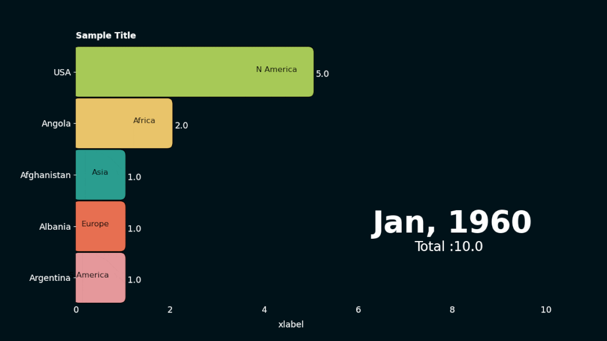
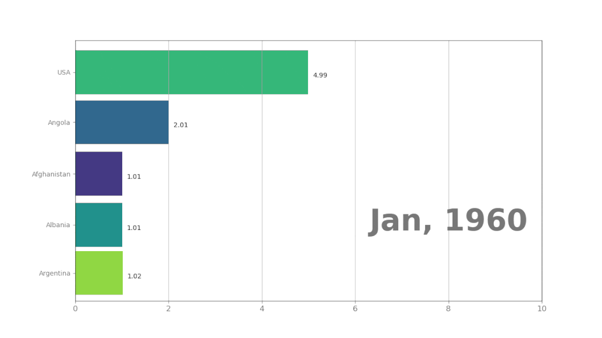

Python<br /><br />这是一位专攻Python语言的程序员开发的安装包，名叫Pynimate。<br />目前可以直接通过PyPI安装使用。
<a name="t4bJS"></a>
## 使用指南
想要使用Pynimate，直接`import`一下就行。
```python
import pynimate as nim
```
输入数据后，Pynimate将使用函数`Barplot()`来创建条形数据动画。<br />而创建这种动画，输入的数据必须是pandas数据结构（如下），其中将时间列设置为索引，换句话说索引代表的是自变量。
```
time, col1, col2, col3
2012   1     2     1
2013   1     1     2
2014   2     1.5   3
2015   2.5   2     3.5
```
具体的代码形式如下：
```python
import pandas as pd
df = pd.read_csv('data'csv').set_index('time')
```
比如要处理具体的数据，写成代码应该是这样子的。
```python
df = pd.DataFrame(
    {
        "time": ["1960-01-01", "1961-01-01", "1962-01-01"],
        "Afghanistan": [1, 2, 3],
        "Angola": [2, 3, 4],
        "Albania": [1, 2, 5],
        "USA": [5, 3, 4],
        "Argentina": [1, 4, 5],
    }
).set_index("time")
```
此外，要制作条形数据动画，Barplot还有三个必需的参数得注意：data、time_format和ip_freq（Interpolation frequency）。<br />data就是表格的数据，这里也就不再赘述。<br />time_format是指数据索引的时间日期格式，一般为：”%Y-%m-%d”。<br />最后是ip_freq，它是制作动画中比较关键的一步，通过线性插值使动画更加流畅丝滑。<br />一般来说，并不是所有的原始数据都适合做成动画，现在一个典型的视频是24fps，即每秒有24帧。<br />举个栗子🌰，下面这个表格中的数据只有三个时间点，按理说只能生成3帧视频，最终动画也只有3/24秒。
```
time, col1, col2
2012   1     3  
2013   2     2   
2014   3     1
```
这时候，ip_freq插值（线性）就开始发挥作用了，如果插值是一个季度，则得出的数据就变成了这样：
```
time     col1  col2
2012-01-01  1.00  3.00
2012-04-01  1.25  2.75
2012-07-01  1.50  2.50
2012-10-01  1.75  2.25
2013-01-01  2.00  2.00
2013-04-01  2.25  1.75
2013-07-01  2.50  1.50
2013-10-01  2.75  1.25
2014-01-01  3.00  1.00
```
具体的插值时间间隔为多久，则要视具体的数据而定，一般绘制大数据时，设置为`ip_freq = None`。<br />至此，就能生成数据动画了，完整代码如下所示：
```python
from matplotlib import pyplot as plt
import pandas as pd
import pynimate as nim

df = pd.DataFrame(
    {
        "time": ["1960-01-01", "1961-01-01", "1962-01-01"],
        "Afghanistan": [1, 2, 3],
        "Angola": [2, 3, 4],
        "Albania": [1, 2, 5],
        "USA": [5, 3, 4],
        "Argentina": [1, 4, 5],
    }
).set_index("time")

cnv = nim.Canvas()
bar = nim.Barplot(df, "%Y-%m-%d", "2d")
bar.set_time(callback=lambda i, datafier: datafier.data.index[i].year)
cnv.add_plot(bar)
cnv.animate()
plt.show()
```
这是插值为两天，生成的动画效果。<br /><br />最后还有一个问题，那就是保存动画，有两个格式可以选择：gif或者mp4。<br />保存为动图一般使用：
```python
cnv.save("file", 24, "gif")
```
若要保存为mp4的话，ffmpeg是个不错的选择，它是保存为mp4的标准编写器。
```bash
pip install ffmpeg-python
```
或者
```bash
conda install ffmpeg
```
当然，同样也可以使用`Canvas.save()`来保存。
```python
cnv.save("file", 24 ,"mp4")
```
