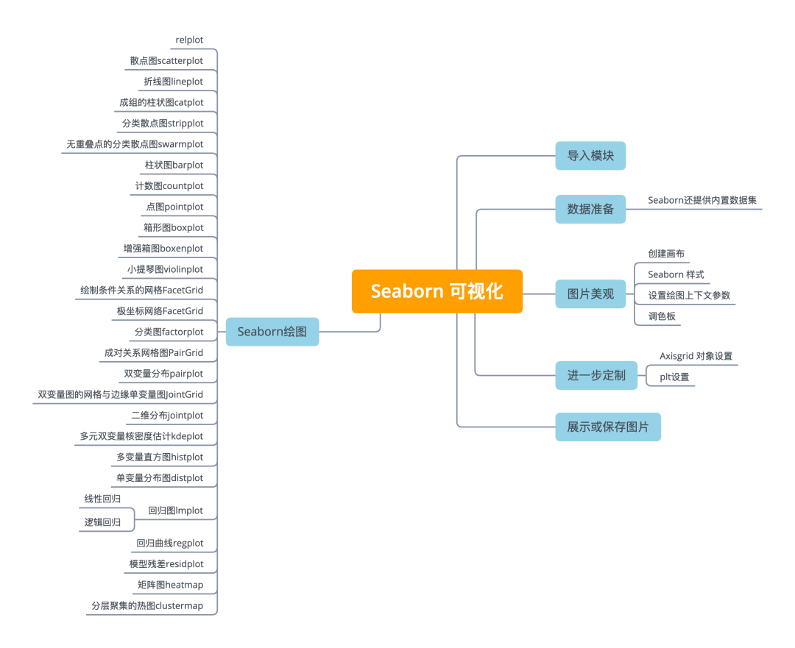
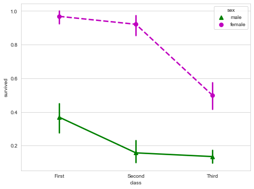
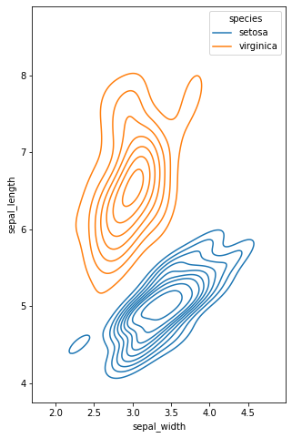

Python Seaborn<br /><br />Python可视化库Seaborn基于matplotlib，并提供了绘制吸引人的统计图形的高级接口。<br />Seaborn就是让困难的东西更加简单。它是针对统计绘图的，一般来说，能满足数据分析90%的绘图需求。Seaborn其实是在matplotlib的基础上进行了更高级的API封装，从而使得作图更加容易，在大多数情况下使用seaborn就能做出很具有吸引力的图，应该把Seaborn视为matplotlib的补充，而不是替代物。同时它能高度兼容numpy与pandas数据结构以及scipy与statsmodels等统计模式。<br />seaborn一共有5个大类21种图，分别是：

- Relational plots 关系类图表
   1. relplot 关系类图表的接口，其实是下面两种图的集成，通过指定kind参数可以画出下面的两种图
   2. scatterplot 散点图
   3. lineplot 折线图
- Categorical plots 分类图表 catplot 分类图表的接口，其实是下面八种图表的集成，，通过指定kind参数可以画出下面的八种图
   1. stripplot 分类散点图
   2. swarmplot 能够显示分布密度的分类散点图
   3. boxplot 箱图
   4. violinplot 小提琴图
   5. boxenplot 增强箱图
   6. pointplot 点图
   7. barplot 条形图
   8. countplot 计数图
- Distribution plot 分布图
   1. jointplot 双变量关系图
   2. pairplot 变量关系组图
   3. distplot 直方图，质量估计图
   4. kdeplot 核函数密度估计图
   5. rugplot 将数组中的数据点绘制为轴上的数据
- Regression plots 回归图
   1. lmplot 回归模型图
   2. regplot 线性回归图
   3. residplot 线性回归残差图
- Matrix plots 矩阵图
   1. heatmap 热力图
   2. clustermap 聚集图
<a name="V1252"></a>
## 导入模块
使用以下别名来导入库:
```python
import matplotlib.pyplot as plt
import seaborn as sns
```
使用Seaborn创建图形的基本步骤是:

1. 准备一些数据
2. 控制图美观
3. Seaborn绘图
4. 进一步定制你的图形
5. 展示图形
```python
import matplotlib.pyplot as plt 
import seaborn as sns
tips = sns.load_dataset("tips")    # Step 1
sns.set_style("whitegrid")         # Step 2 
g = sns.lmplot(x="tip",            # Step 3
               y="total_bill",
               data=tips,
               aspect=2)            
g = (g.set_axis_labels("Tip","Total bill(USD)") \
    .set(xlim=(0,10),ylim=(0,100)))                                                                                     
plt.title("title")                 # Step 4
plt.show(g) 
```
若要在NoteBook中展示图形，可使用魔法函数：
```python
%matplotlib inline
```

<a name="zQH1y"></a>
## 数据准备
```python
import pandas as pd
import numpy as np
uniform_data = np.random.rand(10, 12)
data = pd.DataFrame({'x':np.arange(1,101),
                     'y':np.random.normal(0,4,100)})
```
<a name="xCwEp"></a>
### Seaborn还提供内置数据集
```python
# 直接加载，到网上拉取数据
titanic = sns.load_dataset("titanic")
iris = sns.load_dataset("iris")

# 如果下载较慢，或加载失败，可以下载到本地，然后加载本地路径
titanic = sns.load_dataset('titanic',data_home='seaborn-data',cache=True)
iris = sns.load_dataset("iris",data_home='seaborn-data',cache=True)
```
下载地址：[https://github.com/mwaskom/seaborn-data](https://github.com/mwaskom/seaborn-data)
<a name="OAwBv"></a>
## 图片美观
<a name="mhpT7"></a>
### 创建画布
```python
# 创建画布和一个子图
f, ax = plt.subplots(figsize=(5,6))
```

<a name="AsXe4"></a>
### Seaborn 样式
```python
sns.set()   #(重新)设置seaborn的默认值
sns.set_style("whitegrid")    #设置matplotlib参数
sns.set_style("ticks",        #设置matplotlib参数
             {"xtick.major.size": 8, 
              "ytick.major.size": 8})
sns.axes_style("whitegrid")   #返回一个由参数组成的字典，或使用with来临时设置样式
```
<a name="n0ZHN"></a>
### 设置绘图上下文参数
```python
sns.set_context("talk")        # 设置上下文为“talk”

sns.set_context("notebook",   # 设置上下文为"notebook"，缩放字体元素和覆盖参数映射
                font_scale=1.5, 
                rc={"lines.linewidth":2.5})
```
<a name="vU6a0"></a>
### 调色板
```python
sns.set_palette("husl",3) # 定义调色板
sns.color_palette("husl") # 用with使用临时设置调色板

flatui = ["#9b59b6","#3498db","#95a5a6",
          "#e74c3c","#34495e","#2ecc71"] 
sns.set_palette(flatui)  # 自定义调色板
```
<a name="A56tM"></a>
### Axisgrid 对象设置
```python
g.despine(left=True)      # 隐藏左边线 
g.set_ylabels("Survived") # 设置y轴的标签
g.set_xticklabels(rotation=45)      # 为x设置刻度标签
g.set_axis_labels("Survived","Sex") # 设置轴标签
h.set(xlim=(0,5),         # 设置x轴和y轴的极限和刻度
      ylim=(0,5),
      xticks=[0,2.5,5],
      yticks=[0,2.5,5])
```
<a name="l9Vge"></a>
### plt设置
```python
plt.title("A Title")    # 添加图标题
plt.ylabel("Survived")  # 调整y轴标签
plt.xlabel("Sex")       # 调整x轴的标签
plt.ylim(0,100)         # 调整y轴的上下限
plt.xlim(0,10)          # 调整x轴的限制
plt.setp(ax,yticks=[0,5]) # 调整绘图属性
plt.tight_layout()      # 次要情节调整参数
```
<a name="ceuJ2"></a>
### 展示或保存图片
```python
plt.show()
plt.savefig("foo.png")
plt.savefig("foo.png",   # 保存透明图片
            transparent=True)

plt.cla()   # 清除轴
plt.clf()   # 清除整个图片
plt.close() # 关闭窗口
```
<a name="g2QE1"></a>
## Seaborn绘图
<a name="GvbRX"></a>
### relplot
这是一个图形级别的函数，它用散点图和线图两种常用的手段来表现统计关系。hue, col分类依据,size将产生不同大小的元素的变量分组,aspect长宽比,legend_full每组均有条目。
```python
dots = sns.load_dataset('dots',
            data_home='seaborn-data',
            cache=True)
# 将调色板定义为一个列表，以指定精确的值
palette = sns.color_palette("rocket_r")

# 在两个切面上画线
sns.relplot(
    data=dots,
    x="time", y="firing_rate",
    hue="coherence", size="choice", 
    col="align", kind="line", 
    size_order=["T1", "T2"], palette=palette,
    height=5, aspect=.75, 
    facet_kws=dict(sharex=False),
)
```

<a name="IjsnN"></a>
### 散点图scatterplot
```python
diamonds = sns.load_dataset('diamonds',data_home='seaborn-data',cache=True)

# 绘制散点图，同时指定不同的点颜色和大小
f, ax = plt.subplots(figsize=(8, 6))
sns.despine(f, left=True, bottom=True)
clarity_ranking = ["I1", "SI2", "SI1", "VS2", "VS1", "VVS2", "VVS1", "IF"]
sns.scatterplot(x="carat", y="price",
                hue="clarity", size="depth",
                palette="ch:r=-.2,d=.3_r",
                hue_order=clarity_ranking,
                sizes=(1, 8), linewidth=0,
                data=diamonds, ax=ax)
```

<a name="pRUlX"></a>
### 折线图`lineplot`
seaborn里的`lineplot`函数所传数据必须为一个pandas数组。
```python
fmri = sns.load_dataset('fmri',data_home='seaborn-data',cache=True)
# 绘制不同事件和地区的响应
sns.lineplot(x="timepoint", y="signal",
             hue="region", style="event",
             data=fmri)
```

<a name="UbOop"></a>
### 成组的柱状图catplot
分类图表的接口，通过指定kind参数可以画出下面的八种图<br />stripplot 分类散点图<br />swarmplot 能够显示分布密度的分类散点图<br />boxplot 箱图<br />violinplot 小提琴图<br />boxenplot 增强箱图<br />pointplot 点图<br />barplot 条形图<br />countplot 计数图
```python
penguins = sns.load_dataset('penguins',data_home='seaborn-data',cache=True)
# 按物种和性别画一个嵌套的引线图
g = sns.catplot(
    data=penguins, kind="bar",
    x="species", y="body_mass_g", hue="sex",
    ci="sd", palette="dark", alpha=.6, height=6)
g.despine(left=True)
g.set_axis_labels("", "Body mass (g)")
g.legend.set_title("")
g.fig.set_size_inches(10,6) # 设置画布大小
```

<a name="ovAFH"></a>
### 分类散点图stripplot
```python
sns.stripplot(x="species",
              y="petal_length",
              data=iris)
```

<a name="f3Q2N"></a>
### 无重叠点的分类散点图swarmplot
能够显示分布密度的分类散点图。
```python
sns.swarmplot(x="species",
              y="petal_length",
              data=iris)
```

<a name="m12qA"></a>
### 柱状图barplot
用散点符号显示点估计和置信区间。
```python
sns.barplot(x="sex",
            y="survived",
            hue="class",
            data=titanic)
```

<a name="LpmCy"></a>
### 计数图countplot
```python
# 显示观测次数
sns.countplot(x="deck",
              data=titanic,
              palette="Greens_d")
```

<a name="Q6r74"></a>
### 点图pointplot
用矩形条显示点估计和置信区间。<br />点图代表散点图位置的数值变量的中心趋势估计，并使用误差线提供关于该估计的不确定性的一些指示。点图可能比条形图更有用于聚焦一个或多个分类变量的不同级别之间的比较。他们尤其善于表现交互作用：一个分类变量的层次之间的关系如何在第二个分类变量的层次之间变化。连接来自相同色调等级的每个点的线允许交互作用通过斜率的差异进行判断，这比对几组点或条的高度比较容易。
```python
sns.pointplot(x="class",
              y="survived",
              hue="sex",
              data=titanic,
              palette={"male":"g", "female":"m"},
              markers=["^","o"],
              linestyles=["-","--"])
```

<a name="yPyK7"></a>
### 箱形图boxplot
箱形图（Box-plot）又称为盒须图、盒式图或箱线图，是一种用作显示一组数据分散情况资料的统计图。它能显示出一组数据的最大值、最小值、中位数及上下四分位数。
```python
sns.boxplot(x="alive",
            y="age",
            hue="adult_male", # hue分类依据
            data=titanic)
```

```python
# 绘制宽表数据箱形图
sns.boxplot(data=iris,orient="h")
```

<a name="gSgjQ"></a>
### 增强箱图boxenplot
boxenplot是为更大的数据集绘制增强的箱型图。这种风格的绘图最初被命名为“信值图”，因为它显示了大量被定义为“置信区间”的分位数。它类似于绘制分布的非参数表示的箱形图，其中所有特征对应于实际观察的数值点。通过绘制更多分位数，它提供了有关分布形状的更多信息，特别是尾部数据的分布。
```python
clarity_ranking = ["I1", "SI2", "SI1", "VS2", "VS1", "VVS2", "VVS1", "IF"]
f, ax = plt.subplots(figsize=(10, 6))
sns.boxenplot(x="clarity", y="carat",
              color="orange", order=clarity_ranking,
              scale="linear", data=diamonds,ax=ax)
```

<a name="rKPas"></a>
### 小提琴图violinplot
violinplot与boxplot扮演类似的角色，它显示了定量数据在一个（或多个）分类变量的多个层次上的分布，这些分布可以进行比较。不像箱形图中所有绘图组件都对应于实际数据点，小提琴绘图以基础分布的核密度估计为特征。
```python
sns.violinplot(x="age",
               y="sex",
               hue="survived",
               data=titanic)
```

<a name="fdnEo"></a>
### 绘制条件关系的网格FacetGrid
FacetGrid是一个绘制多个图表（以网格形式显示）的接口。
```python
g = sns.FacetGrid(titanic,
                  col="survived",
                  row="sex")
g = g.map(plt.hist,"age")
```

<a name="YbXT2"></a>
### 极坐标网络FacetGrid
```python
# 生成一个例子径向数据集
r = np.linspace(0, 10, num=100)
df = pd.DataFrame({'r': r, 'slow': r, 'medium': 2 * r, 'fast': 4 * r})

# 将dataframe转换为长格式或“整齐”格式
df = pd.melt(df, id_vars=['r'], var_name='speed', value_name='theta')

# 用极投影建立一个坐标轴网格
g = sns.FacetGrid(df, col="speed", hue="speed",
                  subplot_kws=dict(projection='polar'), height=4.5,
                  sharex=False, sharey=False, despine=False)

# 在网格的每个轴上画一个散点图
g.map(sns.scatterplot, "theta", "r")
```
将dataframe转换为长格式或“整齐”格式过程<br /><br />
<a name="DxOwY"></a>
### 分类图factorplot
```python
# 在Facetgrid上绘制一个分类图
sns.factorplot(x="pclass",
               y="survived",
               hue="sex",
               data=titanic)
```

<a name="iWnfM"></a>
### 成对关系网格图PairGrid
```python
h = sns.PairGrid(iris)    # 绘制成对关系的Subplot网格图
h = h.map(plt.scatter)
```

<a name="wY5ax"></a>
#### 双变量分布pairplot
变量关系组图。
```python
sns.pairplot(iris)        # 绘制双变量分布
```

<a name="Zl50C"></a>
#### 双变量图的网格与边缘单变量图JointGrid
```python
i = sns.JointGrid(x="x",  # 双变量图的网格与边缘单变量图
                  y="y",
                  data=data)
i = i.plot(sns.regplot,
           sns.distplot)
```

<a name="ULTPg"></a>
#### 二维分布jointplot
用于两个变量的画图，将两个变量的联合分布形态可视化出来往往会很有用。在seaborn中，最简单的实现方式是使用jointplot函数，它会生成多个面板，不仅展示了两个变量之间的关系，也在两个坐标轴上分别展示了每个变量的分布。
```python
sns.jointplot("sepal_length",  # 绘制二维分布
              "sepal_width",
              data=iris,
              kind='kde' # kind= "hex"就是两个坐标轴上显示直方图
             )
```

<a name="ixzqW"></a>
### 多元双变量核密度估计`kdeplot`
核密度估计(kernel density estimation)是在概率论中用来估计未知的密度函数，属于非参数检验方法之一。通过核密度估计图可以比较直观的看出数据样本本身的分布特征。
```python
f, ax = plt.subplots(figsize=(8, 8))
ax.set_aspect("equal")

# 绘制等高线图来表示每一个二元密度
sns.kdeplot(
    data=iris.query("species != 'versicolor'"),
    x="sepal_width",
    y="sepal_length",
    hue="species",
    thresh=.1,)
```

<a name="hfRhg"></a>
### 多变量直方图`histplot`
绘制单变量或双变量直方图以显示数据集的分布。<br />直方图是一种典型的可视化工具，它通过计算离散箱中的观察值数量来表示一个或多个变量的分布。该函数可以对每个箱子内计算的统计数据进行归一化，以估计频率、密度或概率质量，并且可以添加使用核密度估计获得的平滑曲线，类似于 `kdeplot()`。
```python
f, ax = plt.subplots(figsize=(10, 6))
sns.histplot(
    diamonds,
    x="price", hue="cut",
    multiple="stack",
    palette="light:m_r",
    edgecolor=".3",
    linewidth=.5,
    log_scale=True,
)
ax.xaxis.set_major_formatter(mpl.ticker.ScalarFormatter())
ax.set_xticks([500, 1000, 2000, 5000, 10000])
```

<a name="dTOsS"></a>
### 单变量分布图`distplot`
在seaborn中想要对单变量分布进行快速了解最方便的就是使用distplot函数，默认情况下它将绘制一个直方图，并且可以同时画出核密度估计(KDE)。
```python
plot = sns.distplot(data.y,
                    kde=False,
                    color='b')
```

<a name="YjUny"></a>
### 矩阵图heatmap
利用热力图可以看数据表里多个特征两两的相似度。
```python
sns.heatmap(uniform_data,vmin=0,vmax=1)
```

<a name="aIAcj"></a>
### 分层聚集的热图clustermap
```python
# Load the brain networks example dataset
df = sns.load_dataset("brain_networks", header=[0, 1, 2], index_col=0,data_home='seaborn-data',cache=True)

# 选择networks网络的一个子集
used_networks = [1, 5, 6, 7, 8, 12, 13, 17]
used_columns = (df.columns.get_level_values("network")
                          .astype(int)
                          .isin(used_networks))
df = df.loc[:, used_columns]

# 创建一个分类调色板来识别网络networks
network_pal = sns.husl_palette(8, s=.45)
network_lut = dict(zip(map(str, used_networks), network_pal))

# 将调色板转换为将绘制在矩阵边的矢量
networks = df.columns.get_level_values("network")
network_colors = pd.Series(networks, index=df.columns).map(network_lut)

# 绘制完整的图
g = sns.clustermap(df.corr(), center=0, cmap="vlag",
                   row_colors=network_colors, col_colors=network_colors,
                   dendrogram_ratio=(.1, .2),
                   cbar_pos=(.02, .32, .03, .2),
                   linewidths=.75, figsize=(12, 13))

g.ax_row_dendrogram.remove()
```

