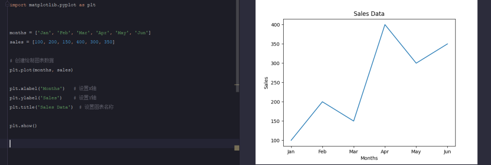
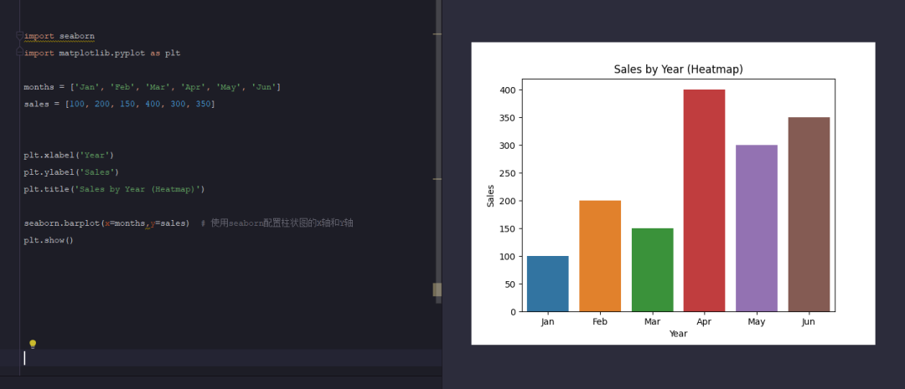
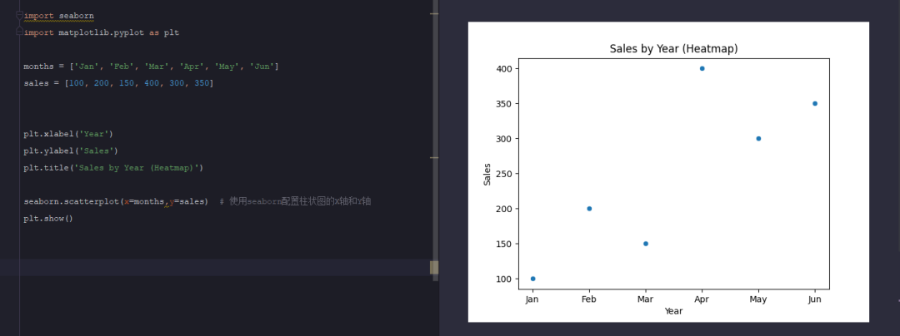
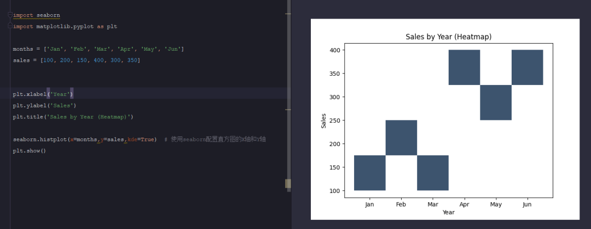
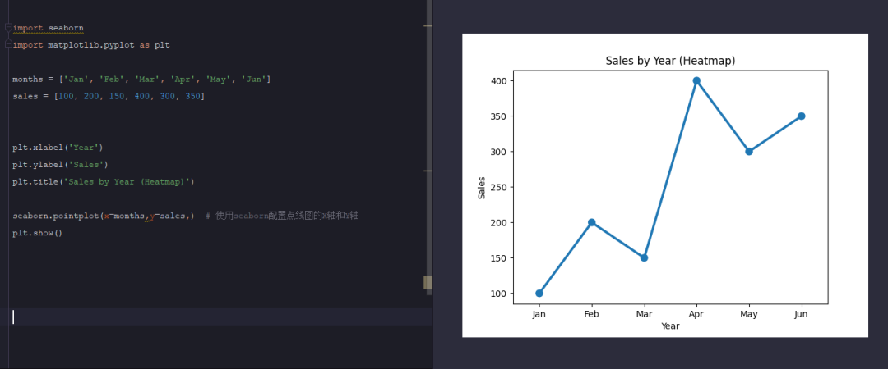
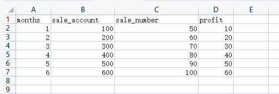
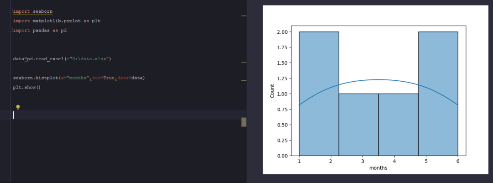

<a name="BlaUp"></a>
## 前言
Python作为当前流行开发语言，不仅可以用于web网站的开发、自动化框架的设计等，也可用于到大数据领域，在大数据领域方面，不仅需要获取到大量的数据，并且还要将这些数据进行整合便于后续的使用和分析，而数据的整合最好的方式就是使用可视化的方式将数据变现出来，所以就来学习Python中的Matplotlib库和Seaborn的使用。
<a name="DTXJ9"></a>
## Matplotlib和Seaborn介绍
在Python中，可以使用Matplotlib库和Seaborn库来生成各种图表。Matplotlib是一个用于创建静态、动态和交互式图表的库，而Seaborn则是基于Matplotlib的一个高级数据可视化库，它提供了更高级的接口，使得绘制统计图形变得更加简单。结合这两个库，可以生成各种类型的图表，如折线图、柱状图、散点图、箱线图等。<br />使用前先安装这两个库
```bash
pip install matplotlib seaborn
```
接下来，通过一个简单的示例来演示如何单独使用Matplotlib成图表。假设有一个数据集，包含了6个月份的数据，想要绘制一个折线图来展示每年的销售额。
```python
import matplotlib.pyplot as plt


months = ['Jan', 'Feb', 'Mar', 'Apr', 'May', 'Jun']
sales = [100, 200, 150, 400, 300, 350]

# 创建绘制图表数据
plt.plot(months, sales)

plt.xlabel('Months')   # 设置X轴
plt.ylabel('Sales')    # 设置Y轴
plt.title('Sales Data')  # 设置图表名称

plt.show()
```
运行代码后会生成一个默认的折线图<br />
<a name="htAg8"></a>
## 结合seabron生成不同的图表
Seaborn支持生成不同样式的图表，包括柱状图、散点图、直方图、折线图、小提琴图、箱线图、热点图、点图、密度图、计数图、分簇散点图、特征图、Facet Grid、联合分布图、分类图等多个类型<br />以下是Seaborn库生成不同图表的一些常用方法

1. `seaborn.distplot()` – 绘制单变量分布图
2. `seaborn.jointplot()` – 绘制双变量关系图
3. `seaborn.pairplot()` – 绘制多变量关系图
4. `seaborn.barplot()` – 绘制条形图
5. `seaborn.countplot()` – 绘制计数图
6. `seaborn.boxplot()` – 绘制箱线图
7. `seaborn.violinplot()` – 绘制小提琴图
8. `seaborn.heatmap()` – 绘制热力图
9. `seaborn.lineplot()` – 绘制线图
10. `seaborn.scatterplot()` – 绘制散点图
<a name="ejcl3"></a>
### 1、生成柱状图
柱状图是经常会见到的数据图表，每个柱状都表示一组数据
```python
import seaborn
import matplotlib.pyplot as plt

months = ['Jan', 'Feb', 'Mar', 'Apr', 'May', 'Jun']
sales = [100, 200, 150, 400, 300, 350]


plt.xlabel('Year')
plt.ylabel('Sales')
plt.title('Sales by Year (Heatmap)')

seaborn.barplot(x=months,y=sales)  # 使用seaborn配置柱状图的X轴和Y轴
plt.show()
```
运行代码生成柱状图<br />
<a name="pssnI"></a>
### 2、生成散点图
散点图顾名思义，每个表里面的一个点就代表着一组数值
```python
import seaborn
import matplotlib.pyplot as plt

months = ['Jan', 'Feb', 'Mar', 'Apr', 'May', 'Jun']
sales = [100, 200, 150, 400, 300, 350]


plt.xlabel('Year')
plt.ylabel('Sales')
plt.title('Sales by Year (Heatmap)')

seaborn.scatterplot(x=months,y=sales)  # 使用seaborn配置散点图的X轴和Y轴
plt.show()
```

<a name="OZXUN"></a>
### 3、绘制直方图
直方图通常适用于可视单个数据的分布情况，不过也可用用于比较两个或者更多变量的变化
```python
import seaborn
import matplotlib.pyplot as plt

months = ['Jan', 'Feb', 'Mar', 'Apr', 'May', 'Jun']
sales = [100, 200, 150, 400, 300, 350]


plt.xlabel('Year')
plt.ylabel('Sales')
plt.title('Sales by Year (Heatmap)')

seaborn.histplot(x=months,y=sales,kde=True)  # 使用seaborn配置直方图的X轴和Y轴
plt.show()
```

<a name="OiFPD"></a>
### 4、绘制点线图
点线图不同于折线图，点线图适用于显示一组数据及其变异性的平觉知或集中趋势，通常用于探索性数据分析，以及快速可视化数据集的分布或者比较多个数据集
```python
import seaborn
import matplotlib.pyplot as plt

months = ['Jan', 'Feb', 'Mar', 'Apr', 'May', 'Jun']
sales = [100, 200, 150, 400, 300, 350]


plt.xlabel('Year')
plt.ylabel('Sales')
plt.title('Sales by Year (Heatmap)')

seaborn.pointplot(x=months,y=sales,)  # 使用seaborn配置点线图的X轴和Y轴
plt.show()
```
生成的图表显示如下：<br /><br />以上是简单的列举了Matplotlib和Seaborn组合生成的一些常规图表信息，但起功能远远不止上述内容，Seaborn在数据分析机器学习有很大的作用，如果想要更加深入了解，可以去逛网地址和查看对应中文文档继续深入学习。<br />当前，后续也可以结合到Python中的panads库一起使用：<br /><br />将数据读取出来并绘制的图表
```python
import seaborn
import matplotlib.pyplot as plt
import pandas as pd


data=pd.read_excel(r"D:\data.xlsx")

seaborn.histplot(x="months",kde=True,data=data)
plt.show()
```
绘制结果如下<br />
