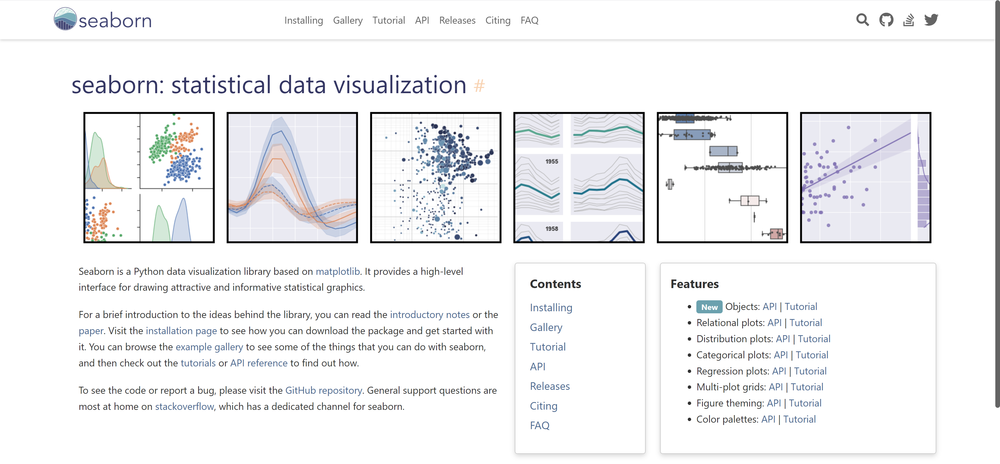
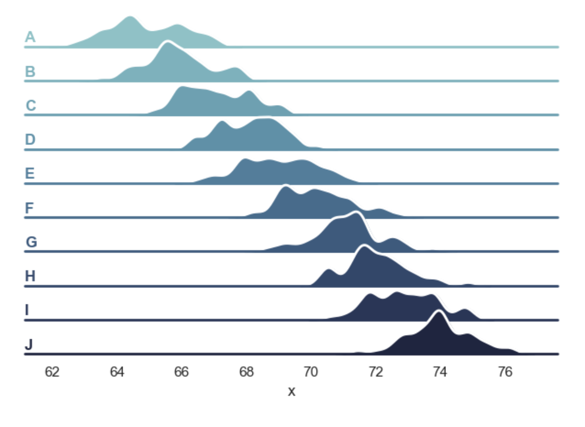
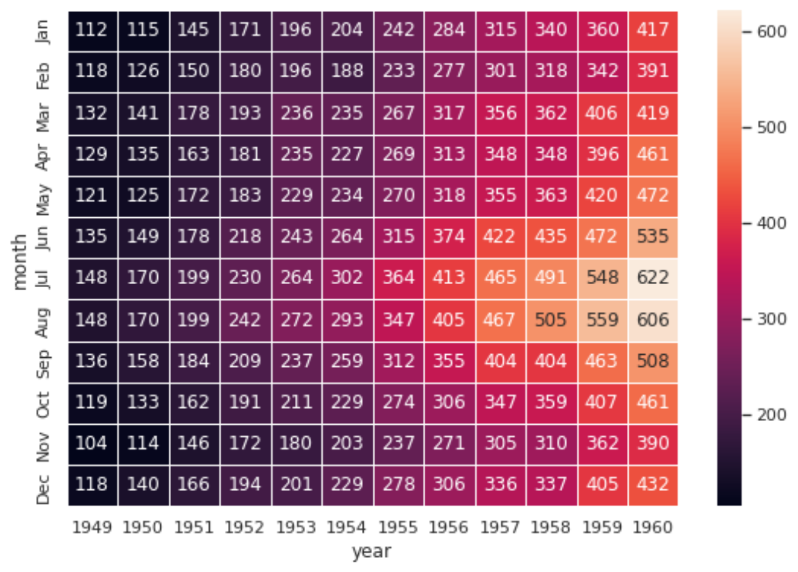

PythonSeaborn<br />官网：[http://seaborn.pydata.org/](http://seaborn.pydata.org/)<br />Seaborn 是一个基于matplotlib的 Python 数据可视化库，它建立在matplotlib之上，并与Pandas数据结构紧密集成，用于绘制有吸引力和信息丰富的统计图形的高级界面。<br />Seaborn 可用于探索数据，它的绘图功能对包含整个数据集的数据框和数组进行操作，并在内部执行必要的语义映射和统计聚合以生成信息图，其面向数据集的声明式 API可以专注于绘图的不同元素的含义，而不是如何绘制它们的细节。<br />Matplotlib 拥有全面而强大的 API，几乎可以根据自己的喜好更改图形的任何属性，seaborn 的高级界面和 matplotlib 的深度可定制性相结合，使得Seaborn既可以快速探索数据，又可以创建可定制为出版质量最终产品的图形。<br />
<a name="Wzm2b"></a>
## 绘制多行图
将变量按照多行的形式进行绘制，使用`sns.FacetGrid`命令。
```python
import numpy as np
import pandas as pd
import seaborn as sns
import matplotlib.pyplot as plt
sns.set_theme(style="white", rc={"axes.facecolor": (0, 0, 0, 0)})

rs = np.random.RandomState(1979)
x = rs.randn(500)
g = np.tile(list("ABCDEFGHIJ"), 50)
df = pd.DataFrame(dict(x=x, g=g))
m = df.g.map(ord)
df["x"] += m

pal = sns.cubehelix_palette(10, rot=-.25, light=.7)
g = sns.FacetGrid(df, row="g", hue="g", aspect=15, height=.5, palette=pal)

g.map(sns.kdeplot, "x",
      bw_adjust=.5, clip_on=False,
      fill=True, alpha=1, linewidth=1.5)
g.map(sns.kdeplot, "x", clip_on=False, color="w", lw=2, bw_adjust=.5)

g.refline(y=0, linewidth=2, linestyle="-", color=None, clip_on=False)

def label(x, color, label):
    ax = plt.gca()
    ax.text(0, .2, label, fontweight="bold", color=color,
            ha="left", va="center", transform=ax.transAxes)

g.map(label, "x")

g.figure.subplots_adjust(hspace=-.25)

g.set_titles("")
g.set(yticks=[], ylabel="")
g.despine(bottom=True, left=True)
```

<a name="USpqd"></a>
## 绘制热力图
将数据的大小用热力图进行呈现，使用`sns.heatmap`命令。
```python
import matplotlib.pyplot as plt
import seaborn as sns
sns.set_theme()

# Load the example flights dataset and convert to long-form
flights_long = sns.load_dataset("flights")
flights = flights_long.pivot("month", "year", "passengers")

# Draw a heatmap with the numeric values in each cell
f, ax = plt.subplots(figsize=(9, 6))
sns.heatmap(flights, annot=True, fmt="d", linewidths=.5, ax=ax)
```

