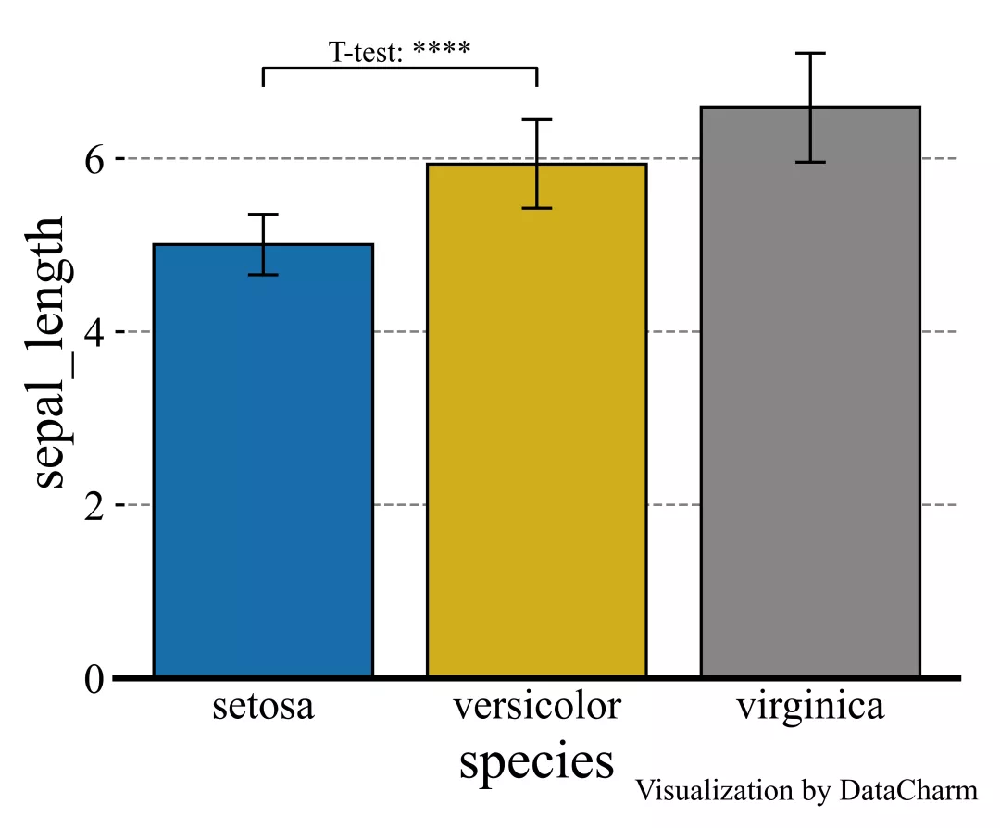
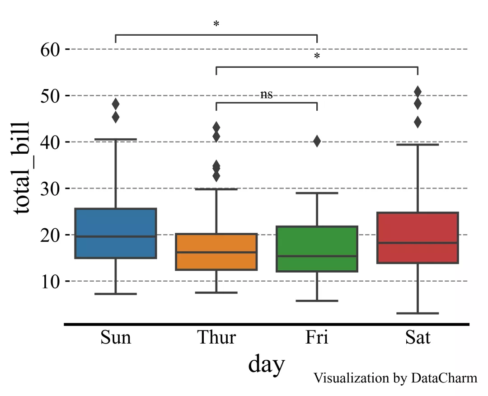
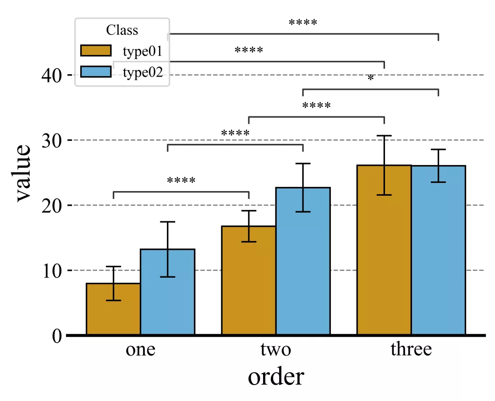
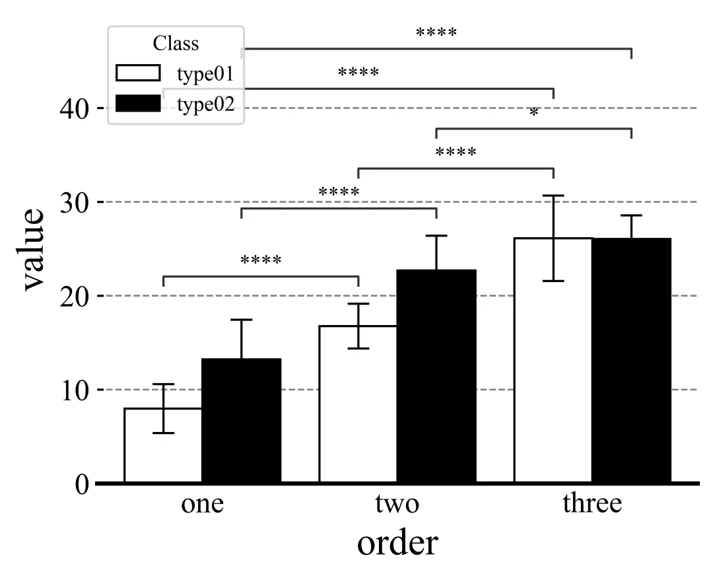
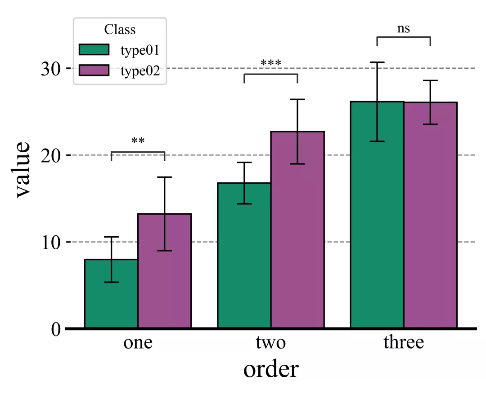
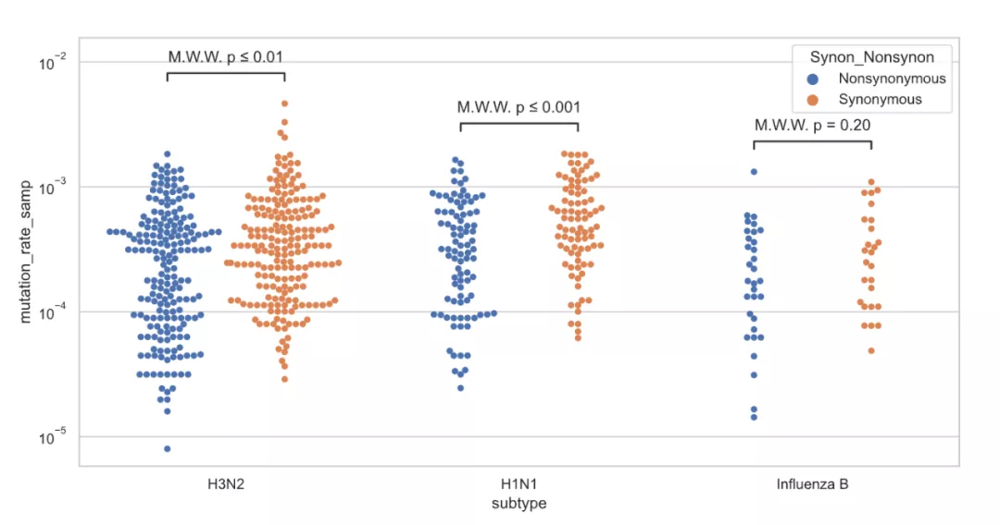
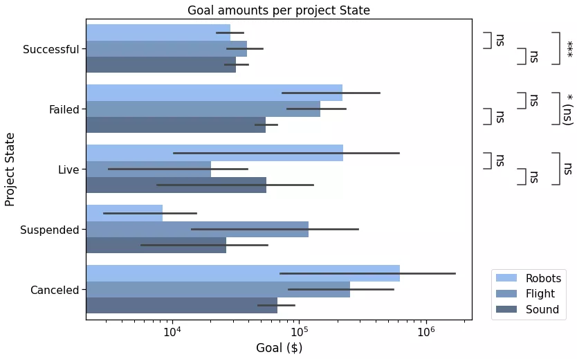

Python<br />在常规的实验统计分析过程中，经常需要在组间数据间添加显著性标注，而在统计学中，数据间的差异显著性检验则是统计假设检验的一种，是一种对组间数据或组内不同数据之间是否有差异以及差异是否明显判断方法。<br />使用Python-Seaborn进行显著性统计图表绘制，详细内容如下：

- Python-Seaborn自定义函数绘制
- Python-statannotations库添加显著性标注
<a name="UPdbA"></a>
## Python-Seaborn 自定义函数绘制
可以通过自定义绘图函数的方式在统计图表中添加显著性标注，这里直接使用Seaborn自带的iris数据集进行绘制，具体内容如下：
<a name="lJIQ8"></a>
### 自定义P值和星号对应关系
由于是完全的自定义，这里需要定义一个函数将P值结果和对应星号进行转化，代码如下：
```python
def convert_pvalue_to_asterisks(pvalue):
    if pvalue <= 0.0001:
        return "****"
    elif pvalue <= 0.001:
        return "***"
    elif pvalue <= 0.01:
        return "**"
    elif pvalue <= 0.05:
        return "*"
    return "ns"
```
<a name="F1unN"></a>
### scipy.stats 计算显著性指标
由于scipy.stats部分中提供多种显著性检验方法，如T-test、ANOVA等，由于篇幅有限，这里只介绍`scipy.stats.ttest_ind()` t检验方法，详细结算过程如下：
```python
iris = sns.load_dataset("iris")
data_p = iris[["sepal_length","species"]]
stat,p_value = scipy.stats.ttest_ind(data_p[data_p["species"]=="setosa"]["sepal_length"],
                                     data_p[data_p["species"]=="versicolor"]["sepal_length"],
                                     equal_var=False)
```
上述结果就将P值计算，然后再通过之前定义的`convert_pvalue_to_asterisks`函数进行转换，得到星号表示形式。
<a name="ubcVZ"></a>
### 可视化绘制
这一步主要使用自定义的绘图方法进行显著性标注绘制，详细绘制代码如下：
```python
plt.rcParams['font.family'] = ['Times New Roman']
plt.rcParams["axes.labelsize"] = 18
palette=['#0073C2FF','#EFC000FF','#868686FF']

fig,ax = plt.subplots(figsize=(5,4),dpi=100,facecolor="w")
ax = sns.barplot(x="species",y="sepal_length",data=iris,palette=palette,
                 estimator=np.mean,ci="sd", capsize=.1,errwidth=1,errcolor="k",
                 ax=ax,
                 **{"edgecolor":"k","linewidth":1})
# 添加P值
x1, x2 = 0, 1
y,h = data_p["sepal_length"].mean()+1,.2
#绘制横线位置
ax.plot([x1, x1, x2, x2], [y, y+h, y+h, y], lw=1, c="k") 
#添加P值
ax.text((x1+x2)*.5, y+h, "T-test: "+ p_value_cov, ha='center', va='bottom', color="k")

ax.tick_params(which='major',direction='in',length=3,width=1.,labelsize=14,bottom=False)
for spine in ["top","left","right"]:
    ax.spines[spine].set_visible(False)
ax.spines['bottom'].set_linewidth(2)
ax.grid(axis='y',ls='--',c='gray')
ax.set_axisbelow(True)
```
<br />Python-Seaborn 自定义显著性标注绘制<br />「注意」:这里由于是自定义绘制，在添加其他组间数据的显著性编著时也采用相同方法。<br />在涉及较多组之间绘制P值是有没有较为方便便捷的方法呢？下面小编介绍一个优秀的第三方拓展库进行绘制。
<a name="fJm9V"></a>
## Python-statannotations库添加显著性标注
Python-statannotations库则是针对Seaborn绘图对象进行显著性标注的专用库，其可以提供柱形图、箱线图、小提琴图等统计图表的显著性标注绘制，计算P值方法基于`scipy.stats`方法，这里简单列举几个示例演示即可，更多详细内容可参看：[Python-statannotations官网](https://github.com/trevismd/statannotations)。
<a name="s0azs"></a>
#### 「样例一」：
```python
import seaborn as sns

from statannotations.Annotator import Annotator

df = sns.load_dataset("tips")
x = "day"
y = "total_bill"
order = ['Sun', 'Thur', 'Fri', 'Sat']
fig,ax = plt.subplots(figsize=(5,4),dpi=100,facecolor="w")
ax = sns.boxplot(data=df, x=x, y=y, order=order,ax=ax)

pairs=[("Thur", "Fri"), ("Thur", "Sat"), ("Fri", "Sun")]
annotator = Annotator(ax, pairs, data=df, x=x, y=y, order=order)
annotator.configure(test='Mann-Whitney', text_format='star',line_height=0.03,line_width=1)
annotator.apply_and_annotate()

ax.tick_params(which='major',direction='in',length=3,width=1.,labelsize=14,bottom=False)
for spine in ["top","left","right"]:
    ax.spines[spine].set_visible(False)
ax.spines['bottom'].set_linewidth(2)
ax.grid(axis='y',ls='--',c='gray')
ax.set_axisbelow(True)
```
<br />Example01 Of Python-statannotations plot make
<a name="V6OWe"></a>
#### 「样例二」：
```python
import seaborn as sns
import matplotlib.pyplot as plt
plt.rcParams['font.family'] = ['Times New Roman']
plt.rcParams["axes.labelsize"] = 18
#palette=['#0073C2FF','#EFC000FF']
palette=['#E59F01','#56B4E8']
#palette = ["white","black"]


fig,ax = plt.subplots(figsize=(5,4),dpi=100,facecolor="w")
ax = sns.barplot(x="order",y="value",hue="class",data=group_data_p,palette=palette,ci="sd",
                 capsize=.1,errwidth=1,errcolor="k",ax=ax,
                 **{"edgecolor":"k","linewidth":1})

# 添加P值
box_pairs = [(("one","type01"),("two","type01")),
             (("one","type02"),("two","type02")),
             (("one","type01"),("three","type01")),
             (("one","type02"),("three","type02")),
             (("two","type01"),("three","type01")),
             (("two","type02"),("three","type02"))]


annotator =  Annotator(ax, data=group_data_p, x="order",y="value",hue="class",
                      pairs=box_pairs)
annotator.configure(test='t-test_ind', text_format='star',line_height=0.03,line_width=1)
annotator.apply_and_annotate()
```
<br />Example02 Of Python-statannotations plot make<br />当然，还可以设置灰色系颜色，如下：<br /><br />Example02-2 Of Python-statannotations plot make
<a name="A9Ktn"></a>
#### 「样例三」如果针对组间数据进行统计分析，可以设置`pairs`参数据如下：
```python
box_pairs = [(("one","type01"),("one","type02")),
             (("two","type01"),("two","type02")),
             (("three","type01"),("three","type02"))]
```
<br />Example03 Of Python-statannotations plot make<br />其他比如抖动图、横向分组柱形图等，可视化结果如下：<br /><br />抖动图显著性标注

<br />横向分组柱形图显著性图外添加
<a name="MYVKa"></a>
### 参考资料
Python-statannotations官网：[https://github.com/trevismd/statannotations](https://github.com/trevismd/statannotations)。
