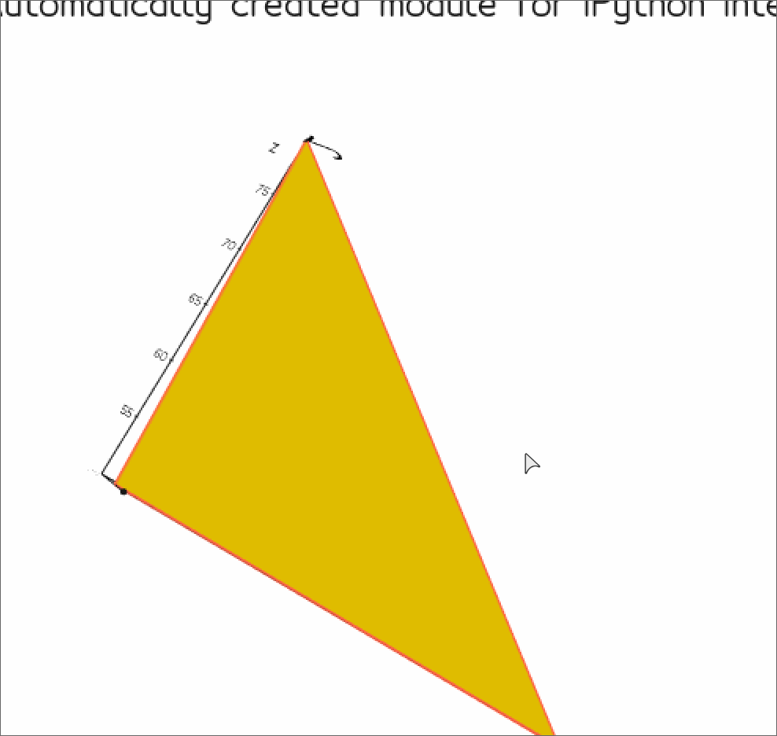
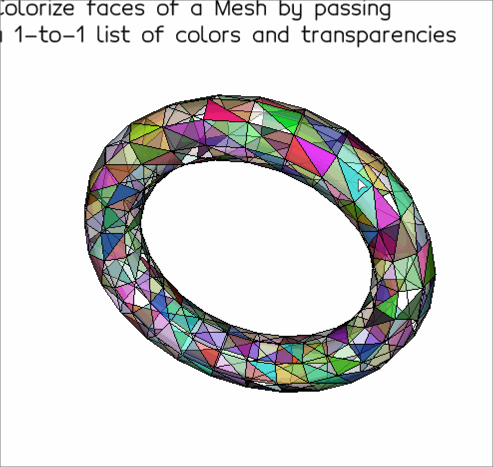
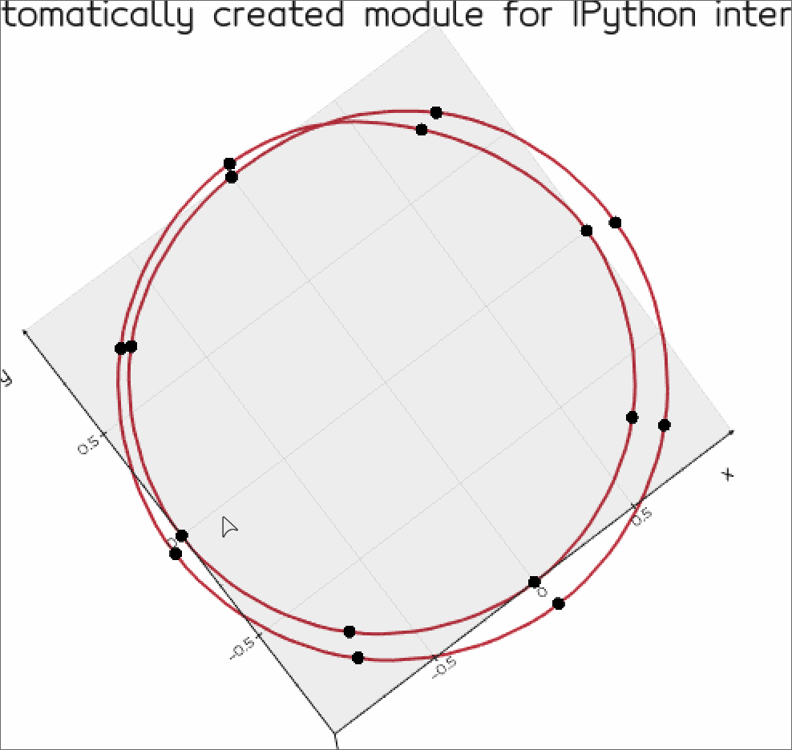
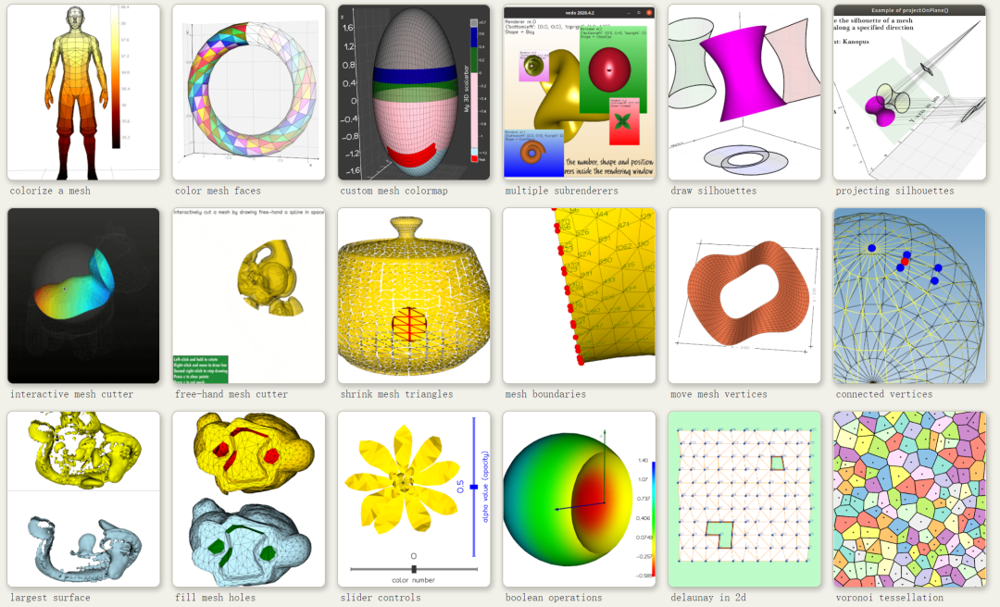
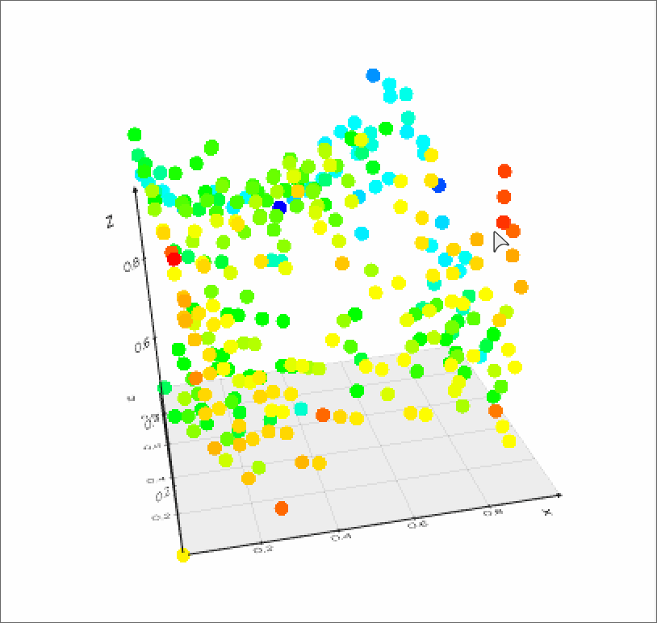
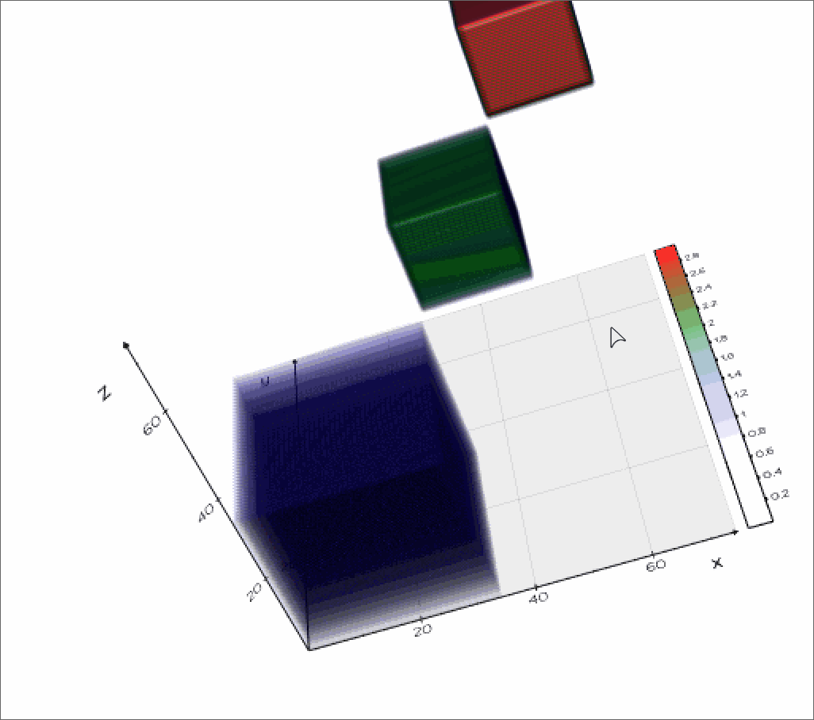
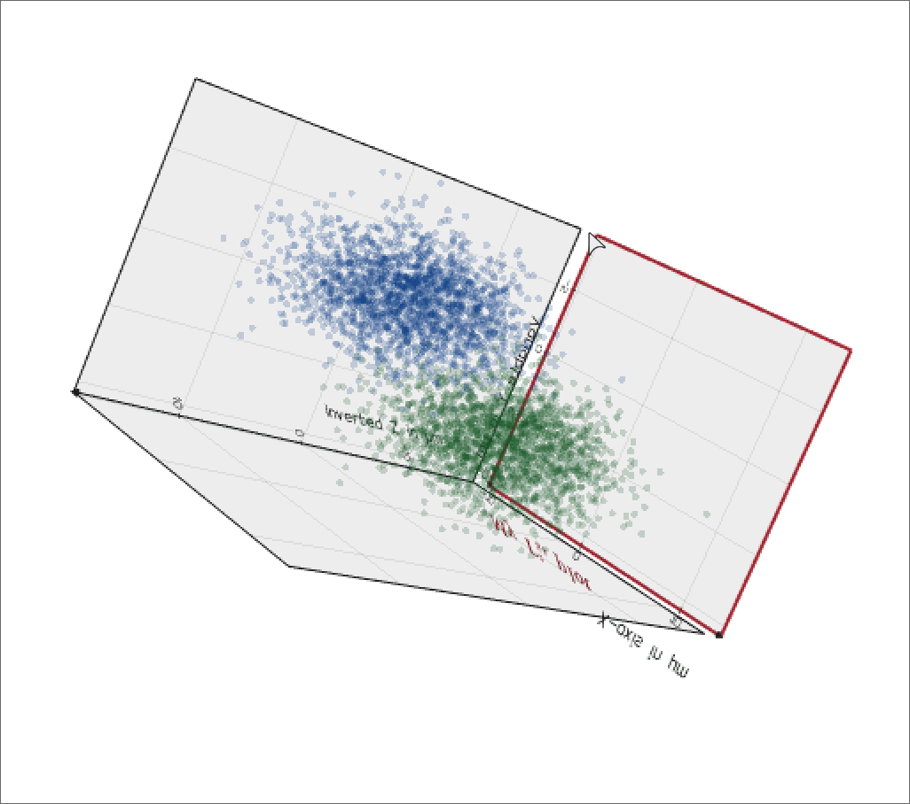
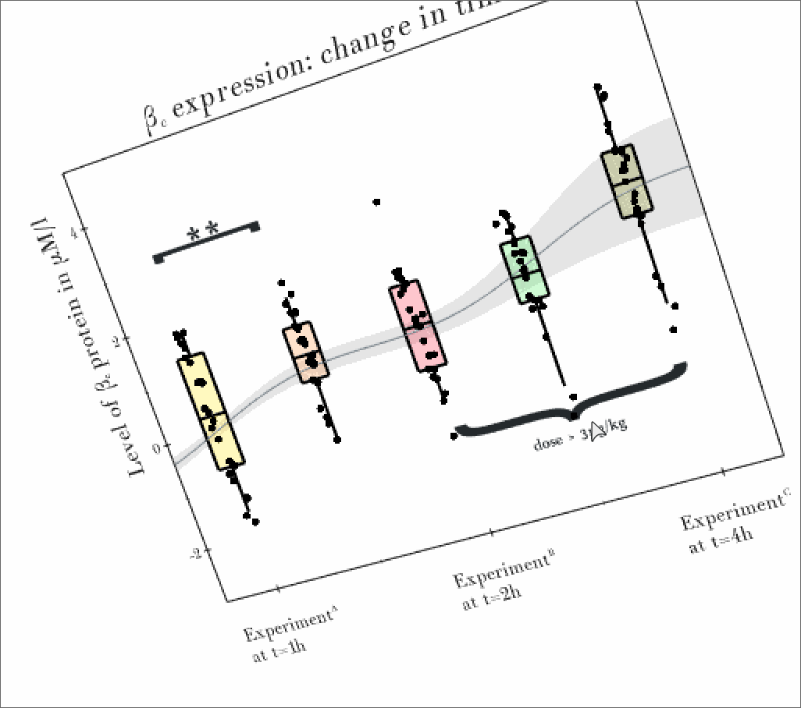
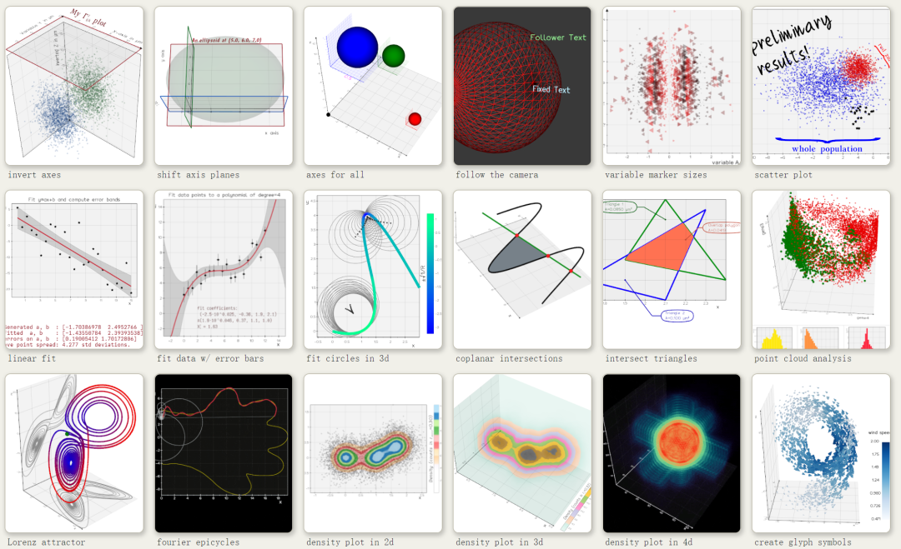
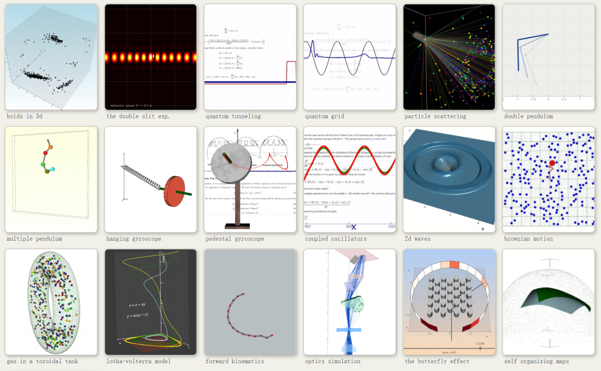

Python<br />Python-vedo库，一款超强的科学计算和3D可视化展示工具包。具体内容如下：

- **Python-vedo库介绍**
- **Python-vedo库案例展示**
<a name="ghJWw"></a>
## Python-vedo库介绍
Python-vedo库是一个用于绘制出版级科研图表和对3D对象进行科学分析和可视化展示的一个Python第三方库。其安装方法也非常简单，如下：
```bash
pip install vedo
# 或者使用conda安装
conda install -c conda-forge vedo
```
vedo库的主要特点如下：

- 使用多边形网格和点云(Point Clouds)；
- 处理体积数据和四面体网格；
- 2D和3D绘图

下面就通过每种类型对vedo库的可视化能力进行展示。
<a name="qRkzd"></a>
## Python-vedo库案例展示
这一小节主要展示vedo库偏科学出版方法的可视化案例，详细如下：
<a name="l4leG"></a>
### 基础用法(Basic)
<a name="KqzLX"></a>
#### hello world mesh
```python
from vedo import Mesh, show

verts = [(50,50,50), (70,40,50), (50,40,80), (80,70,50)]
faces = [(0,1,2), (2,1,3), (1,0,3)]
# (the first triangle face is formed by vertex 0, 1 and 2)

# Build the polygonal Mesh object:
mesh = Mesh([verts, faces])
mesh.backColor('violet').lineColor('tomato').lineWidth(2)
labs = mesh.labels('id').c('black')

# retrieve them as numpy arrays
print('points():', mesh.points())
print('faces() :', mesh.faces())

show(mesh, labs, __doc__, viewup='z', axes=1).close()
```

<a name="FF8Jg"></a>
#### color mesh faces
```python
"""Colorize faces of a Mesh by passing
a 1-to-1 list of colors and transparencies"""
from vedo import *
import numpy as np

settings.useDepthPeeling = True

tor = Torus(res=9).lineWidth(1)

rgba = np.random.rand(tor.NCells(), 4)*255 # RGBA values

tor.cellIndividualColors(rgba)
printc('Mesh cell arrays:', tor.celldata.keys(),
       'shape:', tor.celldata['CellIndividualColors'].shape)

show(tor, __doc__).close()
```

<a name="KuvAS"></a>
#### interactive spline tool
```python
from vedo import Circle, show

# Create a set of points in space
pts = Circle(res=8).extrude(zshift=0.5).pointSize(4)

# Visualize the points
plt = show(pts, __doc__, interactive=False, axes=1)

# Add the spline tool using the same points and interact with it
sptool = plt.addSplineTool(pts, closed=True)

# Switch off the tool
sptool.off()

# Extract and visualize the resulting spline
sp = sptool.spline().lw(4)
show(sp, "My spline is ready!", interactive=True, resetcam=False).close()
```
<br />更多关于Vedo的基础3D绘图可参考：[**Vedo基础绘图样例**](https://vedo.embl.es/#gallery)。部分案例如下：
<a name="faMB1"></a>
### Volumetric
<a name="kGt8c"></a>
#### Generate a denser point cloud
```python
"""Generate a denser point cloud.
The new points are created in such a way that
all points in any local neighborhood are
within a target distance of one another"""
from vedo import Points, printc, show
import numpy as np

npts = 50                        # nr. of points
coords = np.random.rand(npts, 3) # range is [0, 1]
scals = np.abs(coords[:, 1])     # let the scalar be the y of the point itself
pts = Points(coords, r=9)
pts.pointdata["scals"] = scals

densecloud = pts.densify(0.1, nclosest=10, niter=1) # return a new pointcloud.Points
printc('nr. points increased', pts.N(), '\rightarrow ', densecloud.N(), c='lg')

show([(pts, __doc__), densecloud], N=2, axes=1).close()
```

<a name="ZJNTY"></a>
#### Thresholding and slicing a TetMesh
```python
from vedo import TetMesh, dataurl, show

tetmesh = TetMesh(dataurl+'limb_ugrid.vtk').color('Spectral')
tetmesh.addScalarBar3D(title='chem_0  expression', c='k')

thrslist = [0.2, 0.3, 0.8]
isos = tetmesh.isosurface(thrslist)

slce = tetmesh.slice(normal=(1,1,1)).lw(0.1)

show([
      (tetmesh, "A TetMesh"),
      (isos, "Isosurfaces for thresholds:\n"+str(thrslist)),
      (slce, "Slice TetMesh with plane"),
     ], N=3, axes=1, viewup='z').close()
```

<a name="odNRa"></a>
#### Create a Volume from a numpy array
```python
import numpy as np

data_matrix = np.zeros([75, 75, 75], dtype=np.uint8)
# all voxels have value zero except:
data_matrix[0:35,   0:35,  0:35] = 1
data_matrix[35:55, 35:55, 35:55] = 2
data_matrix[55:74, 55:74, 55:74] = 3

from vedo import Volume, show

vol = Volume(data_matrix, c=['white','b','g','r'])
vol.addScalarBar3D()

show(vol, __doc__, axes=1).close()
```

<a name="NQFon"></a>
### Plotting
<a name="s6zHR"></a>
#### invert axes
```python
from vedo import Points, Axes, show
import numpy as np

pts = np.random.randn(2000,3)*[3,2,4]-[1,2,3]
vpts1 = Points(pts).alpha(0.2).c('blue2')
vpts2 = vpts1.clone().shift(5,6,7).c('green2')

axs = Axes([vpts1, vpts2],  # build axes for this set of objects
           xtitle="X-axis in \mum",
           ytitle="Variable Y in \mum",
           ztitle="Inverted Z in \mum",
           htitle='My \Gamma^2_ijk  plot',
           hTitleFont='Kanopus',
           hTitleJustify='bottom-right',
           hTitleColor='red2',
           hTitleSize=0.035,
           hTitleOffset=(0,0.075,0),
           hTitleRotation=45,
           zHighlightZero=True,
           xyFrameLine=2, yzFrameLine=1, zxFrameLine=1,
           xyFrameColor='red3',
           xyShift=1.05, # move xy 5% above the top of z-range
           yzGrid=True,
           zxGrid=True,
           zxShift=1.0,
           xTitleJustify='bottom-right',
           xTitleOffset=-1.175,
           xLabelOffset=-1.75,
           yLabelRotation=90,
           zInverted=True,
           tipSize=0.25,
)

show(vpts1, vpts2, axs, "Customizing Axes", viewup='z').close()
```

<a name="UXMtg"></a>
#### whisker-style plot
```python
from vedo import np, settings, Axes, Brace, Line, Ribbon, show
from vedo.pyplot import whisker

settings.defaultFont = "Theemim"

# build some theoretical expectation to be shown as a grey band
x = np.linspace(-1, 9, 100)
y = x/5 + 0.2*np.sin(x)
ye= y**2/5 + 0.1 # error on y
line = Line(np.c_[x, y])
band = Ribbon(np.c_[x, y-ye], np.c_[x, y+ye]).c('black',0.1)

# create 5 whisker bars with some random data
ws = []
for i in range(5):
    xval = i*2 # position along x axis
    data = xval/5 + 0.2*np.sin(xval) + np.random.randn(25)
    w = whisker(data, bc=i, s=0.5).x(xval)
    ws.append(w)
    # print(i, 'whisker:\n', w.info)

# build braces to inndicate stats significance and dosage
bra1 = Brace([0, 3],[2, 3], comment='*~*', s=0.7, style='[')
bra2 = Brace([4,-1],[8,-1], comment='dose > 3~\mug/kg', s=0.4)

# build custom axes
axes = Axes(xrange=[-1,9],
            yrange=[-3,5],
            htitle='\beta_c  expression: change in time',
            xtitle=' ',
            ytitle='Level of \beta_c  protein in \muM/l',
            xValuesAndLabels=[(0,'Experiment^A\nat t=1h'),
                              (4,'Experiment^B\nat t=2h'),
                              (8,'Experiment^C\nat t=4h'),
                             ],
            xLabelSize=0.02,
            xyGrid=False,
           )

show(ws, bra1, bra2, line, band, __doc__, axes, zoom=1.1).close()
```
其他案例如下：
<a name="zWpIN"></a>
### Simulations
<br />由于3D绘制的复杂性和可视化展示的繁琐性，就展示这些3D可视化结果，更多案例和关于Python-vedo库的介绍可参考：[**Python-vedo库官网**](https://vedo.embl.es/)
<a name="PBQqa"></a>
## 参考资料
Vedo基础绘图样例：[https://vedo.embl.es/#gallery](https://vedo.embl.es/#gallery)<br />Python-vedo库官网：[https://vedo.embl.es/](https://vedo.embl.es/)
