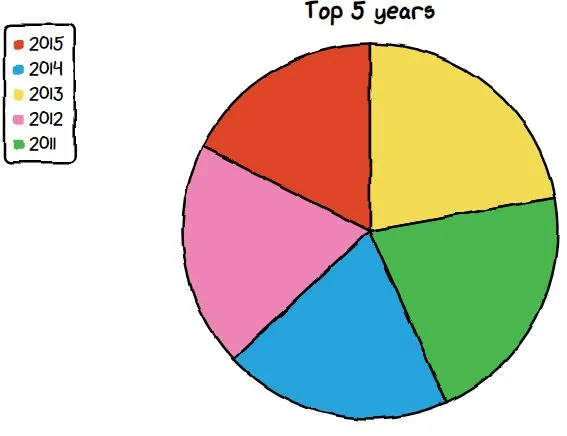

Python 可视化<br />一个很酷的python手绘样式可视化包——可爱的图表 cutecharts。Cutecharts 非常适合为图表提供更个性化的触感。<br />Cutecharts 与常规的 Matplotlib 和 Seaborn 库完全不同，它可以查看手工制作的图表，并在将鼠标悬停在图表上时显示值。Matplotlib 图表中没有悬停效果，这是可爱图表的一个优势。与 seaborn 相比，在可爱图表中创建图表的时间要长一些，但代码数量仍然比标准 matplotlib 库少。<br />该包可用于生成以下类型的图表。目前，该库支持五种不同的图表——条形图、饼图、雷达图、散点图和折线图。
<a name="jcLY8"></a>
## 绘图准备
<a name="r1UOZ"></a>
### 安装cutecharts
这是个python第三方库，要创建此图表，需要安装cutecharts库。具体安装方法与其他库一样。
```bash
pip install cutecharts
```
<a name="QihRc"></a>
### 导入库
```python
import cutecharts.charts as ctc
import pandas as pd
```
<a name="Y2Z7L"></a>
### 数据集
看看 TMBD 数据是什么样子的？数据有 21 列。
```python
df = pd.read_csv(r'tmdb-movies.csv')
df.head(2)
```

<a name="dHz1J"></a>
### 数据说明
TMBD 的数据取自 [kaggle](https://www.kaggle.com/kashishrastogi/eda-of-tmbd-dataset)。

- Popularity流行度： 指定电影流行度的数字量
- Budget预算： 电影制作的预算。
- Revenue收入： 电影产生的全球收入。
- Original Title原片名： 翻译或改编前电影的片名。
- Cast演员： 在电影中扮演角色的演员姓名
- Homepage主页： 指向电影主页的链接。
- Director导演： 导演电影的导演姓名
- Title片名： 电影名称。
- Keywords关键字： 与电影相关的关键字或标签。
- Overview概述： 对电影的简要描述。
- Runtime运行时间： 以分钟为单位的电影运行时间。
- Genres类型： 电影的类型，剧情、动作、喜剧、惊悚等。
- Production Company制作公司： 电影的制作公司。
- Vote Count投票数： 收到的票数。
- Vote Average投票平均： 电影收到的平均评分。
<a name="KbCvD"></a>
#### 日期时间

- Release Date上映日期： 电影上映的日期。
- Release Year发行年份： 电影发行的年份。
<a name="gX0Ya"></a>
### 数据清洗
先清理数据，然后会看到可爱的图表。<br />将特征更改为正确的日期时间格式并将流行功能四舍五入到小数点后两位，以获得更多内容。
```python
df['release_date'] = pd.to_datetime(df['release_date'])
df['popularity'] = round(df['popularity'], 2)
```
<a name="drZOh"></a>
#### 删除不必要的功能
```python
df.drop(['imdb_id', 'homepage', 'budget_adj','revenue_adj'],
      axis=1, inplace=True) 
```
<a name="vzTrU"></a>
#### 用`missing`替换特征`nan`值
```python
df['tagline'].fillna('missing',inplace=True)
df['keywords'].fillna('missing',inplace=True)
df['production_companies'].fillna('missing',inplace=True) 
df['cast'].fillna('missing',inplace=True)
df['director'].fillna('missing',inplace=True)
df['genres'].fillna('missing',inplace=True)
df['overview'].fillna('missing',inplace=True)
```
从预算和收入中删除等于 0 的值。
```python
df.drop(df[(df['budget']==0) & (df['revenue']==0)].index,
        inplace=True)
```
现在，数据是干净的，现在可以进一步创建一些可爱的图表。
<a name="tcdCd"></a>
## cutecharts绘图
<a name="IlAG7"></a>
### cutecharts中使用的参数
分配要的图表名称，例如，要一个饼图然后运行下面的代码。
```python
chart = ctc.Pie()
```
设置需要`width, height`在参数中添加的图表的标题、宽度和高度。
```python
chart = ctc.Pie('Title', width='600px', height='300px')
```
设置图表选项，可以将使用`set_options()`函数。
```python
chart.set_options()
```
设置x和y标签的标题，使用`x_label, y_label`传入`set_options()`函数示例如下。
```python
chart.set_options(x_label='X Labels',
                  y_label='Y Labels')
```
最后，使用一个函数来显示图表`render_notebook()`，下面给出一个例子。
```python
chart.render_notebook()
```
<a name="PuTKW"></a>
## cutecharts绘图
<a name="RbZ8Z"></a>
### 绘制饼图
要制作的图表是甜甜圈图表。看到发行量最高的电影的前 5 年。
```python
df_year = df['release_year'].value_counts(
).reset_index().sort_values(by='index',
                            ascending=False)[:5].rename(columns={'index':'release_year',
                                                                 'release_year':'Count'})
chart = ctc.Pie('Top 5 years', width='600px', height='300px')
chart.set_options(labels=list(df_year['release_year']), inner_radius=0)
chart.add_series(list(df_year['Count']))
chart.render_notebook()
```
<br />饼图
<a name="snnUf"></a>
### 绘制圆环图
要制作的图表是甜甜圈图表。可以看到发行量最高的电影的前 5 年。
```python
df_year = df['release_year'].value_counts(
).reset_index().sort_values(by='index', 
                            ascending=False)[:5].rename(columns={'index':'release_year',
                                                                 'release_year':'Count'})
chart = ctc.Pie('Top 5 years', width='600px', height='300px')
chart.set_options(labels=list(df_year['release_year']), inner_radius=0.8)
chart.add_series(list(df_year['Count']))
chart.render_notebook()
```
<br />圆环图<br />所有的特性都与在饼图中使用的相同，只是`inner_radius`使用了一个额外的参数；可以为甜甜圈图的内部半径给出0到1之间的任何值。如果看到默认的图例将在左上角，可以指定图例的值，如 `upLeft`、`upRight`、`downLeft`、`downRight`。<br />下图显示了 `upRight` 和 `downLeft` 上的图例。<br /><br />甜甜圈图
<a name="URFdx"></a>
### 绘制条形图
该函数将拆分字符串并返回每个类型的计数。
```python
def count_genre(x):
data_plot = df[x].str.cat(sep = '|')
    data = pd.Series(data_plot.split('|'))
    info = data.value_counts(ascending=False)
    return info
```
调用函数来计算每个类型的电影。
```python
df_genre_movies = count_genre('genres')
df_genre_movies = pd.DataFrame(df_genre_movies).reset_index().rename(columns={'index':'Drama', 0:'Count'})
```
<a name="LlLbY"></a>
#### 条形图代码
这里通过导入 faker 库为不同的条使用颜色。
```python
from cutecharts.faker import Faker

chart = ctc.Bar('Top Movie Geners', width='600px', height='200px')
chart.set_options(labels=list(df_genre_movies['Drama'][:7]),
x_label='Drama',
y_label='Count',
colors=Faker.colors
)

chart.add_series('Geners',list(df_genre_movies['Count'][:7]))
chart.render_notebook()
```
<br />条形图<br />这里在可以明确为条形设置不同颜色的地方添加了另一个参数颜色`set_options()` 。
```python
chart = ctc.Bar('Top Movie Geners', width='600px', height='200px')

chart.set_options(labels=list(df_genre_movies['Drama'][:7]),
x_label='Drama',
y_label='Count',

colors=['#FFF1C9', '#F7B7A3', '#EA5F89', '#9B3192', '#57167E', '#47B39C','#00529B'])

chart.add_series('Geners',list(df_genre_movies['Count'][:7]))
chart.render_notebook()
```
<br />不同颜色条形图
<a name="pA02t"></a>
### 绘制折线图
将计算多年来发行的电影数量，并仅绘制 20 年代的电影。
```python
data = df.groupby('release_year').count()['id'].reset_index().tail(16)

制作折线图以找出 20 年代以来电影的影响。
chart = ctc.Line("Impact of Movie over the years of 20's", width='700px', height='200px')
chart.set_options(labels=list(data['release_year']),
                  x_label='Years',
                  y_label='Count',
 )
chart.add_series('Years',list(data['id']))
chart.render_notebook()
```
<br />折线图<br />多年来，电影发行量呈指数增长。
<a name="eBmP9"></a>
### 绘制散点图
看看受欢迎程度与预算的关系，并找出预算是否大于电影的受欢迎程度。
```python
chart = ctc.Scatter("Helps to gain insights like if movies with higher budget have high popularity", width='700px', height='200px')
chart.set_options(x_label='Popularity',
                  y_label='Budget',
                  dot_size=1,
                  colors=['#47B39C']
 )
chart.add_series('Popularity vs Budget', [(z[0], z[1]) for z in list(zip(df['popularity'],df['budget']))])
chart.render_notebook()
```
<br />散点图
<a name="e91eW"></a>
### 绘制雷达图
雷达图也称为蜘蛛图，主要用于显示多变量值。对于雷达图，获取咖啡消费的虚拟数据，其中特征为天、本周和上周。
```python
data = {'Day': ['Mon', 'Tue', 'Wed', 'Thu', 'Fri', 'Sat', 'Sun'],
        'This week': [12, 10, 9, 9, 10, 3, 3], 
        'Last week': [15, 12, 8, 9, 11, 4, 3]
       }
df_coffee = pd.DataFrame(data, columns = ['Day', 'This week', 'Last week'])
```
看看本周和上周每天咖啡消费量的雷达图。
```python
chart = ctc.Radar('Cups of coffee consumed per day')
chart.set_options(
    labels=list(df_coffee['Day']), 
    is_show_legend=True,
    legend_pos='upRight' 
    )
chart.add_series('This Week', list(df_coffee['This week'])) 
chart.add_series('Last Week', list(df_coffee['Last week']))
chart.render_notebook()
```

<a name="q4eqs"></a>
### 数据资料
kaggle：[https://www.kaggle.com/kashishrastogi/eda-of-tmbd-dataset](https://www.kaggle.com/kashishrastogi/eda-of-tmbd-dataset)
