Python<br />这是一个纯 Python 语言编写的可视化工具，就像其名字一样，这是一个可以产生 cute 版图表的工具。<br />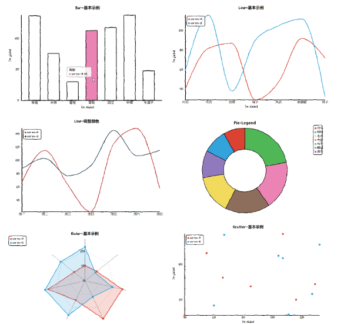
<a name="W1MEe"></a>
## 柱状图
<a name="TDg60"></a>
### 基本柱状图
```python
from cutecharts.charts import Bar
from cutecharts.components import Page
from cutecharts.faker import Faker


def bar_base() -> Bar:
    chart = Bar("Bar-基本示例")
    chart.set_options(labels=Faker.choose(), x_label="I'm xlabel", y_label="I'm ylabel")
    chart.add_series("series-A", Faker.values())
    return chart

bar_base().render()
```
Output:<br />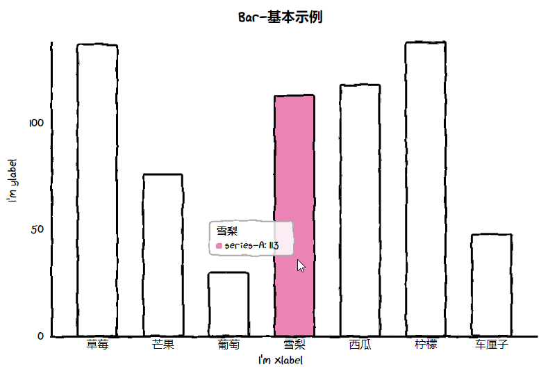
<a name="YTh0P"></a>
### 调整颜色
```python
def bar_tickcount_colors():
    chart = Bar("Bar-调整颜色")
    chart.set_options(labels=Faker.choose(), y_tick_count=10, colors=Faker.colors)
    chart.add_series("series-A", Faker.values())
    return chart
```
Output：<br />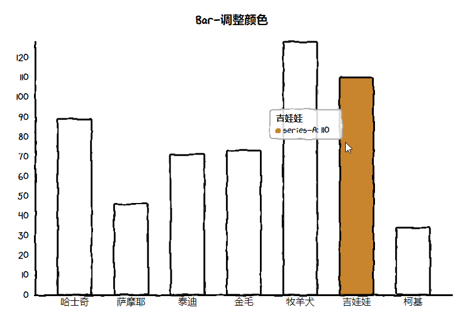
<a name="LdMJV"></a>
## 折线图
<a name="Tw8U8"></a>
### 基本折线图
```python
from cutecharts.charts import Line
from cutecharts.components import Page
from cutecharts.faker import Faker


def line_base() -> Line:
    chart = Line("Line-基本示例")
    chart.set_options(labels=Faker.choose(), x_label="I'm xlabel", y_label="I'm ylabel")
    chart.add_series("series-A", Faker.values())
    chart.add_series("series-B", Faker.values())
    return chart
line_base().render()
```
Output:<br />
<a name="LZd5Z"></a>
### Legend 位置
```python
def line_legend():
    chart = Line("Line-Legend 位置")
    chart.set_options(labels=Faker.choose(), legend_pos="upRight")
    chart.add_series("series-A", Faker.values())
    chart.add_series("series-B", Faker.values())
    return chart
```
Output：<br />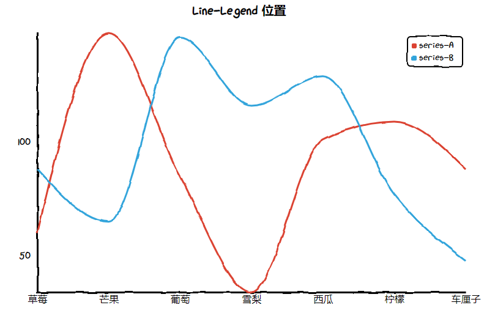
<a name="NBRDP"></a>
### 调整颜色
```python
def line_tickcount_colors():
    chart = Line("Line-调整颜色")
    chart.set_options(labels=Faker.choose(), colors=Faker.colors, y_tick_count=8)
    chart.add_series("series-A", Faker.values())
    chart.add_series("series-B", Faker.values())
    return chart
```
Output:<br />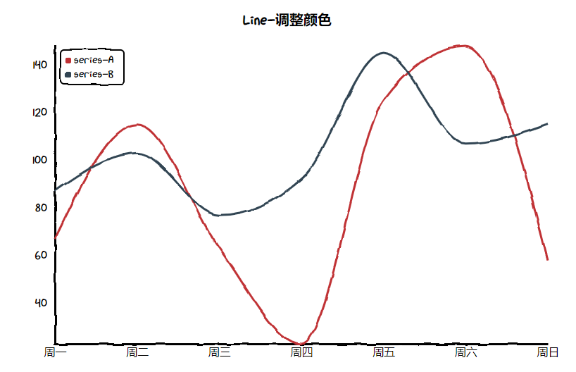
<a name="D4yK0"></a>
## 饼图
<a name="pzdPs"></a>
### 基本饼图
```python
from cutecharts.charts import Pie
from cutecharts.components import Page
from cutecharts.faker import Faker


def pie_base() -> Pie:
    chart = Pie("Pie-基本示例")
    chart.set_options(labels=Faker.choose())
    chart.add_series(Faker.values())
    return chart


pie_base().render()
```
Output：<br />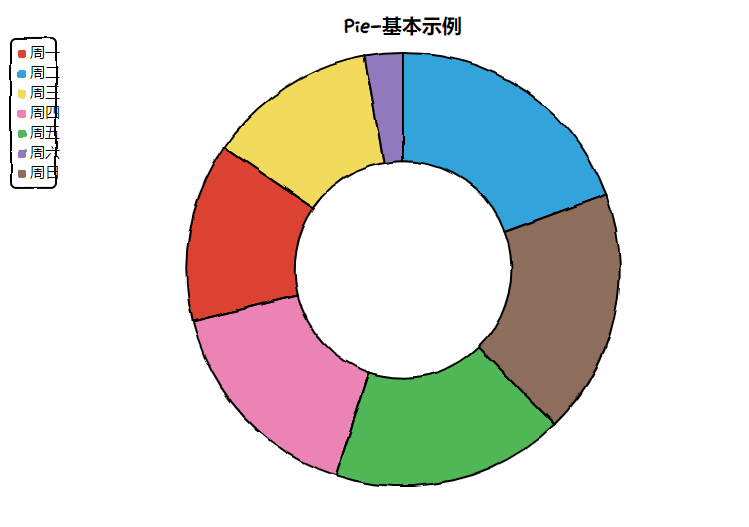
<a name="EhrpI"></a>
### Legend 位置
```python
def pie_legend_font():
    chart = Pie("Pie-Legend")
    chart.set_options(
        labels=Faker.choose(),
        legend_pos="downLeft",
        font_family='"Times New Roman",Georgia,Serif;',
    )
    chart.add_series(Faker.values())
    return chart
```
Output：<br />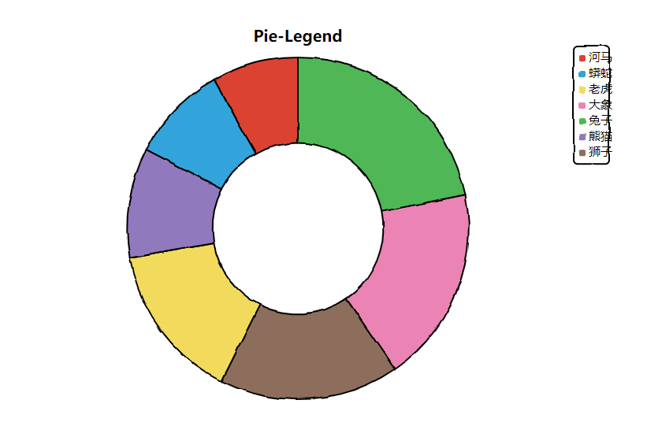
<a name="CAg0Y"></a>
### Radius 调整
```python
def pie_radius():
    chart = Pie("Pie-Radius")
    chart.set_options(
        labels=Faker.choose(),
        inner_radius=0,
    )
    chart.add_series(Faker.values())
    return chart
```
Output：<br />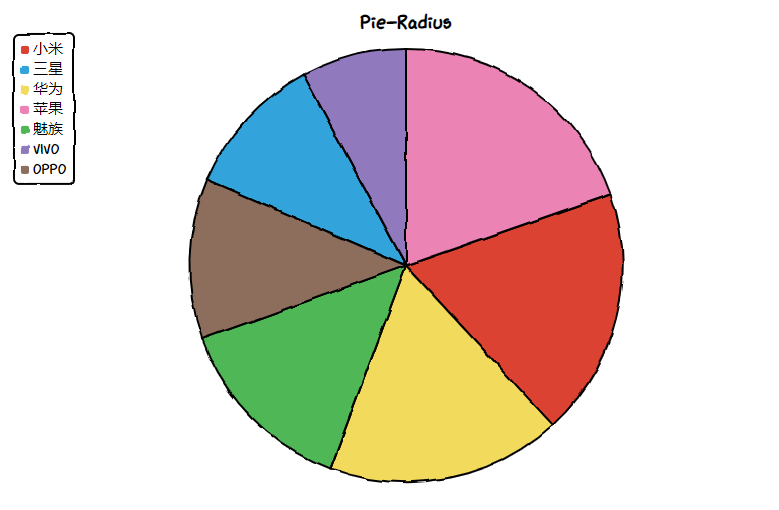
<a name="yNGXV"></a>
## 雷达图
<a name="O5jyu"></a>
### 基本雷达图
```python
from cutecharts.charts import Radar
from cutecharts.components import Page
from cutecharts.faker import Faker


def radar_base() -> Radar:
    chart = Radar("Radar-基本示例")
    chart.set_options(labels=Faker.choose())
    chart.add_series("series-A", Faker.values())
    chart.add_series("series-B", Faker.values())
    return chart


radar_base().render()
```
Output：<br />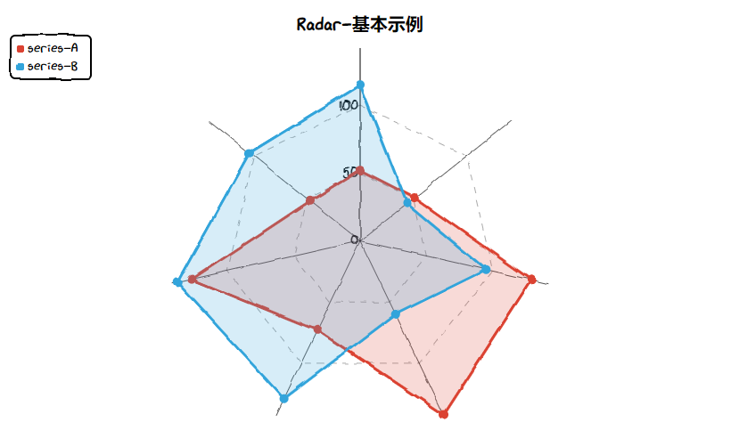
<a name="vD6ip"></a>
### 颜色调整
```python
def radar_legend_colors():
    chart = Radar("Radar-颜色调整")
    chart.set_options(labels=Faker.choose(), colors=Faker.colors, legend_pos="upRight")
    chart.add_series("series-A", Faker.values())
    chart.add_series("series-B", Faker.values())
    return chart
```
Output：<br />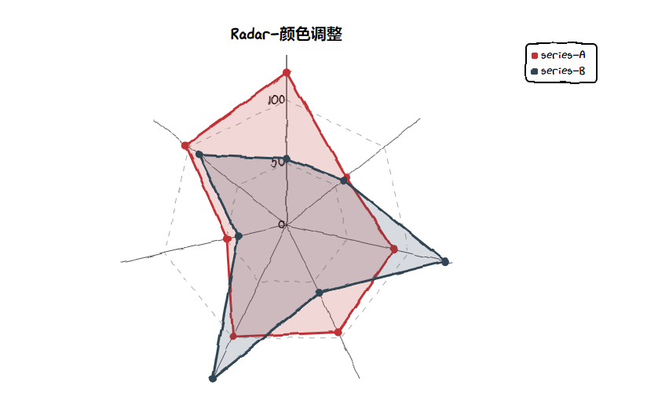
<a name="oLqop"></a>
## 散点图
<a name="nONv7"></a>
### 基本散点图
```python
from cutecharts.charts import Scatter
from cutecharts.components import Page
from cutecharts.faker import Faker


def scatter_base() -> Scatter:
    chart = Scatter("Scatter-基本示例")
    chart.set_options(x_label="I'm xlabel", y_label="I'm ylabel")
    chart.add_series(
        "series-A", [(z[0], z[1]) for z in zip(Faker.values(), Faker.values())]
    )
    chart.add_series(
        "series-B", [(z[0], z[1]) for z in zip(Faker.values(), Faker.values())]
    )
    return chart


scatter_base().render()
```
Output：<br />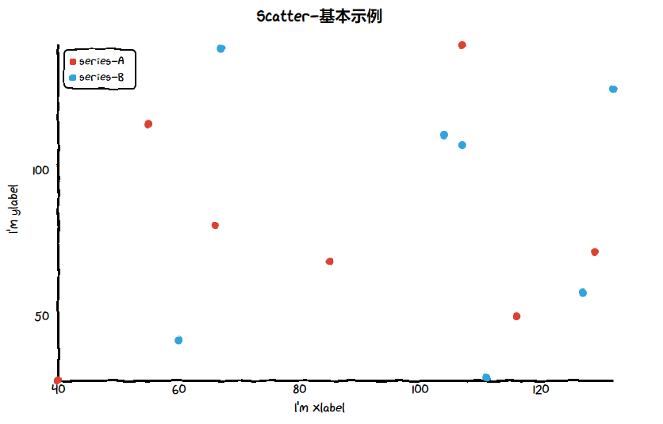
<a name="gU5Oo"></a>
### 散点大小
```python
def scatter_dotsize_tickcount():
    chart = Scatter("Scatter-散点大小")
    chart.set_options(dot_size=2, y_tick_count=8)
    chart.add_series(
        "series-A", [(z[0], z[1]) for z in zip(Faker.values(), Faker.values())]
    )
    chart.add_series(
        "series-B", [(z[0], z[1]) for z in zip(Faker.values(), Faker.values())]
    )
    return chart
```
Output：<br />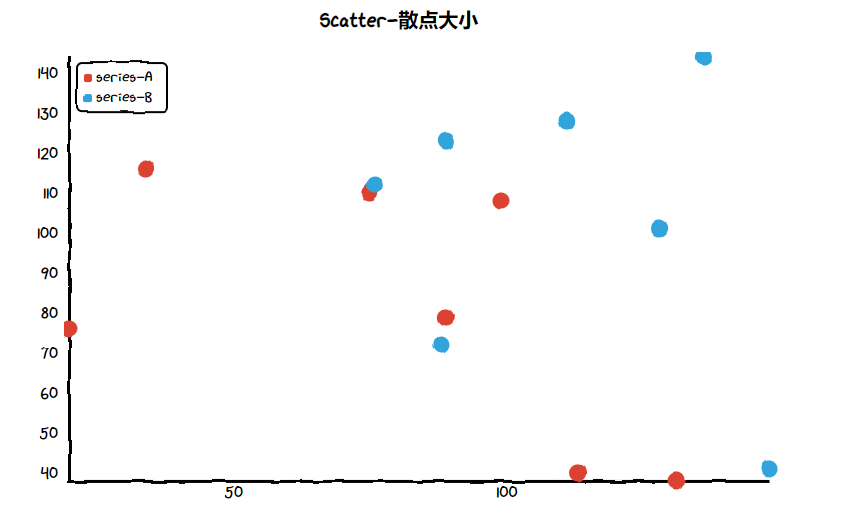
<a name="lOCF2"></a>
### 散点连成线
```python
def scatter_show_line():
    chart = Scatter("Scatter-散点连成线")
    chart.set_options(y_tick_count=8, is_show_line=True)
    chart.add_series(
        "series-A", [(z[0], z[1]) for z in zip(Faker.values(), Faker.values())]
    )
    chart.add_series(
        "series-B", [(z[0], z[1]) for z in zip(Faker.values(), Faker.values())]
    )
    return chart
```
Output：<br />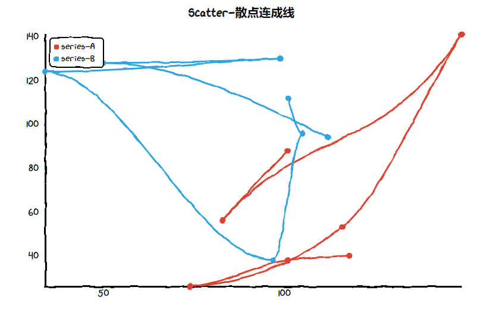
<a name="xXjrx"></a>
## 参考资料
cutecharts: [https://github.com/cutecharts/cutecharts.py](https://github.com/cutecharts/cutecharts.py)
