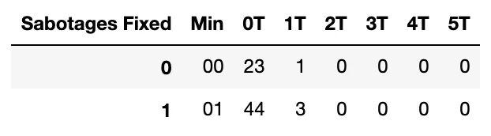

Python 可视化 Bokeh<br />
<a name="GE2hi"></a>
### 前言
数据可视化是预测建模中最基本、最重要的步骤之一。人们通常从数据可视化开始以获得更多见解，并尝试通过探索性数据分析 (EDA) 来理解数据。制作图表和视觉效果是更好的选择，而不是研究表格和值，因为人们喜欢视觉效果而不是无聊的文本或值。<br />所以，制作清晰、优雅、富有洞察力的图表，可以轻松理解，始终将观众视为非技术人员。越少影响越大，适当的可视化带来数据的清晰度，有助于决策。这里给出一个有助于Bokeh可视化的快速指南。<br /><br />数据科学生命周期
<a name="HV9XU"></a>
## 什么是Bokeh？
Bokeh 是 Python 中的交互式可视化库。Bokeh提供的最佳功能是针对现代 Web 浏览器进行演示的高度交互式图形和绘图。Bokeh 制作出优雅、简洁的图表，其中包含各种图表。<br /><br />Bokeh 主要侧重于将数据源转换为 JSON 格式，然后用作 BokehJS 的输入。Bokeh的一些最佳功能是：

- 灵活性： Bokeh 也为复杂的用例提供简单的图表和海关图表。
- 功能强： Bokeh 具有易于兼容的特性，可以与 Pandas 和 Jupyter 笔记本一起使用。
- 样式： 可以控制图表，可以使用自定义 Javascript 轻松修改图表。
- 开源： Bokeh 提供了大量的示例和想法，并在 Berkeley Source Distribution (BSD) 许可下分发。

使用Bokeh，可以轻松地将大数据可视化并以吸引人的优雅方式创建不同的图表。
<a name="VlpkL"></a>
## 在哪使用Bokeh图
有很多可视化库，为什么只需要使用Bokeh？<br />可以使用 Bokeh 库在网页上嵌入图表。使用Bokeh，可以将图表嵌入网络、制作实时仪表板和应用程序。Bokeh 为图表提供了自己的样式选项和小部件。这是使用 Flask 或 Django 在网站上嵌入Bokeh图的优势。<br />主要是Bokeh提供了两个界面层次，简单易上手。

- Bokeh模型
- Bokeh图
- Bokeh应用
- Bokeh服务器
<a name="vEl0B"></a>
#### Bokeh模型
Bokeh模型提供低级接口，为应用程序开发人员提供高端灵活性
<a name="fq26f"></a>
#### Bokeh图
Bokeh绘图提供了一个用于创建视觉符号的高级界面。Bokeh绘图是 Bokeh.models 模块的子类。它包含图形类的定义；图形类是最简单的绘图创建。
<a name="A8bG5"></a>
#### Bokeh应用程序
Bokeh应用程序包，用于创建Bokeh文件；是一家轻量级工厂。
<a name="M2NDz"></a>
#### Bokeh服务器
Bokeh 服务器用于发布和共享交互式图表和应用程序。
<a name="Pc53w"></a>
## 安装Bokeh库
用pip安装Bokeh库，运行以下命令
```bash
pip install pandas-Bokeh
```
为conda环境安装Bokeh库，运行以下命令
```bash
conda install -c patrikhlobil pandas-Bokeh
```
<a name="xvlns"></a>
## 导入Bokeh库
为Bokeh库导入必要的包。
```python
import pandas as pd
# pip install pandas_Bokeh
import pandas_Bokeh
from Bokeh.io import show, output_notebook
from Bokeh.plotting import figure
pandas_Bokeh.output_notebook()
pd.set_option('plotting.backend', 'pandas_Bokeh')
```
Bokeh绘图是一个用于创建交互式视觉效果的界面，从中导入 它作为保存图表的容器。 figure
```python
from Bokeh.plotting import figure
```
需要以下命令来显示图表。
```python
from Bokeh.io import show, output_notebook
```
需要以下命令来在 jupyter notebook 中显示图表的输出。
```python
pandas_Bokeh.output_notebook()
```
要将图表嵌入为 HTML，请运行以下命令。
```python
pandas_bokeh.output_file（文件名）
```
Hovertool 用于在使用鼠标指针悬停在数据上时显示值， ColumnDataSource 是 DataFrame 的 Bokeh 版本。
```python
from Bokeh.models import HoverTool, ColumnDataSource
```
<a name="KPG0b"></a>
### 绘制图表的语法
使用Pandas Bokeh<br />现在，通过以下代码将Bokeh绘图库用于 Pandas 数据框。
```python
dataframe.plot_Bokeh()
```
为Bokeh创建 Figure 对象<br />将创建一个图形对象，它只不过是一个保存图表的容器。可以给 `figure()` 对象取任何名字，这里给了 fig.
```python
fig = figure()
'''
自定义绘图代码
'''
show(fig)
```
使用 ColumnDataSource 创建图表<br />要将 ColumnDataSource 与渲染函数一起使用，至少需要传递 3 个参数：

- x – 包含图表 x 轴数据的 ColumnDataSource 列的名称
- y – 包含图表 y 轴数据的 ColumnDataSource 列的名称
- source – ColumnDataSource 列的名称，该列包含 x 轴和 y 轴引用的数据

要在单独的 HTML 文件中显示输出图表，请运行以下命令。
```python
output_file('abc.html')
```
<a name="Aehl8"></a>
## 使用Bokeh库主题
Bokeh主题有一组预定义的设计，可以将它们应用到您的绘图中。Bokeh 提供了五个内置主题。

- caliber,
- dark_minimal,
- light_minimal,
- night_sky,
- contrast.

下图显示了图表在内置主题中的外观。在这里，采取了不同主题的折线图。<br />运行以下代码以使用内置主题绘制图表。<br />
<a name="PS5TK"></a>
### 图表样式
为了增强图表，可以使用不同的属性。对象共有的三组主要属性：

- 线属性
- 填充属性
- 文本属性

基本造型<br />只添加自定义图表所需的代码，您可以根据需要添加代码。最后，将展示带有演示代码的图表，以便清楚地理解。好吧，还有更多属性的详细解释请参见官方文档。<br />为图表添加背景颜色。
```python
fig = figure(background_fill_color="#fafafa")
```
设置图表宽度和高度的值需要在`figure()`中添加高度和宽度。
```python
fig = figure(height=350, width=500)
```
隐藏图表的 x 轴和 y 轴。
```python
fig.axis.visible=False
```
隐藏图表的网格颜色。
```python
fig.grid.grid_line_color = None
```
要更改图表颜色的强度，使用 alpha 。
```python
fig.background_fill_alpha=0.3
```
要为图表添加标题，需要在 `figure()` 中添加标题。
```python
fig = figure(title="abc")
```
要添加或更改 x 轴和 y 轴标签，请运行以下命令。
```python
fig.xaxis.axis_label='X-axis'
fig.yaxis.axis_label='Y-axis'
```
<a name="YzgwF"></a>
#### 简单样式的演示图表
```python
x = list(range(11))
y0 = x

fig = figure(width=500, height=250,title='Title',background_fill_color="#fafafa")

fig.circle(x, y0, size=12, color="#53777a", alpha=0.8)
fig.grid.grid_line_color = None
fig.xaxis.axis_label='X-axis'
fig.yaxis.axis_label='Y-axis'

show(fig)
```
<br />使用 `Bokeh.plotting` 界面创建图表的步骤是：<br />

- 准备数据
- 创建一个新的情节
- 为您的数据添加渲染，以及您对绘图的可视化自定义
- 指定生成输出的位置（在 HTML 文件中或在 Jupyter Notebook 中）
- 显示结果
<a name="hLOcY"></a>
## Python 中的Bokeh用例
将要处理的数据是当中最著名的数据集，可以在 kaggle上找到该数据集。<br />人们玩手机游戏新热潮，它突然流行起来，成为大流行中的热门视频游戏。绍游戏的运作方：这是一款多人游戏，其中四到十名玩家被放入一艘外星飞船。每个玩家都有自己的Imposter或Crewmate角色；船员的任务是在飞船周围跑来跑去完成所有分配的任务，并照顾好不被冒名顶替者杀死。玩家可以被投票下船，因此每场比赛都成为生存游戏。
<a name="HYzk9"></a>
### 数据
加载数据并再创建一个特征User ID；用户 id 会告诉我们它像用户 1、用户 2 等哪个用户。
```python
import glob
path = 'archive' 
all_files = glob.glob(path + "/*.csv")
li = []
usr=0
for filename in all_files:
    usr+=1
    df = pd.read_csv(filename, index_col=None, header=0)
    df['User ID']=usr
    li.append(df)
df = pd.concat(li, axis=0, ignore_index=True)
df[:2]
```

<a name="CgpUg"></a>
### 数据说明

- Game Completed Date-游戏完成的日期和时间
- Team团队- 告诉我们玩家是冒名顶替者还是船员
- Outcome结果- 告诉我们游戏是否赢/输
- Task Completed已完成的任务 - 船员完成的任务数
- All Tasks Completed – 布尔变量显示所有任务是否由船员完成
- Murdered谋杀- 船员是否被谋杀
- Imposter Kills冒名顶替者杀死 – 冒名顶替者的击杀次数
- Game Length游戏时长——游戏的总持续时间
- Ejected - 玩家是否被其他玩家驱逐
- Sabotages Fixed – 船员修复的破坏次数
- Time to complete all tasks完成所有任务的时间——船员完成任务所用的时间
- Rank Change排名变化- 比赛输/赢后排名的变化
- Region/Game Code地区/游戏代码- 服务器和游戏代码
- User ID用户 ID –用户数量。

注意：本文不包含 EDA，但展示了如何在 Bokeh 中使用不同的图表<br />看看数据的分布。
```python
df.describe(include='O')
```
<br />将创建一个特征 Minute 并从 Game Lenght 中提取数据。
```python
df['Min'] = df.apply(lambda x : x['Game Length'].split(" ")[0] , axis = 1)
df['Min'] = df['Min'].replace('m', '', regex=True)
df['Min'][:2]
```
```python
0    07
1    16
Name: Min, dtype: object
```
现在，将替换 Murdered 特征的值。
```python
df['Murdered'].replace(['No', 'Yes', '-'], ['Not Murdered', 'Murdered', 'Missing'],inplace=True)
```
完成必要的清洁步骤后。首先看看Bokeh中的基本图表。
<a name="tKrM0"></a>
### 饼形图
检查一下游戏中是否有更多的船员或冒名顶替者，有总共 2227 人的数据。
```python
df_team = df.Team.value_counts()
df_team.plot_Bokeh(kind='pie', title='Ration of Mposter vs Crewmate')
```
<br />如图所示，Cremates 占 79%，Imposters 占 21%，由此可见 Imposter: Crewmates 的比例为1:4。冒名顶替者较少，因此有可能赢得大部分比赛。
<a name="D0mSy"></a>
### 圆环图
检查游戏中是否有更多的船员或冒名顶替者被谋杀。将添加两个将在图表中使用的功能 Angle 和 Color。
```python
from math import pi
df_mur = df.Murdered.value_counts().reset_index().rename(columns={'index': 'Murdered', 'Murdered': 'Value'})
df_mur['Angle'] = df_mur['Value']/df_mur['Value'].sum() * 2*pi
df_mur['Color'] = ['#3182bd', '#6baed6', '#9ecae1']

df_mur
```
<br />将用`annular_wedge()`做一个圆环图。
```python
from Bokeh.transform import cumsum

fig = figure(plot_height=350, 
             title="Ration of Murdered vs Not Murdered", 
             toolbar_location=None,

tools="hover", tooltips="@Murdered: @Value", x_range=(-.5, .5))
fig.annular_wedge(x=0, y=1, inner_radius=0.15, 
                  outer_radius=0.25, direction="anticlock",

start_angle=cumsum('Angle', include_zero=True),
                  end_angle=cumsum('Angle'),

line_color="white", fill_color='Color', legend_label='Murdered', source=df_mur)

fig.axis.axis_label=None
fig.axis.visible=False
fig.grid.grid_line_color = None
show(fig)
```
<br />Bokeh圆环图<br />大多数人在游戏中被谋杀，但大部分数据丢失。所以不能说大多数人是在游戏中被谋杀的。
<a name="bsaTe"></a>
### 散点图
首先，将创建 Sabotages fixed 和 Minutes 的数据框，并更改列名并在其中添加 T。
```python
df_min = pd.crosstab(df['Min'], df['Sabotages Fixed']).reset_index()
df_min = df_min.rename(columns={0.0:'0T', 1.0:'1T',
                       2.0:'2T',3.0:'3T',4.0:'4T',5.0:'5T'
                    })
df_min[:2]
```
<br />将 3 次破坏固定为 0,1 和 2 并创建一个数据框。
```python
df_0 = df_min[['Min', '0T']]
df_1 = df_min[['Min', '1T']]
df_2 = df_min[['Min', '2T']]
```
要制作只有一个图例的简单散点图，可以传递数据并使用`scatter()`它来制作图表。
```python
df_min.plot_Bokeh.scatter(x='Min', y='1T')
```
<br />Bokeh散点图<br />要制作包含多个图例的散点图，需要使用圆圈；这是图形对象的一种方法。圆圈是Bokeh提供的众多绘图样式之一，可以使用三角形或更多。
```python
fig = figure(title='Sabotages Fixed vs Minutes', 
             tools= 'hover', 
             toolbar_location="above", 
             toolbar_sticky=False)
fig.circle(x="Min",y='0T', 
         size=12, alpha=0.5, 
         color="#F78888", 
         legend_label='0T', 
         source=df_0),
fig.circle(x="Min",y='1T', 
         size=12, alpha=0.5, 
         color="blue", 
         legend_label='1T', 
         source=df_1),
fig.circle(x="Min",y='2T', 
         size=12, alpha=0.5, 
         color="#626262", 
         legend_label='2T', 
         source=df_2),
show(fig)
```
<br />Bokeh散点图
<a name="xG16D"></a>
### 简单直方图
看看游戏之间的分钟分布。将用hist来绘制直方图。
```python
df_minutes = df['Min'].astype('int64')
df_minutes.plot_Bokeh(kind='hist', title='Distribution of Minutes')
```
<br />Bokeh中的直方图<br />大多数比赛有6分钟到14分钟的时间。
<a name="cW1tA"></a>
### 堆积直方图
看看游戏长度是否会增加，因此冒名顶替者和船员会减少还是增加。使用 hist来制作堆叠直方图。
```python
df_gm_te = pd.crosstab(df['Game Length'], df['Team'])
df_gm_te
```

```python
df_gm_te.plot_Bokeh.hist(title='Gamelegth vs Imposter/Crewmate', figsize=(750, 350))
```
<br />Bokeh中的堆叠直方图<br />冒名顶替者不倾向于长时间玩游戏，他们只想杀死所有火葬并赢得游戏。
<a name="dmoHV"></a>
## 不同类型的条形图
<a name="YvPpk"></a>
### 简单条形图
看看给定的任务是否由人完成。如果所有任务都完成，那么自动火葬将获胜。
```python
df_tc = pd.DataFrame(df['Task Completed'].value_counts())[1:].sort_index().rename(columns={'Task Completed': 'Count'})
df_tc.plot_Bokeh(kind='bar', y='Count', title='How many people have completed given task?', figsize=(750, 350))
```
<br />Bokeh中的条形图<br />完成最多的任务是 7 个，完成最少的任务是 10 个。
<a name="FFwRT"></a>
### 堆积条形图
看看谁赢了：冒名顶替者或火葬。
```python
df1 = pd.crosstab(df['Team'], df['Outcome'])
df1.plot_Bokeh.bar(title='Who wins: Imposter or Crewmates',stacked=True,
figsize=(550, 350))
```
<br />Bokeh中的堆积条形图<br />冒名顶替者比 Crewmates 赢得更多。Imposter赢得或输掉比赛没有太大区别，价值非常接近。很多情况下，他们有5个火葬场和4个冒名顶替者。
<a name="SVDm8"></a>
### 堆积垂直条形图
完成任务会不会赢得比赛，拭目以待。
```python
df['All Tasks Completed'].replace(['Yes','No'], ['Tasks Completed','Tasks Not Completed'], inplace=True)

df2 = pd.crosstab(df['Outcome'], df['All Tasks Completed'])
df2.plot_Bokeh.barh(title='Completeing task: win or loss', stacked=True,
figsize=(650, 350))
```
<br />Bokeh中的堆积条形图<br />完成任务将自动赢得火葬。完成任务赢得比赛的人数更多。
<a name="zEbtz"></a>
### 双向条形图
用双向条形图看看用户是赢了还是输了。要制作双向条形图，需要将一个度量设为负值，这里将损失特征设为负值。
```python
df_user = pd.crosstab(df['User ID'], df['Outcome']).reset_index()
df_user['Loss'] = df_user['Loss']*-1
df_user['User ID'] = (df_user.index+1).astype(str) + ' User'
df_user = df_user.set_index('User ID')
df_user[:2]
```
现在完成上面的过程后，只需要`barh()` 在两个方向上制作一个条形图即可。
```python
df_user.plot_Bokeh.barh(title='Users: Won or Defeat')
```
<br />Bokeh中的双向条形图<br />从图表中，可以轻松区分用户是被击败还是赢得了比赛。
<a name="nvz2j"></a>
### 折线图
看看游戏中火化的排出比例。将line 用来制作折线图。
```python
df_crewmate = df[df['Team'] == 'Crewmate']
df_t_ej = pd.crosstab(df_crewmate['User ID'], df_crewmate['Ejected']).reset_index()
df_t_ej = df_t_ej[['No','Yes']]
df_t_ej.plot_Bokeh.line(title='Cremates Memebers: Ejected vs Minutes', figsize=(750, 350))
```
<br />Bokeh中的折线图<br />没有被逐出游戏的成员存在很大差异。
<a name="LcMC2"></a>
### 棒棒糖图表
将获胜的前 10 名用户的图表可视化。在所有用户 ID 中添加了一个用户字符串。数据框看起来像这样。
```python
df_user_new = pd.crosstab(df['User ID'], df['Outcome']).reset_index().sort_values(by='Win', ascending=False)[:10]
df_user_new['User ID'] = (df_user_new.index+1).astype(str) + ' User'
df_user_new[:2]
```
在此图表中，将从图表中删除 x 轴和 y 轴网格线。为了制作棒棒糖图表，需要结合 `segment()` 和`circle()`。
```python
x = df_user_new['Win']

factors = df_user_new['User ID'] #.values
fig = figure(title="Top 10 Users: Win", toolbar_location=None,tools="hover", tooltips="@x",
y_range=factors, x_range=[0,75],
plot_width=750, plot_height=350)

fig.segment(0, factors, x, factors, line_width=2, line_color="#3182bd")
fig.circle(x, factors, size=15, fill_color="#9ecae1", line_color="#3182bd", line_width=3)
fig.xgrid.grid_line_color = None
fig.ygrid.grid_line_color = None
show(fig)
```
<br />Bokeh中的棒棒糖图
<a name="ffqOH"></a>
### 面积图
看看在这段时间（分钟）内修复了多少破坏事件。在这里为了简单起见，只看到两个破坏活动 0th 和 1st。
```python
from Bokeh.models import ColumnDataSource
from Bokeh.plotting import figure, output_file, show

# data
df_min = pd.crosstab(df['Min'], df['Sabotages Fixed']).reset_index()
df_min = df_min.rename(columns={0.0:'0T', 1.0:'1T',2.0:'2T',3.0:'3T',4.0:'4T',5.0:'5T'})

# chart
names = ['0T','1T']
source = ColumnDataSource(data=dict(x = df_min.Min,
                                    y0 = df_min['0T'],
                                    y1 = df_min['1T']))

fig = figure(width=400, height=400, title='Sabotages Fied vs Minutes')
fig.varea_stack(['y0','y1'], x='x', color=("grey", "lightgrey"),legend_label=names, source=source)

fig.grid.grid_line_color = None
fig.xaxis.axis_label='Minutes'

show(fig)
```
<br />Bokeh中的面积图<br />随着时间的增加，破坏活动会减少。<br />到目前为止，已经看到了Bokeh中的所有基本图表，现在看看如何在Bokeh中使用布局。这将创建仪表板或应用程序。因此，可以将特定用例的所有信息集中在一个地方。
<a name="ghmns"></a>
## Bokeh库的布局功能
Layout 函数将构建一个由绘图和小部件组成的网格。可以在一个布局中拥有尽可能多的行和列或网格。<br />有许多可用的布局选项：

- 如果要垂直显示图，请使用**column()**函数。
- 如果要水平显示图，请使用**row()**函数。
- 如果您希望以网格方式绘制图形，请使用**gridplot()**函数。
- 如果您希望图表以最佳方式放置，请使用**layout()**函数

取一个虚拟数据。
```python
from Bokeh.io import output_file, show
from Bokeh.layouts import row,column
from Bokeh.plotting import figure
output_file("layout.html")
x = list(range(11))
y0 = x
y1 = [10 - i for i in x]
y2 = [abs(i - 5) for i in x]
# create three plots
s1 = figure(width=250, height=250, background_fill_color="#fafafa")
s1.circle(x, y0, size=12, color="#53777a", alpha=0.8)
s2 = figure(width=250, height=250, background_fill_color="#fafafa")
s2.triangle(x, y1, size=12, color="#c02942", alpha=0.8)
s3 = figure(width=250, height=250, background_fill_color="#fafafa")
s3.square(x, y2, size=12, color="#d95b43", alpha=0.8)
```
如果使用 `column()` 函数，输出将如下所示。
```python
show(column(s1, s2, s3))
```
<br />如果使用 `row()` 函数，输出将如下所示。
```python
# 将结果排成一行并显示
show(row(s1, s2, s3))
```
<br />在 Bokeh 中制作仪表板布局。在这里拍了三张图表，一张是棒棒糖图，另外两张是Bokeh的饼图。<br />在Bokeh中设置布局的主要逻辑是希望如何设置图表。创建一个如下图所示的设计。<br />
```python
layout = grid([[fig1],
               [fig2, fig3]])
```
在 Bokeh 中运行仪表板布局的整个代码。
```python
from Bokeh.io import output_file, show
from Bokeh.plotting import figure
from Bokeh.layouts import column, grid
# 1 layout
df_user_new = pd.crosstab(df['User ID'], df['Outcome']).reset_index().sort_values(by='Win', ascending=False)[:10]
df_user_new['User ID'] = (df_user_new.index+1).astype(str) + ' User'
x = df_user_new['Win']
factors = df_user_new['User ID'] 
fig1 = figure(title="Top 10 Users: Win", toolbar_location=None,
              tools="hover", tooltips="@x",
              y_range=factors, x_range=[0,75], 
              width=700, height=250)
fig1.segment(0, factors, x, factors, line_width=2, line_color="#3182bd")
fig1.circle(x, factors, size=15, fill_color="#9ecae1", line_color="#3182bd", line_width=3)
# 2 layout
df_mur = df.Murdered.value_counts().reset_index().rename(columns={'index': 'Murdered', 'Murdered': 'Value'})
df_mur['Angle'] = df_mur['Value']/df_mur['Value'].sum() * 2*pi
df_mur['Color'] = ['#3182bd', '#6baed6', '#9ecae1']
fig2 = figure(height=300,width=400, title="Ration of Murdered vs Not Murdered", 
              toolbar_location=None, tools="hover", tooltips="@Murdered: @Value", x_range=(-.5, .5))
fig2.annular_wedge(x=0, y=1,  inner_radius=0.15, outer_radius=0.25, direction="anticlock",
                   start_angle=cumsum('Angle', include_zero=True), end_angle=cumsum('Angle'),
                   line_color="white", fill_color='Color', legend_label='Murdered', source=df_mur)
# 3 layout
df_team = pd.DataFrame(df.Team.value_counts()).reset_index().rename(columns={'index': 'Team', 'Team': 'Value'})
df_team['Angle'] = df_team['Value']/df_team['Value'].sum() * 2*pi
df_team['Color'] = ['#3182bd', '#6baed6']

fig3 = figure(height=300, width=300, title="Ration of Cremates vs Imposter",  
              toolbar_location=None, tools="hover", tooltips="@Team: @Value", x_range=(-.5, .5))
fig3.annular_wedge(x=0, y=1,  inner_radius=0.15, outer_radius=0.25, direction="anticlock",
                   start_angle=cumsum('Angle', include_zero=True), end_angle=cumsum('Angle'),
                   line_color="white", fill_color='Color', legend_label='Team', source=df_team)
# Styling
for fig in [fig1, fig2, fig3]:
        fig.grid.grid_line_color = None
for fig in [fig2, fig3]:
        fig.axis.visible=False
        fig.axis.axis_label=None
layout = grid([
                [fig1],
                [fig2, fig3]
       ])
show(layout)
```

