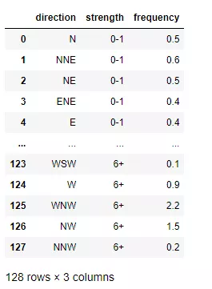

Python Plotly Express<br />Plotly Express 是一个新的高级 Python 可视化库，它是 Plotly.py 的高级封装，为复杂图表提供简单的语法。最主要的是 Plotly 可以与 Pandas 数据类型 DataFrame 完美的结合，对于数据分析、可视化来说实在是太便捷了，而且是完全免费的，非常值得尝试<br />下面使用 Ployly 的几个内置数据集来进行相关图表绘制的演示
<a name="MVcW5"></a>
## 数据集
Plotly 内置的所有数据集都是 DataFrame 格式，也即是与 Pandas 深度契合的体现
<a name="kzsZK"></a>
### 不同国家历年GDP收入与人均寿命
包含字段：国家、洲、年份、平均寿命、人口数量、GDP、国家简称、国家编号
```python
gap = px.data.gapminder()
gap2007 = gap.query("year==2007")
gap2007
```
Output<br />
<a name="V8zg3"></a>
### 餐馆的订单流水
包含字段：总账单、小费、性别、是否抽烟、星期几、就餐时间、人数
```python
tips = px.data.tips()
tips
```
Output<br />
<a name="STbi4"></a>
### 鸢尾花
包含字段：萼片长、萼片宽、花瓣长、花瓣宽、种类、种类编号
```python
iris = px.data.iris()  
iris
```
Output<br />
<a name="a0t1E"></a>
### 风力数据
包含字段：方向、强度、数值
```python
wind = px.data.wind()  
wind
```
Output<br />
<a name="LWeVr"></a>
### 2013年蒙特利尔市长选举投票结果
包括字段：区域、Coderre票数、Bergeron票数、Joly票数、总票数、胜者、结果(占比分类)
```python
election = px.data.election() 
election
```
Output<br />
<a name="MUC2y"></a>
### 蒙特利尔一个区域中心附近的汽车共享服务的可用性
包括字段：纬度、经度、汽车小时数、高峰小时
```python
carshare = px.data.carshare()
carshare
```
Output<br />
<a name="t4Tzg"></a>
## 内置调色板
Plotly 还拥有众多色彩高级的调色板，在绘制图表的时候不再为颜色搭配而烦恼
<a name="Kibzi"></a>
### 卡通片的色彩和序列
```python
px.colors.carto.swatches()
```
Output<br />
<a name="rRP8G"></a>
### CMOcean项目的色阶
```python
px.colors.cmocean.swatches()
```
Output<br /><br />还有其他很多调色板供选择，就不一一展示了，下面只给出代码，具体颜色样式可以自行运行代码查看<br />ColorBrewer2项目的色阶
```python
px.colors.colorbrewer
```
周期性色标，适用于具有自然周期结构的连续数据
```python
px.colors.cyclical 
```
分散色标，适用于具有自然终点的连续数据
```python
px.colors.diverging
```
定性色标，适用于没有自然顺序的数据
```python
px.colors.qualitative
```
顺序色标，适用于大多数连续数据
```python
px.colors.sequential
```
<a name="crUQQ"></a>
## Plotly Express 基本绘图
<a name="tK6qm"></a>
### 散点图
Plotly 绘制散点图非常容易，一行代码就可以完成
```python
px.scatter(gap2007, x="gdpPercap", y="lifeExp")
```
Output<br /><br />还可以通过参数 color 来区分不同的数据类别
```python
px.scatter(gap2007, x="gdpPercap", y="lifeExp", color="continent")
```
Output<br /><br />这里每个点都代表一个国家，不同颜色则代表不同的大洲<br />可以使用参数 size 来体现数据的大小情况
```python
px.scatter(gap2007, x="gdpPercap", y="lifeExp", color="continent", size="pop", size_max=60)
```
Output<br /><br />还可以通过参数 hover_name 来指定当鼠标悬浮的时候，展示的信息<br /><br />还可以根据数据集中不同的数据类型进行图表的拆分
```python
px.scatter(gap2007, x="gdpPercap", y="lifeExp", color="continent", size="pop", 
           size_max=60, hover_name="country", facet_col="continent", log_x=True)
```
Output<br /><br />当然还可以查看不同年份的数据，生成自动切换的动态图表
```python
px.scatter(gap, x="gdpPercap", y="lifeExp", color="continent", size="pop", 
           size_max=60, hover_name="country", animation_frame="year", animation_group="country", log_x=True,
          range_x=[100, 100000], range_y=[25, 90], labels=dict(pop="Population", gdpPercap="GDP per Capa", lifeExp="Life Expectancy"))
```
Output<br />
<a name="WM8w9"></a>
### 地理信息图
Plotly 绘制动态的地理信息图表也是非常方便，通过这种地图的形式，也可以清楚的看到数据集中缺少前苏联的相关数据
```python
px.choropleth(gap, locations="iso_alpha", color="lifeExp", hover_name="country", animation_frame="year", 
              color_continuous_scale=px.colors.sequential.Plasma, projection="natural earth")
```
Output<br />
<a name="eRA31"></a>
### 矩阵散点图
```python
px.scatter_matrix(iris, dimensions=['sepal_width', 'sepal_length', 'petal_width', 'petal_length'], color='species', symbol='species')
```
Output<br />
<a name="yxQbm"></a>
### 平行坐标图
```python
px.parallel_coordinates(tips, color='size', color_continuous_scale=px.colors.sequential.Inferno)
```
Output<br />
<a name="UHaXA"></a>
### 三元散点图
```python
px.scatter_ternary(election, a="Joly", b="Coderre", c="Bergeron", color="winner", size="total", hover_name="district",
                   size_max=15, color_discrete_map = {"Joly": "blue", 
                   "Bergeron": "green", "Coderre":"red"} )
```
Output<br />
<a name="v14yQ"></a>
### 极坐标线条图
```python
px.line_polar(wind, r="frequency", theta="direction", color="strength", 
            line_close=True,color_discrete_sequence=px.colors.sequential.Plotly3[-2::-1])
```
Output<br />
<a name="v92nr"></a>
### 小提琴图
```python
px.violin(tips, y="tip", x="sex", color="smoker", facet_col="day", facet_row="time",box=True, points="all", 
          category_orders={"day": ["Thur", "Fri", "Sat", "Sun"], "time": ["Lunch", "Dinner"]},
          hover_data=tips.columns)
```
Output<br />
<a name="PdQZN"></a>
### 极坐标条形图
```python
px.bar_polar(wind, r="frequency", theta="direction", color="strength",
            color_discrete_sequence= px.colors.sequential.Plotly3[-2::-1])
```
Output<br />
<a name="FPYX4"></a>
### 并行类别图
```python
px.parallel_categories(tips, color="size", color_continuous_scale=px.
            colors.sequential.Inferno)
```
Output<br />
<a name="rofMU"></a>
### 直方图
```python
px.histogram(tips, x="total_bill", color="smoker",facet_row="day", facet_col="time")
```
Output<br />
<a name="tACxJ"></a>
### 三维散点图
```python
px.scatter_3d(election, x="Joly", y="Coderre", z="Bergeron", color="winner", 
              size="total", hover_name="district",symbol="result", 
              color_discrete_map = {"Joly": "blue", "Bergeron": "green", 
              "Coderre":"red"})
```
Output<br />
<a name="HWzvS"></a>
### 密度等值线图
```python
px.density_contour(iris, x="sepal_width", y="sepal_length", color="species")
```
Output<br />
<a name="GvnzZ"></a>
### 箱形图
```python
px.box(tips, x="sex", y="tip", color="smoker", notched=True)
```
Output<br />
<a name="mYexp"></a>
### 地理坐标线条图
```python
px.line_geo(gap.query("year==2007"), locations="iso_alpha", 
            color="continent", projection="orthographic")
```
Output<br />
<a name="CokHN"></a>
### 条线图
```python
px.line(gap, x="year", y="lifeExp", color="continent", 
        line_group="country", hover_name="country",
        line_shape="spline", render_mode="svg")
```
Output<br />
<a name="C1ZOf"></a>
### 面积图
```python
px.area(gap, x="year", y="pop", color="continent", 
        line_group="country")
```
Output<br />
<a name="AvT4S"></a>
### 热力图
```python
px.density_heatmap(iris, x="sepal_width", y="sepal_length", 
                   marginal_x="rug", marginal_y="histogram")
```
Output<br />
<a name="ppjPZ"></a>
### 条形图
```python
px.bar(tips, x="sex", y="total_bill", color="smoker", barmode="group")
```
Output<br /><br />总体来说，Plotly/Plotly Express 还是非常强大绘图工具，值得细细研究~
