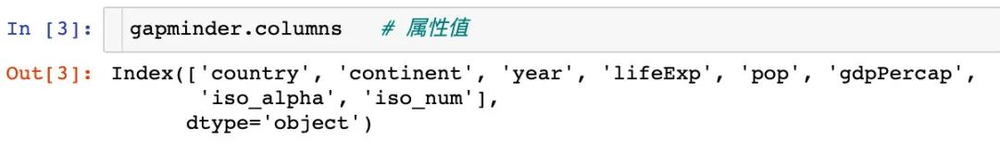

Python 可视化 Plotly_express<br />
<a name="zDDTw"></a>
## 1、环境准备

- Python3.7
- Jupyter notebook
- Pandas1.1.3
- Plotly_express0.4.1

其中 Plotly_express0.4.1 是本文的主角，安装它非常简单，只需要使用 `pip install` 就可以
```bash
$ python3 -m pip install plotly_express
```
<a name="jecUU"></a>
## 2、工具概述
在说 plotly_express之前，先了解下plotly。Plotly是新一代的可视化神器，由TopQ量化团队开源。虽然Ploltly功能非常之强大，但是一直没有得到重视，主要原因还是其设置过于繁琐。因此，Plotly推出了其简化接口：Plotly_express，下文中统一简称为px。<br />px是对Plotly.py的一种高级封装，其内置了很多实用且现代的绘图模板，用户只需要调用简单的API函数即可实用，从而快速绘制出漂亮且动态的可视化图表。<br />px是完全免费的，用户可以任意使用它。最重要的是，`px`和`plotly`生态系统的其他部分是完全兼容的。用户不仅可以在`Dash`中使用，还能通过`Orca`将数据导出为几乎任意文件格式。<br />官网的学习资料：[https://plotly.com/](https://plotly.com/)<br />px的安装是非常简单的，只需要通过`pip install plotly_express`来安装即可。安装之后的使用：
```python
import plotly_express as px  
```
<a name="bOS0V"></a>
## 3、开始绘图
接下来通过px中自带的数据集来绘制各种精美的图形。

- gapminder
- tips
- wind
<a name="bENXZ"></a>
### 3.1 数据集
首先看下`px`中自带的数据集：
```python
import pandas as pd
import numpy as np
import plotly_express as px  # 现在这种方式也可行：import plotly.express as px

# 数据集
gapminder = px.data.gapminder()
gapminder.head()  # 取出前5条数据
```
<br />看看全部属性值：<br />
<a name="uCZ2r"></a>
### 3.2 线型图
线型图line在可视化制图中是很常见的。利用px能够快速地制作线型图：
```python
# line 图
fig = px.line(
  gapminder,  # 数据集
  x="year",  # 横坐标
  y="lifeExp",  # 纵坐标
  color="continent",  # 颜色的数据
  line_group="continent",  # 线性分组
  hover_name="country",   # 悬停hover的数据
  line_shape="spline",  # 线的形状
  render_mode="svg"  # 生成的图片模式
)
fig.show()
```
<br />再来制作面积图：
```python
# area 图
fig = px.area(
  gapminder,  # 数据集
  x="year",  # 横坐标
  y="pop",  # 纵坐标
  color="continent",   # 颜色
  line_group="country"  # 线性组别
)
fig.show()
```

<a name="zuDOJ"></a>
### 3.3 散点图<br /><br />
散点图的制作调用`scatter`方法：<br /><br />指定size参数还能改变每个点的大小：
```python
px.scatter(
  gapminder2007   # 绘图DataFrame数据集
  ,x="gdpPercap"  # 横坐标
  ,y="lifeExp"  # 纵坐标
  ,color="continent"  # 区分颜色
  ,size="pop"   # 区分圆的大小
  ,size_max=60  # 散点大小
)
```
<br />通过指定`facet_col`、`animation_frame`参数还能将散点进行分块显示：
```python
px.scatter(
  gapminder   # 绘图使用的数据
  ,x="gdpPercap" # 横纵坐标使用的数据
  ,y="lifeExp"  # 纵坐标数据
  ,color="continent"  # 区分颜色的属性
  ,size="pop"   # 区分圆的大小
  ,size_max=60  # 圆的最大值
  ,hover_name="country"  # 图中可视化最上面的名字
  ,animation_frame="year"  # 横轴滚动栏的属性year
  ,animation_group="country"  # 标注的分组
  ,facet_col="continent"   # 按照国家country属性进行分格显示
  ,log_x=True  # 横坐标表取对数
  ,range_x=[100,100000]  # 横轴取值范围
  ,range_y=[25,90]  # 纵轴范围
  ,labels=dict(pop="Populations",  # 属性名字的变化，更直观
               gdpPercap="GDP per Capital",
               lifeExp="Life Expectancy")
)
```

<a name="QgteE"></a>
### 3.4 地理数据绘图
在实际的工作中，可能会接触到中国地图甚至是全球地图，使用px也能制作：
```python
px.choropleth(
  gapminder,  # 数据集
  locations="iso_alpha",  # 配合颜色color显示
  color="lifeExp", # 颜色的字段选择
  hover_name="country",  # 悬停字段名字
  animation_frame="year",  # 注释
  color_continuous_scale=px.colors.sequential.Plasma,  # 颜色变化
  projection="natural earth"  # 全球地图
             )
```

```python
fig = px.scatter_geo(
  gapminder,   # 数据
  locations="iso_alpha",  # 配合颜色color显示
  color="continent", # 颜色
  hover_name="country", # 悬停数据
  size="pop",  # 大小
  animation_frame="year",  # 数据帧的选择
  projection="natural earth"  # 全球地图
                    )

fig.show()
```

```python
px.scatter_geo(gapminder, # 数据集
               locations="iso_alpha",  # 配和color显示颜色
               color="continent",  # 颜色的字段显示
               hover_name="country",  # 悬停数据
               size="pop",  # 大小
               animation_frame="year"  # 数据联动变化的选择
               #,projection="natural earth"   # 去掉projection参数
              )
```
<br />使用line_geo来制图：
```python
fig = px.line_geo(
    gapminder2007,  # 数据集
    locations="iso_alpha",  # 配合和color显示数据
    color="continent",  # 颜色
    projection="orthographic")   # 球形的地图
fig.show()
```

<a name="dKKyf"></a>
### 3.5 使用内置iris数据
先看看怎么使用px来查看内置数据的文档：<br />
<a name="hmFCf"></a>
#### 选择两个属性制图
选择两个属性作为横纵坐标来绘制散点图
```python
fig = px.scatter(
  iris,  # 数据集
  x="sepal_width",  # 横坐标
  y="sepal_length"  # 纵坐标
                )
fig.show()
```
<br />通过color参数来显示不同的颜色：<br />
<a name="xyIpU"></a>
### 3.6 联合分布图
一个图形中能够将散点图和直方图组合在一起显示：
```python
px.scatter(
  iris,  # 数据集
  x="sepal_width", # 横坐标
  y="sepal_length",  # 纵坐标
  color="species",  # 颜色
  marginal_x="histogram",  # 横坐标直方图
  marginal_y="rug"   # 细条图
)
```

<a name="L5voy"></a>
### 3.7 小提琴图
小提琴图能够很好的显示数据的分布和误差情况，一行代码利用也能显示小提琴图：
```python
px.scatter(
  iris,  # 数据集
  x="sepal_width",  # 横坐标
  y="sepal_length",  # 纵坐标
  color="species",  # 颜色
  marginal_y="violin",  # 纵坐标小提琴图
  marginal_x="box",  # 横坐标箱型图
  trendline="ols"  # 趋势线
)
```

<a name="i2O3g"></a>
### 3.8 散点矩阵图
```python
px.scatter_matrix(
  iris,  # 数据
  dimensions=["sepal_width","sepal_length","petal_width","petal_length"],  # 维度选择
  color="species")  # 颜色
```

<a name="MvrEZ"></a>
### 3.9 平行坐标图
```python
px.parallel_coordinates(
  iris,   # 数据集
  color="species_id",  # 颜色
  labels={"species_id":"Species",  # 各种标签值
          "sepal_width":"Sepal Width",
          "sepal_length":"Sepal Length",
          "petal_length":"Petal Length",
          "petal_width":"Petal Width"},
  color_continuous_scale=px.colors.diverging.Tealrose,
  color_continuous_midpoint=2)
```

<a name="Ze81Q"></a>
### 3.10 箱体误差图
```python
# 对当前值加上下两个误差值
iris["e"] = iris["sepal_width"] / 100
px.scatter(
  iris,  # 绘图数据集
  x="sepal_width",  # 横坐标
  y="sepal_length",  # 纵坐标
  color="species",  # 颜色值
  error_x="e",  # 横轴误差
  error_y="e"  # 纵轴误差
          )
```

<a name="q8zZB"></a>
### 3.11 等高线图
等高线图反映数据的密度情况：
```python
px.density_contour(
  iris,  # 绘图数据集
  x="sepal_width",  # 横坐标
  y="sepal_length",  # 纵坐标值
  color="species"  # 颜色
)
```
<br />等高线图和直方图的俩和使用：
```python
px.density_contour(
  iris, # 数据集
  x="sepal_width",  # 横坐标值
  y="sepal_length",  # 纵坐标值
  color="species",  # 颜色
  marginal_x="rug",  # 横轴为线条图
  marginal_y="histogram"   # 纵轴为直方图
                  )
```

<a name="iR9r7"></a>
### 3.12 密度热力图
```python
px.density_heatmap(
  iris,  # 数据集
  x="sepal_width",   # 横坐标值
  y="sepal_length",  # 纵坐标值
  marginal_y="rug",  # 纵坐标值为线型图
  marginal_x="histogram"  # 直方图
                  )
```

<a name="WPi9W"></a>
### 3.13 并行类别图
在接下来的图形中使用的小费tips实例，首先是导入数据：<br />
```python
fig = px.parallel_categories(
  tips,  # 数据集 
  color="size",  # 颜色
  color_continuous_scale=px.colors.sequential.Inferno)  # 颜色变化取值
fig.show()
```
<a name="kzTyV"></a>
### 3.14 柱状图

```python
fig = px.bar(
  tips,  # 数据集
  x="sex",  # 横轴
  y="total_bill",  # 纵轴
  color="smoker",  # 颜色参数取值
  barmode="group",  # 柱状图模式取值
  facet_row="time",  # 行取值
  facet_col="day",  # 列元素取值
  category_orders={
    "day": ["Thur","Fri","Sat","Sun"],  # 分类顺序
    "time":["Lunch", "Dinner"]})
fig.show()
```

<a name="OZnSP"></a>
### 3.15 直方图
```python
fig = px.histogram(
  tips,  # 绘图数据集
  x="sex",  # 横轴为性别
  y="tip",  # 纵轴为费用
  histfunc="avg",  # 直方图显示的函数
  color="smoker",  # 颜色
  barmode="group",  # 柱状图模式
  facet_row="time",  # 行取值
  facet_col="day",   # 列取值
  category_orders={  # 分类顺序
    "day":["Thur","Fri","Sat","Sun"],
    "time":["Lunch","Dinner"]}
)

fig.show()
```

<a name="Eio7k"></a>
### 3.16 箱型图
箱型图也是现实数据的误差和分布情况：
```python
# notched=True显示连接处的锥形部分
px.box(tips,  # 数据集
       x="day",  # 横轴数据
       y="total_bill",  # 纵轴数据
       color="smoker",  # 颜色
       notched=True)  # 连接处的锥形部分显示出来
```

```python
px.box(
  tips,  # 数据集
  x="day",  # 横轴
 y="total_bill",  # 纵轴 
 color="smoker",  # 颜色
#         notched=True   # 隐藏参数
      )
```
<br />再来画一次小提琴图：
```python
px.violin(
    tips,   # 数据集
    x="smoker",  # 横轴坐标
    y="tip",  # 纵轴坐标  
    color="sex",   # 颜色参数取值
    box=True,   # box是显示内部的箱体
    points="all",  # 同时显示数值点
    hover_data=tips.columns)  # 结果中显示全部数据
```

<a name="CdrZz"></a>
### 3.17 极坐标图
在这里使用的是内置的wind数据：<br />
<a name="HKtib"></a>
#### 散点极坐标图

<a name="jGpSt"></a>
#### 线性极坐标图
```python
fig = px.line_polar(
    wind,  # 数据集
    r="frequency",  # 半径
    theta="direction",  # 角度
    color="strength",  # 颜色
    line_close=True,  # 线性闭合
    color_discrete_sequence=px.colors.sequential.Plasma_r)  # 颜色变化
fig.show()
```

<a name="vqenE"></a>
#### 柱状极坐标图
```python
fig = px.bar_polar(
    wind,   # 数据集
    r="frequency",   # 半径
    theta="direction",  # 角度
    color="strength",  # 颜色
    template="plotly_dark",  # 主题
    color_discrete_sequence=px.colors.sequential.Plasma_r)  # 颜色变化
fig.show()
```

<a name="owLcO"></a>
## 4、颜色面板
在px中有很多的颜色可以供选择，提供了一个颜色面板：
```python
px.colors.qualitative.swatches()
```

```python
px.colors.sequential.swatches()
```

<a name="Ps7vn"></a>
## 5、主题
px中存在3种主题：

- `plotly`
- `plotly_white`
- `plotly_dark`
```python
px.scatter(
    iris,  # 数据集
    x="sepal_width",  # 横坐标值
    y="sepal_length",  # 纵坐标取值
    color="species",  # 颜色
    marginal_x="box",  # 横坐标为箱型图
    marginal_y="histogram",  # 纵坐标为直方图
    height=600,  # 高度
    trendline="ols",  # 显示趋势线
    template="plotly")  # 主题
```

```python
px.scatter(
    iris,  # 数据集
    x="sepal_width",  # 横坐标值
    y="sepal_length",  # 纵坐标取值
    color="species",  # 颜色
    marginal_x="box",  # 横坐标为箱型图
    marginal_y="histogram",  # 纵坐标为直方图
    height=600,  # 高度
    trendline="ols",  # 显示趋势线
    template="plotly_white")  # 主题    
```

```python
px.scatter(
    iris,  # 数据集
    x="sepal_width",  # 横坐标值
    y="sepal_length",  # 纵坐标取值
    color="species",  # 颜色
    marginal_x="box",  # 横坐标为箱型图
    marginal_y="histogram",  # 纵坐标为直方图
    height=600,  # 高度
    trendline="ols",  # 显示趋势线
    template="plotly_dark")  # 主题   
```

<a name="nIONS"></a>
## 6、总结
通过plotly_express来绘制柱状图、线型图、散点图、小提琴图、极坐标图等各种常见的图形。通过观察上面`Plotly_express`绘制图形过程，不难发现它有三个主要的优点：

- 快速出图，少量的代码就能满足多数的制图要求。基本上都是几个参数的设置就能快速出图
- 图形漂亮，绘制出来的可视化图形颜色亮丽，也有很多的颜色供选择。
- 图形是动态可视化的。
