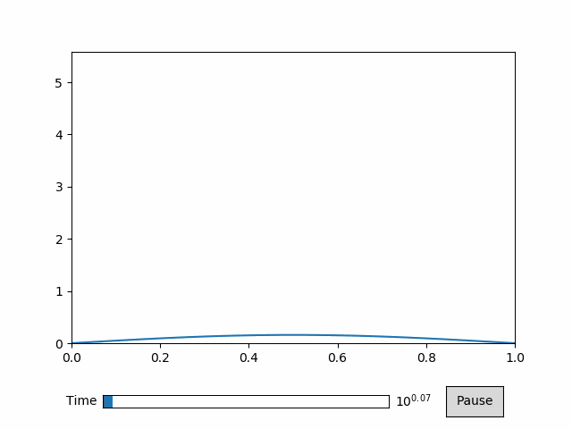
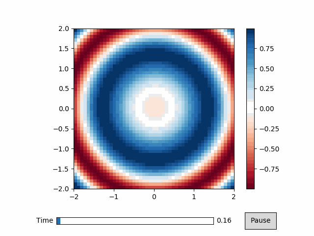
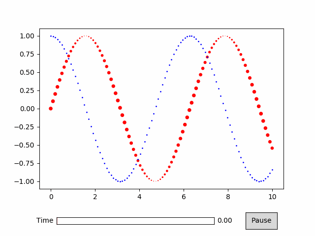

Python<br />Python语言中的animatplot可视化包是一个极为实用的数据可视化工具，可以帮助用户更加直观地展示数据，并且支持动态展示，具有非常好的用户体验。下面来详细介绍一下animatplot可视化包的安装、特点、注意事项、详细案例以及总结。
<a name="iXZTO"></a>
## 安装
animatplot可视化包可以通过pip指令进行安装，输入以下指令即可：
```bash
pip install animatplot
```
<a name="HYmul"></a>
## 特点

1. 动态可视化

animatplot可视化包最大的特点就是能够创建各种动态可视化图表，让用户能够更好地观察数据的变化趋势。比如，用户可以创建动态散点图来观察数据点的变化，或者创建动态线性图来观察数据的趋势变化。

2. 简单易用

animatplot可视化包非常简单易用，用户只需要几行代码就能够创建各种动态可视化图表。而且，animatplot可视化包还提供了丰富的文档和示例，让用户能够更好地了解如何使用该工具。

3. 可定制化

animatplot可视化包提供了丰富的参数设置，让用户能够自定义各种动态可视化图表的样式和属性。比如，用户可以设置动态散点图的颜色、大小、透明度等属性，或者设置动态线性图的线条颜色、宽度、样式等属性。

4. 其他特点
- 支持动态展示，可以展示数据的变化过程，更加直观。
- 支持自定义图形，可以根据用户需求进行自定义。
- 支持交互式操作，用户可以通过鼠标、键盘等方式进行交互。
- 支持多种数据格式，包括numpy数组、pandas数据框等。
<a name="QEO9q"></a>
## 注意事项

5. 数据格式

使用animatplot可视化包时，需要注意数据的格式。animatplot可视化包支持多种数据格式，包括numpy数组、pandas数据框等。但是，需要保证数据格式的正确性，否则可能会导致绘图失败。

6. 动画效果

使用animatplot可视化包时，需要注意动画效果的设置。animatplot可视化包提供了多种动画效果，包括线性动画、缩放动画、旋转动画等。用户可以根据自己的需要选择合适的动画效果，但需要注意动画效果不要过于复杂，否则可能会导致绘图速度变慢。

7. 交互性

用animatplot可视化包时，需要注意交互性的设置。animatplot可视化包提供了多种交互方式，包括鼠标交互、键盘交互等。用户可以根据自己的需要选择合适的交互方式，但需要注意交互方式不要过于复杂，否则可能会导致用户体验不佳。
<a name="syKh8"></a>
## 详细案例
<a name="lWwwq"></a>
### 对数时间尺度
只需将关键字参数`log=True`传递给时间线，就可以得到对数时间尺度。
```java
import numpy as np
import matplotlib.pyplot as plt
import animatplot as amp


x = np.linspace(0, 1, 20)
t = np.logspace(0, 2, 30)

X, T = np.meshgrid(x, t)
Y = np.sin(X*np.pi)*np.log(T)

timeline = amp.Timeline(t, log=True)
block = amp.blocks.Line(X, Y)
anim = amp.Animation([block], timeline)

plt.xlim([0,1])
plt.ylim([0,Y.max()+1])

anim.controls()
anim.save_gif('logtime')
plt.show()
```

<a name="lcyM0"></a>
### 等值线图
```python
import numpy as np
import matplotlib.pyplot as plt
import animatplot as amp


x = np.linspace(-2, 2, 50)
y = np.linspace(-2, 2, 50)
t = np.linspace(0, 2*np.pi, 40)

X, Y, T = np.meshgrid(x, y, t)

Z = np.sin(X*X+Y*Y-T)

block = amp.blocks.Pcolormesh(X[:,:,0], Y[:,:,0], Z, t_axis=2, cmap='RdBu')
plt.colorbar(block.quad)
plt.gca().set_aspect('equal')

anim = amp.Animation([block], amp.Timeline(t))

anim.controls()

anim.save_gif('pcolormesh')
plt.show()
```

<a name="j0tSg"></a>
### 动态散点图
```python
%matplotlib qt
import numpy as np
import matplotlib as mpl
import matplotlib.pyplot as plt
import animatplot as amp
#构建数据
x = np.linspace(0, 10, 100)
t = np.linspace(0, 2*np.pi, 100)

X, T = np.meshgrid(x, t)

Y1 = np.sin(X+T)
Y2 = np.sin(X+T+np.pi/2)

Sizes = 20*np.cos(X-5*T)**2

timeline = amp.Timeline(T, fps=10)
block1 = amp.blocks.Scatter(X, Y1, Sizes, c='r')
block2 = amp.blocks.Scatter(X, Y2, 1, c='b')
anim = amp.Animation([block1, block2], timeline)

anim.controls()
anim.save_gif('scatter') #save animation for the docs
plt.show()
```
<br />更多关于animatplot包绘制动态可视化的案例可参考：[**animatplot包官网案例**](https://animatplot.readthedocs.io/en/stable/gallery.html#)
<a name="Ow3sN"></a>
## 总结
通过本文的介绍，了解了Python语言中的animatplot可视化包的安装、特点、注意事项以及详细案例。animatplot可视化包是一款功能强大的可视化工具，能够让用户轻松地创建各种动态可视化图表。使用animatplot可视化包时，需要注意数据格式、动画效果和交互性的设置，以保证绘图效果和用户体验。
<a name="yoksb"></a>
## 参考资料
**animatplot包官网案例: **[**https://animatplot.readthedocs.io/en/stable/gallery.html#**](https://animatplot.readthedocs.io/en/stable/gallery.html#)
