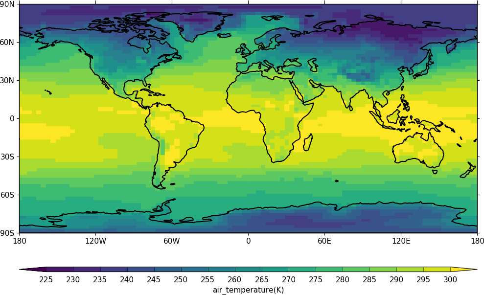
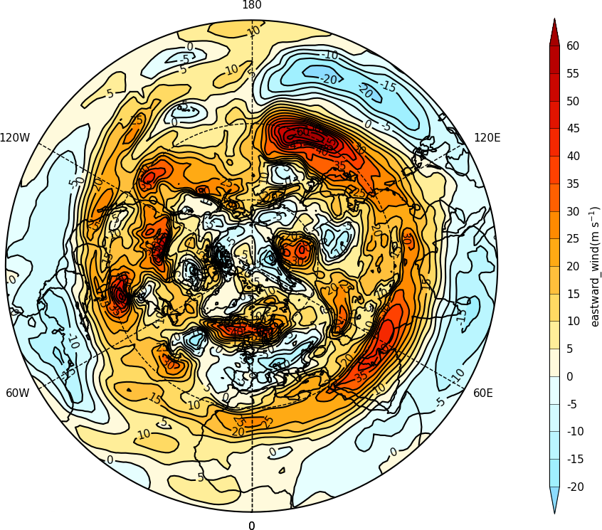
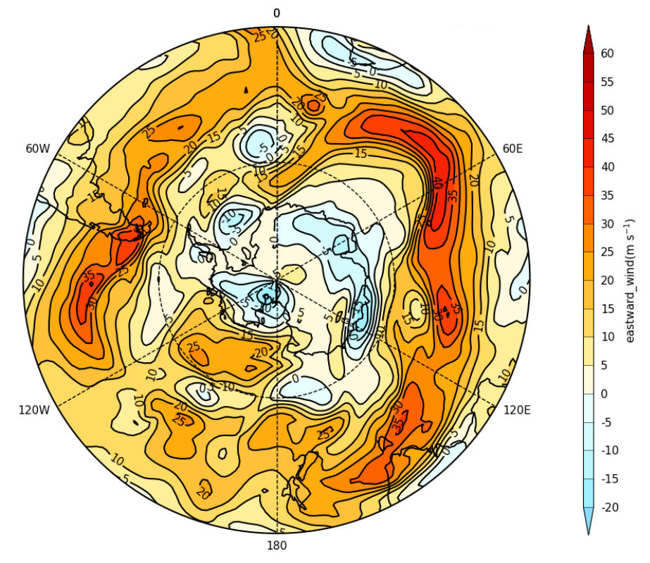
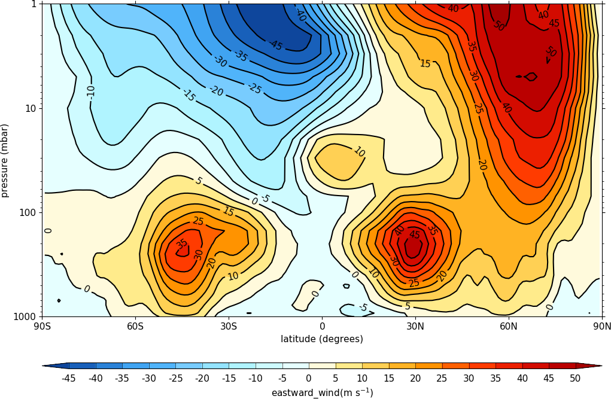
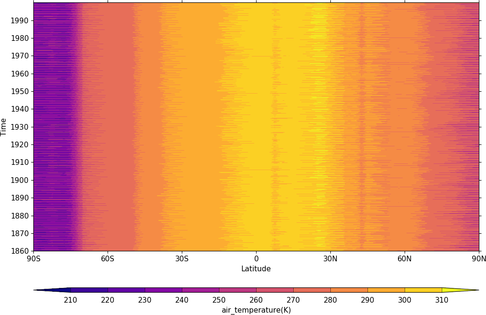
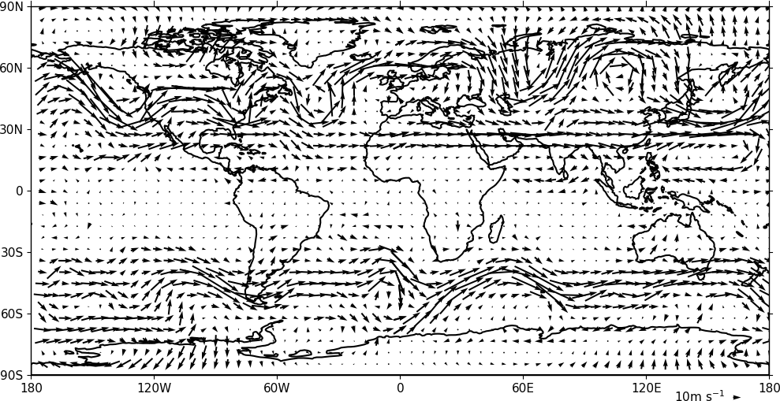
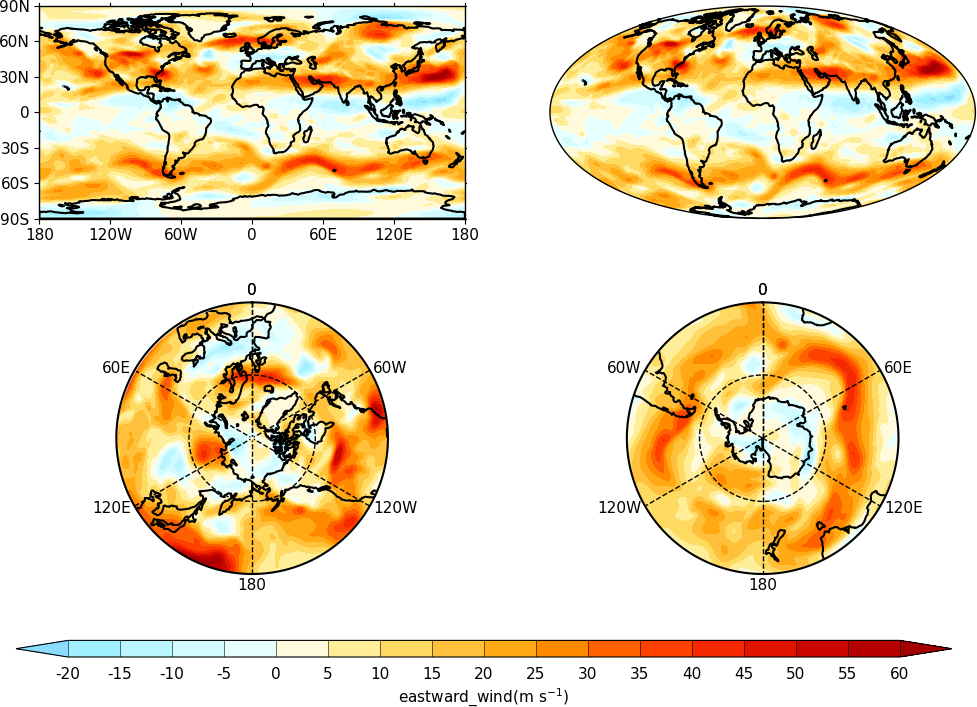
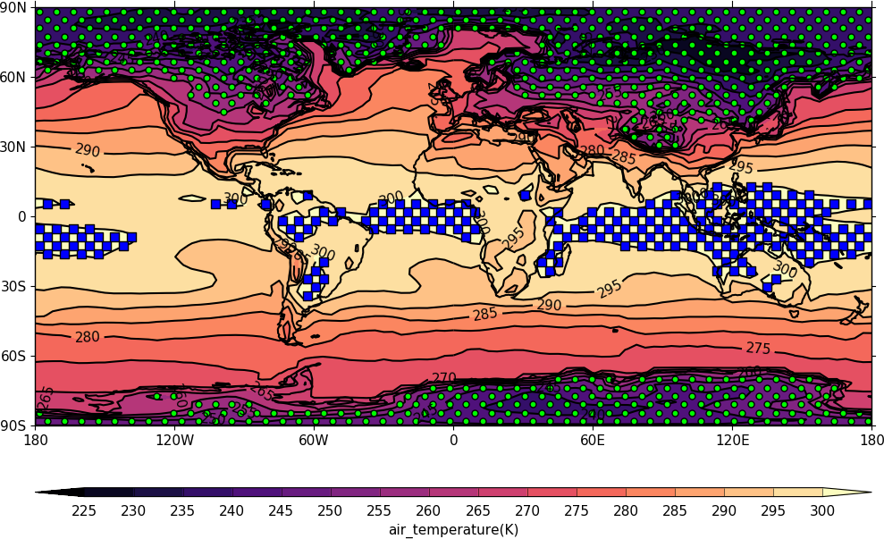

Python环境中优质的关于气象可视化的优质资源-cf-plot，具体内容包括：

- cf-plot的简单介绍
- cf-plot的示例展示
<a name="HTos8"></a>
## cf-plot的简单介绍
cf-plot 是一组Python示例教程集合，主要用于制作气候研究中的常见等高线(contour)、矢量(vector)和线图(line plots)等。cf-plot一般使用cf-python来呈现数据和CF属性进行绘图，还可以使用 numpy 数据数组作为输入字段，从而灵活地绘制数据。<br />更多详细内容可参考：[**cf-plot介绍**](http://ajheaps.github.io/cf-plot/)。
<a name="MjKCJ"></a>
## cf-plot的示例展示
<a name="aEj8t"></a>
### Blockfill plots
```python
import cf
import cfplot as cfp
f=cf.read('cfplot_data/tas_A1.nc')[0]
cfp.con(f.subspace(time=15), blockfill=True, lines=False)
```

<a name="eDY9C"></a>
### Polar stereographic plots
```python
import cf
import cfplot as cfp
f=cf.read('cfplot_data/ggap.nc')[1]
cfp.mapset(proj='npstere')
cfp.con(f.subspace(pressure=500))
```

```python
import cf
import cfplot as cfp
f=cf.read('cfplot_data/ggap.nc')[1]
cfp.mapset(proj='spstere', boundinglat=-30, lon_0=0)
cfp.con(f.subspace(pressure=500))
```

<a name="vexNN"></a>
### Latitude - Pressure Plots
```python
import cf
import cfplot as cfp
f=cf.read('cfplot_data/ggap.nc')[1]
cfp.con(f.collapse('mean','longitude'), ylog=True)
```

<a name="IG3zJ"></a>
### Hovmuller plots
```python
import cf
import cfplot as cfp
f=cf.read('cfplot_data/tas_A1.nc')[0]
cfp.cscale('plasma')
cfp.con(f.subspace(longitude=0), lines=0)
```

<a name="J4lb9"></a>
### Vector and stream Plots
```python
import cf
import cfplot as cfp
f=cf.read('cfplot_data/ggap.nc')
u=f[1].subspace(pressure=500)
v=f[2].subspace(pressure=500)
cfp.vect(u=u, v=v, key_length=10, scale=100, stride=5)
```

<a name="kcPkV"></a>
### Multiple plots on a page and plot positioning
```python
import cf
import cfplot as cfp
f=cf.read('cfplot_data/ggap.nc')[1]

cfp.gopen(rows=2, columns=2, bottom=0.2)
cfp.gpos(1)
cfp.con(f.subspace(pressure=500), lines=False, colorbar=None)
cfp.gpos(2)
cfp.mapset(proj='moll')
cfp.con(f.subspace(pressure=500), lines=False, colorbar=None)
cfp.gpos(3)
cfp.mapset(proj='npstere', boundinglat=30, lon_0=180)
cfp.con(f.subspace(pressure=500), lines=False, colorbar=None)
cfp.gpos(4)
cfp.mapset(proj='spstere', boundinglat=-30, lon_0=0)
cfp.con(f.subspace(pressure=500), lines=False, colorbar_position=[0.1, 0.1, 0.8, 0.02],
        colorbar_orientation='horizontal')
cfp.gclose()
```

<a name="nhes2"></a>
### Stipple plots
```python
import cf
import cfplot as cfp
f=cf.read('cfplot_data/tas_A1.nc')[0]
g=f.subspace(time=15)
cfp.gopen()
cfp.cscale('magma')
cfp.con(g)
cfp.stipple(f=g, min=220, max=260, size=100, color='#00ff00')
cfp.stipple(f=g, min=300, max=330, size=50, color='#0000ff', marker='s')
cfp.gclose()
```
<br />以上就是关于cf-plot的具体示例介绍，更多其他案例可查阅：[**cf-plot示例**](http://ajheaps.github.io/cf-plot/gallery.html)
<a name="TyE0i"></a>
## 总结
介绍了一个优秀的关于气象领域的可视化工具-cf-plot 及其优秀的示例，可以从中学习到绘图技巧和绘图灵感~
<a name="lunqp"></a>
## 参考资料
**cf-plot介绍:**[**_http://ajheaps.github.io/cf-plot/_**](http://ajheaps.github.io/cf-plot/)<br />**cf-plot示例:**[**_http://ajheaps.github.io/cf-plot/gallery.html_**](http://ajheaps.github.io/cf-plot/gallery.html)
