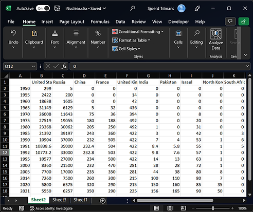
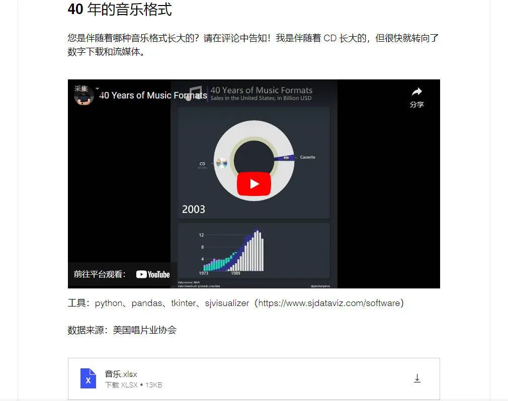
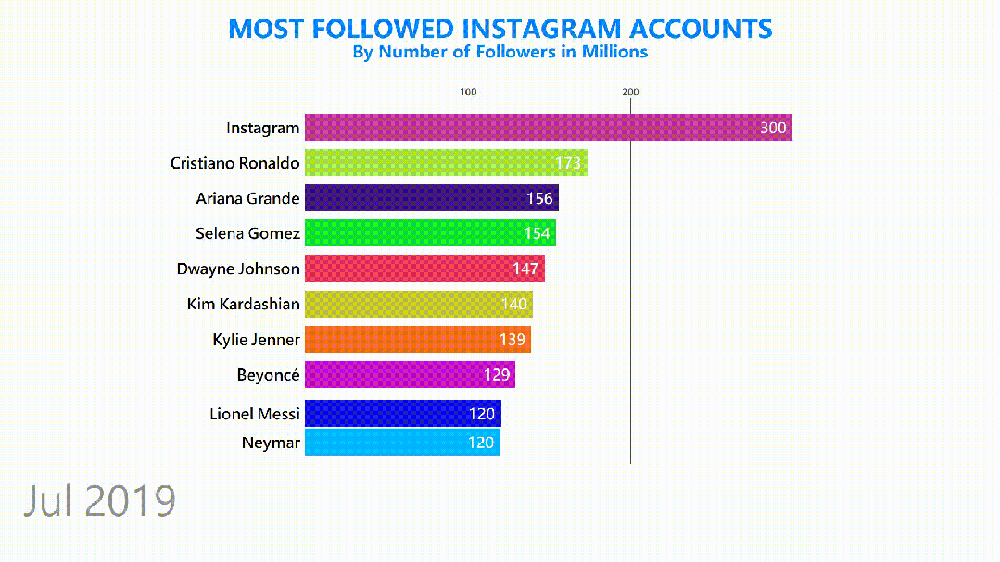
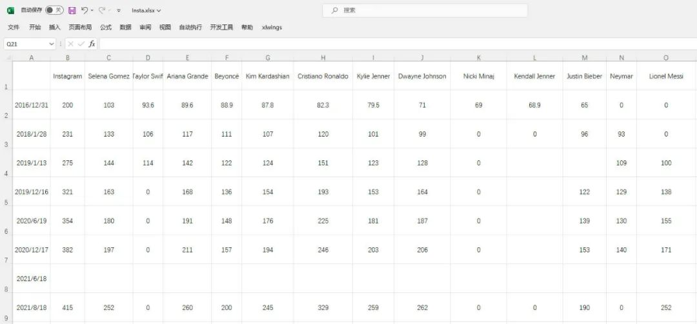
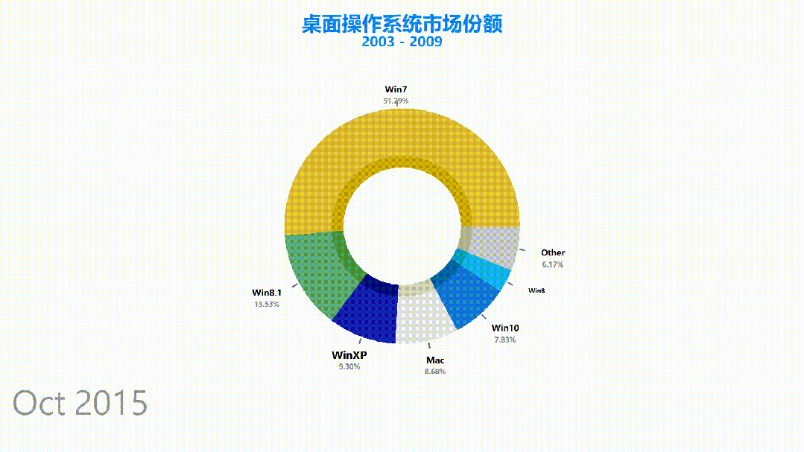
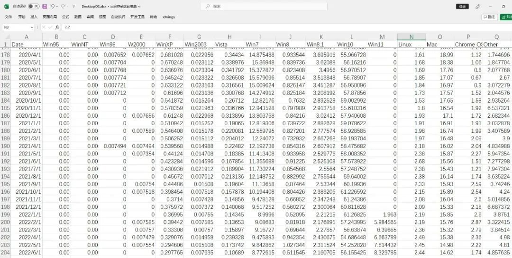
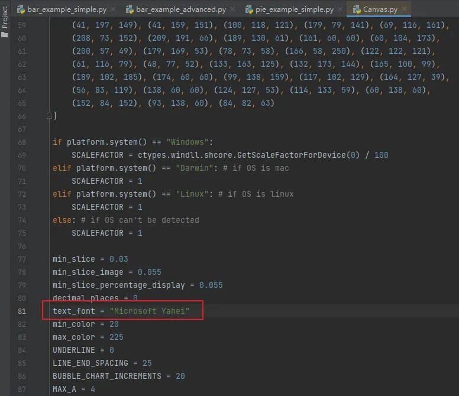
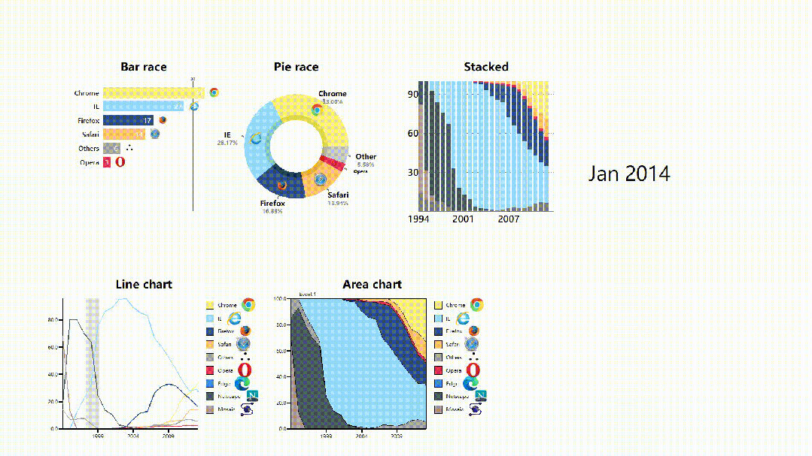
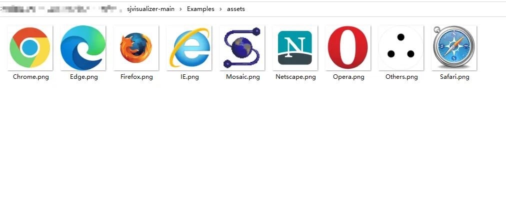
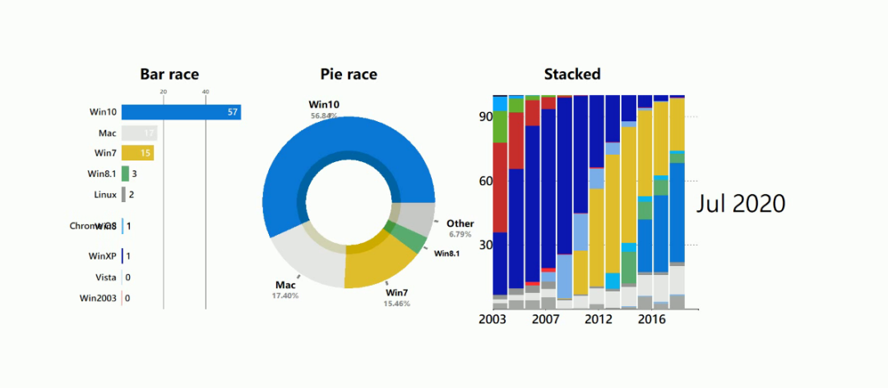

介绍一个非常棒的数据可视化库，**sjvisualizer**。<br />根据**时间序列数据**制作动态图表，包含条形图、饼图、堆叠条形图、折线图、堆叠面积图。<br />可以先看一下官方的示例~<br /><br />只需几行代码，就可以制作电脑浏览器发展史的动态图表。<br />GitHub地址：[_https://github.com/SjoerdTilmans/sjvisualizer_](https://github.com/SjoerdTilmans/sjvisualizer)<br />使用pip进行该库的安装。
```bash
# 安装sjvisualizer
pip install sjvisualizer
```
然后需要加载特定格式的数据，下面是一个数据示例。<br /><br />其中第一列中包含日期，随后的每个列标题都是数据类别，下面包含每个日期的值。<br />此外还可以进行一些**自定义配置**，比如添加图标、添加自定义颜色以及调整可视化的大小。<br />大家可以查看相应的文档。<br />[_https://www.sjdataviz.com/software_](https://www.sjdataviz.com/software)<br />作者还提供了不少其它案例，并且提供了数据源。<br /><br />同样可以访问如下地址，进行查看。<br />[_https://www.sjdataviz.com/data_](https://www.sjdataviz.com/data)<br />下面就来看一下官方提供的几个示例代码吧~
<a name="U1MEt"></a>
## 1、条形图
最受关注的Instagram账号。<br /><br />数据集情况如下。<br /><br />发现数据有部分缺失，说明程序会进行**补全操作**。<br />具体代码如下。
```python
from sjvisualizer import Canvas
from sjvisualizer import DataHandler
from sjvisualizer import BarRace
import json


def main(fps=60, duration=0.35):
    number_of_frames = duration * 60 * fps

    # 加载颜色配置文件
    with open('colors/colors.json') as f:
        colors = json.load(f)

    # 加载数据源
    df = DataHandler.DataHandler(excel_file="data/Insta.xlsx", number_of_frames=number_of_frames).df

    canvas = Canvas.canvas()

    # 添加条形图图表
    bar_chart = BarRace.bar_race(canvas=canvas.canvas, df=df, colors=colors)
    canvas.add_sub_plot(bar_chart)

    # 添加静态文字
    canvas.add_title("MOST FOLLOWED INSTAGRAM ACCOUNTS", color=(0, 132, 255))
    canvas.add_sub_title("By Number of Followers in Millions", color=(0, 132, 255))

    # 时间设置
    canvas.add_time(df=df, time_indicator="month")

    # 保存颜色配置文件
    with open("colors/colors.json", "w") as file:
        json.dump(colors, file, indent=4)

    # 输出视频文件
    canvas.play(fps=fps, record=True, file_name="output1.mp4")


if __name__ == "__main__":
    main()
```
<a name="z35kx"></a>
## 2、饼图
桌面操作系统市场份额。<br /><br />数据集情况如下，一共有200多条。<br /><br />其中本次设置了**中文字体**，可以在代码中进行修改。<br /><br />饼图动态图表代码如下。
```python
from sjvisualizer import Canvas
from sjvisualizer import DataHandler
from sjvisualizer import PieRace
import json


def main(fps=60, duration=0.35):
    number_of_frames = duration * 60 * fps

    # 加载颜色配置文件
    with open('colors/colors.json') as f:
        colors = json.load(f)

    df = DataHandler.DataHandler(excel_file="data/DesktopOS.xlsx", number_of_frames=number_of_frames).df

    canvas = Canvas.canvas()

    # 添加饼图图表
    bar_chart = PieRace.pie_plot(canvas=canvas.canvas, df=df, colors=colors)
    canvas.add_sub_plot(bar_chart)

    # 加载静态文字
    canvas.add_title("桌面操作系统市场份额", color=(0, 132, 255))
    canvas.add_sub_title("2003 - 2009", color=(0, 132, 255))

    # 时间设置
    canvas.add_time(df=df, time_indicator="month")

    # 保存颜色配置文件
    with open("colors/colors.json", "w") as file:
        json.dump(colors, file, indent=4)

    canvas.play(fps=fps, record=True, file_name="output3.mp4")


if __name__ == "__main__":
    main()
```
<a name="JGjep"></a>
## 3、合成图
电脑浏览器发展史动态图表。<br /><br />可以发现每个图表都带有浏览器的logo。<br />如果想要添加自定义的图像logo，是不需要进行任何编码！<br /><br />只需将图像文件 (.png) 放入**assets**文件夹中，只要它与数据类别具有相同的名称，程序就会自动选择。<br />合成图动态图表代码如下。
```python
from sjvisualizer import Canvas
from sjvisualizer import DataHandler
from sjvisualizer import BarRace
from sjvisualizer import PieRace
from sjvisualizer import Date
from sjvisualizer import StackedBarChart
from sjvisualizer import LineChart
from sjvisualizer import AreaChart
import json


def main(fps=60, duration=0.35):
    number_of_frames = duration * 60 * fps

    # 加载颜色配置文件
    with open('colors/colors.json') as f:
        colors = json.load(f)

    df = DataHandler.DataHandler(excel_file="data/browsers.xlsx", number_of_frames=number_of_frames).df

    canvas = Canvas.canvas()

    width = int(canvas.canvas["width"])
    height = int(canvas.canvas["height"])

    chart_height = int(height / 3.5)

    # 条形图
    bar_chart = BarRace.bar_race(canvas=canvas.canvas, df=df, title="Bar race", colors=colors, height=chart_height,
                                 width=int(width / 6), x_pos=int(height / 3 / 2), y_pos=int(width / 5) / 2)
    canvas.add_sub_plot(bar_chart)

    # 饼图
    pie_plot = PieRace.pie_plot(canvas=canvas.canvas, df=df, title="Pie race", colors=colors, height=chart_height,
                                width=int(width / 6), x_pos=int(height / 3 / 2 * 3), y_pos=int(width / 5) / 2)
    canvas.add_sub_plot(pie_plot)

    # 堆叠图
    stacked = StackedBarChart.stacked_bar_chart(canvas=canvas.canvas, df=df, title="Stacked", colors=colors,
                                                height=chart_height,
                                                width=int(width / 6), x_pos=int(height / 3 / 2 * 5.5),
                                                y_pos=int(width / 5) / 2, number_of_bars=25)
    canvas.add_sub_plot(stacked)

    # 折线图时间线
    events = {
        "Event 1": ["28/01/1998", "28/01/2000"],
        "Event 2": ["28/01/2018", "28/01/2019"]
    }

    # 折线图
    line = LineChart.line_chart(canvas=canvas, df=df, title="Line chart", colors=colors, height=chart_height,
                                width=int(width / 6), x_pos=int(height / 3 / 2),
                                y_pos=int(width / 5) + 1.05 * chart_height, events=events)
    canvas.add_sub_plot(line)

    # 面积图
    area = AreaChart.area_chart(canvas=canvas, df=df, title="Area chart", colors=colors, height=chart_height,
                                width=int(width / 6), x_pos=int(height / 3 * 2),
                                y_pos=int(width / 5) + 1.05 * chart_height)
    canvas.add_sub_plot(area)

    # 时间设置
    date = Date.date(canvas=canvas.canvas, height=int(height / 20),
                     width=int(width / 20), x_pos=int(height / 3 / 2 * 8), y_pos=int(width / 5), time_indicator="month",
                     df=df)
    canvas.add_sub_plot(date)

    # 保存颜色配置文件
    with open("colors/colors.json", "w") as file:
        json.dump(colors, file, indent=4)

    canvas.play(fps=fps, record=True, file_name="output2.mp4")


if __name__ == "__main__":
    main()
```
<a name="JqqEy"></a>
## 4、总结
相信不少小伙伴，对自己做的静态图表平平无奇而烦恼。<br />那么试试动态图表，应该是个不错的选择。<br /><br />不仅有新意，而且还直观+美观。
