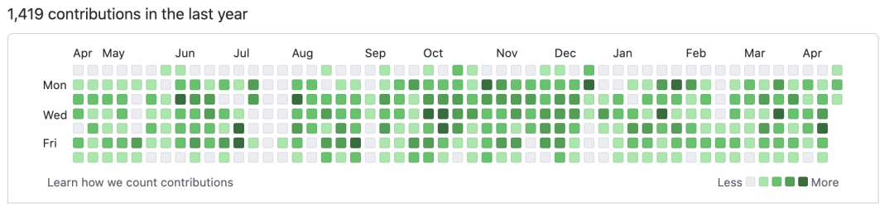
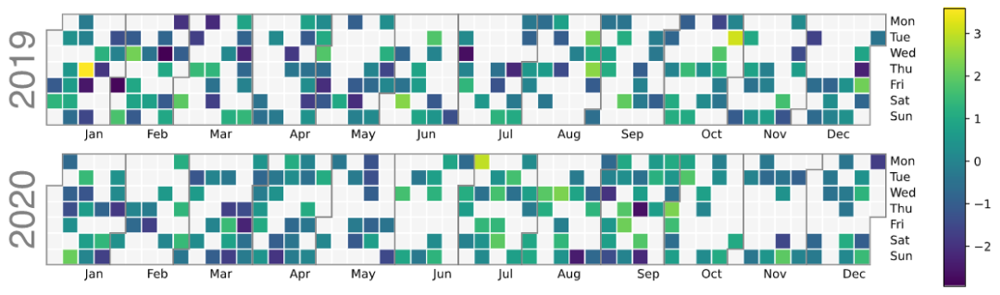
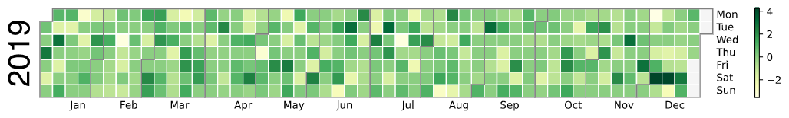
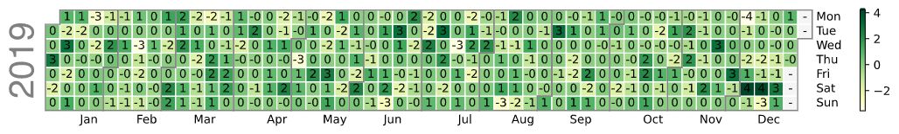
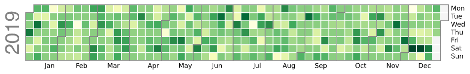
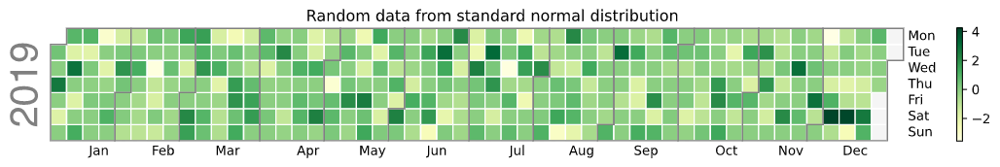
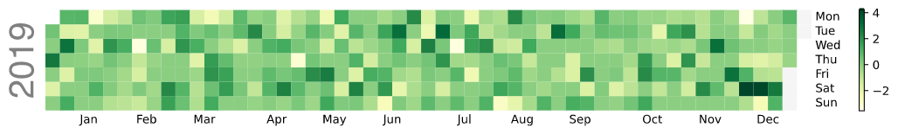

Python 可视化<br />相信很多人都会在 Github 中看到这么一个热图，该热图记录的是 Github 平台使用的日常贡献。在每个日历年的热图中以天为单位采样的时间序列数据。GitHub 的贡献图表示用户在过去几年中所做的贡献数量。色块表示贡献的数量，如色标下方所示。从这张热图中，可以检测到每天的贡献模式。<br />
<a name="ZKDZw"></a>
## 时间序列数据
时间序列数据是随着时间的推移收集并按照一定规则排序的一系列数据，如时间序列中的每小时、每天、每月或每年的数据序列。时间序列的应用包括来自工业过程的传感器读数、降水、降雨、温度或农业作物生长等天气数据，患者在一段时间内的医疗记录等。时间序列分析发现隐藏的模式，如趋势或季节性。
<a name="Cy6pt"></a>
## 日历热图
日历热图使用彩色单元格，通常采用单一基色色调，并使用其明度、色调和饱和度进行扩展（如从浅到深的蓝色）。它在日历视图中显示每天事件的相对数量。每天按周排列，按月和年分组。这能够快速识别每天和每周的模式。
<a name="kYixe"></a>
## Calplot
可视化是深入了解数据的好方法。在检查时间序列数据时，必须从数据中了解季节性或周期性行为（如果涉及）。使用 calplot python 库创建热图。Calplot 从 Pandas 时间序列数据创建热图。
```bash
pip install calplot

Collecting calplot
  Downloading calplot-0.1.7.4-py3-none-any.whl (8.2 kB)
Installing collected packages: calplot
Successfully installed calplot-0.1.7.4
```
<a name="fXwwt"></a>
## 基本绘图
```python
import calplot
import numpy as np; np.random.seed(sum(map(ord, 'calplot')))
import pandas as pd
all_days = pd.date_range('1/1/2019', periods=730, freq='D')
days = np.random.choice(all_days, 500)
events = pd.Series(np.random.randn(len(days)), index=days)
calplot.calplot(events)
```

<a name="HLBVY"></a>
### 隐藏边界
边界相关参数：`edgecolor`，指的是分隔月份的线条的颜色。将其设置为None即为隐藏边界。
```python
all_days = pd.date_range('1/1/2019', periods=360, freq='D')
days = np.random.choice(all_days, 500)
events = pd.Series(np.random.randn(len(days)), index=days)
calplot.calplot(events, edgecolor=None, cmap='YlGn')
```

<a name="HBVtU"></a>
### 更改边界年份样式
参数yearlabel_kws传递给 matplotlib set_ylabel调用的关键字参数用于绘制每个子图的年份。该参数接受一个字典，可以设置颜色，大小等样式。
```python
calplot.calplot(events, 
                yearlabel_kws={'color': 'black'},
                cmap='YlGn')
```

<a name="fCoYR"></a>
### 添加文本标签
和普通热图类似，可以在每个小格子上显示具体数值，通过参数`textformat`和`textfiller`控制，分别表示网格单元文本的字符串格式，以及网格单元格的在文本缺失数据的时显示的文本样式。
```python
calplot.calplot(events, textformat='{:.0f}',
                textfiller='-', cmap='YlGn')
```

<a name="o7dGQ"></a>
### 隐藏颜色条
热图右边都会有个颜色线条，以注明每种颜色的颜色范围，如果不需要显示，可以将参数 colorbar 设置为 False。
```python
calplot.calplot(events, colorbar=False, cmap='YlGn')
```

<a name="Ff94j"></a>
### 设置title
控制热图标题的参数suptitle，接受一个字符串。
```python
calplot.calplot(events, 
                suptitle='Random data from standard normal distribution', 
                cmap='YlGn')
```

<a name="U8m9E"></a>
### 隐藏热图的边线
控制将每天分开的线的宽度参数`linewidth`，如果要将其隐藏，可以将其直接设置为0即可。
```python
calplot.calplot(events, linewidth=0, cmap='YlGn')
```
<br />更多详情请见：[https://calplot.readthedocs.io/en/latest/](https://calplot.readthedocs.io/en/latest/)
