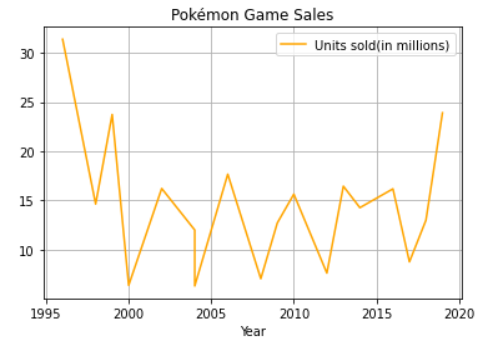
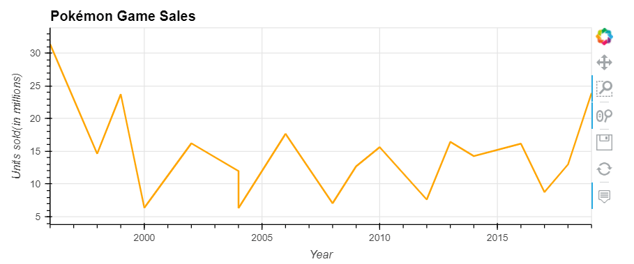
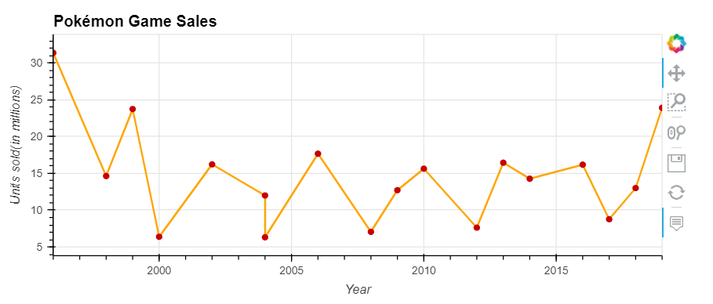
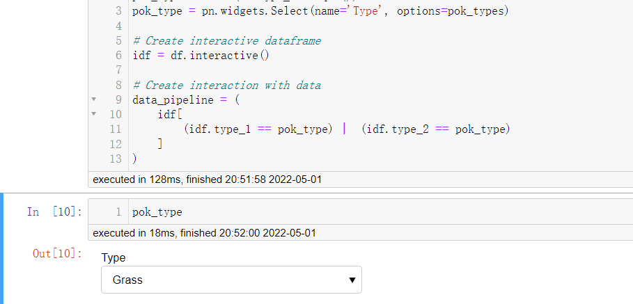
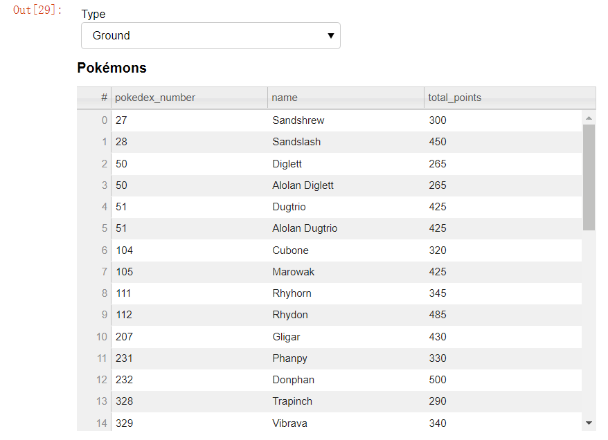
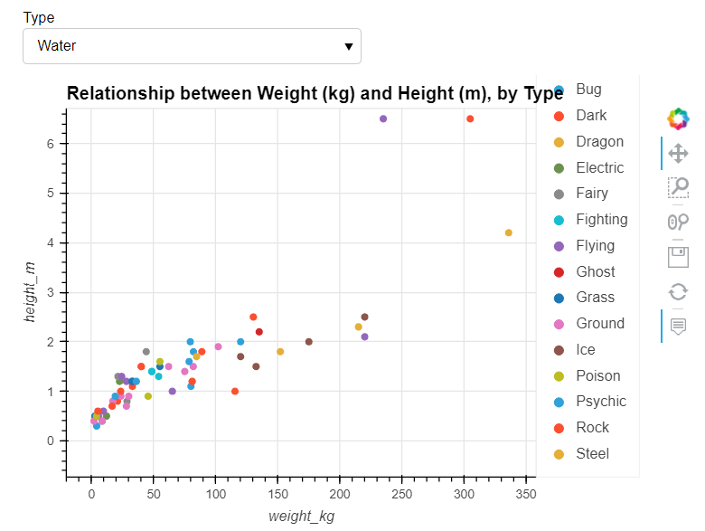
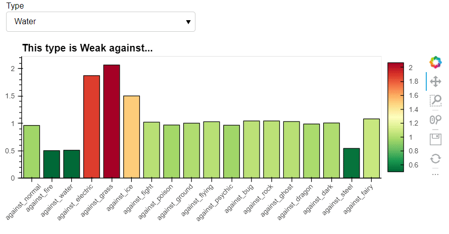
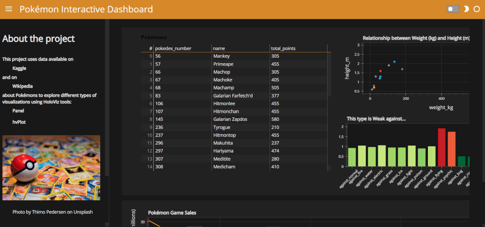

Python<br />在Python当中用于绘制图表的模块，相信大家用的最多的便是matplotlib和seabron，除此之外还有一些用于动态交互的例如Plotly模块和Pyecharts模块，再来推荐两个用于制作可视化大屏的库，分别叫做hvPlot以及Panel，依次会为大家分享

- 用pandas以及hvPlot结合生成具有交互性的图表
- 用Panel模块生成小的组件，配合图表进行使用
- 制作一个数据可视化大屏来更好地呈现数据
<a name="yoV7w"></a>
## pandas+hvPlot绘制图表
首先导入一些要用到的模块以及用pandas来读取数据集，代码如下
```python
# To handle data
import numpy as np
import pandas as pd

# To make visualizations
import hvplot.pandas
import panel as pn; pn.extension()
from panel.template import DarkTheme
```
用pandas绘制出来的图表默认都是以matplotlib模块为后端，因为不具备交互性，如下图所示<br />数据集：[games_sales.csv](https://www.yuque.com/attachments/yuque/0/2022/csv/396745/1651815281524-5258d7c9-1747-49c7-ab36-040f70097d4f.csv?_lake_card=%7B%22src%22%3A%22https%3A%2F%2Fwww.yuque.com%2Fattachments%2Fyuque%2F0%2F2022%2Fcsv%2F396745%2F1651815281524-5258d7c9-1747-49c7-ab36-040f70097d4f.csv%22%2C%22name%22%3A%22games_sales.csv%22%2C%22size%22%3A920%2C%22type%22%3A%22text%2Fcsv%22%2C%22ext%22%3A%22csv%22%2C%22status%22%3A%22done%22%2C%22taskId%22%3A%22uacda45e2-3e9f-41aa-98ba-2210c1d2bea%22%2C%22taskType%22%3A%22upload%22%2C%22id%22%3A%22u03850f65%22%2C%22card%22%3A%22file%22%7D)
```python
sales = pd.read_csv('games_sales.csv')
sales.plot(kind='line', x='Year', y='Units sold(in millions)', color='orange', grid=True, title='Pokémon Game Sales');
```
output<br /><br />代码中的`kind`参数对应的是图表的类型，`X`参数代表的是X轴上面的所要要用到的数据，同理，还指定了标题、图表的颜色等等参数，那么要是希望pandas在绘制图表的时候是以hvPlot为后端，需要添加如下的代码
```python
pd.options.plotting.backend = 'holoviews'
```
同样来绘制如上所示的图表，代码如下
```python
sales.plot(kind='line', x='Year', y='Units sold(in millions)', color='orange', grid=True, title='Pokémon Game Sales')
```
output<br /><br />通过最右侧的工具栏，可以将绘制出来的图表保存、放大/缩小、移动等一系列操作。也可以同时将若干种图表结合在一起，绘制在同一张图上面
```python
salesplot = sales.plot(kind='line', x='Year', y='Units sold(in millions)',
                       color='orange', grid=True, title='Pokémon Game Sales',
                       hover=False) * \
                sales.plot(kind='scatter', x='Year', y='Units sold(in millions)',
                           color='#c70000', hover_cols='Game')
salesplot
```
output<br /><br />分别绘制了两张图表，散点图以及折线图，通过`*`将两者有效地结合到了一块儿。
<a name="eqbQM"></a>
## 制作一个小组件
用`Panel`模块也来生成一个组件，代码如下
```python
pok_types = list(df.type_1.unique())
pok_type = pn.widgets.Select(name='Type', options=pok_types)
pok_type
```
output<br /><br />结合该组件来绘制图表，代码如下
```python
viz0 = data_pipeline[['pokedex_number', 'name',
                      'total_points']].hvplot(kind='table',title='Pokémons',
                                              width=400, height=400)
viz0
```
output<br /><br />可以通过当中的参数`kind`来调整要绘制的图表的类型，`width`以及`height`参数来调整图表的大小，`title`参数来调整图表的标题，来绘制一张散点图，代码如下
```python
viz1 = data_pipeline.hvplot(x='weight_kg', y='height_m', 
                     by='type_2', kind='scatter', 
                     hover_cols=['name', 'type_1', 'type_2'],
                     width=600, height=400,grid=True,
                     title='Relationship between Weight (kg) and Height (m), by Type'
                    )
viz1
```
output<br /><br />另外也可以同样来绘制一张柱状图，代码如下
```python
data_damage = data_pipeline.iloc[:, -18:].mean().rename('Damage')
viz2 = data_damage.hvplot(kind='bar',c='Damage', 
               title='正在思考要取什么标题会比较好......', 
               rot=30, shared_axes=False,
               colorbar=True, colormap='RdYlGn_r', 
               )
viz2
```
output<br />
<a name="n6F3Y"></a>
### 制作一个数据面板大屏
接下来将上面绘制的所有图表，都放置在一张数据大屏当中显示，代码如下
```python
template = pn.template.FastListTemplate(theme=DarkTheme,
    title = '数据面板',
    sidebar=[
        pn.pane.Markdown('# 关于这个项目'),
        pn.pane.Markdown('#### 这个项目的数据来源是[Kaggle](https://www.kaggle.com/datasets/mariotormo/complete-pokemon-dataset-updated-090420) and on [Wikipedia](https://en.wikipedia.org/wiki/Pok%C3%A9mon_(video_game_series)#Reception) about Pokémons to explore different types of visualizations using HoloViz tools: [Panel](https://panel.holoviz.org/) [hvPlot](https://hvplot.holoviz.org/)'),
        pn.pane.JPG('图片的路径.jpg', sizing_mode='scale_both'),
        pn.pane.Markdown('[图片的来源](https://unsplash.com/photos/dip9IIwUK6w)'),
        pn.pane.Markdown('## Filter by Type'),
        pok_type
    ],
    main=[pn.Row(
                  pn.Column(viz0.panel(width=600, height=400, margin=(0,20))), 
                  pn.Column(pn.Row(viz1.panel(width=700, height=250, margin=(0,20))),
                            pn.Column(viz2.panel(width=700, height=250), margin=(0,20))),
                 ),
          pn.Row(salesplot.opts(width=1400, height=200))
    ],
    accent_base_color='#d78929',
    header_background='#d78929',
    sidebar_footer='<br><br><a href=".......">GitHub链接</a>', 
    main_max_width='100%'                                        
)

template.servable();

template.show()
```
output
```python
Launching server at http://localhost:63968
<bokeh.server.server.Server at 0x1bd811e82b0>
```
按照上述的链接来浏览器中打开，数据大屏面板就可以做好了，如下图所示<br />
