Python 可视化 Matplotlib
<a name="0iBwn"></a>
## 1、简介
前不久「贝壳研究院」基于其丰富的房地产相关数据资源，发布了「2020 新一线城市居住报告」：<br /><br />图1<br />以纯Python的方式模仿复刻图2所示作品：<br />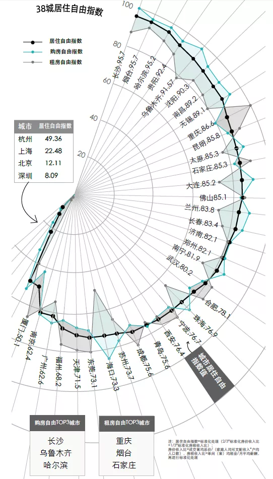<br />图2
<a name="a9Sw8"></a>
## 2、复刻过程
<a name="1aFwx"></a>
### 2.1 观察原作品
其实原作品咋一看上去有点复杂，但经过观察，将原始图片主要元素拆分成几个部分来构思复现方式，还是不算复杂的，总结为以下几部分：<br />（1）坐标系部分<br />稍微懂点数据可视化的人应该都可以看出原作品的坐标不是常规的笛卡尔坐标系，而是极坐标系，这里复现原作品极坐标系的难点在于，其并不是完整的极坐标系，即左边略小于半圆的区域是隐藏了参考线的。因此与其在matplotlib中极坐标系的基础上想方法隐藏部分参考线，不如逆向思维，从构造参考线的角度出发，自己组织构造参考线，会更加的自由和灵活。<br />（2）颜色填充<br />这里的「颜色填充」指的是以居住自由指数折线为中线，在购房自由指数折线与租房自由指数折线之间的颜色填充区域，但困难的是这里当购房自由指数高于租房自由指数时对应的颜色为浅蓝绿色，而反过来则变为灰色，与购房自由指数、租房自由指数的颜色相呼应。<br />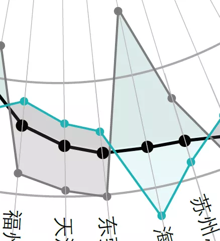<br />图3
<a name="CMURx"></a>
### 2.2 开始动手
综合考虑前面这些难点，借助matplotlib+geopandas+shapely操纵几何对象和绘制调整图像的方便快捷性，来完成这次的挑战。
<a name="Gt4JO"></a>
#### 2.2.1 构建坐标系统
因为极坐标系中的参考线非常类似俯视南北极点所看到的经纬线，因此可以利用地图学中坐标参考系里的「正射投影」（Orthographic），可以理解为纯粹的半球：<br />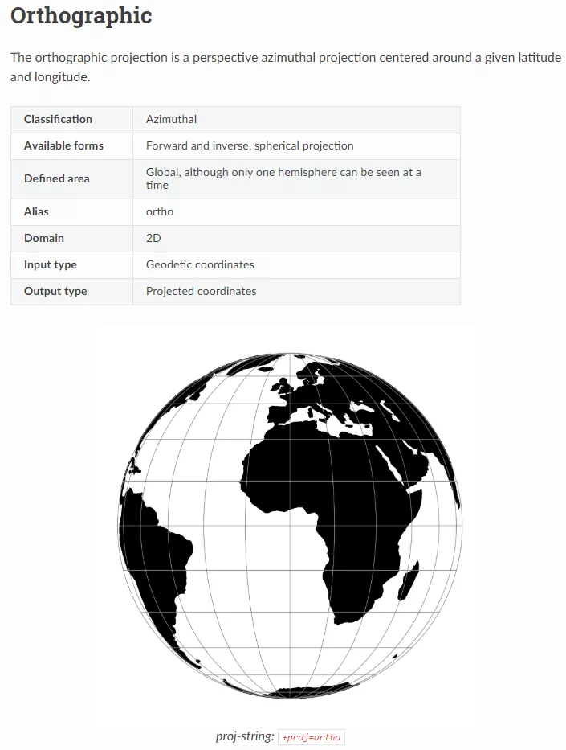<br />图4<br />只需要设定中心点参数在南极点或北极点，再配合简单的经纬度相关知识就可以伪造出任意的经纬线，再利用geopandas中的投影变换向设定好的「正射投影」进行转换，再作为平面坐标进行绘图即可。譬如按照这个思路来创建东经10度到东经220度之间，以及南纬-90度到-80度之间，对应的5条纬度线和对应38个城市的经线：
```python
import geopandas as gpd  
from shapely.geometry import LineString, Point, Polygon  
import matplotlib.pyplot as plt  
import numpy as np  
import warnings  
  
plt.rcParams['font.sans-serif'] = ['SimHei'] # 解决matplotlib中文乱码问题  
plt.rcParams['axes.unicode_minus'] = False # 解决matplotlib负号显示问题  
warnings.filterwarnings('ignore')  
  
# 设置中心点在南极点的正射投影  
crs = '+proj=ortho +lon_0=0 +lat_0=-90'  
  
# 构建经度线并设置对应经纬度的地理坐标系  
lng_lines = gpd.GeoDataFrame({  
    'geometry': [LineString([[lng, -90], [lng, -78]]) for lng in np.arange(10, 220, 210 / 38)]},   
    crs='EPSG:4326')  
  
# 构建纬度线并设置为对应经纬度的地理坐标系  
lat_lines = gpd.GeoDataFrame({  
    'geometry': [LineString([[lng, lat] for lng in range(10, 220)]) for lat in range(-90, -79, 2)]},   
    crs='EPSG:4326')
```
构造好数据之后，将经线与纬线对应的GeoDataFrame转换到设置好的「正射投影」crs上，再作为不同图层进行叠加绘制：<br />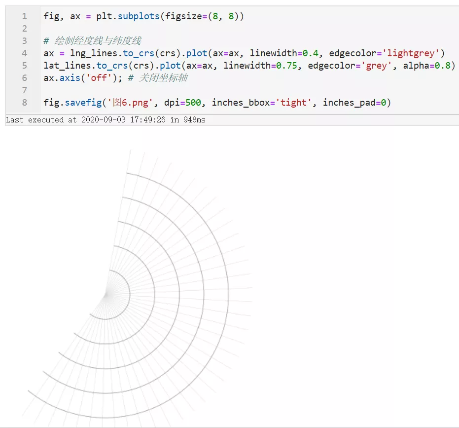<br />图5
<a name="XydJW"></a>
#### 2.2.2 绘制指标折线
坐标系以及参考线的逻辑定了下来之后，接下来需要将原作品中所展现的3种指标数据转换为3条样式不同的折线。首先来准备数据，因为原报告中只能找到居住自由指数的具体数值，其他两个指标未提供，因此可以结合这3个数值的相互关系，推断出每个城市的购房自由指数与租房自由指数1个比自身的居住自由指数高，1个比居住自由指数低的规律来「伪造」数据：<br />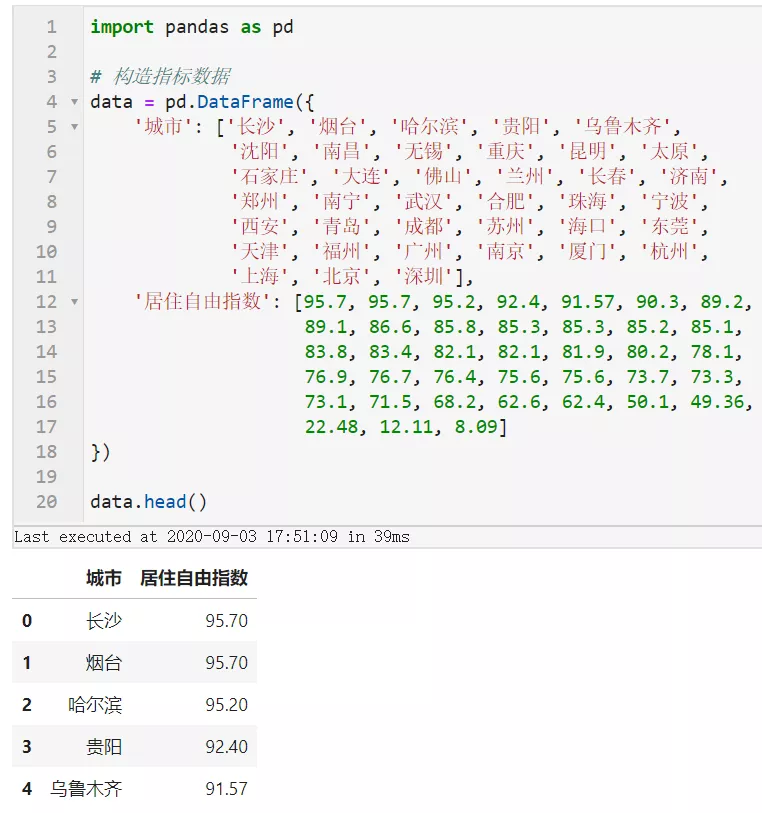<br />图6<br />按照前面推断出的规则来伪造示例数据，并对伪造过程中的不合理数据进行修正：
```python
def fake_index(value):  
      
    fake = []  
    fake.append(value+np.random.uniform(5, 10))  
    fake.append(value-np.random.uniform(5, 10))  
      
    return np.random.choice(fake, size=2, replace=False).tolist()  
  
data['购房自由指数'], data['租房自由指数'] = list(zip(*data['居住自由指数'].apply(fake_index)))  
  
# 修正伪造数据中大于100和小于0的情况  
data.loc[:, '居住自由指数':] = data.loc[:, '居住自由指数':].applymap(lambda v: 100 if v > 100 else v)  
data.loc[:, '居住自由指数':] = data.loc[:, '居住自由指数':].applymap(lambda v: 0 if v < 0 else v)  
data.head()
```
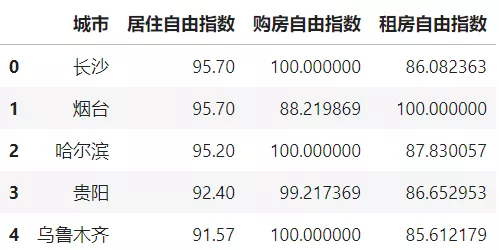<br />图7<br />至此数据已经伪造完成，接下来需要做的事情是对指标值进行变换，使其能够适应前面所确立的坐标系统。虽然严格意义上说俯视南极点所看到的每一段等间距的纬度带随着其越发靠近赤道，在平面上会看起来越来越窄，但因为选取的是南纬-90度到南纬-80度之间的区域，非常靠近极点，因此可以近似视为每变化相同纬度宽度是相等的。利用下面的函数实现0-100向-90到-80的线性映射：<br />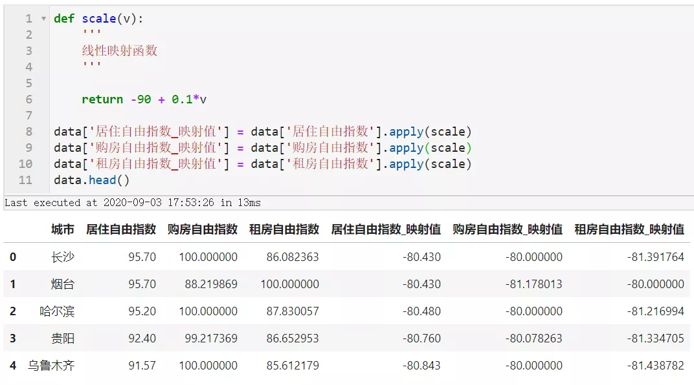<br />图8<br />接下来就为每个指标构造线与散点部分的矢量数据，并在统一转换坐标参考系到「正射投影」之后叠加到之前的图像上：
```python

# 为每个城市生成1条经线  
lng_lines = gpd.GeoDataFrame({  
    'geometry': [LineString([[lng, -90], [lng, -78]]) for lng in np.arange(10, 220, 210 / data.shape[0])]},   
    crs='EPSG:4326')  
  
# 居住自由指数对应的折线  
line1 = gpd.GeoDataFrame({  
    'geometry': [LineString([(lng, lat) for lng, lat in zip(np.arange(10, 220, 210 / data.shape[0]),  
                                                            data['居住自由指数_映射值'])])]},   
    crs='EPSG:4326')  
  
# 居住自由指数对应的折线上的散点  
scatter1 = gpd.GeoDataFrame({  
    'geometry': [Point(lng, lat) for lng, lat in zip(np.arange(10, 220, 210 / data.shape[0]),  
                                                     data['居住自由指数_映射值'])]}, crs='EPSG:4326')  
  
# 购房自由指数对应的折线  
line2 = gpd.GeoDataFrame({  
    'geometry': [LineString([(lng, lat) for lng, lat in zip(np.arange(10, 220, 210 / data.shape[0]),  
                                                            data['购房自由指数_映射值'])])]},   
    crs='EPSG:4326')  
  
# 购房自由指数对应的折线上的散点  
scatter2 = gpd.GeoDataFrame({  
    'geometry': [Point(lng, lat) for lng, lat in zip(np.arange(10, 220, 210 / data.shape[0]),  
                                                     data['购房自由指数_映射值'])]}, crs='EPSG:4326')  
  
  
# 租房自由指数对应的折线  
line3 = gpd.GeoDataFrame({  
    'geometry': [LineString([(lng, lat) for lng, lat in zip(np.arange(10, 220, 210 / data.shape[0]),  
                                                            data['租房自由指数_映射值'])])]},   
    crs='EPSG:4326')  
  
# 租房自由指数对应的折线上的散点  
scatter3 = gpd.GeoDataFrame({  
    'geometry': [Point(lng, lat) for lng, lat in zip(np.arange(10, 220, 210 / data.shape[0]),  
                                                     data['租房自由指数_映射值'])]}, crs='EPSG:4326')  
  
                               
fig, ax = plt.subplots(figsize=(8, 8))  
  
# 绘制经度线与纬度线  
ax = lng_lines.to_crs(crs).plot(ax=ax, linewidth=0.4, edgecolor='lightgrey')  
ax = lat_lines.to_crs(crs).plot(ax=ax, linewidth=0.75, edgecolor='grey', alpha=0.8)  
ax = line1.to_crs(crs).plot(ax=ax, color='black', linewidth=1)  
ax = scatter1.to_crs(crs).plot(ax=ax, color='black', markersize=12)  
ax = line2.to_crs(crs).plot(ax=ax, color='#00CED1', linewidth=0.6)  
ax = scatter2.to_crs(crs).plot(ax=ax, color='#00CED1', markersize=4)  
ax = line3.to_crs(crs).plot(ax=ax, color='lightgrey', linewidth=0.6)  
ax = scatter3.to_crs(crs).plot(ax=ax, color='lightgrey', markersize=4)  
ax.axis('off'); # 关闭坐标轴  
  
fig.savefig('图11.png', dpi=500, inches_bbox='tight', inches_pad=0)  
```
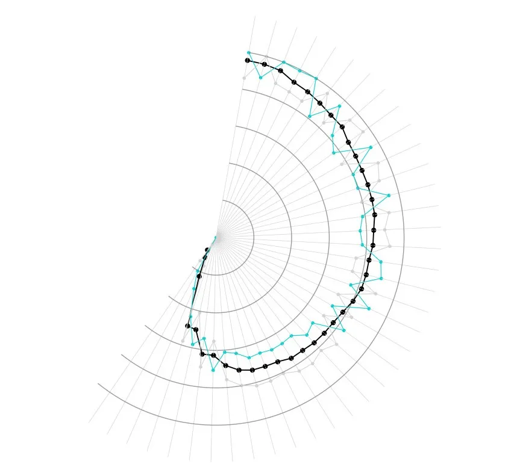<br />图9<br />至此绘制指标折线部分已完成。
<a name="OMbp5"></a>
#### 2.2.3 绘制填充区域
在相继解决完「坐标系统」、「指标折线绘制」之后，就到了最好玩的部分了，接下来来绘制图中购房自由指数与租房自由指数之间的折线，并且要按照「填充较大值对应色彩」的原则来处理，接下来需要用到一点简单的拓扑学知识，首先分别构造购房自由指数_映射值和租房自由指数_映射值引入南极点后所围成的多边形：<br />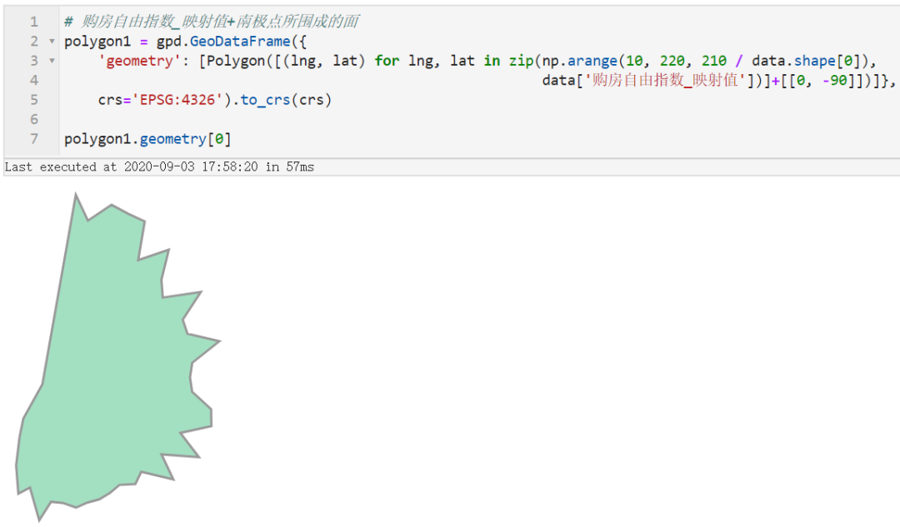<br />图10<br />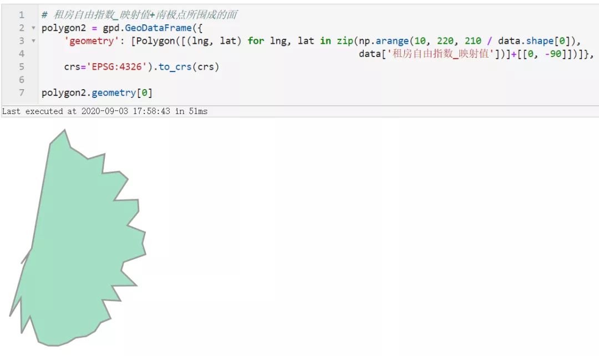<br />图11<br />接下来先暂停下来思考思考，购房自由指数_映射值与租房自由指数_映射值之间彼此高低起伏交错而形成的填充区域对应着上面两个多边形之间的什么关系？没错！就是就是两者去除掉彼此重叠区域后各自剩余的部分！<br />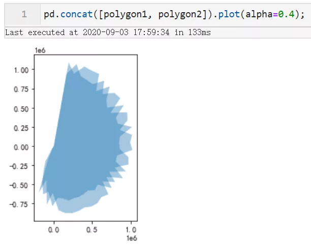<br />图12<br />那么接下来要做的事就so easy了，只需要分别得到两者去除重叠面后，剩余的部分，以对应的填充色彩叠加绘制在图11的图像上就可以啦~，利用geopandas中的difference即可轻松实现：
```python
fig, ax = plt.subplots(figsize=(8, 8))  
  
# 绘制经度线与纬度线  
ax = lng_lines.to_crs(crs).plot(ax=ax, linewidth=0.4, edgecolor='lightgrey')  
ax = lat_lines.to_crs(crs).plot(ax=ax, linewidth=0.75, edgecolor='grey', alpha=0.8)  
ax = line1.to_crs(crs).plot(ax=ax, color='black', linewidth=1)  
ax = scatter1.to_crs(crs).plot(ax=ax, color='black', markersize=12)  
ax = line2.to_crs(crs).plot(ax=ax, color='#00CED1', linewidth=0.6)  
ax = scatter2.to_crs(crs).plot(ax=ax, color='#00CED1', markersize=4)  
ax = line3.to_crs(crs).plot(ax=ax, color='lightgrey', linewidth=0.6)  
ax = scatter3.to_crs(crs).plot(ax=ax, color='lightgrey', markersize=4)  
ax = polygon1.difference(polygon2).plot(ax=ax, color='#00CED1', alpha=0.2)  
polygon2.difference(polygon1).plot(ax=ax, color='lightgrey', alpha=0.6)  
ax.axis('off'); # 关闭坐标轴  
  
fig.savefig('图13.png', dpi=500, inches_bbox='tight', inches_pad=0)
```
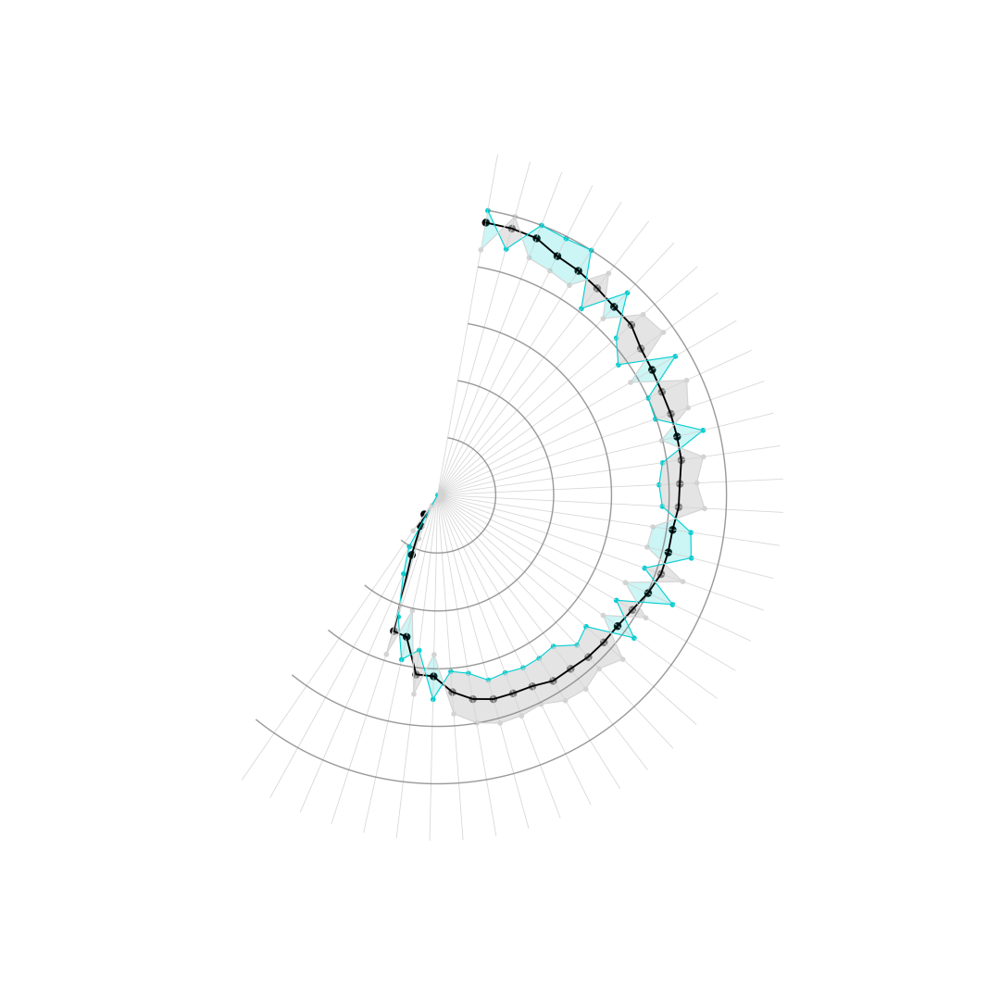<br />图13
<a name="FtJcR"></a>
#### 2.2.4 补充文字、标注等元素
其实到这里，就已经完成了对原作品复刻的精髓部分了，剩下的无非是添加些文字、刻度之类的，其实这部分很多都可以在出图之后利用其他软件PS完成，比写代码轻松，所以这部分只对添加「城市+指标」的文字标签以及刻度值进行补充：<br />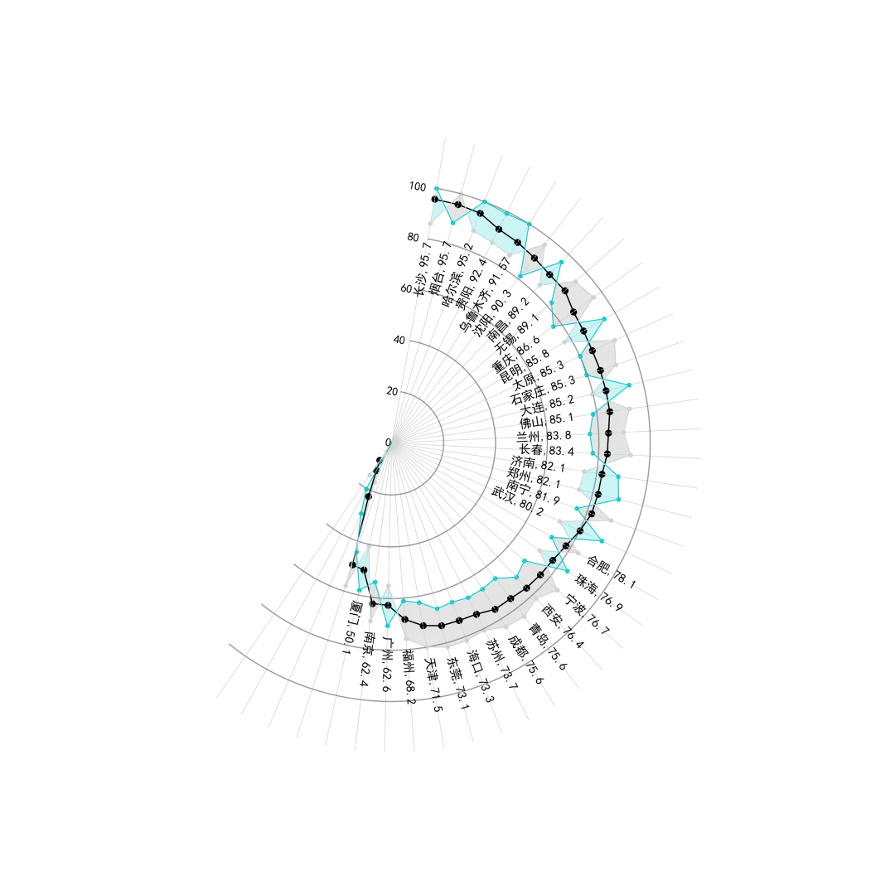<br />图14<br />再模仿原作品裁切一下图片，主要元素是不是非常一致了~，也可以根据自己的喜好来修改不同的颜色：<br />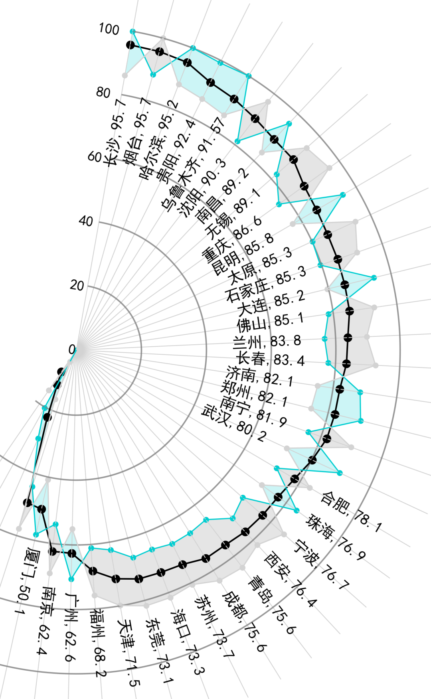
