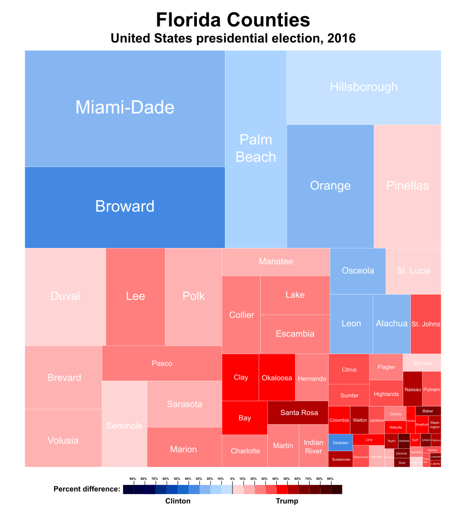
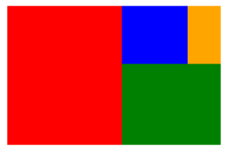
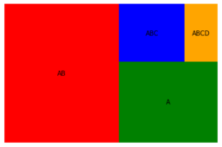
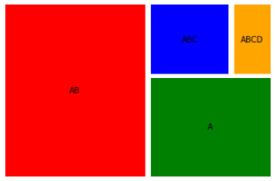

Python可视化热力图<br />树形图易于可视化，且易于被人理解。树状图通过展示不同大小的矩形，以传达不同大小的数据量，一般认为，较大的矩形意味着占总体的一大部分，而较小的矩形意味着整体的一小部分。一起学习如何使用**Squarify**库在 Python 中构建**树形图**。
<a name="H9b8x"></a>
## 介绍
树状图使用嵌套在一起的不同大小的矩形来可视化分层数据。每个矩形的大小与其代表的整体数据量成正比。这些嵌套的矩形代表树的分支，因此得名。除了尺寸外，每个矩形都有代表独特类别的独特颜色。树状图广泛用于从金融机构到销售组织的行业。<br />树形图最早是在 1990 年代早期由美国马里兰大学人机交互实验室的 Ben Shneiderman 教授发明的。这种可视化背后的想法是在固定空间中按大小比较数量。现在看看如何实际构建词云。<br />
<a name="PnJ6c"></a>
## 使用 Squarify 构建树状图
Python 中的，可以使用 Squarify 直接构建树状图。且只需要一行代码`squarify.plot(data)`即可轻松构建。
<a name="xISCb"></a>
### 1. 安装必要的库
!pip install squarify

<a name="sO8Du"></a>
### 2. 导入必要的库
```python
import matplotlib.pyplot as plt
import squarify
```
<a name="XKkoN"></a>
### 3. 创建随机数据
随机生成一个值列表，这些值将作为数据传递到绘图中。
```python
data = [500, 250, 60, 120] 
```
<a name="Ljxpu"></a>
### 4. 绘制树状图
使用**`squarify.plot()`** 方法构建树状图。这里将随机数据变量**data**作为此 `**squarify.plot**` 方法的参数。此外，附加一行修饰代码 `**plt.axis('off')**`  隐藏 **树状图** 的轴。
```python
squarify.plot(data)
plt.axis('off')
plt.show()
```
<a name="WdGY7"></a>
### 5. 把它们放在一起
```python
import matplotlib.pyplot as plt
import squarify
data = [500, 250, 60, 120]
squarify.plot(data)
plt.axis('off')
plt.show()
```
在执行此代码时得到：<br /><br />每次执行此代码时，它都生成一组随机颜色的嵌套矩形。
<a name="jb9Jc"></a>
## 使用附加参数
借助 `**.plot()**` 方法的参数，可以在树状图中添加更多的修饰。可以通过明确指定属性来控制树形图的颜色、标签和填充。
<a name="Knuxf"></a>
### 1. 指定树状图的颜色
```python
import matplotlib.pyplot as plt
import squarify
sizes = [500, 250, 120, 60]
color = ['red', 'green', 'blue', 'orange']
squarify.plot(sizes,color=color)
plt.axis('off')
plt.show()
```
在执行此代码时得到：<br />
<a name="R04wn"></a>
### 2.给树状图添加标签
不同的标签值可以通过将列表传递到 `squarify.plot()` 的标签属性来显式添加标签。这将覆盖现有标签或将标签添加到树状图中（如果不存在）。标签将按照`.plot()`所传递的列表中的相同顺序被添加到树状图中。
```python
import matplotlib.pyplot as plt
import squarify
labels = ['A', 'AB', 'ABC', 'ABCD']
sizes = [500, 250, 120, 60]
color = ['red', 'green', 'blue', 'orange']
squarify.plot(sizes,color=color, label = labels)
plt.axis('off')
plt.show()
```
在执行此代码时，得到：<br />
<a name="G2rRg"></a>
### 3. 树状图中的pad
可以在树状图中添加pad，将树状图中的每个具体彼此分离，这将有助于更好地区分矩形。当有大量类别或矩形时，这很有用。可以通过将**pad**参数设置为**True**来调用。
```python
import matplotlib.pyplot as plt
import squarify
labels = ['AB', 'A', 'ABC', 'ABCD']
sizes = [500, 250, 120, 60]
color = ['red', 'green', 'blue', 'orange']
squarify.plot(sizes,color=color, label = labels, pad = True)
plt.axis('off')
plt.show()
```
在执行代码时得到：<br />
<a name="v7J6d"></a>
## 写在最后
由此看来，构建树形图可谓是小菜一碟。除了squarify 库，树状图还可以使用 Python 中的其他几个库来构建。如比较流行的plotly库。
```python
import plotly_express as px
import plotly.graph_objects as go
px.treemap(names = name, parents = parent)
go.Figure(go.Treemap(labels = name, parents = parent,))
```
当然，还有许多 BI 工具可用于更加方便简单地构建树状图。
