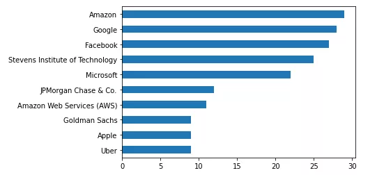
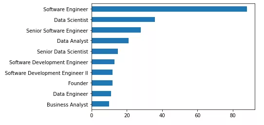
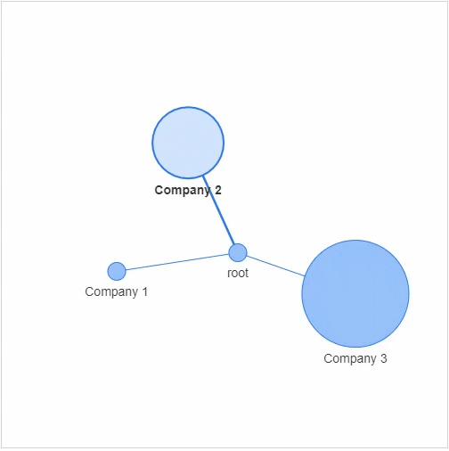
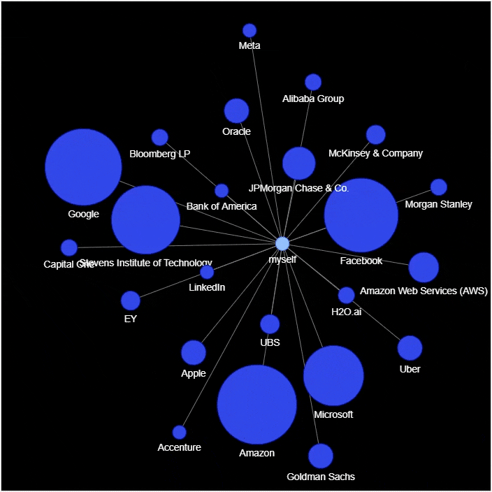

Python
<a name="Uj11k"></a>
### 数据来源
这里用的数据是来自领英当中的社交数据，由于之前也在美国读书，也尝试过在国外找实习、找工作等等，都是通过领英在进行职场上的社交，投递简历、结交职场精英等等，久而久之也逐渐地形成了自己的社交网络，将这部分的社交数据下载下来，然后用pandas模块读取<br />
<a name="ewZUq"></a>
### 数据的读取和清洗
先导入需要用到的模块
```python
import pandas as pd
import janitor
import datetime

from IPython.core.display import display, HTML
from pyvis import network as net
import networkx as nx
```
读取所需要用到的数据集
```python
df_ori = pd.read_csv("Connections.csv", skiprows=3)
df_ori.head()
```
接下来进行数据的清洗，具体的思路就是将空值去除掉，并且数据集当中的“Connected on”这一列，内容是日期，但是数据类型却是字符串，因此也需要将其变成日期格式。
```python
df = (
    df_ori
    .clean_names() # 去除掉字符串中的空格以及大写变成小写
    .drop(columns=['first_name', 'last_name', 'email_address']) # 去除掉这三列
    .dropna(subset=['company', 'position']) # 去除掉company和position这两列当中的空值
    .to_datetime('connected_on', format='%d %b %Y')
  )
```
output
```python
                    company            position connected_on
0                xxxxxxxxxx  Talent Acquisition   2021-08-15
1               xxxxxxxxxxxx   Associate Partner   2021-08-14
2                      xxxxx                猎头顾问   2021-08-14
3  xxxxxxxxxxxxxxxxxxxxxxxxx          Consultant   2021-07-26
4    xxxxxxxxxxxxxxxxxxxxxx     Account Manager   2021-07-19
```
<a name="jM0QB"></a>
### 数据的分析与可视化
先来看一下认识的这些人脉中，分别都是在哪些公司工作的
```python
df['company'].value_counts().head(10).plot(kind="barh").invert_yaxis()
```
output<br /><br />从上图可以看到，排在比较前面的大公司都是亚马逊、谷歌、Facebook、微软以及JP Morgan等大公司。<br />然后再来看一下人脉中，大多都是什么职业的
```python
df['position'].value_counts().head(10).plot(kind="barh").invert_yaxis()
```
output<br /><br />从上图可以看出，大多都是从事的是软件工程师相关的工作，排在第二的则是数据科学家以及高级软件工程师，看来程序员认识的果然大多也都是程序员。<br />然后来看一下社交网络的可视化图表的绘制，但是在这之前呢，需要先说明几个术语，每一个社交网络都包含：

- 节点：社交网络当中的每个参与者
- 边缘：代表着每一个参与者的关系以及关系的紧密程度

先来简单的绘制一个社交网络，主要用到的是`networkx`模块以及`pyvis`模块，
```python
g = nx.Graph()
g.add_node(0, label = "root") # intialize yourself as central node
g.add_node(1, label = "Company 1", size=10, title="info1")
g.add_node(2, label = "Company 2", size=40, title="info2")
g.add_node(3, label = "Company 3", size=60, title="info3")
```
先是建立了4个节点，也分别给他们命名，其中的参数`size`代表着节点的大小，然后将这些个节点相连接
```python
g.add_edge(0, 1)
g.add_edge(0, 2)
g.add_edge(0, 3)
```
最后出来的样子如下图<br /><br />先从人脉中，他们所属的公司来进行网络的可视化，首先对所属的公司做一个统计排序
```python
df_company = df['company'].value_counts().reset_index()
df_company.columns = ['company', 'count']
df_company = df_company.sort_values(by="count", ascending=False)
df_company.head(10)
```
output
```python
                            company  count
0                            Amazon     xx
1                            Google     xx
2                          Facebook     xx
3   Stevens Institute of Technology     xx
4                         Microsoft     xx
5              JPMorgan Chase & Co.     xx
6         Amazon Web Services (AWS)     xx
9                             Apple      x
10                    Goldman Sachs      x
8                            Oracle      x
```
然后来绘制社交网络的图表
```python
# 实例化网络
g = nx.Graph()
g.add_node('myself') # 将自己放置在网络的中心

# 遍历数据集当中的每一行
for _, row in df_company_reduced.iterrows():

    # 将公司名和统计结果赋值给新的变量
    company = row['company']
    count = row['count']

    title = f"<b>{company}</b> – {count}"
    positions = set([x for x in df[company == df['company']]['position']])
    positions = ''.join('<li>{}</li>'.format(x) for x in positions)

    position_list = f"<ul>{positions}</ul>"
    hover_info = title + position_list

    g.add_node(company, size=count*2, title=hover_info, color='#3449eb')
    g.add_edge('root', company, color='grey')

# 生成网络图表
nt = net.Network(height='700px', width='700px', bgcolor="black", font_color='white')
nt.from_nx(g)
nt.hrepulsion()

nt.show('company_graph.html')
display(HTML('company_graph.html'))
```
output<br /><br />从上面也能看到与谷歌、Facebook以及亚马逊、微软等公司的联系较为密切，认识较多从这些大公司当中出来的员工，与此同时，来可视化一下人脉中各种岗位的分布，先做一个统计排序
```python
df_position = df['position'].value_counts().reset_index()
df_position.columns = ['position', 'count']
df_position = df_position.sort_values(by="count", ascending=False)
df_position.head(10)
```
output
```python
                           position  count
0                 Software Engineer     xx
1                    Data Scientist     xx
2          Senior Software Engineer     xx
3                      Data Analyst     xx
4             Senior Data Scientist     xx
5     Software Development Engineer     xx
6  Software Development Engineer II     xx
7                           Founder     xx
8                     Data Engineer     xx
9                  Business Analyst     xx
```
然后进行网络图的绘制
```python
g = nx.Graph()
g.add_node('myself') # 将自己放置在网络的中心

for _, row in df_position_reduced.iterrows():

    # 将岗位名和统计结果赋值给新的变量
    position = row['position']
    count = row['count']

    title = f"<b>{position}</b> – {count}"
    positions = set([x for x in df[position == df['position']]['position']])
    positions = ''.join('<li>{}</li>'.format(x) for x in positions)

    position_list = f"<ul>{positions}</ul>"
    hover_info = title + position_list

    g.add_node(position, size=count*2, title=hover_info, color='#3449eb')
    g.add_edge('root', position, color='grey')

# 生成网络图表
nt = net.Network(height='700px', width='700px', bgcolor="black", font_color='white')
nt.from_nx(g)
nt.hrepulsion()

nt.show('position_graph.html')
```
output<br />
