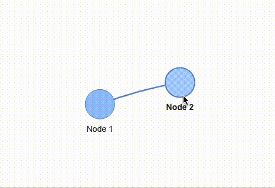
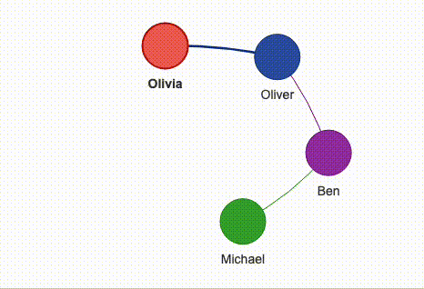
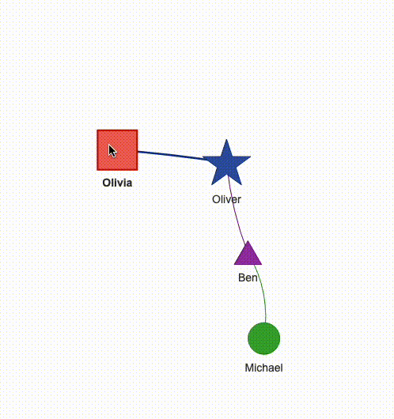

在当今数据驱动的世界里，数据的可视化变得越来越重要。特别是在网络分析领域，将复杂的关系网络转换为直观的图形表示，对于理解和传达信息至关重要。在众多的数据可视化工具中，Python的Pyvis库以其简单性和强大的功能脱颖而出。<br />Pyvis是一个专门用于创建和展示网络图的库，它基于JavaScript的vis.js库进行了高效的封装，提供了一种在Python环境中轻松创建交互式网络图的方法。它的使用场景广泛，从社交网络分析、生物信息学的蛋白质交互网络，到互联网基础设施的映射，几乎任何需要网络图可视化的领域都可以从Pyvis中受益。它特别适用于以下几种场景：

- 社交网络分析：可视化用户之间的互动关系，识别社交网络中的关键节点和群体。
- 互联网和通信网络：展示网络设备之间的连接状态和网络架构。
- 科学研究：在生物学和化学领域，用于显示分子间的复杂关系或者蛋白质网络。
- 数据科学和教育：作为一个教学工具，帮助学生和研究人员更好地理解和分析复杂的网络数据。
<a name="jcSwC"></a>
## 基本用法
使用Pyvis创建网络图的过程直观而简单。首先，需要安装Pyvis库，这可以通过简单的pip命令完成：
```bash
pip install pyvis
```
安装后，可以开始创建您的第一个网络图。Pyvis提供了一个Network类，用于构建和管理网络。可以添加节点（add_node）和边（add_edge）来构建网络。<br />例如，创建一个简单的网络图，包含两个相连的节点，代码如下所示
```python
from pyvis.network import Network

# 创建一个网络对象
net = Network()

# 添加节点和边
net.add_node(1, label="Node 1")
net.add_node(2, label="Node 2")
net.add_edge(1, 2)

# 生成网络图并保存为HTML文件
net.show("my_network.html", notebook=False)
```
output<br />
<a name="fD3yl"></a>
## 高级特性
除了创建基础的网络图，它还允许用户对网络图的各个方面进行广泛定制。一个典型的应用是根据需要改变网络中节点的颜色、大小和形状，以更好地表示不同类型的数据或突出特定的信息。以下是一个示例，展示了如何使用Pyvis为不同的节点分配特定的颜色和标签：
```python
from pyvis.network import Network

net = Network()

# 添加节点，指定标签和颜色
net.add_nodes([3, 4, 5, 6],
              label=['Michael', 'Ben', 'Oliver', 'Olivia'],
              color=['#3da831', '#9a31a8', '#3155a8', '#eb4034'])

# 添加边
net.add_edge(3, 4)
net.add_edge(4, 5)
net.add_edge(5, 6)

# 生成并显示网络图
net.show('list_of_nodes_with_color.html', notebook=False)
```
output<br /><br />在这个例子中，首先创建了一个Network对象。然后使用`add_nodes`方法添加了四个节点，分别为节点3、4、5和6。不仅为每个节点指定了一个标签（如'Michael'、'Ben'等），还为每个节点指定了一个独特的颜色。这些颜色是通过十六进制颜色代码指定的，可以非常精确地控制每个节点的外观。<br />接下来，通过`add_edge`方法添加了节点间的连接。这在可视化中创建了节点之间的关系。<br />最后，使用`show`方法生成了一个HTML文件，该文件包含了刚刚创建的交互式网络图。设置`notebook=False`是为了在非Jupyter笔记本环境中生成和显示网络图。<br />要是想要改变节点的大小和形状，需要在`add_node()`或`add_nodes()`方法中使用额外的参数来指定这些属性。对于大小，可以使用size参数；对于形状，可以使用shape参数。这些参数允许进一步定制化网络图中每个节点的外观。
```python
from pyvis.network import Network

net = Network()

# 添加节点，指定标签、颜色、大小和形状
net.add_nodes([3, 4, 5, 6],
              label=['Michael', 'Ben', 'Oliver', 'Olivia'],
              color=['#3da831', '#9a31a8', '#3155a8', '#eb4034'],
              size=[20, 15, 30, 25],
              shape=['dot', 'triangle', 'star', 'square'])

# 添加边
net.add_edge(3, 4)
net.add_edge(4, 5)
net.add_edge(5, 6)

# 生成并显示网络图
net.show('list_of_nodes_with_custom_features.html', notebook=False)
```
在这个例子中：

- size参数定义了每个节点的大小。这里的值是节点半径的像素大小。
- shape参数定义了节点的形状。Pyvis支持多种形状，如dot（圆点）、triangle（三角形）、star（星形）和square（方形）。

而出来的结果如下图所示<br />
