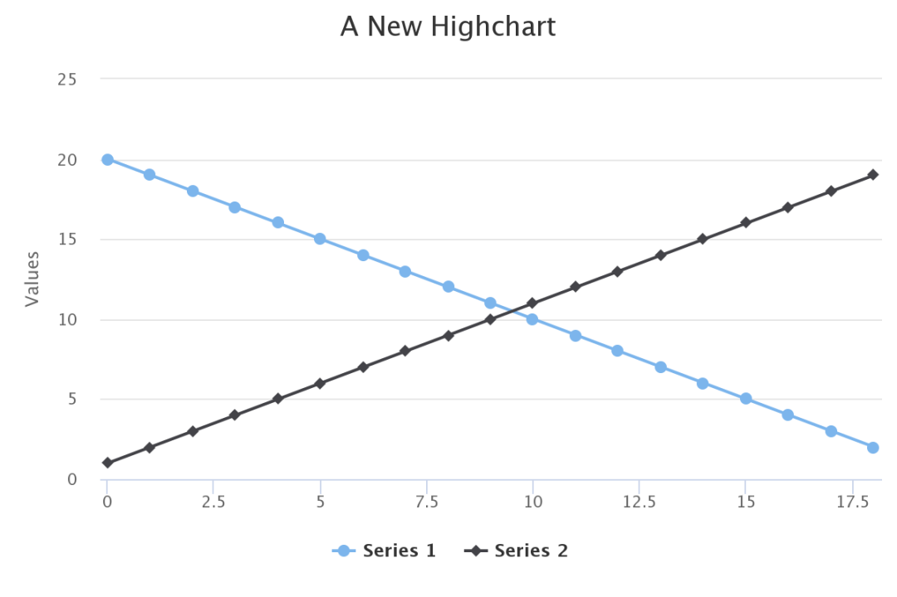
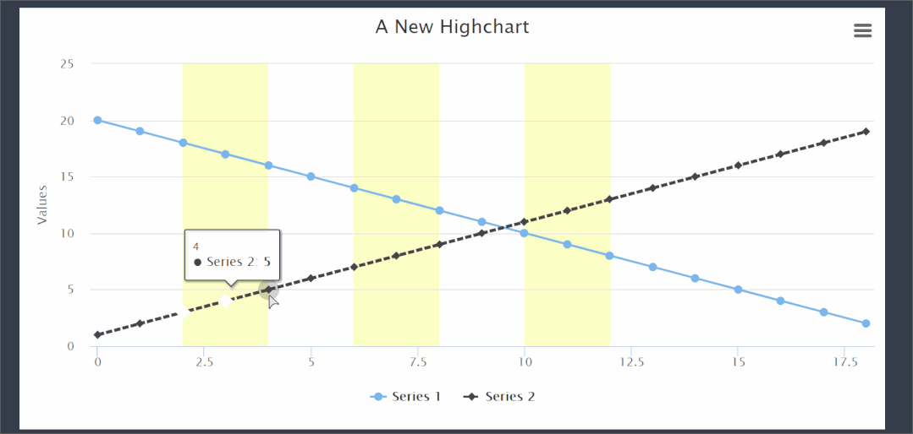
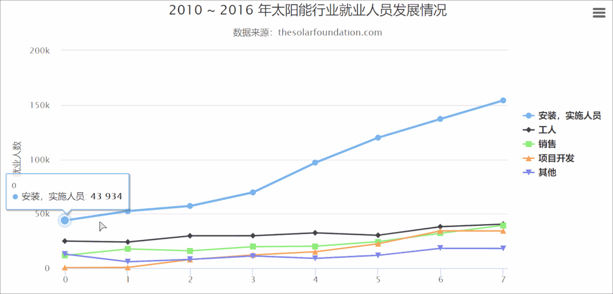
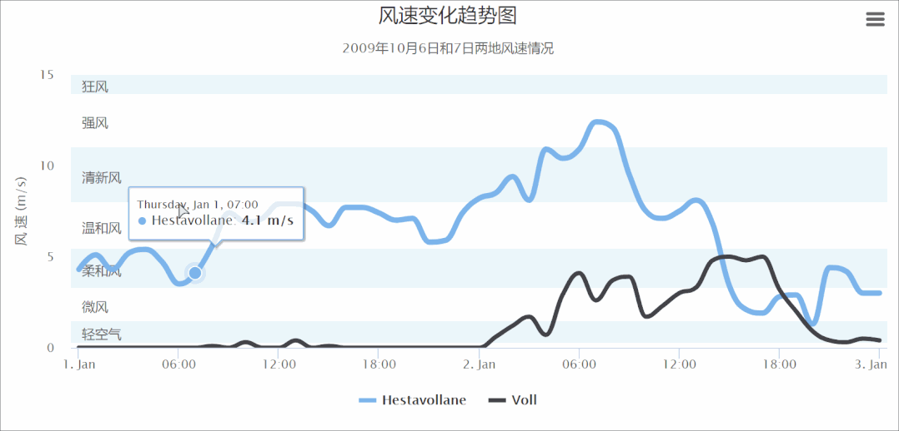

Python<br />推荐一个超强交互式可视化绘制工具-python-highcharts，熟悉HightCharts绘图软件的小伙伴对这个不会陌生，python-highcharts就是使用Python进行Highcharts项目绘制，简单的说就是实现Python和Javascript之间的简单转换层，话不多说，直接进行介绍，具体包括以下几个方面：

- python-highcharts库的简单介绍
- python-highcharts 具体案例
<a name="Nt7gd"></a>
## python-highcharts库的简单介绍
python-highcharts库作为优秀的第三方库，其实现了对HightCharts项目的Python封装应用，里面关于图表细节的设置还是基于Javascript代码，但较简单，可以进行随意更改。<br />需要注意的是，由于HightCharts可以免费用于非商业用途，所以使用python-highcharts绘制也是如此，商业用途需要购买单独的许可证。这里当作练习即可~~<br />python-highcharts库绘制的图形主要包括如下类别：

- Highcharts：绘制如折线图、散点图等常规图表；
- Highstock：绘制股价走势图表；
- Highmaps：绘制地图；
<a name="Jf6Ta"></a>
## python-highcharts 具体案例
这一部分分别主要介绍Highcharts的样例，因为Highstock和Highmaps使用较少，且反应较慢，这里不做介绍。详细内容如下：
<a name="OMW0g"></a>
### 样例一
```python
from highcharts import Highchart 
H = Highchart() 

data = list(range(1,20))
data2 = list(range(20,1,-1)) 
#绘制
H.add_data_set(data2,'line')
H.add_data_set(data, 'line')
H
```
<br />备注：所有图表都是交互式的，这里展示的为静态图片。<br />还可以通过添加交互点击时的状态，如下：
```python
H.add_data_set(data2,'line')
H.add_data_set(data, 'line', 
    marker={
        'states': {
            'hover': {
                'enabled': True, 
                'fillColor': 'white', 
                'lineColor': 'red',
                'lineWidth': 2
            }
        }
    },
    events={
        'click': "function (event) { alert(this.name + ' clicked\\n' + 'Alt: ' + event.altKey + '\\n' + \
                 'Control: ' + event.ctrlKey + '\\n' + 'Shift: ' + event.shiftKey + '\\n');}"}, 
    dashStyle='ShortDash'
)

options = {
    'xAxis':{
        'plotBands': 
            [{'color': '#FCFFC5', 'from': 2, 'to': 4}, 
            {'color': '#FCFFC5', 'from': 6, 'to': 8},
            {'color': '#FCFFC5', 'from': 10, 'to': 12}]
        }
}
H.set_dict_options(options)
```

<a name="O0vKP"></a>
### 样例二
这个例子小编获取Highcharts官网样例进行再现，详细如下：
```python
from highcharts import Highchart 
chart = Highchart() 

data01 = [43934, 52503, 57177, 69658, 97031, 119931, 137133, 154175]
data02 =[24916, 24064, 29742, 29851, 32490, 30282, 38121, 40434]
data03 =[11744, 17722, 16005, 19771, 20185, 24377, 32147, 39387]
data04 = [550, 780, 7988, 12169, 15112, 22452, 34400, 34227]
data05 = [12908, 5948, 8105, 11248, 8989, 11816, 18274, 18111]

chart.add_data_set(data01,'line',name='安装，实施人员')
chart.add_data_set(data02, 'line', name='工人')
chart.add_data_set(data03,'line',name='销售')
chart.add_data_set(data04, 'line', name='项目开发')
chart.add_data_set(data05,'line',name='其他')

options = {
     "title": {
       "text": '2010 ~ 2016 年太阳能行业就业人员发展情况'},
    "subtitle": {
      "text": '数据来源：thesolarfoundation.com'},
    "yAxis": {
      "title": {
         "text": '就业人数'
        }},
     "legend": {
        "layout": 'vertical',
         "align": 'right',
         "verticalAlign": 'middle'
      }}
chart.set_dict_options(options)
chart
```

<a name="dROo1"></a>
### 样例三
```python
from highcharts import Highchart 
chart = Highchart() 


#name: 'Hestavollane',
data01 = [4.3, 5.1, 4.3, 5.2, 5.4, 4.7, 3.5, 4.1, 5.6, 7.4, 6.9, 7.1,
          7.9, 7.9, 7.5, 6.7, 7.7, 7.7, 7.4, 7.0, 7.1, 5.8, 5.9, 7.4,
          8.2, 8.5, 9.4, 8.1, 10.9, 10.4, 10.9, 12.4, 12.1, 9.5, 7.5,
         7.1, 7.5, 8.1, 6.8, 3.4, 2.1, 1.9, 2.8, 2.9, 1.3, 4.4, 4.2,
         3.0, 3.0]

#name: 'Voll',
data02 = [0.0, 0.0, 0.0, 0.0, 0.0, 0.0, 0.0, 0.0, 0.1, 0.0, 0.3, 0.0,
          0.0, 0.4, 0.0, 0.1, 0.0, 0.0, 0.0, 0.0, 0.0, 0.0, 0.0, 0.0,
          0.0, 0.6, 1.2, 1.7, 0.7, 2.9, 4.1, 2.6, 3.7, 3.9, 1.7, 2.3,
          3.0, 3.3, 4.8, 5.0, 4.8, 5.0, 3.2, 2.0, 0.9, 0.4, 0.3, 0.5, 0.4]

chart.add_data_set(data01,'spline',name='Hestavollane')
chart.add_data_set(data02, 'spline', name='Voll')
options = {
    "title": {
       "text": '风速变化趋势图'
             },
    "subtitle": {
        "text": '2009年10月6日和7日两地风速情况'
        },
   "xAxis": {
      "type": 'datetime',
      "labels": {
      "overflow": 'justify'
          }
        },
   "yAxis": {
      "title": {
        "text": '风 速 (m/s)'
          },
  "min": 0,
  "minorGridLineWidth": 0,
  "gridLineWidth": 0,
  "alternateGridColor": None,
  "plotBands": [{ #// Light air
   "from": 0.3,
   "to": 1.5,
   "color": 'rgba(68, 170, 213, 0.1)',
   "label": {
    "text": '轻空气',
    "style": {
     "color": '#606060'
    }
   }
  }, { #// Light breeze
   "from": 1.5,
   "to": 3.3,
   "color": 'rgba(0, 0, 0, 0)',
   "label": {
    "text": '微风',
    "style": {
     "color": '#606060'
    }
   }
  }, { #// Gentle breeze
   "from": 3.3,
   "to": 5.5,
   "color": 'rgba(68, 170, 213, 0.1)',
   "label": {
    "text": '柔和风',
    "style": {
     "color": '#606060'
    }
   }
  }, { #// Moderate breeze
   "from": 5.5,
   "to": 8,
   "color": 'rgba(0, 0, 0, 0)',
   "label": {
    "text": '温和风',
    "style": {
     "color": '#606060'
    }
   }
  }, { #// Fresh breeze
   "from": 8,
   "to": 11,
   "color": 'rgba(68, 170, 213, 0.1)',
   "label": {
    "text": '清新风',
    "style": {
     "color": '#606060'
    }
   }
  }, { #// Strong breeze
   "from": 11,
   "to": 14,
   "color": 'rgba(0, 0, 0, 0)',
   "label": {
    "text": '强风',
    "style": {
     "color": '#606060'
    }
   }
  }, { #// High wind
   "from": 14,
   "to": 15,
   "color": 'rgba(68, 170, 213, 0.1)',
   "label": {
    "text": '狂风',
    "style": {
     "color": '#606060'
    }
   }
  }]
 },
 "tooltip": {
  "valueSuffix": ' m/s'
 },
 "plotOptions": {
  "spline": {
   "lineWidth": 4,
   "states": {
    "hover": {
     "lineWidth": 5
    }
   },
   "marker": {
    "enabled": False
   },
   "pointInterval": 3600000, #// one hour
   
  }
 } 
}

chart.set_dict_options(options)
chart
```
<br />基本上官网提供的例子，python-highcharts都是可以实现的，前提是对这个库有一定的了解程度。当然，会一点JS更好~~ 更多关于此包绘制方法详细内容可参考：[**python-highcharts**](https://github.com/kyper-data/python-highcharts) 和[**HightCharts**](https://www.highcharts.com.cn/demo/highcharts)**。**
<a name="irZAW"></a>
## 参考资料
**python-highcharts: **[https://github.com/kyper-data/python-highcharts](https://github.com/kyper-data/python-highcharts)<br />**HightCharts官网: **[https://www.highcharts.com.cn/demo/highcharts](https://www.highcharts.com.cn/demo/highcharts)
