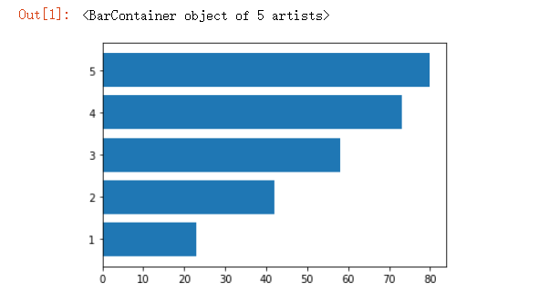
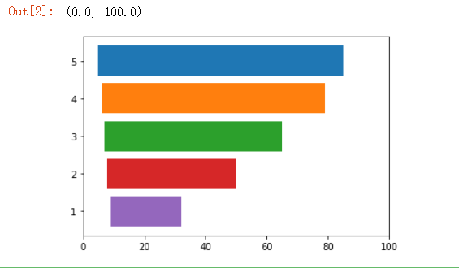
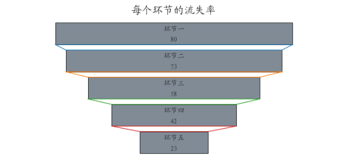
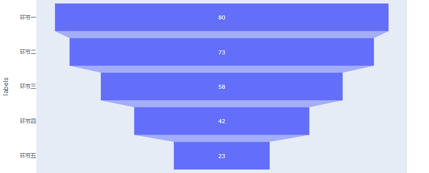
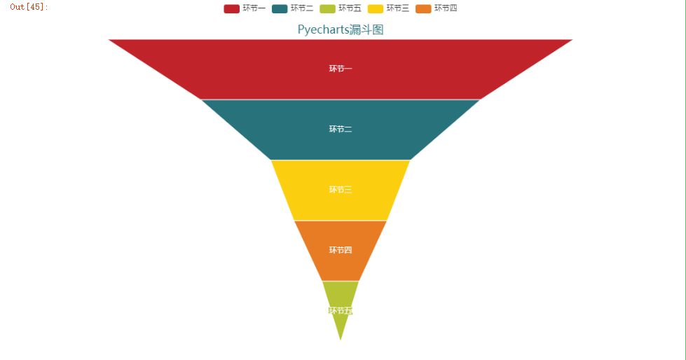
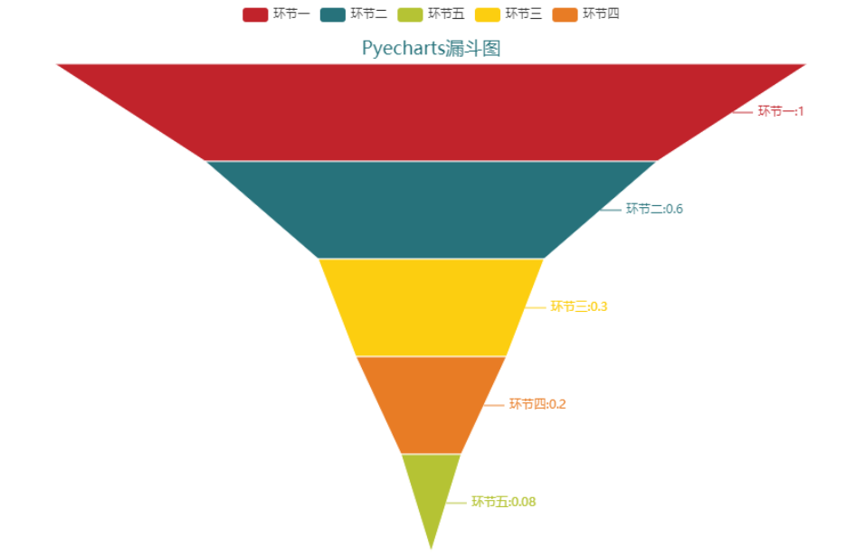

Python 可视化
<a name="IkFBK"></a>
## 关于“漏斗图”
漏斗图常用于用户行为的转化率分析，例如通过漏斗图来分析用户购买流程中各个环节的转化率。当然在整个分析过程当中，会把流程优化前后的漏斗图放在一起，进行比较分析，得出相关的结论，今天小编就用“matplotlib”、“plotly”以及“pyecharts”这几个模块来为大家演示一下怎么画出好看的漏斗图<br />首先要导入需要用到的模块以及数据，
```python
import matplotlib.pyplot as plt
import pandas as pd
df = pd.DataFrame({"环节": ["环节一", "环节二", "环节三", "环节四", "环节五"], 
                   "人数": [1000, 600, 400, 250, 100], 
                   "总体转化率": [1.00, 0.60, 0.40, 0.25, 0.1]})
```
需要用到的数据如下图所示<br /><br />用matplotlib来制作漏斗图，制作出来的效果可能会稍显简单与粗糙，制作的原理也比较简单，先绘制出水平方向的直方图，然后利用`plot.barh()`当中的“left”参数将直方图向左移，便能出来类似于漏斗图的模样
```python
y = [5,4,3,2,1]
x = [85,75,58,43,23]
x_max = 100
x_min = 0
for idx, val in enumerate(x):
    plt.barh(y[idx], x[idx], left = idx+5)
plt.xlim(x_min, x_max)
```
<br />而要绘制出想要的想要的漏斗图的模样，代码示例如下
```python
from matplotlib import font_manager as fm
# funnel chart
y = [5,4,3,2,1]
labels = df["环节"].tolist()
x = df["人数"].tolist()
x_range = 100
font = fm.FontProperties(fname="KAITI.ttf")
```
```python
fig, ax = plt.subplots(1, figsize=(12,6))
for idx, val in enumerate(x):
    left = (x_range - val)/2
    plt.barh(y[idx], x[idx], left = left, color='#808B96', height=.8, edgecolor='black')
    # label
    plt.text(50, y[idx]+0.1, labels[idx], ha='center',
             fontproperties=font, fontsize=16, color='#2A2A2A')
    # value
    plt.text(50, y[idx]-0.3, x[idx], ha='center',
             fontproperties=font, fontsize=16, color='#2A2A2A')
    
    if idx != len(x)-1:
        next_left = (x_range - x[idx+1])/2
        shadow_x = [left, next_left, 
                    100-next_left, 100-left, left]
        shadow_y = [y[idx]-0.4, y[idx+1]+0.4, 
                    y[idx+1]+0.4, y[idx]-0.4, y[idx]-0.4]
        plt.plot(shadow_x, shadow_y)
plt.xlim(x_min, x_max)
plt.axis('off')
plt.title('每个环节的流失率', fontproperties=font, loc='center', fontsize=24, color='#2A2A2A')
plt.show()
```
绘制出来的漏斗图如下图所示<br /><br />当然用plotly来绘制的话则会更加的简单一些，代码示例如下
```python
import plotly.express as px
data = dict(values=[80,73,58,42,23],
            labels=['环节一', '环节二', '环节三', '环节四', '环节五'])
fig = px.funnel(data, y='labels', x='values')
fig.show()
```
<br />最后用pyecharts模块来绘制一下，当中有专门用来绘制“漏斗图”的方法，只需要调用即可
```python
from pyecharts.charts import Funnel
from pyecharts import options as opts
from pyecharts.globals import ThemeType

c = (
    Funnel(init_opts=opts.InitOpts(width="900px", height="600px",theme = ThemeType.INFOGRAPHIC ))
    .add(
        "环节",
        df[["环节","总体转化率"]].values,
        sort_="descending",
        label_opts=opts.LabelOpts(position="inside"),
    )
    .set_global_opts(title_opts=opts.TitleOpts(title="Pyecharts漏斗图", pos_bottom = "90%", pos_left = "center"))
)
c.render_notebook()
```
<br />将数据标注上去之后
```python
c = (
    Funnel(init_opts=opts.InitOpts(width="900px", height="600px",theme = ThemeType.INFOGRAPHIC ))
    .add(
        "商品",
        df[["环节","总体转化率"]].values,
        sort_="descending",
        label_opts=opts.LabelOpts(position="inside"),
    )
    .set_global_opts(title_opts=opts.TitleOpts(title="Pyecharts漏斗图", pos_bottom = "90%", pos_left = "center"))
    .set_series_opts(label_opts=opts.LabelOpts(formatter="{b}:{c}"))
)
c.render_notebook()
```
 
