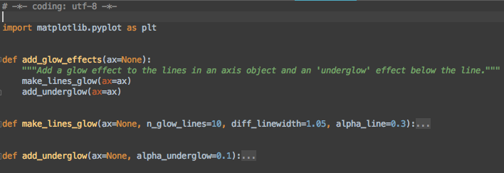
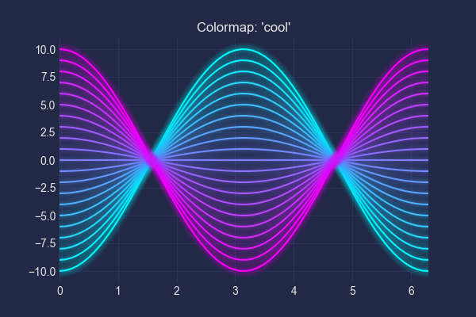
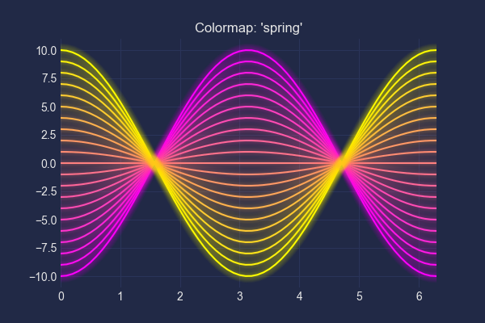
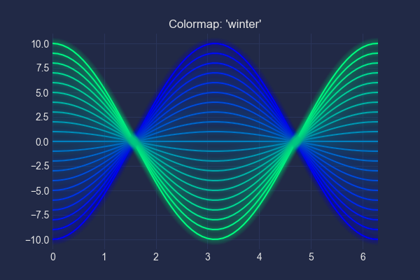
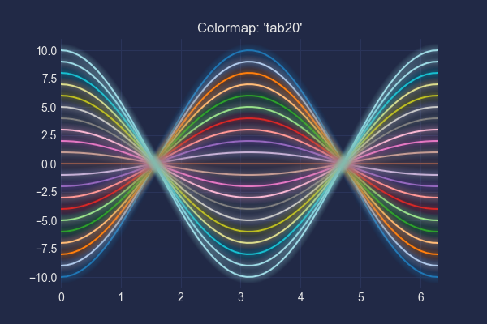
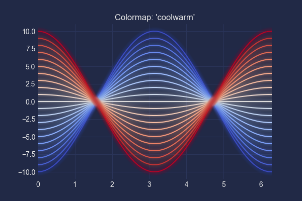
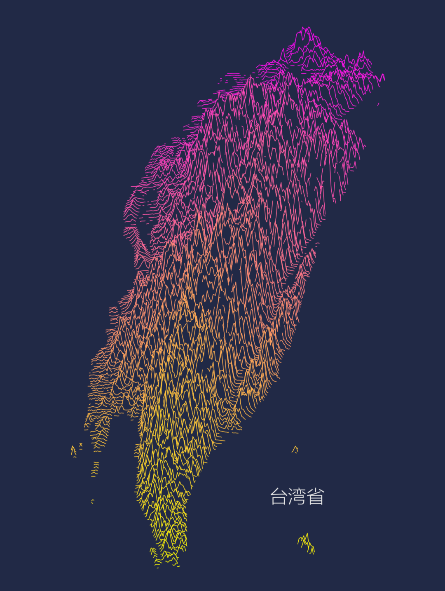

Python 可视化
<a name="ZRKOD"></a>
## “赛博朋克”风格的Python库，「mplcyberpunk」
GitHub：[https://github.com/dhaitz/mplcyberpunk](https://github.com/dhaitz/mplcyberpunk)<br />首先通过pip安装。
```python
# 安装
pip install mplcyberpunk
```
由于作者没有编写使用文档，而且只给了一部分的示例代码...<br />先来看第一个示例。
```python
import matplotlib.pyplot as plt
import mplcyberpunk

# 添加样式
plt.style.use("cyberpunk")

plt.plot([1, 3, 9, 5, 2, 1, 1], marker='o')
plt.plot([4, 5, 5, 7, 9, 8, 6], marker='o')

# 设置线条发光+面积图
mplcyberpunk.add_glow_effects()
plt.show()
```
得到一个线条发光的面积图。<br /><br />确实很符合赛博朋克的霓虹灯风格，人造光源。<br />通过查看库的源码文件core.py，发现该库的两个主要功能。<br /><br />即`make_lines_glow(线条发光)`和`add_underglow(线条面积图)`。<br />下面将每个方法都用一次。
```python
import numpy as np
import mplcyberpunk
import matplotlib.pyplot as plt

plt.style.use("cyberpunk")

# 数据
x = np.arange(-7, 7, 0.1)
y1 = np.sin(x)
y2 = np.sin(x) + x
y3 = np.sin(x) * x
y4 = np.sin(x) / x
plt.plot(x, y1)
plt.plot(x, y2)
plt.plot(x, y3)
plt.plot(x, y4)

# 线条发光
mplcyberpunk.make_lines_glow()
# 面积图
mplcyberpunk.add_underglow()

# 保存图片
plt.savefig("defalut.png")
```
第一个是默认格式，第二个是添加线条发光，第三个是线条发光+面积图。<br /><br />和作者给的示例图，差了标题和图例，小伙伴们可以自行添加～<br />此外还可以自定义一些其他类型的颜色。<br />默认`colormap`是`cool`。
```python
import matplotlib.pyplot as plt
from matplotlib import cm
import mplcyberpunk
import numpy as np

# time
t = np.arange(0, 6.4, 0.1)
# frequency
f = 1
amplitudes = np.arange(-10, 11, 1)
# amplitude
A = [x * np.cos(f*t) for x in amplitudes]

# 设置颜色样式，cool、spring、winter、tab20、coolwarm
colormap_sect = np.linspace(0, 1, len(amplitudes))
colors = [cm.coolwarm(x) for x in colormap_sect]

plt.rcParams['figure.figsize'] = [6, 4]
plt.style.use("cyberpunk")
plt.xlim(right=6.3)

for i in range(21):
    plt.plot(t, A[i], color=colors[i])
mplcyberpunk.make_lines_glow()

# 标题名，cool、spring、winter、tab20、coolwarm
plt.title("Colormap: 'coolwarm'")
plt.savefig("colormap.png")
```
得到5种配色方案的图表。<br /><br />看起来，都很炫！
<a name="GdDgW"></a>
## 生成“赛博朋克”风格的地图。
使用到的是ridge_map的山脊地图。<br />GitHub：[https://github.com/ColCarroll/ridge_map](https://github.com/ColCarroll/ridge_map)
```python
# 安装
pip install ridge_map
# 安装库的依赖
pip install scikit-image==0.14.2
```
这里需要注意，安装scikit-image时需指定0.14.2版本，否则会报错。<br />由于ridge_map这个库内容比较多，就不展开说了。
```python
import matplotlib.font_manager as fm
import matplotlib.pyplot as plt
from ridge_map import RidgeMap
import mplcyberpunk

# 赛博朋克样式
plt.style.use("cyberpunk")

# 中文显示
plt.rcParams['font.sans-serif'] = ['SimHei']  # Windows
plt.rcParams['font.sans-serif'] = ['Hiragino Sans GB'] # Mac
plt.rcParams['axes.unicode_minus'] = False

# 字体
font_prop = fm.FontProperties(fname="方正兰亭刊黑.ttf")

# 获取数据，此处需特殊技巧才能成功
rm = RidgeMap(bbox=(-156.250305, 18.890695, 154.714966, 20.275080), font=font_prop)

# 设置线条数，朝向，以及其他属性
values = rm.get_elevation_data(num_lines=200, viewpoint='north')
values = rm.preprocess(values=values,
                       water_ntile=10,
                       vertical_ratio=240)

# 设置标题，线条颜色，背景颜色等
rm.plot_map(values, label="夏威夷", kind='gradient', line_color=plt.get_cmap('spring'), background_color='#212946')
plt.savefig('夏威夷.png')
```
得到夏威夷岛的山脊地图，朋克风格满满！<br /><br />作者提供的两个图，世界地图和欧洲地图，数据获取时间太久，所以选择放弃～<br />好像是可以使用heightmaps格式的图片直接实现，感兴趣的小伙伴，可以自己试试！<br /><br />实验一个小一点的区域，台湾省。
```python
import matplotlib.font_manager as fm
import matplotlib.pyplot as plt
from ridge_map import RidgeMap
import mplcyberpunk

# 赛博朋克样式
plt.style.use("cyberpunk")

# 中文显示
plt.rcParams['font.sans-serif'] = ['SimHei']  # Windows
plt.rcParams['font.sans-serif'] = ['Hiragino Sans GB'] # Mac
plt.rcParams['axes.unicode_minus'] = False

# 字体
font_prop = fm.FontProperties(fname="方正兰亭刊黑.ttf")

# 获取数据，此处需特殊技巧才能成功
rm = RidgeMap(bbox=(122.014, 25.344, 120.036, 21.902), font=font_prop)

# 设置线条数，朝向，以及其他属性
values = rm.get_elevation_data(num_lines=200, viewpoint='north')
values = rm.preprocess(values=values,
                       water_ntile=10,
                       vertical_ratio=240)

# 设置标题，线条颜色，背景颜色等
rm.plot_map(values, label="台湾省", kind='gradient', line_color=plt.get_cmap('spring'), background_color='#212946')
plt.savefig('台湾省.png')
```
其中经纬度坐标，可通过腾讯位置服务获取。<br /><br />得到台湾省的山脊线图。<br />
