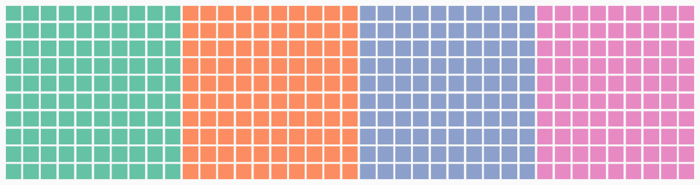
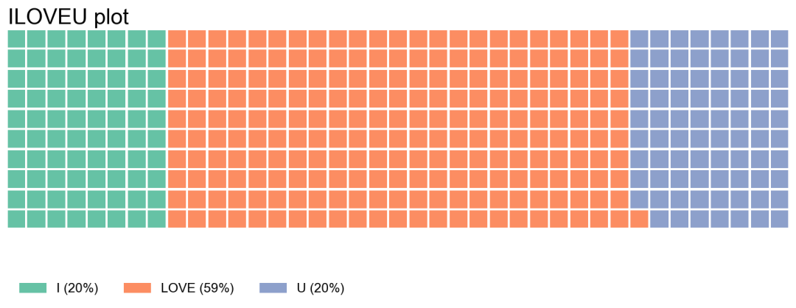
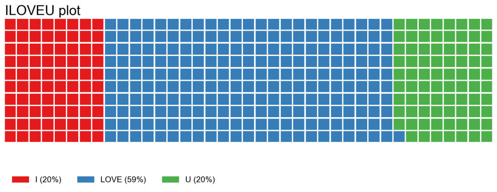
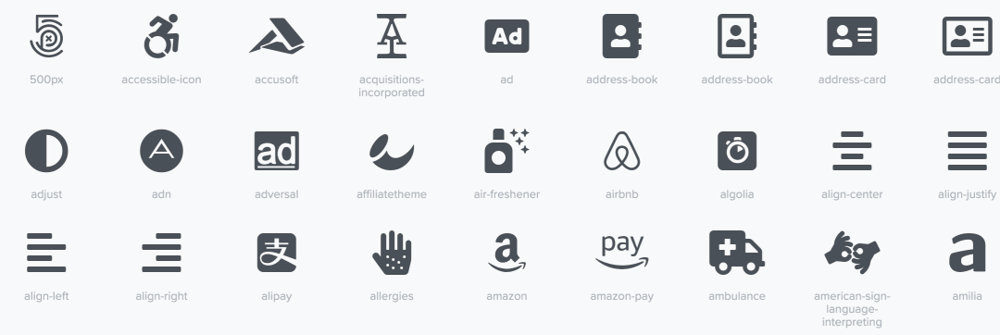
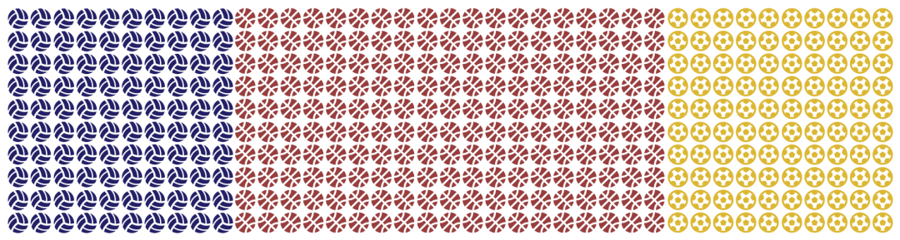
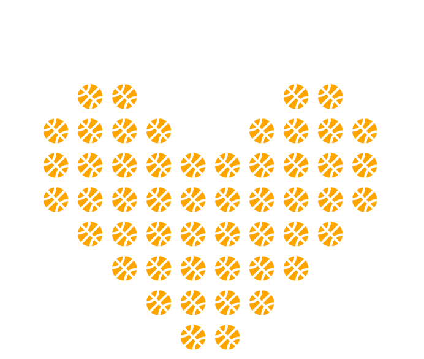
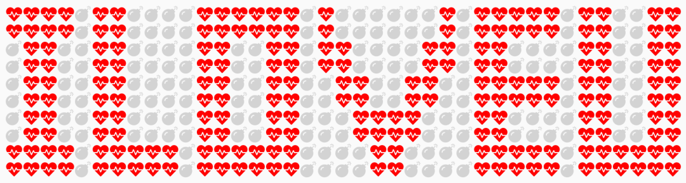
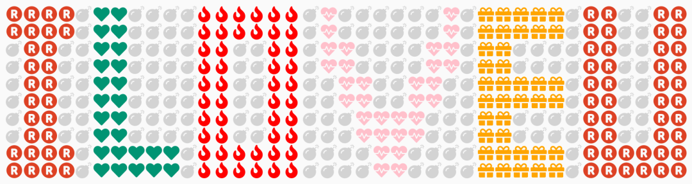

Python Matplotlib pywaffle<br /><br />华夫饼图(Waffle Chart)，或称为直角饼图，可以直观的描绘百分比完成比例情况。与传统的饼图相比较，华夫饼图表达的百分比更清晰和准确，它的每一个格子代表  `1%`。<br />华夫饼图的典型应用是比较同类型指标完成比例。<br />虽然`matplotlib`并没有提供原生的华夫饼图接口，需要安装第三方包`pywaffle`，配合`matplotlib`绘制华夫饼图，但`matplotlib`与`pywaffle`完美融合，绘制图形也非常方便，只需一行代码即可完成精美图表绘制。<br />首先安装`pywaffle`：
```bash
pip install pywaffle
```
<a name="GlqY6"></a>
### 第一张华夫饼图
`pywaffle`的应用非常简单。首先将`Waffle`类传递给`matplotlib.pyplot.figure`函数的`FigureClass`参数，然后通过设置`matplotlib.pyplot.figure`函数的参数即可完成华夫饼图的定制。
```python
import matplotlib.pyplot as plt
from pywaffle import Waffle
fig = plt.figure(
    FigureClass=Waffle,
    rows=100,
    columns=39,  # 行或列都可以省略
    values=[100,100,100,90])
fig.show()
```

<a name="Knoxv"></a>
### 设置标题、标签和图例
通过设置对应参数，即可以对目标图进行自定义。<br />如标题和图例分别通过参数`title`和`legend`，均是接受字典中的matplotlib参数。标签参数为`labels`，如果未指定，`values`则将使用键作为标签。<br />
<a name="QENg3"></a>
### 设置颜色
颜色是影响一个图形外观的重要因素之一。参数colors接受列表或元组中的颜色。其长度必须等于values。如
```python
values=[30, 16, 4]
colors=["#232066", "#983D3D", "#DCB732"]
```
更改色块颜色的另一种方法是将matplotlib中的Colormap传递给参数 cmap_name，该参数可批量设置颜色。包括 Pastel1，Pastel2，Paired，Accent，Dark2，Set1，Set2，Set3，tab10，tab20，tab20b，tab20c。<br />如`cmap_name="tab10"`<br /><br />比较有意思的是下面的字符和图标这两个参数。
<a name="B5r9Z"></a>
### 设置字符
通过将一个字符列表或元组传递给参数`characters`，每个类别的类别字符可以具有不同的字符，但长度必须与`values`相同。
```python
fig = plt.figure(
    FigureClass=Waffle,
    rows=5,
    values=[30, 16, 4],
    colors=["#4C8CB5", "#B7CBD7", "#C0C0C0"],
    characters='⬤',
    font_size=24)
```

<a name="mJYpT"></a>
### 设置图标
带有图标的华夫饼图也被称为象形图。<br />使用参数`icons`设置图表形状，通过将图标名称的列表或元组传递给参数`icons`，支持使用Font Awesome图标([https://fontawesome.com/](https://fontawesome.com/))。<br /><br />部分例子<br />使用`icon_size`设置图标的大小。<br />使用`icon_style`设置图表样式可以是Solid, Regular 和 Brands。<br />使用`icon_legend= True`设置图例，图例中的符号将是图标，否则，它将是一个颜色条。
```python
icons=['volleyball-ball',
       'basketball-ball','futbol']
```

<a name="PP02z"></a>
### 表白图形绘制
下面就通过改变图标、颜色、值的大小，并通过一行代码绘制一个 ❤️ 形的华夫饼图。
<a name="cLr0m"></a>
### 一行代码绘制爱心图
```python
fig = plt.figure(figsize=(12, 4),dpi=150,
    FigureClass=Waffle,
    rows=10,
    values=[14,3,6,5,4,6,3,6,3,6,4,6,5,6,5,6,5,5,6,3,13],
    colors=["white"]+[ "orange", "white"]*10,
    icons=['basketball-ball']*21,
    font_size=20)
```

<a name="BFISP"></a>
### 绘制 "I LOVE U"
<a name="AOpGF"></a>
#### 设置好需要的参数
```python
from pywaffle import Waffle
background_color = "#fafafa"
# 华夫饼格子数
values=[2, 6, 24, 6, 2, 10, 22, 8, 2, 8, 2, 18,
        22, 6, 4, 6, 22, 16, 4, 4, 4, 4, 4, 4, 4,
        6, 4, 8, 4, 8, 4, 8, 4, 10, 22, 2, 2, 2, 
        4, 2, 2, 2, 4, 2, 2, 2, 2, 10, 22, 8, 2, 8, 20]
# 颜色
colors=['red'] + ['lightgray', 'red']*26
# 图标
icons=['heartbeat']+['bomb','heartbeat']*26
```
<a name="vBjCv"></a>
#### 绘图
```python
fig = plt.figure(figsize=(12, 4),
    dpi=150, #设置画布大小
    # 设置背景颜色
    facecolor=background_color,
    # 指定华夫饼图
    FigureClass=Waffle,
    # 设置行数
    rows=10,
    # 设置值
    values=values,
    # 设置颜色
    colors=colors,
    # 设置图标
    icons=icons)
```
<br />当然，还可以将不同的字母更换成不同的图标及颜色，显得更加绚丽。<br />

 
