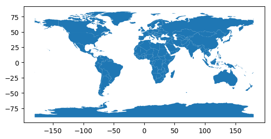
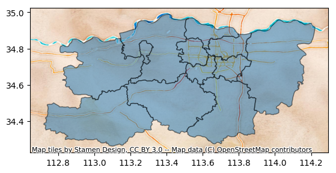

Python<br />主要介绍GeoPandas的使用要点。GeoPandas是一个Python开源项目，旨在提供丰富而简单的地理空间数据处理接口。GeoPandas扩展了Pandas的数据类型，并使用matplotlib进行绘图。GeoPandas官方仓库地址为：[**GeoPandas**](https://github.com/geopandas/geopandas)。GeoPandas的官方文档地址为：[**GeoPandas-doc**](https://geopandas.org/en/stable/docs.html)。本文主要参考[**GeoPandas Examples Gallery**](https://geopandas.org/en/stable/gallery/index.html)。<br />GeoPandas推荐使用Python3.7版本及以上，运行环境最好是linux系统。GeoPandas安装命令如下：
```bash
pip install geopandas
```
如果上述命令安装出问题，则推荐使用conda安装GeoPandas，命令如下：
```bash
conda install geopandas
```
或：
```bash
conda install --channel conda-forge geopandas
```
除了GeoPandas需要安装，以下第三方库也需要安装：
```bash
pip install mapclassify
pip install matplotlib_scalebar
pip install rtree
pip install contextily
```
```python
# jupyter notebook环境去除warning
import warnings
warnings.filterwarnings("ignore")

# 查看geopandas版本
import geopandas as gpd

gpd.__version__
```
```
'0.13.2'
```
<a name="S9VDi"></a>
## 1、分级统计图Choropleth
分级统计图Choropleth是一种表示地理区域内数据分布的可视化图表。它将地图划分为不同的区域，并使用颜色或阴影的不同程度来显示该区域的数据值。通常，分级统计图用于显示人口统计、自然资源分布等数据。分级统计图以帮助观察者更容易地理解数据在地理空间上的分布情况和变化趋势，有助于制定决策和规划相关工作。
```python
import geopandas as gpd
from geopandas import read_file
```
```python
# pip install mapclassify
import mapclassify
mapclassify.__version__
```
```
'2.5.0'
```
```python
# 读取四川地图数据，数据来自DataV.GeoAtlas，将其投影到EPSG:4573
data = gpd.read_file('https://geo.datav.aliyun.com/areas_v3/bound/510000_full.json').to_crs('EPSG:4573')
data.head()
```
| **<br /> | **adcode** | **name** | **childrenNum** | **level** | **parent** | **subFeatureIndex** | **geometry** |
| --- | --- | --- | --- | --- | --- | --- | --- |
| **0** | 510100 | 成都市 | 20 | city | {'adcode': 510000} | 0 | MULTIPOLYGON (((18399902.859 3356187.915, 1840... |
| **1** | 510300 | 自贡市 | 6 | city | {'adcode': 510000} | 1 | MULTIPOLYGON (((18419941.941 3231303.167, 1842... |
| **2** | 510400 | 攀枝花市 | 5 | city | {'adcode': 510000} | 2 | MULTIPOLYGON (((18183734.470 2889855.327, 1818... |
| **3** | 510500 | 泸州市 | 7 | city | {'adcode': 510000} | 3 | MULTIPOLYGON (((18540813.879 3244247.734, 1853... |
| **4** | 510600 | 德阳市 | 6 | city | {'adcode': 510000} | 4 | MULTIPOLYGON (((18516163.207 3398495.768, 1851... |

<a name="mFzdG"></a>
### 简单分级统计
以下代码通过scheme分级统计四川省各地级市所包含区县数。
```python
ax = data.plot(
    column="childrenNum",
    scheme="QUANTILES", # 设置分层设色标准
    edgecolor='lightgrey', 
    k=7, # 分级数量
    cmap="Blues",
    legend=True,
    # 通过fmt设置位数
    legend_kwds={"loc": "center left", "bbox_to_anchor": (1, 0.5),"fmt": "{:.2f}"}
)

# 显示各地级市包含区县数量
for index in data.index:
    x = data.iloc[index].geometry.centroid.x
    y = data.iloc[index].geometry.centroid.y
    name = data.iloc[index]["childrenNum"]
    ax.text(x, y, name, ha="center", va="center",color='red')
```
```python
# 查看label，也就是分级区间
labels = [t.get_text() for t in ax.get_legend().get_texts()]
labels
```
```
[' 3.00,  5.00',
 ' 5.00,  6.00',
 ' 6.00,  6.57',
 ' 6.57,  7.43',
 ' 7.43,  9.29',
 ' 9.29, 13.57',
 '13.57, 20.00']
```
```python
# 查看各个分级标准和区间数量，一般是左开右闭
res = mapclassify.Quantiles(data["childrenNum"], k=7)
res
```
```
Quantiles

   Interval      Count
----------------------
[ 3.00,  5.00] |     5
( 5.00,  6.00] |     4
( 6.00,  6.57] |     0
( 6.57,  7.43] |     3
( 7.43,  9.29] |     3
( 9.29, 13.57] |     3
(13.57, 20.00] |     3
```
<a name="hwjzC"></a>
### 间隔展示
```python
ax = data.plot(
    column="childrenNum",
    scheme="BoxPlot", 
    edgecolor='k',
    cmap="OrRd", # 设置分层设色标准
    legend=True,
    # 通过interval设置是否展示区间间隔
    legend_kwds={"loc": "center left", "bbox_to_anchor": (1, 0.5), "interval": True}
)

# 显示各地级市包含区县数量
for index in data.index:
    x = data.iloc[index].geometry.centroid.x
    y = data.iloc[index].geometry.centroid.y
    name = data.iloc[index]["childrenNum"]
    ax.text(x, y, name, ha="center", va="center",color='red')
```

<a name="bsWOr"></a>
### 分类展示
以数值分类的方式展示数据，其中区县数量为20的地级市为成都市。
```python
ax = data.plot(
    column="childrenNum",
    categorical=True, # 以数值分类的方式展示
    legend=True,
    cmap="tab20",
    # 对于分类数据，fmt设置无用
    legend_kwds={"loc": "center left", "bbox_to_anchor": (1, 0.5), "fmt": "{:.0f}"},
)  

# 显示各地级市包含区县数量
for index in data.index:
    x = data.iloc[index].geometry.centroid.x
    y = data.iloc[index].geometry.centroid.y
    name = data.iloc[index]["childrenNum"]
    ax.text(x, y, name, ha="center", va="center",color='red')
```

<a name="BLEQO"></a>
### 自定义分级
```python
# 自定义分级标准
def custom(value):
    # 设置ABC三个等级
    level = None
    if value > 15:
        level = 'A'
    elif value > 8:
        level = 'B'
    else:
        level = 'C'
    return level

# 根据自定义函数映射为新的列
data['level'] = data['childrenNum'].apply(custom)
data.head()
```
| **<br /> | **adcode** | **name** | **childrenNum** | **level** | **parent** | **subFeatureIndex** | **geometry** |
| --- | --- | --- | --- | --- | --- | --- | --- |
| **0** | 510100 | 成都市 | 20 | A | {'adcode': 510000} | 0 | MULTIPOLYGON (((18399902.859 3356187.915, 1840... |
| **1** | 510300 | 自贡市 | 6 | C | {'adcode': 510000} | 1 | MULTIPOLYGON (((18419941.941 3231303.167, 1842... |
| **2** | 510400 | 攀枝花市 | 5 | C | {'adcode': 510000} | 2 | MULTIPOLYGON (((18183734.470 2889855.327, 1818... |
| **3** | 510500 | 泸州市 | 7 | C | {'adcode': 510000} | 3 | MULTIPOLYGON (((18540813.879 3244247.734, 1853... |
| **4** | 510600 | 德阳市 | 6 | C | {'adcode': 510000} | 4 | MULTIPOLYGON (((18516163.207 3398495.768, 1851... |

```python
ax = data.plot(
    column="level",
    categorical=True, # 以数值分类的方式展示
    legend=True,
    cmap="coolwarm",
    # 对于分类数据，fmt设置无用
    legend_kwds={"loc": "center left", "bbox_to_anchor": (1, 0.5), "fmt": "{:.0f}"},
)  

# 显示各地级市包含区县数量
for index in data.index:
    x = data.iloc[index].geometry.centroid.x
    y = data.iloc[index].geometry.centroid.y
    name = data.iloc[index]["childrenNum"]
    ax.text(x, y, name, ha="center", va="center",color='red')
```

<a name="akByG"></a>
## 2、通过DataFrame创建GeoDataFrame
<a name="riWb9"></a>
### 基于经纬度数据
GeoDataFrame有一个geometry列，可以通过经纬度数据Latitude和Longitude创建该列。
```python
import pandas as pd
# 生成关于南美城市的dataframe数据
df = pd.DataFrame(
    {
        "City": ["Buenos Aires", "Brasilia", "Santiago", "Bogota", "Caracas"],
        "Country": ["Argentina", "Brazil", "Chile", "Colombia", "Venezuela"],
        "Latitude": [-34.58, -15.78, -33.45, 4.60, 10.48],
        "Longitude": [-58.66, -47.91, -70.66, -74.08, -66.86],
    }
)

df
```
| **<br /> | **City** | **Country** | **Latitude** | **Longitude** |
| --- | --- | --- | --- | --- |
| **0** | Buenos Aires | Argentina | -34.58 | -58.66 |
| **1** | Brasilia | Brazil | -15.78 | -47.91 |
| **2** | Santiago | Chile | -33.45 | -70.66 |
| **3** | Bogota | Colombia | 4.60 | -74.08 |
| **4** | Caracas | Venezuela | 10.48 | -66.86 |

```python
# 将dataframe转换为GeoDataFrame
import geopandas as gpd
gdf = gpd.GeoDataFrame(
    df, geometry=gpd.points_from_xy(df.Longitude, df.Latitude), crs="EPSG:4326"
)
gdf
```
| **<br /> | **City** | **Country** | **Latitude** | **Longitude** | **geometry** |
| --- | --- | --- | --- | --- | --- |
| **0** | Buenos Aires | Argentina | -34.58 | -58.66 | POINT (-58.66000 -34.58000) |
| **1** | Brasilia | Brazil | -15.78 | -47.91 | POINT (-47.91000 -15.78000) |
| **2** | Santiago | Chile | -33.45 | -70.66 | POINT (-70.66000 -33.45000) |
| **3** | Bogota | Colombia | 4.60 | -74.08 | POINT (-74.08000 4.60000) |
| **4** | Caracas | Venezuela | 10.48 | -66.86 | POINT (-66.86000 10.48000) |

```python
# 在南美地图上展示
world = gpd.read_file(gpd.datasets.get_path("naturalearth_lowres"))
# 定位到南美
ax = world.cx[-90:-55, -25:15].plot(color="white", edgecolor="black")
# 在ax区域上绘制地图
gdf.plot(ax=ax, color="red")
```
```
<matplotlib.axes._subplots.AxesSubplot at 0x7f75ed57a460>
```

<a name="SsfJr"></a>
### 基于WTK格式数据
WKT (Well-Known Text) 是一种用于描述地理位置的数据格式。WTK格式的数据包含点、线、多边形等地理位置信息。WTK格式的数据可以被许多GIS软件和地理位置分析工具所读取和处理。可以将带有WKT数据的DataFrame转换为GeoDataframe。
```python
df = pd.DataFrame(
    {
        "City": ["Buenos Aires", "Brasilia", "Santiago", "Bogota", "Caracas"],
        "Country": ["Argentina", "Brazil", "Chile", "Colombia", "Venezuela"],
        "Coordinates": [
            "POINT(-58.66 -34.58)",
            "POINT(-47.91 -15.78)",
            "POINT(-70.66 -33.45)",
            "POINT(-74.08 4.60)",
            "POINT(-66.86 10.48)",
        ],
    }
)
df
```
| **<br /> | **City** | **Country** | **Coordinates** |
| --- | --- | --- | --- |
| **0** | Buenos Aires | Argentina | POINT(-58.66 -34.58) |
| **1** | Brasilia | Brazil | POINT(-47.91 -15.78) |
| **2** | Santiago | Chile | POINT(-70.66 -33.45) |
| **3** | Bogota | Colombia | POINT(-74.08 4.60) |
| **4** | Caracas | Venezuela | POINT(-66.86 10.48) |

```python
# 创建新列然后数据转换
df["Coordinates"] = gpd.GeoSeries.from_wkt(df["Coordinates"])
gdf = gpd.GeoDataFrame(df, geometry="Coordinates", crs="EPSG:4326")

print(gdf.head())
```
```
City    Country                  Coordinates
0  Buenos Aires  Argentina  POINT (-58.66000 -34.58000)
1      Brasilia     Brazil  POINT (-47.91000 -15.78000)
2      Santiago      Chile  POINT (-70.66000 -33.45000)
3        Bogota   Colombia    POINT (-74.08000 4.60000)
4       Caracas  Venezuela   POINT (-66.86000 10.48000)
```
```python
# 在南美地图上展示
world = gpd.read_file(gpd.datasets.get_path("naturalearth_lowres"))
# 定位到南美
ax = world.cx[-90:-55, -25:15].plot(color="white", edgecolor="black")
# 在ax区域上绘制地图
gdf.plot(ax=ax, color="red")
```
```
<matplotlib.axes._subplots.AxesSubplot at 0x7f75ed445100>
```

<a name="sPVVE"></a>
## 3、添加比例尺
在地理空间数据分析和可视化过程中，比例尺可以了解地图上的距离和大小关系。基于matplotlib进行可视化时，可以利用[**matplotlib-scalebar**](https://github.com/ppinard/matplotlib-scalebar)库添加比例尺。
<a name="Q7S9s"></a>
### 简单比例尺
```python
import geopandas as gpd
# pip install matplotlib_scalebar安装
from matplotlib_scalebar.scalebar import ScaleBar
```
```python
# nybb为纽约五大地图
nybb = gpd.read_file(gpd.datasets.get_path("nybb"))
# 北美地区常见坐标系统，坐标以米为单位
nybb = nybb.to_crs(32619)  
nybb.head()
```
| <br /> | **BoroCode** | **BoroName** | **Shape_Leng** | **Shape_Area** | **geometry** |
| --- | --- | --- | --- | --- | --- |
| **0** | 5 | Staten Island | 330470.010332 | 1.623820e+09 | MULTIPOLYGON (((72387.313 4502901.349, 72390.3... |
| **1** | 4 | Queens | 896344.047763 | 3.045213e+09 | MULTIPOLYGON (((90672.492 4505050.592, 90663.5... |
| **2** | 3 | Brooklyn | 741080.523166 | 1.937479e+09 | MULTIPOLYGON (((88021.476 4503764.521, 87967.7... |
| **3** | 1 | Manhattan | 359299.096471 | 6.364715e+08 | MULTIPOLYGON (((76488.408 4515823.054, 76399.6... |
| **4** | 2 | Bronx | 464392.991824 | 1.186925e+09 | MULTIPOLYGON (((86828.383 4527641.247, 86816.3... |

如下所示，创建ScaleBar对象所需的唯一参数是dx。dx表示输入图片每一个像素代表的长度，units为dx的单位。此参数的值取决于坐标参考系的单位。在前面nybb数据集已经使用epsg:32619坐标系统，该坐标系以单位米为单位，如下所示，可以看到nybb.crs输出结果中Axis Info项标识了该参考系以metre米为单位。
```python
nybb.crs
```
```
<Projected CRS: EPSG:32619>
Name: WGS 84 / UTM zone 19N
Axis Info [cartesian]:
- E[east]: Easting (metre)
- N[north]: Northing (metre)
Area of Use:
- name: Between 72°W and 66°W, northern hemisphere between equator and 84°N, onshore and offshore. Aruba. Bahamas. Brazil. Canada - New Brunswick (NB); Labrador; Nunavut; Nova Scotia (NS); Quebec. Colombia. Dominican Republic. Greenland. Netherlands Antilles. Puerto Rico. Turks and Caicos Islands. United States. Venezuela.
- bounds: (-72.0, 0.0, -66.0, 84.0)
Coordinate Operation:
- name: UTM zone 19N
- method: Transverse Mercator
Datum: World Geodetic System 1984 ensemble
- Ellipsoid: WGS 84
- Prime Meridian: Greenwich
```
在下面代码中添加了比例尺和像素尺寸，该比例尺采用的是线段式表示方式，即在地图上绘制一条线段并注明该地图上该线段所代表的实际距离。
```python
ax = nybb.plot()
# 在地图中添加比例尺和像素尺寸
scalebar =ScaleBar(dx=1,units="m")
ax.add_artist(scalebar)
```
```
<matplotlib_scalebar.scalebar.ScaleBar at 0x7f75ed426a30>
```

<a name="is7CY"></a>
### 确定比例尺基准长度
如下所示，以经纬度为单位的epsg:4326坐标系，其单位尺度为度（经纬度）。
```python
# nybb为纽约五大区地图
nybb = gpd.read_file(gpd.datasets.get_path("nybb"))
nybb = nybb.to_crs(4326) 
nybb.plot()
```
```
<matplotlib.axes._subplots.AxesSubplot at 0x7f75ed3a9cd0>
```

```python
nybb.crs
```
```
<Geographic 2D CRS: EPSG:4326>
Name: WGS 84
Axis Info [ellipsoidal]:
- Lat[north]: Geodetic latitude (degree)
- Lon[east]: Geodetic longitude (degree)
Area of Use:
- name: World.
- bounds: (-180.0, -90.0, 180.0, 90.0)
Datum: World Geodetic System 1984 ensemble
- Ellipsoid: WGS 84
- Prime Meridian: Greenwich
```
可以通过计算该地图中相邻两点之间的距离长度来确定比例尺基准长度，要注意的是这两点应该位于待绘制的地图中。
```python
from shapely.geometry.point import Point

points = gpd.GeoSeries(
    [Point(-73.9, 40.7), Point(-74.9, 40.7)], crs=4326
)  
# 将两点转换到以米为单位的坐标系
points = points.to_crs(32619)  
# 计算点之间的距离，距离单位为坐标系的单位
distance_meters = points[0].distance(points[1])
distance_meters
```
```
84698.53985065906
```
```python
nybb = nybb.to_crs(4326) 
ax = nybb.plot()
ax.add_artist(ScaleBar(distance_meters,"m"))
```
```
<matplotlib_scalebar.scalebar.ScaleBar at 0x7f75ed113400>
```

<a name="JBz5f"></a>
### 比例尺自定义
通过更改 ScaleBar 参数能够调整比例尺的显示效果，ScaleBar具体参数如下所示。这些参数的使用可以自行尝试。
```python
scalebar = ScaleBar(
    dx, # 像素和长度之间的比例尺。例如，如果一个像素代表1毫米，则dx=0.001。
    units="m", # 长度单位
    dimension="si-length", # 维度
    label=None, # 刻度尺标签
    length_fraction=None, # 刻度尺长度占比
    height_fraction=None, # 刻度尺高度占比
    width_fraction=None, # 刻度尺宽度占比
    location=None, # 刻度尺的位置
    pad=None, # 刻度尺和边框之间的间距
    border_pad=None, # 刻度尺和边框之间的边距
    sep=None, # 刻度尺标签和刻度之间的距离
    frameon=None, # 是否显示边框
    color=None, # 刻度尺和标签的颜色
    box_color=None, # 边框的颜色
    box_alpha=None, # 边框的透明度
    scale_loc=None, # 刻度线的位置
    label_loc=None, # 刻度尺标签的位置
    font_properties=None, # 标签和刻度线的字体属性
    label_formatter=None, # 标签的格式化函数
    scale_formatter=None, # 刻度线的格式化函数
    fixed_value=None, # 固定的数值
    fixed_units=None, # 固定的单位
    animated=False, # 是否允许动画
    rotation=None, # 刻度尺的旋转角度
    bbox_to_anchor=None, # bbox的锚点
    bbox_transform=None, # bbox的变换
)
```
此外，也可以更改一像素代表的长度单位，如`ScaleBar(2, dimension="si-length", units="km")`表示图中1像素代表实际si-length（国际单位制）中的2km。所支持的长度单位参数如下表所示：

| **dimension** | **units** |
| --- | --- |
| si-length | km, m, cm, um |
| imperial-length | in, ft, yd, mi |
| si-length-reciprocal | 1/m, 1/cm |
| angle | deg |

一些比例尺参数调整的示例如下
```python
nybb = gpd.read_file(gpd.datasets.get_path("nybb")).to_crs(32619)
ax = nybb.plot()

# 改变位置和方向
scale1 = ScaleBar(
    dx=1,
    label="Scale 1",
    location="lower left",  # 位置
    label_loc="left",
    scale_loc="top",  # 注释文字相对于横线方向位置
)

# 改变颜色
scale2 = ScaleBar(
    dx=1,
    label="Scale 2",
    location="center",
    color="#b32400",
    box_color="yellow",
    box_alpha=0.8,  # 透明度
)

# 改变文字
scale3 = ScaleBar(
    dx=1,
    label="Scale 3",
    font_properties={
        "size": "large",
    },  
    location="lower right",  # 位置
    scale_formatter=lambda value, unit: f"> {value} {unit} <",
)


# 改变长度
scale4 = ScaleBar(
    dx=1,
    label="Scale 4",
    length_fraction=0.5, # 表示刻度线占绘图区域的50%
    scale_loc="top",
    label_loc="left",
    border_pad=1,
    pad=0.25,
)

ax.add_artist(scale1)
ax.add_artist(scale2)
ax.add_artist(scale3)
ax.add_artist(scale4)
```
```
<matplotlib_scalebar.scalebar.ScaleBar at 0x7f753de7d850>
```

<a name="t1puu"></a>
## 4、图层操作与几何运算
<a name="YHhpn"></a>
### 4.1 图层叠加
在geopandas中，`overlay()`函数是用于将两个地理图层进行叠加分析的函数。它可以进行求交集、并集、差集和对称差集等操作。`overlay()`函数的基本语法如下：
```python
geopandas.overlay(layer1, layer2, how)
```
其中，layer1和layer2是两个geopandas地理图层对象，how是一个字符串，指定要进行的叠加操作。how参数有以下取值：

- `**intersection**`**：交集**
- `**union**`**：并集**
- `**difference**`**：差集**
- `**symmetric_difference**`**：对称差集**
- `**identity**`

在下面的示例中展示overlay函数的使用方式。
<a name="gaHpr"></a>
#### 准备数据
```python
import geopandas as gpd
import pandas as pd
from shapely.geometry import Polygon, Point
```
```python
# 画一个圆
center = Point(2, 2)  # 圆心坐标
radius = 1# 圆的半径
circle = center.buffer(radius)
gdf1 = gpd.GeoDataFrame({'geometry': circle, 'circle':[0]})
gdf1.plot()
```
```
<matplotlib.axes._subplots.AxesSubplot at 0x7f74a2e0fc10>
```

```
gdf1
```
| <br /> | **geometry** | **circle** |
| --- | --- | --- |
| **0** | POLYGON ((3.00000 2.00000, 2.99518 1.90198, 2.... | 0 |

```python
# 画两个正方形
square = gpd.GeoSeries([Polygon([(0, 0), (2, 0), (2, 2), (0, 2)]),
                        Polygon([(2, 2), (4, 2), (4, 4), (2, 4)])])
gdf2 = gpd.GeoDataFrame({'geometry': square, 'square':[0,1]})
gdf2.plot()
```
```
<matplotlib.axes._subplots.AxesSubplot at 0x7f753db6ab20>
```

```
gdf2
```
| <br /> | **geometry** | **square** |
| --- | --- | --- |
| **0** | POLYGON ((0.00000 0.00000, 2.00000 0.00000, 2.... | 0 |
| **1** | POLYGON ((2.00000 2.00000, 4.00000 2.00000, 4.... | 1 |

```python
# 展示共同绘图结果
ax = gdf1.plot()
gdf2.plot(ax=ax)
```
```
<matplotlib.axes._subplots.AxesSubplot at 0x7f75ed2480a0>
```

<a name="JW44u"></a>
#### 交集intersection
```python
# 需要pip install rtree
gdf = gpd.overlay(gdf1, gdf2, how='intersection')
gdf
```
| <br /> | **circle** | **square** | **geometry** |
| --- | --- | --- | --- |
| **0** | 0 | 0 | POLYGON ((1.90198 1.00482, 1.80491 1.01921, 1.... |
| **1** | 0 | 1 | POLYGON ((2.09802 2.99518, 2.19509 2.98079, 2.... |

```python
gdf.plot(cmap="tab10")
```
```
<matplotlib.axes._subplots.AxesSubplot at 0x7f75ed10acd0>
```

<a name="Wwvwy"></a>
#### 并集union
```python
# 需要pip install rtree
gdf = gpd.overlay(gdf1, gdf2, how='union')
gdf
```
| **<br /> | **circle** | **square** | **geometry** |
| --- | --- | --- | --- |
| **0** | 0.0 | 0.0 | POLYGON ((1.90198 1.00482, 1.80491 1.01921, 1.... |
| **1** | 0.0 | 1.0 | POLYGON ((2.09802 2.99518, 2.19509 2.98079, 2.... |
| **2** | 0.0 | NaN | MULTIPOLYGON (((1.00000 2.00000, 1.00482 2.098... |
| **3** | NaN | 0.0 | POLYGON ((2.00000 0.00000, 0.00000 0.00000, 0.... |
| **4** | NaN | 1.0 | POLYGON ((2.00000 4.00000, 4.00000 4.00000, 4.... |

```python
gdf.plot(cmap="tab10")
```
```
<matplotlib.axes._subplots.AxesSubplot at 0x7f75ed15deb0>
```

<a name="wmPSp"></a>
#### 差集difference
```python
# 需要pip install rtree
# 提取在gdf1中，但不在gdf2中的区域
gdf = gpd.overlay(gdf1, gdf2, how='difference')
# 也可以用以下写法更加直观
# gdf = gdf1.overlay(gdf2, how='difference')
gdf
```
| <br /> | **geometry** | **circle** |
| --- | --- | --- |
| **0** | MULTIPOLYGON (((1.00000 2.00000, 1.00482 2.098... | 0 |

```python
gdf.plot(cmap="tab10")
```
```
<matplotlib.axes._subplots.AxesSubplot at 0x7f75ed0d27f0>
```

<a name="y0pxJ"></a>
#### 对称差集symmetric_difference
```python
# 需要pip install rtree
# 提取不在gdf1和pdf2交集的区域
gdf = gpd.overlay(gdf1, gdf2, how='symmetric_difference')
gdf
```
| <br /> | **circle** | **square** | **geometry** |
| --- | --- | --- | --- |
| **0** | 0.0 | NaN | MULTIPOLYGON (((1.00000 2.00000, 1.00482 2.098... |
| **1** | NaN | 0.0 | POLYGON ((2.00000 0.00000, 0.00000 0.00000, 0.... |
| **2** | NaN | 1.0 | POLYGON ((2.00000 4.00000, 4.00000 4.00000, 4.... |

```python
gdf.plot(cmap="tab10")
```
```
<matplotlib.axes._subplots.AxesSubplot at 0x7f75ed259070>
```

<a name="ihfY0"></a>
#### identity
identity是ArcGIS中常用的操作。意思是将源地理图层与参考图层进行比较，以在源图层中标识与参考图层中相交的区域。使用identity的一个典型场景是当需要分析两个图层交集的时候。例如，可能有一个图层包含了所有的道路，另一个图层包含了所有的建筑。通过使用identity可以找到所有的建筑物位于哪些道路上。
```python
# 需要pip install rtree
gdf = gpd.overlay(gdf1, gdf2, how='identity')
gdf
```
| **<br /> | **circle** | **square** | **geometry** |
| --- | --- | --- | --- |
| **0** | 0.0 | 0.0 | POLYGON ((1.90198 1.00482, 1.80491 1.01921, 1.... |
| **1** | 0.0 | 1.0 | POLYGON ((2.09802 2.99518, 2.19509 2.98079, 2.... |
| **2** | 0.0 | NaN | MULTIPOLYGON (((1.00000 2.00000, 1.00482 2.098... |

```python
gdf.plot(cmap="tab10")
```
```
<matplotlib.axes._subplots.AxesSubplot at 0x7f75ed256d60>
```

<a name="C1KDf"></a>
### 4.2 空间连接
空间连接允许将两个或多个空间数据集合并成一个新的数据集。例如，有两个数据集，一个包含所有城市的边界，另一个包含所有的人口数据。通过空间连接，可以将这两个数据集合并成一个新的数据集，其中每个城市都会有相应的人口数据。GeoPandas提供sjoin函数将两个GeoDataFrame数据集基于空间关系进行连接。sjoin函数常用参数如下：
```python
sjoin(left_df, right_df, how='inner', op='intersects', lsuffix='left', rsuffix='right')
```
其中，参数含义如下：

- `**left_df**`**：左侧的GeoDataFrame数据集。**
- `**right_df**`**：右侧的GeoDataFrame数据集。**
- `**how**`**：连接方式，可选项如下：**
   - `**inner**`**：（默认选项）：返回两个GeoDataFrame中具有共同空间索引的几何体的交集。**
   - `**left**`**：返回左侧GeoDataFrame中的所有几何体，以及右侧GeoDataFrame中与之相交的几何体。如果右侧GeoDataFrame中没有与左侧相交的几何体，则右侧数据中的所有列都将为null。**
   - `**right**`**：与left相反，返回右侧GeoDataFrame中的所有几何体，以及左侧GeoDataFrame中与之相交的几何体。如果左侧GeoDataFrame中没有与右侧相交的几何体，则左侧数据中的所有列都将为null。**
- `**predicate**`**：连接的空间关系，常用选项如下：**
   - `**intersects **`**（默认选项）：返回两个几何体相交的所有几何体。**
   - `**contains**`**：返回左侧GeoDataFrame中包含于右侧GeoDataFrame中的所有几何体。**
   - `**within**`**：返回右侧GeoDataFrame中包含于左侧GeoDataFrame中的所有几何体。**
   - `**touches**`**：返回两个几何体相切的所有几何体。**
   - `**crosses**`**：返回两个几何体相交但不相切的所有几何体。**
   - `**overlaps**`**：返回两个几何体部分重叠的所有几何体。**
- `**lsuffix**`**：组合后左侧数据集中几何对象列的后缀，默认为left。**
- `**rsuffix**`**：组合后右侧数据集中几何对象列的后缀，默认为right。**

以下示例展示了如何使用sjoin函数进行空间连接。
<a name="VS56O"></a>
#### 准备数据
```python
# 创建点 GeoDataFrame
points = gpd.GeoDataFrame(
    [
        {'id': 'p1', 'geometry': Point(0, 0)},
        {'id': 'p2', 'geometry': Point(1, 1)},
        {'id': 'p3', 'geometry': Point(2, 2)},
        {'id': 'p4', 'geometry': Point(3, 3)}
    ],
    crs='EPSG:4326'
)
points
```
| <br /> | **id** | **geometry** |
| --- | --- | --- |
| **0** | p1 | POINT (0.00000 0.00000) |
| **1** | p2 | POINT (1.00000 1.00000) |
| **2** | p3 | POINT (2.00000 2.00000) |
| **3** | p4 | POINT (3.00000 3.00000) |

```python
points.plot()
```
```
<matplotlib.axes._subplots.AxesSubplot at 0x7f75ed360bb0>
```

```python
# 创建多边形 GeoDataFrame
polygons = gpd.GeoDataFrame(
    [
        {'id': 'P1', 'geometry': Polygon([(0, 0), (0, 2), (2, 2), (2, 0)])},
        {'id': 'P2', 'geometry': Polygon([(1, 1), (1, 3), (3, 3), (3, 1)])}
    ],
    crs='EPSG:4326'
)
polygons
```
| <br /> | **id** | **geometry** |
| --- | --- | --- |
| **0** | P1 | POLYGON ((0.00000 0.00000, 0.00000 2.00000, 2.... |
| **1** | P2 | POLYGON ((1.00000 1.00000, 1.00000 3.00000, 3.... |

```python
polygons.plot()
```
```
<matplotlib.axes._subplots.AxesSubplot at 0x7f75ed49deb0>
```

<a name="lFxRZ"></a>
#### sjoin函数
```python
# 左连接
join_left_df = points.sjoin(polygons, how="left")
# 输出结果中的每一行都表示左侧GeoDataFrame中的一个几何对象与右侧GeoDataFrame中的一个几何对象进行了连接后得到的结果。
# index_right表示右侧GeoDataFrame中的行索引
# id_left：表示左侧GeoDataFrame中的几何对象的ID
# id_right：表示右侧GeoDataFrame中的几何对象的ID
# geometry：表示连接后的几何对象
join_left_df
```
| <br /> | **id_left** | **geometry** | **index_right** | **id_right** |
| --- | --- | --- | --- | --- |
| **0** | p1 | POINT (0.00000 0.00000) | 0 | P1 |
| **1** | p2 | POINT (1.00000 1.00000) | 0 | P1 |
| **1** | p2 | POINT (1.00000 1.00000) | 1 | P2 |
| **2** | p3 | POINT (2.00000 2.00000) | 0 | P1 |
| **2** | p3 | POINT (2.00000 2.00000) | 1 | P2 |
| **3** | p4 | POINT (3.00000 3.00000) | 1 | P2 |

```python
# 右连接
join_right_df = points.sjoin(polygons, how="right")
join_right_df
```
| <br /> | **index_left** | **id_left** | **id_right** | **geometry** |
| --- | --- | --- | --- | --- |
| **0** | 0 | p1 | P1 | POLYGON ((0.00000 0.00000, 0.00000 2.00000, 2.... |
| **0** | 1 | p2 | P1 | POLYGON ((0.00000 0.00000, 0.00000 2.00000, 2.... |
| **0** | 2 | p3 | P1 | POLYGON ((0.00000 0.00000, 0.00000 2.00000, 2.... |
| **1** | 1 | p2 | P2 | POLYGON ((1.00000 1.00000, 1.00000 3.00000, 3.... |
| **1** | 2 | p3 | P2 | POLYGON ((1.00000 1.00000, 1.00000 3.00000, 3.... |
| **1** | 3 | p4 | P2 | POLYGON ((1.00000 1.00000, 1.00000 3.00000, 3.... |

```python
# 设置predicate
join_right_within_df = points.sjoin(polygons, how="left", predicate="contains")
join_right_within_df
```
| **<br /> | **id_left** | **geometry** | **index_right** | **id_right** |
| --- | --- | --- | --- | --- |
| **0** | p1 | POINT (0.00000 0.00000) | NaN | NaN |
| **1** | p2 | POINT (1.00000 1.00000) | NaN | NaN |
| **2** | p3 | POINT (2.00000 2.00000) | NaN | NaN |
| **3** | p4 | POINT (3.00000 3.00000) | NaN | NaN |

<a name="CvaAc"></a>
### 4.3 几何操作
GeoPandas提供了多种用于几何操作的函数，具体如下：

- **构造方法**
   - `**buffer(distance, resolution=16)**`**：返回一个GeoSeries，其中包含与每个几何对象距离在给定距离内的所有点的几何形状。**
   - `**boundary**`**：返回一个GeoSeries，其中包含每个几何形状的集合理论边界的低维对象。**
   - `**centroid**`**：返回一个GeoSeries，其中包含每个几何质心的点。**
   - `**convex_hull**`**：返回一个GeoSeries，其中包含表示包含每个对象中所有点的最小凸多边形的几何形状，除非对象中的点数小于三个。对于两个点，凸包会折叠成一个线串；对于一个点，凸包是一个点。**
   - `**envelope**`**：返回一个GeoSeries，其中包含包含每个对象的点或最小矩形多边形（其边与坐标轴平行）的几何形状。**
   - `**simplify(tolerance, preserve_topology=True)**`**：返回一个GeoSeries，其中包含每个对象的简化表示。在geopandas中，simplify函数可以用来简化多边形的形状，以减少地图数据的大小，同时也可以提高绘图的效率。当绘图数据特别大时，该函数很有用。tolerance：简化容差值，代表简化几何对象的形状后的最大允许误差。当 tolerance 值越小时，简化后的几何对象的形状越接近原始几何对象的形状。preserve_topology：是否保持拓扑结构，默认值为True，表示保持拓扑结构。**
   - `**unary_union**`**：返回一个几何形状，其中包含GeoSeries中所有几何形状的联合。**
- **几何变化方法**
   - `**affine_transform(self, matrix)**`**：使用仿射变换矩阵来变换 GeoSeries 的几何形状。matrix 为一个包含6、12个元素的列表或元组（2d情况、3d情况）的仿射变换矩阵。关于 matrix 参数的使用需要有仿射变换的知识。**
   - `**rotate(ngle, origin='center', use_radians=False)**`**：旋转 GeoSeries 的坐标系。**
   - `**scale(xfact=1.0, yfact=1.0, zfact=1.0, origin='center')**`**：沿着(x, y, z)三个方向缩放 GeoSeries 的几何形状。**
   - `**skew(xs=0.0, ys=0.0, origin='center', use_radians=False)**`**：基于原点origin，沿着 x 和 y 两个方向倾斜/扭曲 GeoSeries 的几何形状。**
   - `**translate(xoff=0.0, yoff=0.0, zoff=0.0)**`**：平移 GeoSeries 的坐标系。**

**构造方法使用示例**
```python
import geopandas as gpd

# 加载数据集
world = gpd.read_file(gpd.datasets.get_path('naturalearth_lowres'))
# 展示结果
world.plot()
```
```
<matplotlib.axes._subplots.AxesSubplot at 0x7f75ed587670>
```

```python
# buffer函数
buffered = world.geometry.buffer(distance=5)

# 显示结果
buffered.plot()
```
```
<matplotlib.axes._subplots.AxesSubplot at 0x7f74a32e7a30>
```

```python
# 获取几何形状边界
boundary = world.geometry.boundary

# 显示结果
boundary.plot()
```
```
<matplotlib.axes._subplots.AxesSubplot at 0x7f74a3183fd0>
```

```python
# 获取几何质心
centroids = world.geometry.centroid

# 显示结果
centroids.plot(marker='*', color='green', markersize=5)
```
```
<matplotlib.axes._subplots.AxesSubplot at 0x7f74a31560d0>
```

```python
# 获取几何形状的凸包
convex_hulls = world.geometry.convex_hull

# 显示结果
convex_hulls.plot(alpha=0.5, edgecolor='k')
```
```
<matplotlib.axes._subplots.AxesSubplot at 0x7f75ed012eb0>
```

```python
# 获取几何形状的外接矩形
envelopes = world.geometry.envelope

# 显示结果
envelopes.plot(alpha=0.5, edgecolor='k')
```
```
<matplotlib.axes._subplots.AxesSubplot at 0x7f753dee4940>
```

```python
# 对几何对象进行简化处理
simplified = world.geometry.simplify(tolerance=0.1)

# 显示结果
simplified.plot(alpha=0.5, edgecolor='k')
```
```
<matplotlib.axes._subplots.AxesSubplot at 0x7f753dd89a60>
```

```python
merged = world.geometry.unary_union
# 将合并后的几何对象转换为GeoDataFrame
gdf_merged = gpd.GeoDataFrame(geometry=[merged])
# 打印后只有一行
print(gdf_merged)
gdf_merged.plot()
```
```
geometry
0  MULTIPOLYGON (((-162.440 -79.281, -163.027 -78...

<matplotlib.axes._subplots.AxesSubplot at 0x7f753dd36d60>
```

<a name="JTbSV"></a>
#### 几何变化方法使用示例
```python
# 读取数据集
import geopandas as gpd

nybb = gpd.read_file(gpd.datasets.get_path('nybb'))
ax = nybb.plot()
# 启用科学计数法
ax.ticklabel_format(style='sci', axis='both', scilimits=(0,0))
```

```python
from shapely.affinity import affine_transform

# 仿射变换
# 定义仿射变换参数
a, b, d, e, xoff, yoff = 1.5, 0.5, 0, 0.5, 1.5, 0

tmp = nybb.copy()
# 对nybb数据集中的几何对象进行仿射变换
tmp['geometry'] = tmp['geometry'].apply(lambda x: affine_transform(x, [a, b, d, e, xoff, yoff]))

# 显示变换后的nybb数据集
tmp.plot()
```
```
<matplotlib.axes._subplots.AxesSubplot at 0x7f753dee4f10>
```

```python
# 旋转
nybb_rotate = nybb.geometry.rotate(angle=45)
nybb_rotate.plot()
```
```
<matplotlib.axes._subplots.AxesSubplot at 0x7f753d983d60>
```

```python
# 缩放
nybb_scale = nybb.geometry.scale(xfact=2, yfact=2, zfact=1)
nybb_scale.plot()
```
```
<matplotlib.axes._subplots.AxesSubplot at 0x7f753b71aee0>
```

```python
# 倾斜/扭曲
nybb_skew = nybb.geometry.skew(xs=0.1, ys=0.2, use_radians=True)
ax = nybb_skew.plot()
# 启用科学计数法
ax.ticklabel_format(style='sci', axis='both', scilimits=(0,0))
```

```python
# 平移
nybb_translated = nybb.geometry.translate(xoff=100000, yoff=100000, zoff=0)
ax = nybb_translated.plot()
# 启用科学计数法
ax.ticklabel_format(style='sci', axis='both', scilimits=(0,0))
```

<a name="ozJlJ"></a>
### 4.4 汇总
在geopandas中，`dissolve`函数可以对具有相同属性值的几何对象进行合并，从而生成新的几何对象。在汇总过程中，可以选择保留某些字段的信息，也可以对其他字段进行统计计算。`dissolve`函数如下：
```python
geopandas.GeoDataFrame.dissolve(by=None, aggfunc='first', as_index=True, **kwargs)
```
函数参数介绍：

- `**by**`**：可以是一个字段名，也可以是一列字段名的列表。表示按照哪些字段进行汇总。默认为None，即将所有要素合并成一个要素。**
- `**aggfunc**`**：统计函数，用于对其他字段进行计算，可以是以下函数之一：**
   - **'first'：返回第一个非空值。**
   - **'last'：返回最后一个非空值。**
   - **'mean'：返回平均值。**
   - **'sum'：返回总和。**
   - **'min'：返回最小值。**
   - **'max'：返回最大值。**
   - **自定义函数：可以传入自定义的聚合函数。**
- `**as_index**`**：是否将by参数指定的字段作为行索引，默认为**`**True**`**。**
- *****`**kwargs**`**：其他参数。**

下面示例代码演示了`dissolve`函数的使用。
```python
import geopandas as gpd

# 读取湖北省地图数据
data = gpd.read_file('https://geo.datav.aliyun.com/areas_v3/bound/420000_full.json')
data.head()
```
| **<br /> | **adcode** | **name** | **childrenNum** | **level** | **parent** | **subFeatureIndex** | **geometry** |
| --- | --- | --- | --- | --- | --- | --- | --- |
| **0** | 420100 | 武汉市 | 13 | city | {'adcode': 420000} | 0 | MULTIPOLYGON (((113.71000 30.38892, 113.70961 ... |
| **1** | 420200 | 黄石市 | 6 | city | {'adcode': 420000} | 1 | MULTIPOLYGON (((114.54626 30.06280, 114.54502 ... |
| **2** | 420300 | 十堰市 | 8 | city | {'adcode': 420000} | 2 | MULTIPOLYGON (((111.04672 33.20292, 111.03242 ... |
| **3** | 420500 | 宜昌市 | 13 | city | {'adcode': 420000} | 3 | MULTIPOLYGON (((112.07982 30.65932, 112.08643 ... |
| **4** | 420600 | 襄阳市 | 9 | city | {'adcode': 420000} | 4 | MULTIPOLYGON (((111.58304 32.59654, 111.58514 ... |

```python
data.plot(cmap='tab20')
```
```
<matplotlib.axes._subplots.AxesSubplot at 0x7f753d7ad850>
```

```python
# 使用dissolve函数合并几何体，根据地级市的区县数分组
dissolve_data = data.dissolve(by='childrenNum')
dissolve_data.head()
```
| **childrenNum** | **geometry** | **adcode** | **name** | **level** | **parent** | **subFeatureIndex** |
| --- | --- | --- | --- | --- | --- | --- |
| **0** | MULTIPOLYGON (((113.02499 30.18293, 113.02826 ... | 429004 | 仙桃市 | city | {'adcode': 420000} | 13 |
| **3** | MULTIPOLYGON (((115.06176 30.26142, 115.05617 ... | 420700 | 鄂州市 | city | {'adcode': 420000} | 5 |
| **5** | MULTIPOLYGON (((112.06071 30.68840, 112.06988 ... | 420800 | 荆门市 | city | {'adcode': 420000} | 6 |
| **6** | MULTIPOLYGON (((114.94866 29.52531, 114.96668 ... | 420200 | 黄石市 | city | {'adcode': 420000} | 1 |
| **7** | MULTIPOLYGON (((113.43656 30.49471, 113.44782 ... | 420900 | 孝感市 | city | {'adcode': 420000} | 7 |

```python
dissolve_data.plot(cmap='tab20')
```
```
<matplotlib.axes._subplots.AxesSubplot at 0x7f753da46ee0>
```

```python
# 使用dissolve函数合并几何体，根据地级市的区县数分组，其他列求均值
dissolve_data = data.dissolve(by='childrenNum', aggfunc='mean')
dissolve_data.head()
```
| **childrenNum** | **geometry** | **adcode** | **subFeatureIndex** |
| --- | --- | --- | --- |
| **0** | MULTIPOLYGON (((113.02499 30.18293, 113.02826 ... | 429009.0 | 14.5 |
| **3** | MULTIPOLYGON (((115.06176 30.26142, 115.05617 ... | 421000.0 | 8.0 |
| **5** | MULTIPOLYGON (((112.06071 30.68840, 112.06988 ... | 420800.0 | 6.0 |
| **6** | MULTIPOLYGON (((114.94866 29.52531, 114.96668 ... | 420700.0 | 5.5 |
| **7** | MULTIPOLYGON (((113.43656 30.49471, 113.44782 ... | 420900.0 | 7.0 |

<a name="Frdlp"></a>
###  4.5  缺失值与空值处理
在使用geopandas处理地理空间数据时，经常会遇到None和Empty这两个概念。虽然它们都表示缺失值，但它们之间有着一些区别。

- `**None**`**：表示属性或者列的值不存在，或者没有被填充。在geopandas中，如果一个geometry列的值为None，那意味着这个几何对象不存在。**
- `**Empty**`**：表示属性或者列的值存在，但是值为空。在geopandas中，如果一个geometry列的值为空，那意味着这个几何对象是存在的，但是它没有任何形状或者坐标信息。**

以下为具有一个多边形、一个缺失值和一个空多边形的GeoSeries示例：
```python
from shapely.geometry import Polygon
s = gpd.GeoSeries([Polygon([(0, 0), (1, 1), (0, 1)]), None, Polygon([])])
s
```
```
0    POLYGON ((0.00000 0.00000, 1.00000 1.00000, 0....
1                                                 None
2                                        POLYGON EMPTY
dtype: geometry
```
在geopandas空间运算中，缺失的几何图形通常会传播。在结果中，这些缺失的几何图形也会缺失。另一方面，空的几何图形被视为几何图形。结果将取决于所进行的运算。如下所示：
```python
s.area
```
```
0    0.5
1    NaN
2    0.0
dtype: float64
```
可以通过`isna`函数和`is_empty`属性判断是否为缺失值或者空值：
```python
# 判断缺失值
s.isna()
```
```
0    False
1     True
2    False
dtype: bool
```
```python
# 判断空值
s.is_empty
```
```
0    False
1    False
2     True
dtype: bool
```
```python
# 判断缺失或为空
s.is_empty | s.isna()
```
```
0    False
1     True
2     True
dtype: bool
```
```python
# 提取既不缺失也不为空的值
s[~(s.is_empty | s.isna())]
```
```
0    POLYGON ((0.00000 0.00000, 1.00000 1.00000, 0....
dtype: geometry
```
<a name="wWjp3"></a>
## 5、背景地图叠加
[**contextily**](https://github.com/geopandas/contextily)是一个Python库，它提供了一种简单的方法将背景地图（通常是Web瓦片地图，如OpenStreetMap、Stamen Maps、Mapbox等）添加到地理空间数据可视化中。使用contextily库可以使地理空间数据可视化更加生动、直观，同时可以提供更多的地理信息。瓦片地图是一种基于网格的地图显示方式，将地图划分为多个小块，每个小块称为“瓦片”，每个瓦片都有自己的坐标和编号。这些瓦片可以按需加载，使用户能够快速地浏览地图，同时减少了加载时间和资源消耗。瓦片地图常用于在线地图应用程序，例如谷歌地图和百度地图。 contextily支持使用WGS84 (EPSG:4326)和Spheric Mercator (EPSG:3857)坐标系，在Web地图应用程序中，一般使用EPSG:3857（以米为单位）来显示瓦片地图，并使用EPSG:4326（以经纬度为单位）来标记瓦片地图上的位置。<br />contextily库的主要功能包括：

- **从Web地图提供商获取地图图层**
- **将地图图层与地理空间数据集合并**
- **使用Matplotlib或Bokeh绘制地图**

本文主要介绍contextily简单使用，contextily具体使用可参考其官方文档：[**contextily-doc**](https://contextily.readthedocs.io/en/latest/)。contextily库中基于add_basemap函数在地图上添加背景地图。下面是该函数常用可用参数的介绍：

- **ax：matplotlib axes对象，用于绘制地图**
- **crs：输出地图的坐标系，默认为'EPSG:3857'**
- **source：底图的来源，支持多种来源，如OpenStreetMap、Stamen Terrain、Stamen Toner等等，默认为OpenStreetMap**
- **zoom：底图的缩放级别，默认为None，自动根据ax的extent和crs计算。zoom值越高，底图的缩放级别就越大，地图显示的范围也就越小，细节也会越来越清晰。**
- **url：底图的url地址，默认为None，自动根据source和zoom计算。**
- **attribution：底图的版权信息，默认为None**
- **alpha：底图的透明度，默认为1.0**
- ***kwargs：其他matplotlib.image()函数的可选参数，如cmap、vmin、vmax等等**

**⚠⚠source参数选择不同底图的来源，可能需要大量时间或者特定网络，如果失败多重试运行代码。**
<a name="aV86F"></a>
### 5.1 简单背景地图叠加
```python
import geopandas as gpd
# 读取深圳市地图数据
data = gpd.read_file("https://geo.datav.aliyun.com/areas_v3/bound/440300_full.json")
# 简单绘图
ax = data.plot(alpha=0.5, edgecolor="k")
```

```python
# 确定数据所使用的坐标系
data.crs
# 将数据集所使用坐标系转为EPSG:3857
data_wm = data.to_crs(epsg=3857)
```
```python
import contextily as cx
import matplotlib.pyplot as plt 
fig, ax = plt.subplots(figsize=(10, 10))
ax = data_wm.plot(ax = ax, alpha=0.5, edgecolor="k")
# 将自动下载瓦片地图
cx.add_basemap(ax)

# 保存地图
fig.savefig('save.jpg', pad_inches=0.5, bbox_inches='tight', dpi=300)
```
<br />在上面的代码中，如果仅使用经纬度数据叠加瓦片地图，需要在add_basemap函数中设置crs参数，如下所示：
```python
import contextily as cx
import matplotlib.pyplot as plt 
fig, ax = plt.subplots(figsize=(10, 10))
ax = data.plot(ax = ax, alpha=0.5, edgecolor="k")
# 将自动下载瓦片地图
cx.add_basemap(ax, crs=data.crs)
```
<br />可以通过调整zoom参数改变背景瓦片地图的细节程度，建议zoom值不要过大，下载速度太慢。此外可以通过设置attribution=""去除绘图水印。
```python
ax = data_wm.plot(figsize=(10, 10), alpha=0.5, edgecolor="k")
cx.add_basemap(ax, zoom=12, attribution="")
```

<a name="ZfDBx"></a>
### 5.2 定制化背景地图
通过设置add_basemap的source参数能够指定不同的数据源，以在地图上添加不同类型的底图。如下所示：
```python
ax = data_wm.plot(figsize=(10, 10), alpha=0.5, edgecolor="k")
cx.add_basemap(ax, source=cx.providers.Stamen.TonerLite)
ax.set_axis_off()
```
<br />当然也可以叠加多个背景地图，如下所示：
```python
ax = data_wm.plot(figsize=(10, 10), alpha=0.5, edgecolor="k")
cx.add_basemap(ax, source=cx.providers.Stamen.TonerLite)
cx.add_basemap(ax, source=cx.providers.Stamen.TonerLabels)
```
<br />此外也可以叠加多个不同来源的背景图层。如下所示：
```python
ax = data_wm.plot(figsize=(10, 10), alpha=0.5, edgecolor="k")
cx.add_basemap(ax, source=cx.providers.Stamen.Watercolor, zoom=12)
cx.add_basemap(ax, source=cx.providers.Stamen.TonerLabels, zoom=10)
```
<br />从上面的案例可以看到，contextily通过Provider预置提供商的名称来获取相应的Web瓦片地图。contextily所有预置的地图提供商可以通过以下cx.providers命令获取。可以尝试根据这些提供商定制瓦片地图格式。
```python
# cx.providers
```
除了使用contextily预置的地图提供商，可以通过source设置给定瓦片地图地址来指定需要添加的底图。例如可以添加天地图，高德地图，腾讯地图的瓦片地图的地址。一些示例的瓦片地图地址可见：[**高德谷歌腾讯天地图地图瓦片**](https://zhuanlan.zhihu.com/p/138591824)和[**在geopandas中叠加在线地图**](https://www.cnblogs.com/feffery/p/13763601.html)。 一般地图服务提供XYZ瓦片地图链接，其中的xyz代表了地图的坐标系。如下所示：

- **x：表示在地图水平方向上的位置，从左到右递增，即经度值。**
- **y：表示在地图竖直方向上的位置，从上到下递增，即纬度值。**
- **z：表示地图的缩放级别，从0开始递增，数值越大，地图显示的范围越小，细节越丰富。**

在瓦片地图中，地图被分成了许多小块，每个小块都有一个唯一的编号，也就是xyz坐标系。当使用地图服务时，通过改变xyz的值，就可以获取到不同位置、不同缩放级别下的地图瓦片，从而达到展示不同地图的目的。直接通过url设置瓦片地图示例如下：
```python
fig, ax = plt.subplots(figsize=(10, 10))

ax = data_wm.plot(ax=ax, alpha=0.5, edgecolor="k")

cx.add_basemap(ax, 
               source='https://webst01.is.autonavi.com/appmaptile?style=6&x={x}&y={y}&z={z}',
               zoom=12)

fig.savefig('save.jpg', pad_inches=0, bbox_inches='tight', dpi=300)
```

```python
fig, ax = plt.subplots(figsize=(10, 10))

ax = data_wm.plot(ax=ax, alpha=0.5, edgecolor="k")

cx.add_basemap(ax, 
               source='https://webrd02.is.autonavi.com/appmaptile?lang=zh_cn&size=1&scale=1&style=8&x={x}&y={y}&z={z}',
               zoom=12)

fig.savefig('save.jpg', pad_inches=0, bbox_inches='tight', dpi=300)
ax.set_xlim(data_wm.total_bounds[0], data_wm.total_bounds[2])
ax.set_ylim(data_wm.total_bounds[1], data_wm.total_bounds[3])
```
```
(2559177.946084248, 2615308.057854809)
```

<a name="zINIc"></a>
### 5.3 离线背景地图
在有些时候需要离线使用背景瓦片地图，contextly提供`bounds2raster`函数用于根据给定的空间范围和地图缩放级别，将在线地图服务中的栅格数据下载为本地文件。bounds2raster函数常用参数如下：

- **w：float类型，表示空间范围的最小值。**
- **s：float类型，表示空间范围的最小值。**
- **e：float类型，表示空间范围的最大值。**
- **n：float类型，表示空间范围的最大值。**
- **path：str类型，表示下载的栅格数据文件的保存路径。**
- **zoom：int或者字符串类型，表示地图缩放级别。如果为字符串类型，可以设置为'auto'，表示自动确定最佳的缩放级别。**
- **source：str类型，表示地图服务的地址。**
- **ll：bool类型，表示w、s、e、n是否使用经纬度坐标系，默认为False。**
- **wait：int类型，表示两次下载之间的等待时间，单位为秒。默认为0。**
- **max_retries：int类型，表示下载失败后最大的重试次数。默认为2次。**

`bounds2raster`函数返回RGB图像数组和瓦片图像边界框[minX，maxX，minY，maxY]，此外由于网络地图总是基于WGS84 Web Mercator（EPSG:3857）坐标系，因此`bounds2raster`函数返回和保存的图片都是基于EPSG:3857坐标系。
```python
import geopandas as gpd
# 读取郑州市地图数据
data = gpd.read_file("https://geo.datav.aliyun.com/areas_v3/bound/410100_full.json")
# 简单绘图
ax = data.plot(alpha=0.5, edgecolor="k")
```

```python
# 叠加地图
ax = data.plot(alpha=0.5, edgecolor="k")
# crs告诉数据集用的坐标系统，这里data.crs为WGS 84(经纬度)
cx.add_basemap(ax,
               crs=data.crs,
               source=cx.providers.Stamen.Watercolor
              )
```
<br />提取待绘图区域的边界信息
```python
west, south, east, north = bbox = data.total_bounds
bbox
```
```python
array([112.721178,  34.262109, 114.220962,  34.989506])
```
根据边界信息下载数据
```python
import contextily as cx
import matplotlib.pyplot as plt 
img, ext = cx.bounds2raster(west,
                            south,
                            east,
                            north,
                            "demo.tif",
                            source=cx.providers.Stamen.Watercolor,
                            ll=True
                           )
```
```python
# 展示下载的数据
plt.axis('off')
plt.imshow(img)
# 边界范围
ext
```
```
(12523442.714243276, 12719121.506653327, 4030983.1236470537, 4187526.157575096)
```
<br />有了背景地图，`add_basemap`中的source函数设置文件路径地址就可以离线叠加地图。
```python
ax = data.plot(alpha=0.5, edgecolor="k")
# crs告诉数据集用的坐标系统，这里data.crs为WGS 84(经纬度)
cx.add_basemap(ax,
               crs=data.crs,
               source="demo.tif",
              )
```

