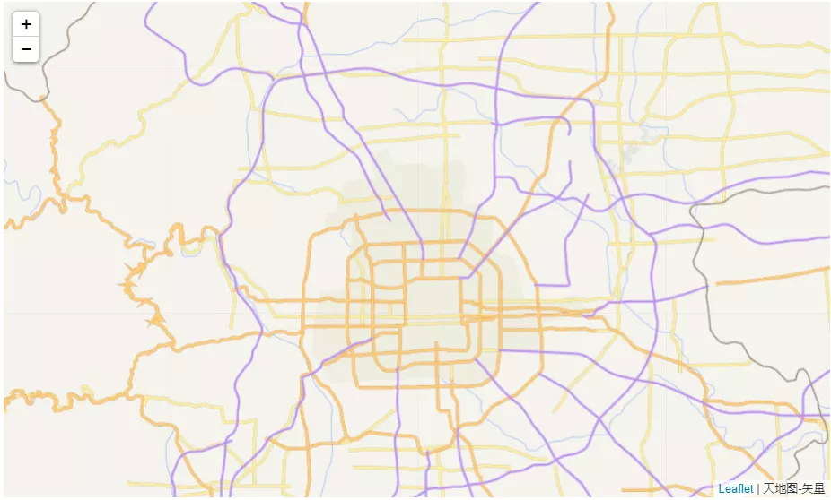

Python 可视化 地图可视化
<a name="zIxG3"></a>
## 1、准备工作
folium是python的一个专业绘制地图的第三方库，所以在使用之前需要先安装它。
```bash
pip install folium
```
在安装完成之后，可以在jupyterlab进行演示如下：
```python
import folium

m = folium.Map()
m
```
<br />默认<br />对于上面的输出，其实是一个可交互的地图，支持放大缩写拖拽等等。<br />如果想将输出存在本地，可以这样来：
```python
m.save('map.html')
```
可以看到本地就存了这个一个文件，浏览器打开就可以进行交互式操作了。<br /><br />map文件
<a name="tewpI"></a>
## 2、关于`folium.Map()`
在上一部分可以看到这个map直接就是一个地图，这里就介绍一下它常用的几个参数。
```python
folium.Map(
    location=None,
    width='100%',
    height='100%',
    left='0%',
    top='0%',
    position='relative',
    tiles='OpenStreetMap',
    attr=None,
    min_zoom=0,
    max_zoom=18,
    zoom_start=10,
    min_lat=-90,
    max_lat=90,
    min_lon=-180,
    max_lon=180,
    max_bounds=False,
    crs='EPSG3857',
    control_scale=False,
    prefer_canvas=False,
    no_touch=False,
    disable_3d=False,
    png_enabled=False,
    zoom_control=True,
    **kwargs,
)
```
没有参数的`folium.Map()`将得到一张世界地图。

- `location`：地图中心，[40.002694, 116.322373]是清华大学校区；
- `zoom_start`：比例尺，默认为10级，大约是一个城市的范围；

其他常用参数包括：

- `width`和`height`：地图的长宽，如果是int则表示像素值，如果是str则表示百分比；
- `max_zoom`：地图可以手动调节的最大比例，默认为18级；
- `control_scale`：是否在地图上添加比例尺，默认为False；
- `no_touch`：是否禁止手动操作，默认为False；
- `tiles`：地图样式，默认为OpenStreetMap
- `attr`：如果设置非内建地图样式，则需要传入这个值，可以理解为你选择的地图样式名称

以上是常用的一些参数，而最常用的莫过于 `location`、`zoom_start`和`tiles`等。<br />内建地图样式还有一下几种：<br />- "OpenStreetMap"<br />- "Mapbox Bright" (Limited levels of zoom for free tiles)<br />- "Mapbox Control Room" (Limited levels of zoom for free tiles)<br />- "Stamen" (Terrain, Toner, and Watercolor)<br />- "Cloudmade" (Must pass API key)<br />- "Mapbox" (Must pass API key)<br />- "CartoDB" (positron and dark_matter)<br />简单试下`location`和`zoo_start`参数：
```python
import folium

m = folium.Map([40.002694, 116.322373],
               zoom_start=15,
               control_scale=True
              )
m
```
可以看到清华大学校区<br /><br />清华大学校区<br />以上对Map的参数进行了简单的介绍，接下来，就来看看地图底图样式的选取情况吧~
<a name="LSuMc"></a>
## 3、内建地图底图样式
可以看到folium其实有好几种内建地图底图样式，其中部分需要去申请key，这里没有申请成功就不做演示了。

- "OpenStreetMap"
- "Mapbox Bright" (Limited levels of zoom for free tiles)
- "Mapbox Control Room" (Limited levels of zoom for free tiles)
- "Stamen" (Terrain, Toner, and Watercolor)
- "Cloudmade" (Must pass API key)
- "Mapbox" (Must pass API key)
- "CartoDB" (positron and dark_matter)
<a name="fdpfT"></a>
### 地势地形底图
```python
m = folium.Map([40.002694, 116.322373],
               tiles='Stamen Terrain',
               zoom_start=15,
               control_scale=True
              )
m
```

<a name="RruKc"></a>
### 黑白无标记底图
```python
m = folium.Map([40.002694, 116.322373],
               tiles='Stamen Toner',
               zoom_start=15,
               control_scale=True
              )
m
```

<a name="nGNds"></a>
### 水墨画底图
```python
m = folium.Map([40.002694, 116.322373],
               tiles='Stamen Watercolor',
               zoom_start=15,
               control_scale=True
              )
m
```
<br />以上就是内建地图底图样式的一些展示，部分需要key的大家可以去这个网站申请：[http://openwhatevermap.xyz/](http://openwhatevermap.xyz/)<br />另外，在这里也可以找到一些地图底图：[http://leaflet-extras.github.io/leaflet-providers/preview/](http://leaflet-extras.github.io/leaflet-providers/preview/)<br />国内用的较多的地图是高德、百度和腾讯地图等，接下来试用一下！
<a name="GcsSq"></a>
## 4、多种第三方地图底图样式
这里演示高德地图、智图GeoQ和腾讯地图等
<a name="AMRST"></a>
### 4.1. 高德地图
高德地图的 中英文地图、卫星影像图、街道图与常规图
<a name="JNQez"></a>
#### 中英文地图
```python
folium.Map([40.002694, 116.322373],
           tiles='https://webrd02.is.autonavi.com/appmaptile?lang=zh_en&size=1&scale=1&style=8&x={x}&y={y}&z={z}',
           attr='高德-中英文对照',
           zoom_start=15,
          )
```

<a name="q4LPL"></a>
#### 纯英文地图
```python
folium.Map([40.002694, 116.322373],
           tiles='https://webrd02.is.autonavi.com/appmaptile?lang=en&size=1&scale=1&style=8&x={x}&y={y}&z={z}',
           attr='高德-纯英文对照',
           zoom_start=15,
          )
```

<a name="XzAYd"></a>
#### 卫星影像图
```python
tiles = 'https://webst02.is.autonavi.com/appmaptile?style=6&x={x}&y={y}&z={z}'
folium.Map([40.002694, 116.322373],
           tiles= tiles,
           attr='高德-卫星影像图',
           zoom_start=15,
          )
```

<a name="SVfhU"></a>
#### 街道图
```python
folium.Map([40.002694, 116.322373],
           tiles= 'https://wprd01.is.autonavi.com/appmaptile?x={x}&y={y}&z={z}&lang=zh_cn&size=1&scl=1&style=8&ltype=11',
           attr='高德-街道路网图',
           zoom_start=10,
          )
```

<a name="yvfj8"></a>
#### 常规图
```python
folium.Map([40.002694, 116.322373],
           tiles= 'https://wprd01.is.autonavi.com/appmaptile?x={x}&y={y}&z={z}&lang=zh_cn&size=1&scl=1&style=7',
           attr='高德-常规图',
           zoom_start=15,
          )
```

<a name="yXSQt"></a>
### 4.2. 智图GeoQ
这个蛮好的，用起来简单，多种风格地图，即拿即用
<a name="lSXmq"></a>
#### 彩色版
```python
m = folium.Map([40.002694, 116.322373],
               tiles='http://map.geoq.cn/ArcGIS/rest/services/ChinaOnlineCommunity/MapServer/tile/{z}/{y}/{x}',
               attr='彩色版',
               zoom_start=15,
              )
m
```

<a name="sxdms"></a>
#### 暖色版
```python
m = folium.Map([40.002694, 116.322373],
               tiles='http://map.geoq.cn/ArcGIS/rest/services/ChinaOnlineStreetWarm/MapServer/tile/{z}/{y}/{x}',
               attr='暖色版',
               zoom_start=15,
              )
m
```

<a name="H26ZB"></a>
#### 灰色版
```python
m = folium.Map([40.002694, 116.322373],
               tiles='http://map.geoq.cn/ArcGIS/rest/services/ChinaOnlineStreetGray/MapServer/tile/{z}/{y}/{x}',
               attr='灰色版',
               zoom_start=15,
              )
m
```

<a name="PLoXq"></a>
#### 蓝黑版
```python
m = folium.Map([40.002694, 116.322373],
               tiles='http://map.geoq.cn/ArcGIS/rest/services/ChinaOnlineStreetPurplishBlue/MapServer/tile/{z}/{y}/{x}',
               attr='蓝黑版',
               zoom_start=15,
              )
m
```

<a name="gOLXs"></a>
#### 英文版
```python
m = folium.Map([40.002694, 116.322373],
               tiles='http://map.geoq.cn/ArcGIS/rest/services/ChinaOnlineCommunityENG/MapServer/tile/{z}/{y}/{x}',
               attr='英文版',
               zoom_start=15,
              )
m
```

<a name="jmdXE"></a>
#### 中国行政区划边界
```python
m = folium.Map([40.002694, 116.322373],
               tiles='http://thematic.geoq.cn/arcgis/rest/services/ThematicMaps/administrative_division_boundaryandlabel/MapServer/tile/{z}/{y}/{x}',
               attr='中国行政区划边界',
              )
m
```

<a name="dbFYm"></a>
#### 水系专题
```python
m = folium.Map([40.002694, 116.322373],
               tiles='http://thematic.geoq.cn/arcgis/rest/services/ThematicMaps/WorldHydroMap/MapServer/tile/{z}/{y}/{x}',
               attr='水系专题',
              )
m
```

<a name="lPYrT"></a>
#### 街道网图
```python
m = folium.Map([40.002694, 116.322373],
               tiles='http://thematic.geoq.cn/arcgis/rest/services/StreetThematicMaps/Gray_OnlySymbol/MapServer/tile/{z}/{y}/{x}',
               attr='街道网图',
              )
m
```

<a name="xAq2v"></a>
#### 暖色街道网图
```python
m = folium.Map([40.002694, 116.322373],
               tiles='http://thematic.geoq.cn/arcgis/rest/services/StreetThematicMaps/Warm_OnlySymbol/MapServer/tile/{z}/{y}/{x}',
               attr='暖色-街道网图',
              )
m
```

<a name="sHw0k"></a>
### 4.3. 腾讯地图
```python
tiles =  'https://rt0.map.gtimg.com/tile?z={z}&x={x}&y={-y}'
folium.Map([39.904989, 116.405285],
           tiles= tiles,
           attr='腾讯地图'          
          )
```

<a name="gLXO8"></a>
### 4.4. 天地图
[https://www.tianditu.gov.cn/](https://www.tianditu.gov.cn/)<br />需要注册一个key
<a name="ddy6z"></a>
#### 天地图影像
```python
m = folium.Map([40.002694, 116.322373],
               tiles='http://t7.tianditu.gov.cn/img_w/wmts?SERVICE=WMTS&REQUEST=GetTile&VERSION=1.0.0&LAYER=img&STYLE=default&TILEMATRIXSET=w&FORMAT=tiles&TILEMATRIX={z}&TILEROW={y}&TILECOL={x}&tk=',
               attr='天地图-影像'
              )
m
```

<a name="WPHeS"></a>
#### 天地图影像注记
```python
m = folium.Map([40.002694, 116.322373],
               tiles='http://t7.tianditu.gov.cn/cia_w/wmts?SERVICE=WMTS&REQUEST=GetTile&VERSION=1.0.0&LAYER=cia&STYLE=default&TILEMATRIXSET=w&FORMAT=tiles&TILEMATRIX={z}&TILEROW={y}&TILECOL={x}&tk=',
               attr='天地图-影像标注'
              )
m
```

<a name="WPMKk"></a>
#### 天地图矢量
```python
m = folium.Map([40.002694, 116.322373],
               tiles='http://t7.tianditu.gov.cn/vec_w/wmts?SERVICE=WMTS&REQUEST=GetTile&VERSION=1.0.0&LAYER=vec&STYLE=default&TILEMATRIXSET=w&FORMAT=tiles&TILEMATRIX={z}&TILEROW={y}&TILECOL={x}&tk=',
               attr='天地图-矢量',
               zoom_start=10,
              )
m
```

<a name="vCcLN"></a>
#### 天地图矢量注记
```python
m = folium.Map([40.002694, 116.322373],
               tiles='http://t7.tianditu.gov.cn/cva_w/wmts?SERVICE=WMTS&REQUEST=GetTile&VERSION=1.0.0&LAYER=cva&STYLE=default&TILEMATRIXSET=w&FORMAT=tiles&TILEMATRIX={z}&TILEROW={y}&TILECOL={x}&tk=',
               attr='天地图-矢量注记'
              )
m
```

<a name="hZEzz"></a>
#### 天地图地形
```python
m = folium.Map([40.002694, 116.322373],
               tiles='http://t7.tianditu.gov.cn/ter_w/wmts?SERVICE=WMTS&REQUEST=GetTile&VERSION=1.0.0&LAYER=ter&STYLE=default&TILEMATRIXSET=w&FORMAT=tiles&TILEMATRIX={z}&TILEROW={y}&TILECOL={x}&tk=',
               attr='天地图-地形',
               zoom_start=3,
              )
m
```

<a name="DkDFP"></a>
#### 天地图地形注记
```python
m = folium.Map([40.002694, 116.322373],
               tiles='http://t7.tianditu.gov.cn/cta_w/wmts?SERVICE=WMTS&REQUEST=GetTile&VERSION=1.0.0&LAYER=cta&STYLE=default&TILEMATRIXSET=w&FORMAT=tiles&TILEMATRIX={z}&TILEROW={y}&TILECOL={x}&tk=',
               attr='天地图-地形标记',
               zoom_start=3,
              )
m
```
<br />百度地图这边测试失败了，暂时没有找到合适的替换方案。
<a name="yXOya"></a>
## 5、补充
其实，还可以找更多的地图底图瓦片URL来进行替换，多样化地图绘制。<br />另外在用经纬度坐标点进行地图绘制的时候，比如标记点、绘制区域、热力图绘制等等，需要考虑经纬度坐标是哪个地图系下面的，然后再用对应地图系的相关底图进行绘制才准确！
