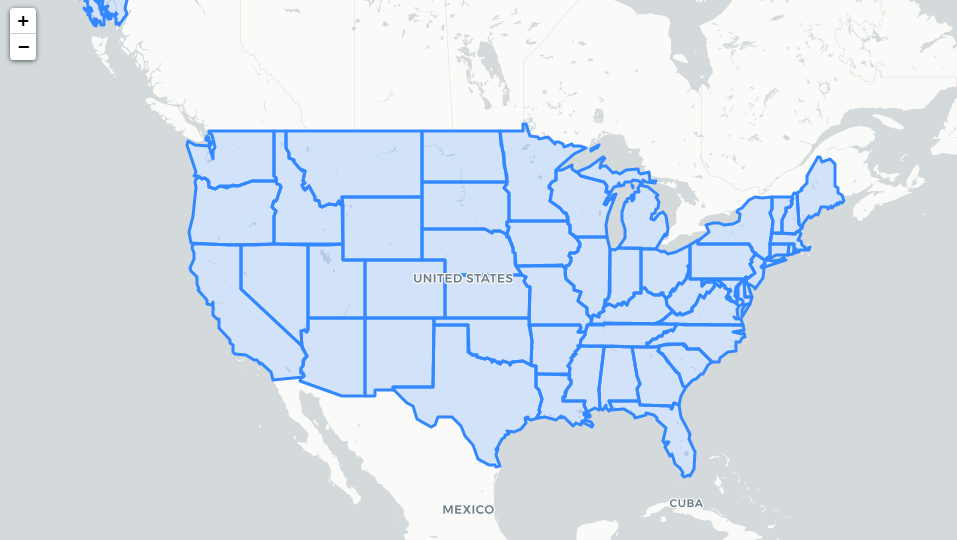
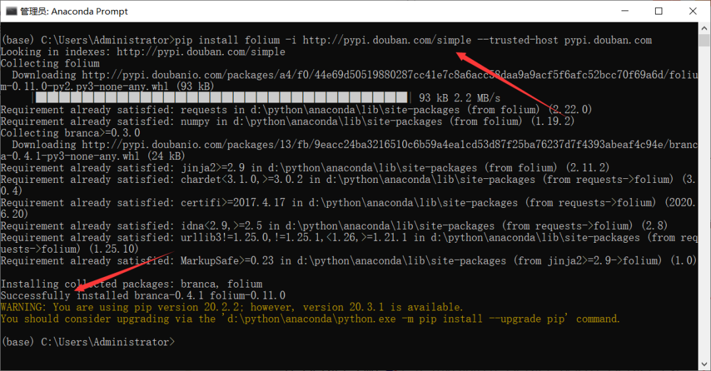
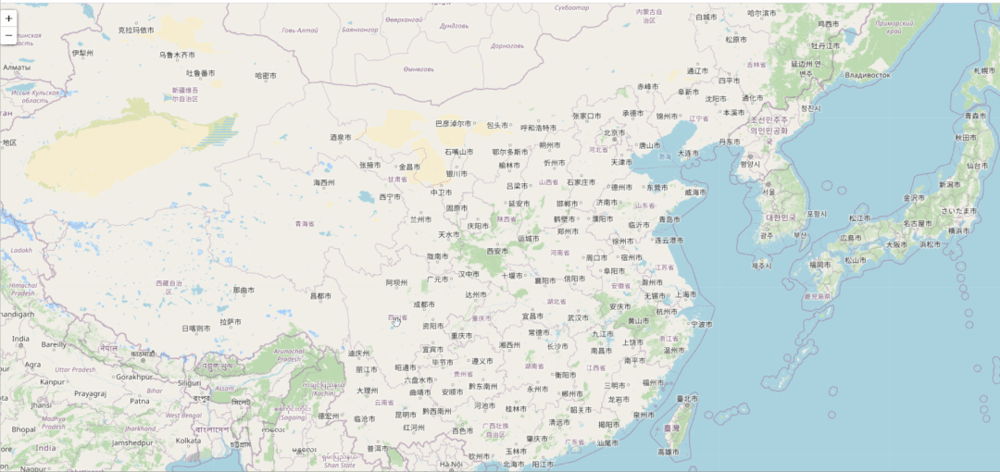
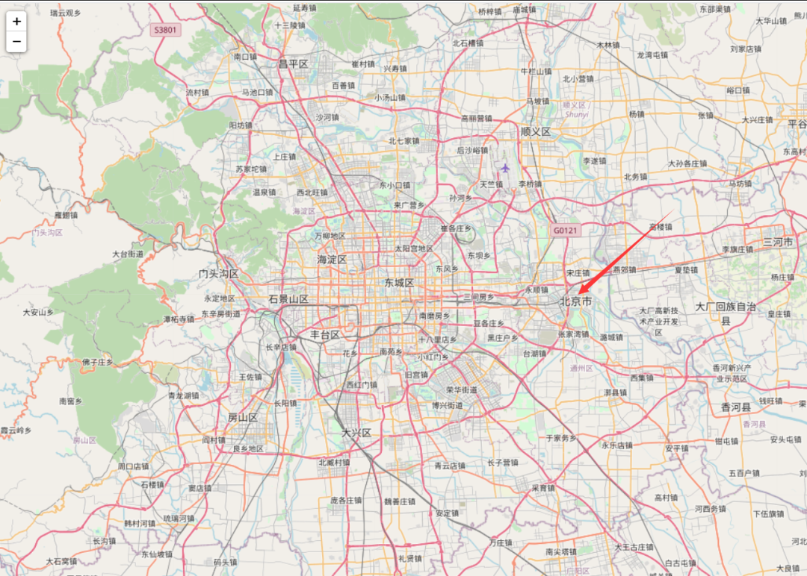
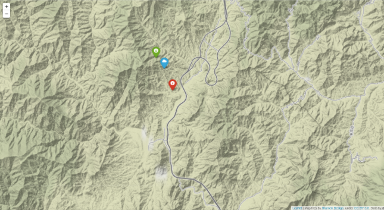
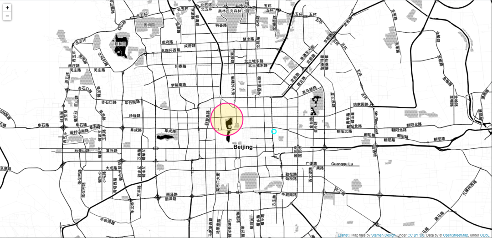
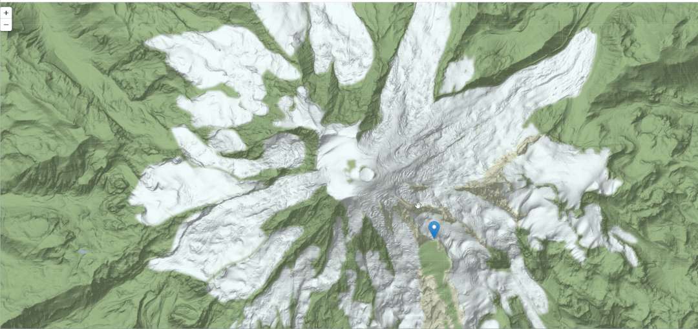
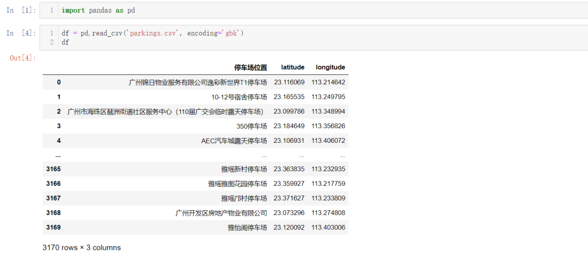
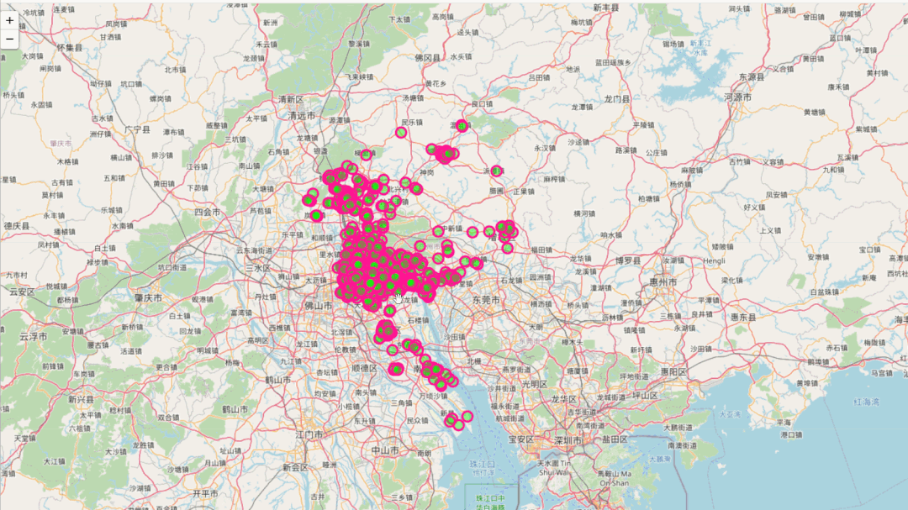
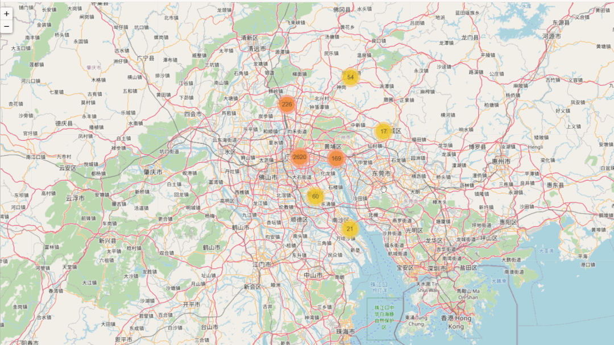

Python
<a name="tHYfh"></a>
## 一、folium简介和安装
folium 建立在 Python 生态系统的数据应用能力和 Leaflet.js 库的映射能力之上，在Python中操作数据，然后通过 folium 在 Leaflet 地图中可视化。<br />folium **<br />
<a name="kGfSS"></a>
### 1、folium的简介

- Folium是建立在 Python 生态系统的数据整理 Datawrangling 能力和 Leaflet.js 库的映射能力之上的开源库。用 Python 处理数据，然后用 Folium 将它在 Leaflet 地图上进行可视化。Folium能够将通过 Python 处理后的数据轻松地在**交互式**的 Leaflet 地图上进行可视化展示。它不单单可以在地图上展示数据的分布图，还可以使用 Vincent/Vega 在地图上加以标记。
- 这个开源库中有许多来自 OpenStreetMap、MapQuest Open、MapQuestOpen Aerial、Mapbox和Stamen 的内建地图元件，而且支持使用 Mapbox 或 Cloudmade 的 API 密钥来定制个性化的地图元件。Folium支持 GeoJSON 和 TopoJSON 两种文件格式的叠加，也可以将数据连接到这两种文件格式的叠加层，最后可使用 color-brewer 配色方案创建分布图。
- Folium可以让你用 Python 强大生态系统来处理数据，然后用 Leaflet 地图来展示。Folium内置一些来自 OpenStreetMap、MapQuest Open、MapQuest Open Aerial、Mapbox和Stamen 的地图元件(tilesets)，并且支持用 Mapbox 或者 Cloudmade API keys 来自定义地图元件。Folium支持 GeoJSON 和 TopJSON 叠加(overlays)，绑定数据来创造一个分级统计图(Choropleth map)。但是，Folium库绘制热点图的时候，需要联网才可显示。
<a name="ewIJN"></a>
### 2、安装folium
```bash
pip install folium -i http://pypi.douban.com/simple --trusted-host pypi.douban.com
```
👆这里直接使用了国内豆瓣源<br />
<a name="cJkDG"></a>
## 二、基本使用
folium 显示地图的类为 folium.Map，类的声明如下：
```python
class folium.Map(location=None, width='100%', height='100%', left='0%', top='0%', position='relative', tiles='OpenStreetMap', attr=None, min_zoom=0, max_zoom=18, zoom_start=10, min_lat=-90, max_lat=90, min_lon=-180, max_lon=180, max_bounds=False, crs='EPSG3857', control_scale=False, prefer_canvas=False, no_touch=False, disable_3d=False, png_enabled=False, zoom_control=True, **kwargs)
```
几个重要的参数：

- location：经纬度，list 或者 tuple 格式，顺序为 latitude, longitude
- zoom_start：缩放值，默认为 10，值越大比例尺越小，地图放大级别越大
- control_scale：Bool型，控制是否在地图上添加比例尺，默认为 False 即不添加
- tiles：显示样式，默认 "OpenStreetMap"，也就是开启街道显示
- crs：地理坐标参考系统，默认为 "EPSG3857"
<a name="gpMM3"></a>
### 1、各级别地图
<a name="itqq0"></a>
#### 世界地图
```python
import folium

print(folium.__version__)

# define the world map
world_map = folium.Map()
# save world map
world_map.save('test_01.html')
```
结果如下：<br />当前folium版本：0.11.0


<a name="pYZSX"></a>
#### 国家地图
```python
import folium
# define the national map
national_map = folium.Map(location=[35.3, 100.6], zoom_start=4)
# save national map
national_map.save('test_02.html')
```
结果如下：<br />
<a name="mkTwK"></a>
#### 市级地图
其实改变地图显示也就是改变显示的经纬度和缩放比例，省级、市级、县级用法相似，这里举一个市级的例子为例，如北京市：
```python
import folium
# define the national map
city_map = folium.Map(location=[39.93, 116.40], zoom_start=10)
# save national map
city_map.save('test_03.html')
```

<a name="jsUi9"></a>
### 2、在地图上标记
<a name="s3Jek"></a>
#### 普通标记
添加普通标记用 Marker，可以选择标记的图案。
```python
import folium

bj_map = folium.Map(location=[39.93, 115.40], zoom_start=12, tiles='Stamen Terrain')

folium.Marker(
    location=[39.95, 115.33],
    popup='Mt. Hood Meadows',
    icon=folium.Icon(icon='cloud')
).add_to(bj_map)

folium.Marker(
    location=[39.96, 115.32],
    popup='Timberline Lodge',
    icon=folium.Icon(color='green')
).add_to(bj_map)

folium.Marker(
    location=[39.93, 115.34],
    popup='Some Other Location',
    icon=folium.Icon(color='red', icon='info-sign')    # 标记颜色  图标
).add_to(bj_map)

bj_map.save('test_04.html')
```
结果如下：<br />
<a name="C064V"></a>
#### 圆形标记
添加圆形标记用 Circle 以及 CircleMarker
```python
import folium

bj_map = folium.Map(location=[39.93, 116.40], zoom_start=12, tiles='Stamen Toner')

folium.Circle(
    radius=200,
    location=(39.92, 116.43),
    popup='The Waterfront',
    color='#00FFFF',   # 颜色
    fill=False,        # 填充
).add_to(bj_map)

folium.CircleMarker(
    location=(39.93, 116.38),
    radius=50,   # 圆的半径
    popup='Laurelhurst Park',
    color='#FF1493',
    fill=True,
    fill_color='#FFD700'
).add_to(bj_map)

bj_map.save('test_05.html')
```
结果如下：<br />
<a name="RTjQq"></a>
#### 动态放置标记
```python
import folium

dynamic_tagging = folium.Map(
    location=[46.8527, -121.7649],
    tiles='Stamen Terrain',
    zoom_start=13
)

folium.Marker(
    [46.8354, -121.7325],
    popup='Camp Muir'
).add_to(dynamic_tagging)

dynamic_tagging.add_child(folium.ClickForMarker(popup='Waypoint'))
dynamic_tagging.save('test_06.html')
```
结果如下：<br /><br />更多详细使用可以参考官方文档：[http://python-visualization.github.io/folium/quickstart.html](http://python-visualization.github.io/folium/quickstart.html)
<a name="rL1Sk"></a>
## 三、实战案例
以将停车场地理位置数据可视化在地图上示例，熟悉 folium 地图可视化的使用。
<a name="g6RPB"></a>
### 1、获取经纬度数据
停车场地理位置数据来源于网络，数据真实可靠，下面先利用 Python 爬虫获取数据
```python
#数据来源：http://219.136.133.163:8000/Pages/Commonpage/login.aspx

import requests
import csv
import json
import logging

headers = {
    'X-Requested-With': 'XMLHttpRequest',
    'User-Agent': 'Mozilla/5.0 (Windows NT 10.0; WOW64) AppleWebKit/537.36 (KHTML, like Gecko) Chrome/65.0.3325.181 Safari/537.36'
}
logging.basicConfig(level=logging.INFO, format='%(asctime)s - %(levelname)s: %(message)s')
url = 'http://219.136.133.163:8000/Pages/Commonpage/AsyGetData.asmx/GetParkList'
s = requests.session()
s.get(url, headers=headers)
for i in range(1, 318):
    data = {
        'cp': str(i),
        'ps': '10',
        'kw': '',
        'lon': 'undefined',
        'lat': 'undefined',
        'type': 'undefined'
    }
    url = 'http://219.136.133.163:8000/Pages/Commonpage/AsyGetData.asmx/GetParkList'
    # post提交表单数据
    res = s.post(url, data=data, headers=headers)
    # 重新设置编码
    res.encoding = 'utf-8'
    # str转json  便于提取数据
    result = json.loads(res.text)['Result']
    for j in result:
        park_name = j['ParkName']
        Lon = j['Longitude']
        Lat = j['Latitude']
        with open('parkings.csv', 'a+', newline='', encoding='gb18030') as f:
            f_csv = csv.writer(f)
            f_csv.writerow([park_name, Lon, Lat])
            logging.info([park_name, Lon, Lat])
```
结果如下：<br /><br /><br />共有 3170 个停车场地理位置数据
<a name="SsDO9"></a>
### 2、folium地图可视化
```python
import pandas as pd
import folium

# 读取csv数据
data = pd.read_csv('parkings.csv', encoding='gbk')
# 传入纬度和经度数据
park_map = folium.Map(location=[data['latitude'].mean(), data['longitude'].mean()], zoom_start=10, control_scale=True,)
# 实例化 folium.map.FeatureGroup 对象
incidents = folium.map.FeatureGroup()
for name,row in data.iterrows():
    incidents.add_child(
        folium.CircleMarker(            # CircleMarker表示花圆
            (row["latitude"], row["longitude"]),   # 每个停车场的经纬度坐标
            radius=7,                   # 圆圈半径
            color='#FF1493',            # 标志的外圈颜色
            fill=True,                  # 是否填充
            fill_color='#00FF00',       # 填充颜色
            fill_opacity=0.4            # 填充透明度
        )
    )

park_map.add_child(incidents)
park_map.save('park_map1.html')
```
效果如下：<br /><br />这样看起来有点乱，下面来统计一下各个局域的停车场数量
```python
import pandas as pd
import folium
from folium import plugins

data = pd.read_csv('parkings.csv', encoding='gbk')
park_map = folium.Map(location=[data['latitude'].mean(), data['longitude'].mean()], zoom_start=10, control_scale=True,)
marker_cluster = plugins.MarkerCluster().add_to(park_map)

for name,row in data.iterrows():
    folium.Marker(location=[row["latitude"], row["longitude"]]).add_to(marker_cluster)
park_map.save('park_map2.html')
```
效果如下：<br /><br />这样能对各个局域停车场的数量在地图上进行统计，将图不断放大以后，还可以显示每个停车场的具体位置，非常方便。
<a name="qgK9k"></a>
## 参考资料
[http://python-visualization.github.io/folium/quickstart.html](http://python-visualization.github.io/folium/quickstart.html)
