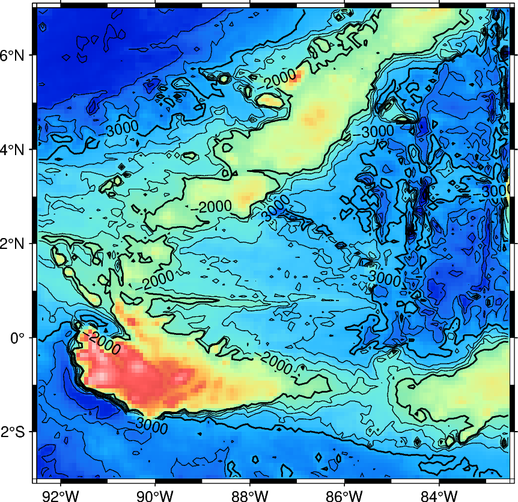
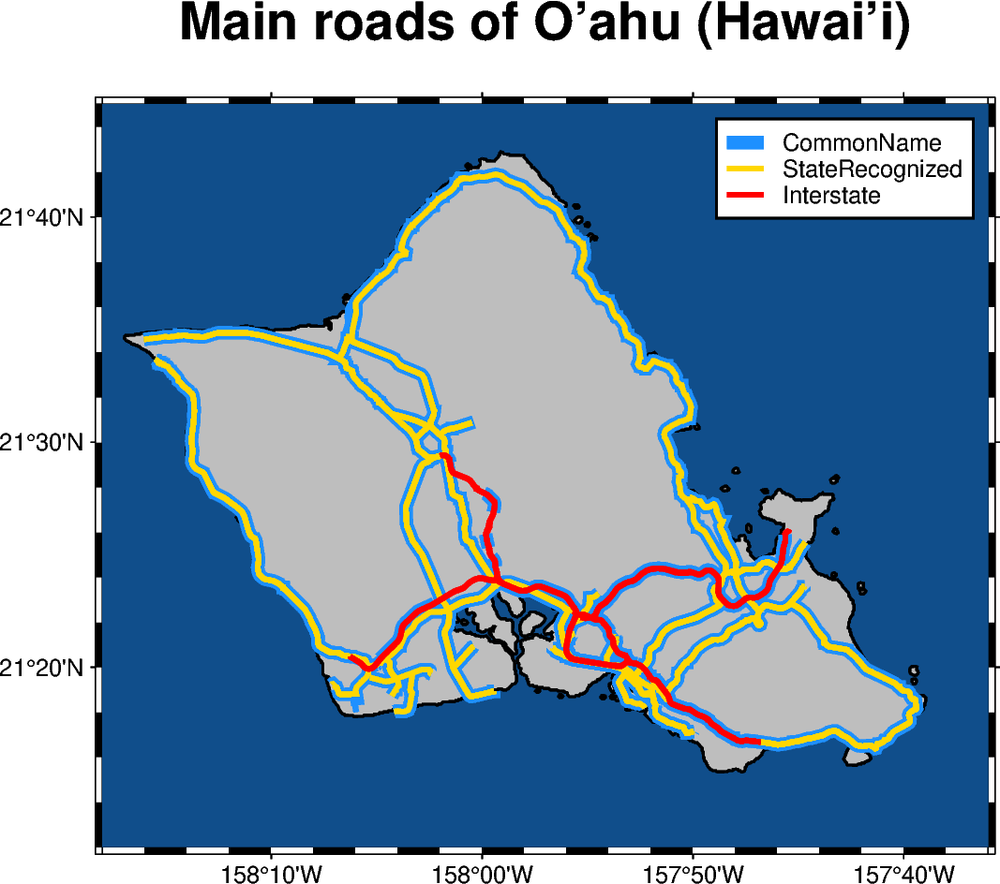
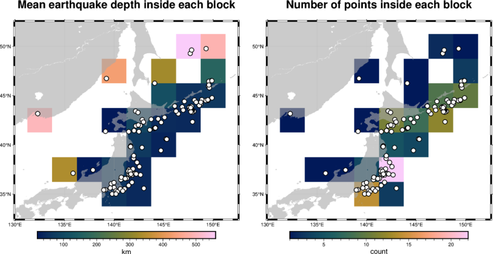

Python 可视化 地图<br />pygmt是基于具有强大绘图功能的GMT软件，且使用pygmt前必须安装GMT(Generic Mapping Tools)软件。GMT具体安装步骤可参考：[GMT中文手册](https://docs.gmt-china.org/latest/)。需要注意的是，现阶段pygmt还不能完全支持GMT所能绘制的全部图表类型，后续更新会持续完善。本期推文主要是对Python-pygmt的一个介绍，主要内容如下：

- Python-pygmt安装
- Python-pygmt 示例绘制
<a name="AqilJ"></a>
## Python-pygmt安装
之所以这里专门介绍pygmt库安装，是因为该库最好使用Anaconda进行安装，且需单独的进行pygmt运行环境的搭建。pygmt官网推荐安装脚本语句如下(默认GMT已安装)：
```bash
conda create --name pygmt --channel conda-forge pygmt
```
在使用如下语句激活刚构建的pygmt虚拟环境：
```bash
conda activate pygmt
```
「注意」：这里小编建议在使用Python进行空间图表绘制时，最好是单独构建虚拟环境，避免依赖库版本冲突问题。
<a name="kcRvc"></a>
## Python-pygmt 示例绘制
这一个部分主要介绍pygmt现阶段所能绘制的主要图表类型，主要内容如下：
<a name="NZcF0"></a>
### Shorelines(海岸线)
```python
fig = pygmt.Figure()
fig.basemap(region="g", projection="W15c", frame=True)
fig.coast(shorelines=True)
fig.show()
```
")
<a name="CzzUl"></a>
### data points(气泡图)
```python
fig = pygmt.Figure()
fig.basemap(region=region, projection="M15c", frame=True)
fig.coast(land="black", water="skyblue")
pygmt.makecpt(cmap="viridis", series=[data.depth_km.min(), data.depth_km.max()])
fig.plot(
    x=data.longitude,
    y=data.latitude,
    size=0.02 * 2**data.magnitude,
    color=data.depth_km,
    cmap=True,
    style="cc",
    pen="black",
)
fig.colorbar(frame='af+l"Depth (km)"')
fig.show()
```
")
<a name="AD83p"></a>
### map with contour lines
```python
fig = pygmt.Figure()
fig.grdimage(
    grid=grid,
    cmap="haxby",
    projection="M10c",
    frame=True,
)
fig.grdcontour(
    annotation=1000,
    interval=250,
    grid=grid,
    limit=[-4000, -2000],
)
fig.show()
```

<a name="sNT41"></a>
### Roads
```python
import geopandas as gpd
import pygmt

# Read shapefile data using geopandas
gdf = gpd.read_file(
	"http://www2.census.gov/geo/tiger/TIGER2015/PRISECROADS/tl_2015_15_prisecroads.zip"
)
# The dataset contains different road types listed in the RTTYP column,
# here we select the following ones to plot:
roads_common = gdf[gdf.RTTYP == "M"]  # Common name roads
roads_state = gdf[gdf.RTTYP == "S"]  # State recognized roads
roads_interstate = gdf[gdf.RTTYP == "I"]  # Interstate roads

fig = pygmt.Figure()

# Define target region around O'ahu (Hawai'i)
region = [-158.3, -157.6, 21.2, 21.75]  # xmin, xmax, ymin, ymax

title = r"Main roads of O\047ahu (Hawai\047i)"  # \047 is octal code for '
fig.basemap(region=region, projection="M12c", frame=["af", f'WSne+t"{title}"'])
fig.coast(land="gray", water="dodgerblue4", shorelines="1p,black")

# Plot the individual road types with different pen settings and assign labels
# which are displayed in the legend
fig.plot(data=roads_common, pen="5p,dodgerblue", label="CommonName")
fig.plot(data=roads_state, pen="2p,gold", label="StateRecognized")
fig.plot(data=roads_interstate, pen="2p,red", label="Interstate")

# Add legend
fig.legend()

fig.show()
```

<a name="CHhY0"></a>
### Blockmean
```python
import pygmt

# Load sample data
data = pygmt.datasets.load_sample_data(name="japan_quakes")
# Select only needed columns
data = data[["longitude", "latitude", "depth_km"]]

# Set the region for the plot
region = [130, 152.5, 32.5, 52.5]
# Define spacing in x and y direction (150 by 150 minute blocks)
spacing = "150m"

fig = pygmt.Figure()

# Calculate mean depth in km from all events within 150x150 minute
# bins using blockmean
df = pygmt.blockmean(data=data, region=region, spacing=spacing)
# convert to grid
grd = pygmt.xyz2grd(data=df, region=region, spacing=spacing)

fig.grdimage(
    grid=grd,
    region=region,
    frame=["af", '+t"Mean earthquake depth inside each block"'],
    cmap="batlow",
)
# plot slightly transparent landmasses on top
fig.coast(land="darkgray", transparency=40)
# plot original data points
fig.plot(
    x=data.longitude, y=data.latitude, style="c0.3c", color="white", pen="1p,black"
)
fig.colorbar(frame=["x+lkm"])

fig.shift_origin(xshift="w+5c")

# Calculate number of total locations within 150x150 minute bins via
# blockmean's summary parameter
df = pygmt.blockmean(data=data, region=region, spacing=spacing, summary="n")
grd = pygmt.xyz2grd(data=df, region=region, spacing=spacing)

fig.grdimage(
    grid=grd,
    region=region,
    frame=["af", '+t"Number of points inside each block"'],
    cmap="batlow",
)
fig.coast(land="darkgray", transparency=40)
fig.plot(
    x=data.longitude, y=data.latitude, style="c0.3c", color="white", pen="1p,black"
)
fig.colorbar(frame=["x+lcount"])

fig.show()
```
<br />以上就是小编简单介绍的关于Python-pygmt库常用科研地图绘制类型，更多其他图表类型，大家可参考：[Python-pygmt官网例子](https://www.pygmt.org/latest/gallery/index.html)。
<a name="ENnfc"></a>
## 参考资料
GMT中文手册: [https://docs.gmt-china.org/latest/](https://docs.gmt-china.org/latest/)<br />Python-pygmt官网例子: [https://www.pygmt.org/latest/gallery/index.html](https://www.pygmt.org/latest/gallery/index.html)
