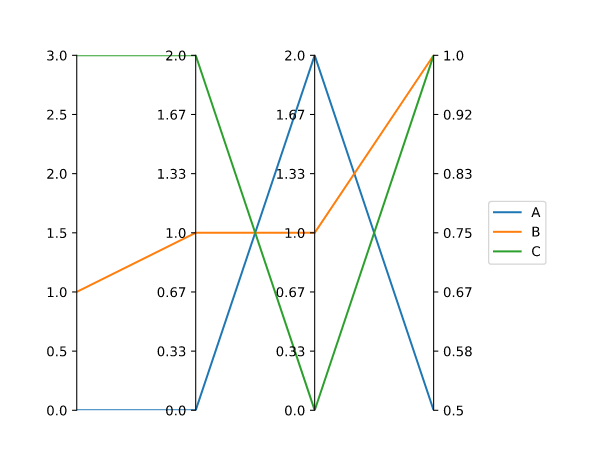

Python<br />发现了一个绘制平行坐标图(Parallel Coordinate Plot) 超方便的绘制工具-Paxplot，接下来了解一下这个高效绘制工具。
<a name="Naegn"></a>
## Python-Paxplot简单介绍
<a name="q0QFD"></a>
### 安装方法
Python-Paxplot库可通过pip直接进行安装，如下：
```bash
pip install paxplot
```
<a name="bOxPq"></a>
### 使用方法

- 简单例子
```python
data = [
    [0.0, 0.0, 2.0, 0.5],
    [1.0, 1.0, 1.0, 1.0],
    [3.0, 2.0, 0.0, 1.0],
]
import paxplot
import matplotlib.pyplot as plt

paxfig = paxplot.pax_parallel(n_axes=4)
paxfig.plot(data)
plt.show()
```


- 添加文本
```python
paxfig = paxplot.pax_parallel(n_axes=4)
paxfig.plot(data)
paxfig.set_labels(['A', 'B', 'C', 'D'])
plt.show()
```


- 更改刻度数字
```python
data = [
    [0.0, 0.0, 2.0, 0.5],
    [1.0, 1.0, 1.0, 1.0],
    [3.0, 2.0, 0.0, 1.0],
]
paxfig = paxplot.pax_parallel(n_axes=4)
paxfig.plot(data)
paxfig.set_even_ticks(
    ax_idx=0,
    n_ticks=15,
)
paxfig.set_even_ticks(
    ax_idx=1,
    n_ticks=16,
    precision=3
)
plt.show()
```


- 添加图例
```python
paxfig = paxplot.pax_parallel(n_axes=4)
paxfig.plot(data)
paxfig.add_legend(labels=['A', 'B', 'C'])
plt.show()
```


- 添加colorbar Paxplot库特点之一，可以添加colorbar,方便区分每条线的数值。
```python
paxfig = paxplot.pax_parallel(n_axes=4)
paxfig.plot(data)
paxfig.set_label(
    ax_idx=0,
    label='Column A'
)
paxfig.add_colorbar(
    ax_idx=0,
    cmap='viridis',
    colorbar_kwargs={'label': 'Column A'}
)
plt.show()
```


- 使用Pandas DataFrame对象数据绘制
```python
import pandas as pd
import matplotlib.pyplot as plt
import paxplot

# Import data
path_to_data = paxplot.datasets.tradeoff()
df = pd.read_csv(path_to_data)
cols = df.columns

# Create figure
paxfig = paxplot.pax_parallel(n_axes=len(cols))
paxfig.plot(df.to_numpy())

# Add labels
paxfig.set_labels(cols)

# Add colorbar
color_col = 0
paxfig.add_colorbar(
    ax_idx=color_col,
    cmap='viridis',
    colorbar_kwargs={'label': cols[color_col]}
)
plt.show()
```
<br />以上就是Paxplot库的简单介绍，这个库还在开发中，后期可能会有更加优秀的功能。更多详细内容可参考：[**Python-Paxplot库官网**](https://kravitsjacob.github.io/paxplot/index.html)
<a name="Y2xP1"></a>
## 参考资料
**Python-Paxplot库官网: **[**https://kravitsjacob.github.io/paxplot/index.html**](https://kravitsjacob.github.io/paxplot/index.html)
