图像处理 OpenCV<br />OpenCV 是一个强大的图片处理工具，尤其是随着人工智能、图片识别等行业的兴起，这个第三方库也越来越受到重视。<br />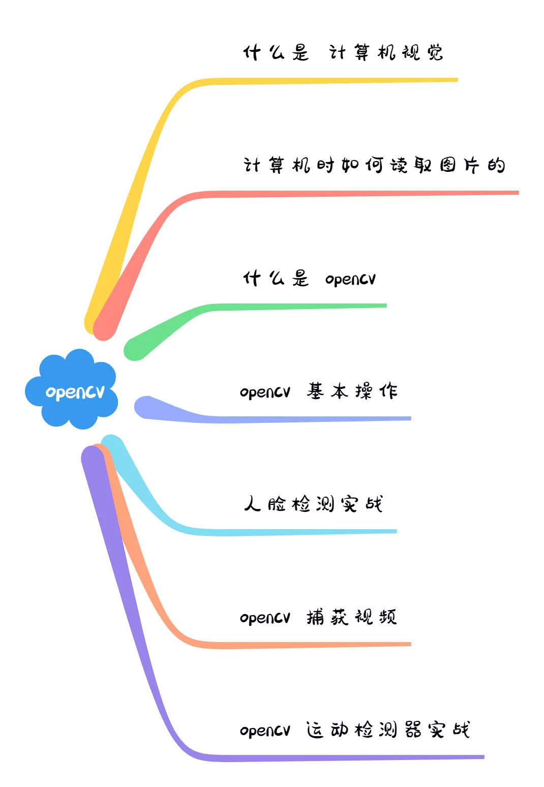
<a name="bwQq5"></a>
## 计算机视觉
先来看下到底什么是计算机视觉<br />其实这个是一个比较大的问题了，先来简化下问题，思考如下场景<br />相信很多朋友都会使用微博来晒出自己的旅游照片，当然照片中会包含自己和家人朋友等等。那么该怎么快速的识别出照片中不同的人并标注出来呢，这个时候就可以用到计算机视觉的知识了<br />计算机视觉是一个跨学科领域，涉及如何使计算机从数字图像或视频中获得高级别的理解，并使得计算机能够识别诸如人脸、灯柱甚至雕像之类的物体
<a name="fwjkO"></a>
## 计算机如何读取图像
比如说下面这张图片，计算机是怎么展示的呢<br />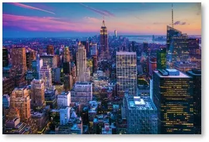<br />计算机会将任何图像读取为 0 到 255 之间的范围值<br />对于任何彩色图像，都有 3 个主要通道——红色、绿色和蓝色，它的工作原理非常简单：<br />为每种原色形成一个矩阵，然后这些矩阵组合起来为各个 R、G、B 颜色提供像素值，然后矩阵的每个元素提供与像素亮度强度有关的数据<br />文字有些抽象，来看下面这张图片<br />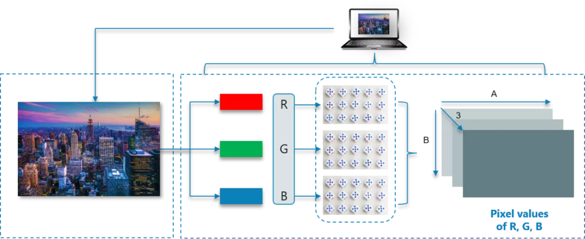<br />如图所示，此处图像的大小可以计算为 B x A x 3<br />注意：对于黑白图像，只有一个通道<br />了解了前置基础知识后，接下来让看看 OpenCV 到底是什么
<a name="wnIYu"></a>
### OpenCV 是什么
OpenCV 是一个 Python 库，用于解决计算机视觉问题。OpenCV 最初由 Intel 于 1999 年开发，后来得到 Willow Garage 的支持，从而发展的更加迅速<br />OpenCV 支持多种编程语言，如 C++、Python、Java 等，同时也支持多种平台，包括 Windows、Linux 和 MacOS<br />OpenCV Python 只不过是与 Python 一起使用的原始 C++ 库的包装类，所有 OpenCV 数组结构都会被转换为 NumPy 数组<br />这使得 OpenCV 更容易与其他使用 NumPy 的库集成，例如，SciPy 和 Matplotlib 等<br />接下来看看使用 OpenCV 执行的一些基本操作
<a name="s9FYh"></a>
### OpenCV 基本操作
<a name="dEEln"></a>
## 载入图像
```python
import cv2

# 彩色图片

img = cv2.imread (Penguins.jpg,1)


# 黑白图片

img_1 = cv2.imread (Penguins.jpg,0)
```
如上一段代码所示，首先需要导入 OpenCV 模块<br />然后可以使用 imread 模块读取图像，参数中的1表示是彩色图像。如果该参数为 0 而不是 1，则表示导入的图像是黑白图像
<a name="z6Mn2"></a>
## 图像形状/分别率
可以利用 shape 子函数来打印出图像的形状
```python
import cv2

img = cv2.imread (Penguins.jpg,0)

print(img.shape)
```
图像的形状是指 NumPy 数组的形状，从执行代码可以看出，矩阵由 768 行和 1024 列组成
<a name="M6XPF"></a>
## 展示图像
```python
import cv2

Img = cv2.imread(Penguins.jpg,0)

cv2.imshow(Penguins, Img)

cv2.waitKey(0)

# cv2.waitKey(2000)

cv2.destroyAllWindows()
```
首先使用 imread 导入图像<br />接下来使用 imshow 函数通过打开一个窗口来显示图像，imshow 函数有两个参数，分别是窗口的名称和要显示的图像对象<br />然后等待用户事件，waitKey 使窗口保持静态，直到用户按下某个键，传递的参数是以毫秒为单位的时间<br />最后，使用 destroyAllWindows 根据 waitForKey 参数关闭窗口
<a name="nr4eO"></a>
## 调整图像大小
调整图像大小也很容易
```python
import cv2

img = cv2.imread(Penguins.jpg,0)

resized_image = cv2.resize(img, (650,500))

cv2.imshow(Penguins, resized_image)

cv2.waitKey(0)

cv2.destroyAllWindows()
```
在这里，resize 函数用于将图像调整为所需的形状，这里的参数是新调整大小的图像的形状<br />图像对象从 img 变为 resized_image，因为现在图像对象发生了变化<br />还有另一种方法可以将参数传递给 resize 函数
```python
Resized_image = cv2.resize(img, int(img.shape[1]/2), int(img.shape[0]/2)))
```
这样，得到的新图像形状会是原始图像形状的一半<br />接下来让进入实战部分，使用 OpenCV 执行人脸检测
<a name="afhvA"></a>
### 人脸检测
人脸检测？乍一看似乎很复杂，但是通过 OpenCV 就非常容易了，只需要三步走即可！<br />第 1 步：首先拿到一个图像，然后创建一个级联分类器，它最终会给出人脸的特征<br />第 2 步：这一步涉及使用 OpenCV，它将读取图像和特征文件，主要就是操作 NumPy 数组<br />需要做的就是搜索人脸 NumPy ndarray 的行和列值，这是带有人脸矩形坐标的数组<br />第 3 步：使用矩形人脸框显示图像<br />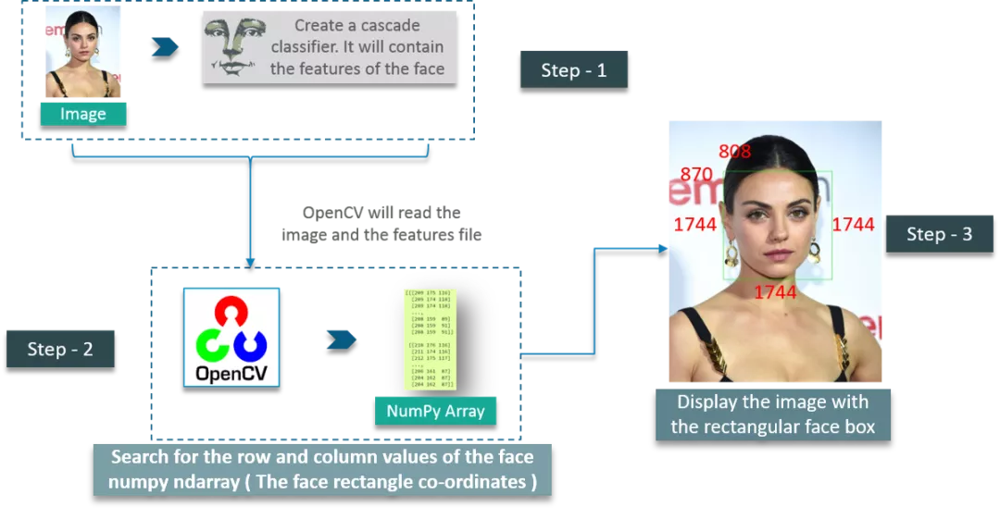<br />首先，创建一个 CascadeClassifier 对象来提取人脸的特征，参数就是包含面部特征的 XML 文件的路径<br />下一步是读取带有人脸的图像，并使用 COLOR_BGR2GREY 将其转换为黑白图像，接着，搜索图像的坐标，这是使用 detectMultiScale 来完成的<br />什么是坐标呢？就是面部矩形的坐标。scaleFactor 用于将形状值减少 5%，直到找到人脸。因此，总的来说 -- 值越小，准确性越高<br />最后展示图像
<a name="eUzfc"></a>
## 添加人脸框
一个比较简单的逻辑处理<br />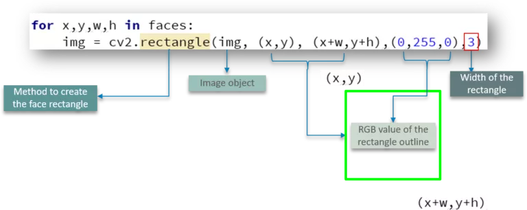<br />定义了使用 `cv2.rectangle` 通过传递图像对象、框轮廓的 RGB 值和矩形的宽度等参数来创建矩形的方法。<br />看看人脸检测的完整代码：
```python
import cv2

# Create a CascadeClassifier Object
face_cascade = cv2.CascadeClassifier("haarcascade_frontalface_default.xml")

# Reading the image as it is
img = cv2.imread("photo.jpg")

# Reading the image as gray scale image
gray_img = cv2.cvtColor(img,cv2.COLOR_BGR2GRAY)

# Search the co-ordintes of the image
faces = face_cascade.detectMultiScale(gray_img, scaleFactor = 1.05,minNeighbors=5)
for x,y,w,h in faces:
    img = cv2.rectangle(img, (x,y), (x+w,y+h),(0,255,0),3)

resized = cv2.resize(img,(int(img.shape[1]/7),int(img.shape[0]/7)))

cv2.imshow("Gray", resized)

cv2.waitKey(0)

cv2.destroyAllWindows()
```
接下来看看如何使用 OpenCV 捕获带有计算机网络摄像头的视频
<a name="HA2PU"></a>
### 使用 OpenCV 捕获视频
使用 OpenCV 捕获视频也非常简单<br />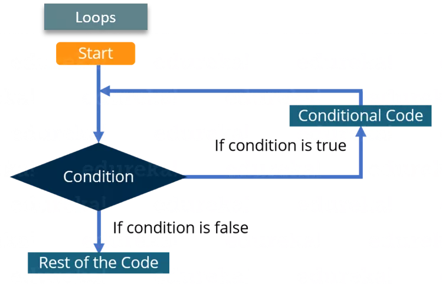<br />一张一张地读取图像，由于帧的快速处理已经超过了眼睛的机制（生物学范畴☺）使单个图像移动起来，就生成了视频<br />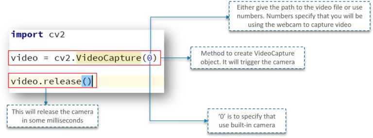<br />首先，先导入 OpenCV 库，接下来使用一个名为 VideoCapture 的方法，用于创建 VideoCapture 对象，该方法用于触发用户机器上的摄像头。此函数的参数表示程序应使用内置摄像头还是附加摄像头，“0”表示内置摄像头<br />最后的释放方法用于在几毫秒内释放系统相机<br />但是当尝试执行上面的代码时，会注意到相机灯亮起一秒钟然后关闭这是因为没有时间延迟来保持相机功能<br />来增加延迟<br />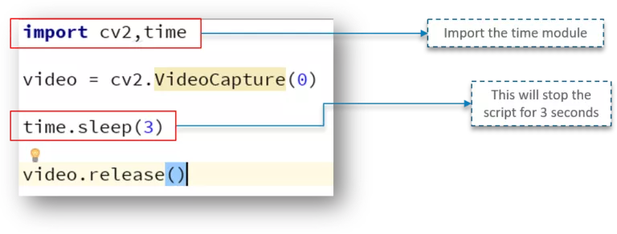<br />增加了3秒钟的延迟，网络摄像头将开启 3 秒钟<br />添加一个窗口来显示视频输出<br />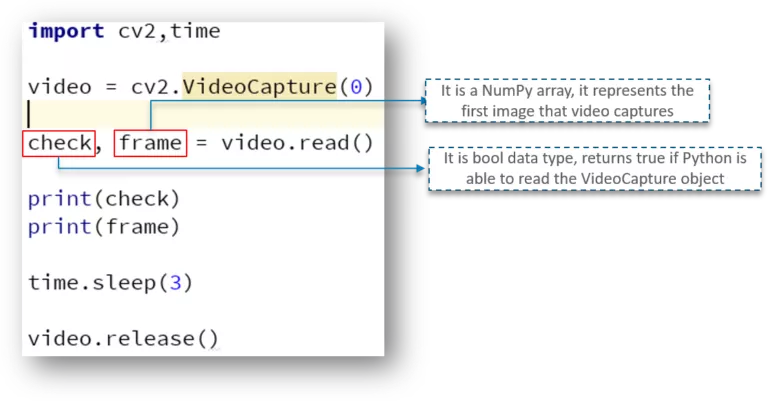<br />在这里，定义了一个 NumPy 数组，用它来表示视频捕获的第一张图像——存储在帧数组中<br />还有一个 check 变量——这是一个布尔数据类型，如果 Python 能够访问和读取 VideoCapture 对象，那么它返回 True<br />下面是代码的输出情况<br />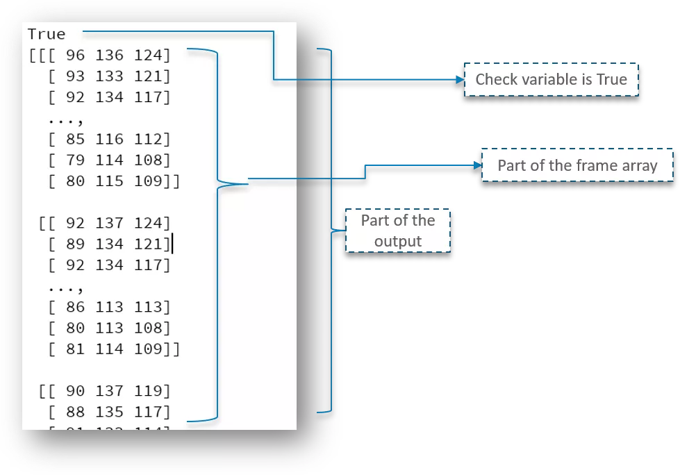<br />得到的输出为 True，并打印了帧数组的一部分<br />但是需要从读取视频的第一帧开始，以此，需要首先创建一个帧对象，它将读取 VideoCapture 对象的图像<br />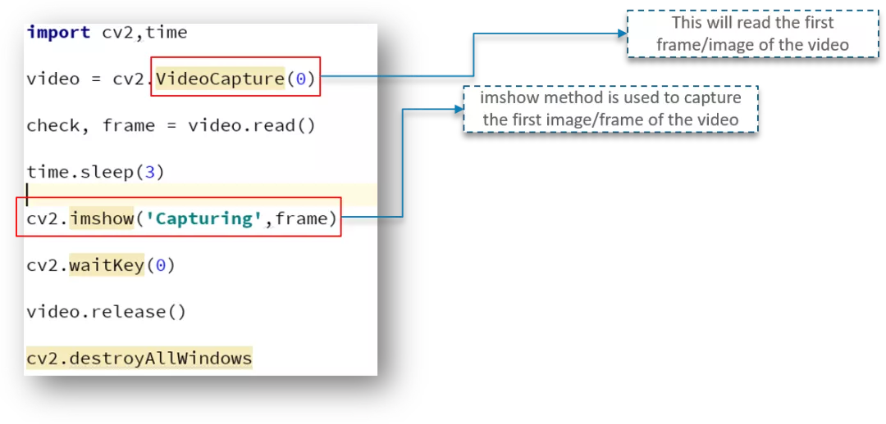<br />如上所示， imshow 方法用于捕获视频的第一帧
<a name="wYvO0"></a>
## 直接捕获视频
为了捕获视频，使用 while 循环<br />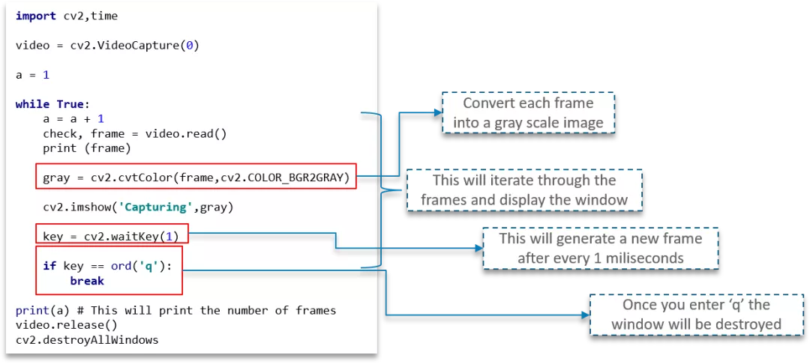<br />使用 `cvtColor` 函数将每一帧转换为灰度图像<br />waitKey(1) 将确保在每毫秒间隔后生成一个新帧<br />这里还有一个用户事件触发器，一旦用户按下“q”键，程序窗口就会关闭<br />下面看看如何使用 OpenCV 做一个非常有趣的运动检测器
<a name="BPITt"></a>
### 基于 OpenCV 的运动检测器
问题场景：通过一个网络摄像头，可以检测到摄像头前任何运动物体，并且返回一个图表，这个图表包含人/物体在相机前面的时间<br />问题场景示意图如下：<br />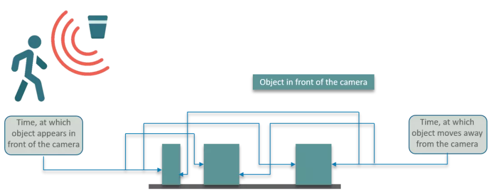<br />下面来思考下解决方案<br />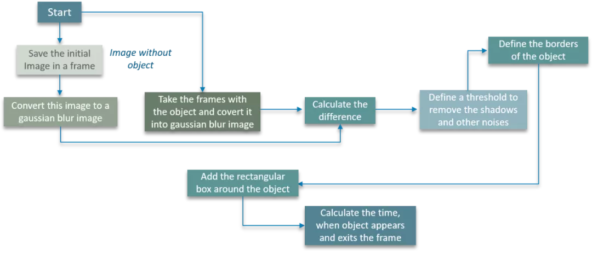<br />首先将图像保存在特定帧中<br />接下来将图像转换为高斯模糊图像，这样做是为了确保计算出模糊图像和实际图像之间的明显差异<br />此时，图像仍然不是对象，定义了一个阈值来去除图像中的瑕疵，例如阴影和其他噪声等等<br />再接下来定义对象的边框，在对象周围添加一个矩形框<br />最后，计算对象出现和退出帧的时间<br />思路还是蛮清晰的<br />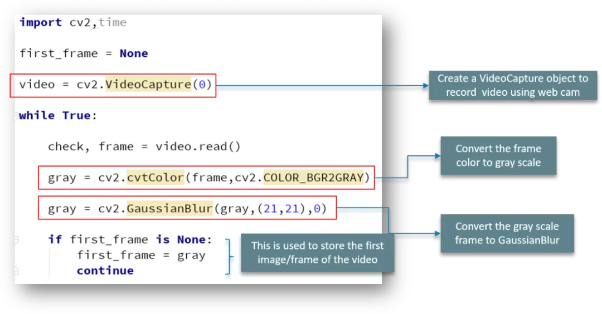<br />首先导入包并创建 VideoCapture 对象以确保使用网络摄像头捕获视频。<br />while 循环遍历视频的各个帧，将彩色帧转换为灰度图像，然后将此灰度图像转换为高斯模糊模型<br />使用 if 语句来存储视频的第一个图像<br />接下来继续深入<br />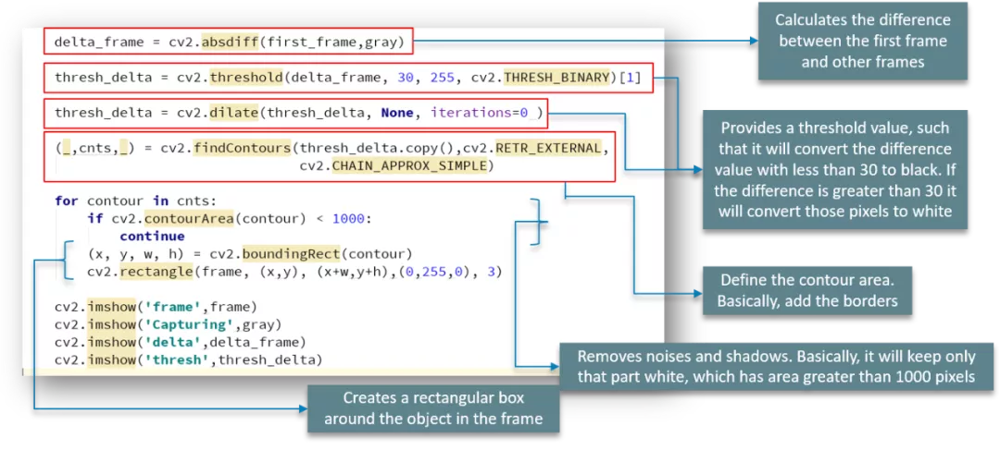<br />使用 absdiff 函数来计算第一个出现的帧与所有其他帧之间的差异<br />阈值函数提供阈值，将小于30的差值转换为黑色。如果差异大于 30，它会将这些像素转换为白色<br />之后使用 `findContours` 函数来定义图像的轮廓区域<br />就像前面说的，contourArea 函数可去除噪声和阴影。为简单起见，将只保留那部分为白色，其面积大于为此定义的 1000 像素<br />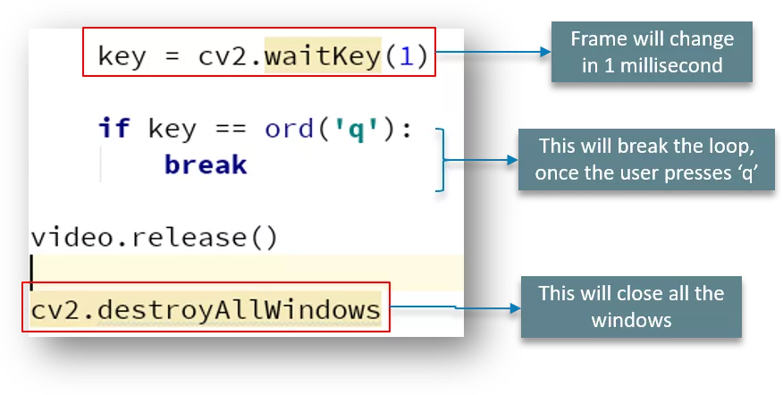<br />帧每 1 毫秒更改一次，当用户输入“q”时，循环中断并关闭窗口<br />最后计算对象在相机前的时间<br />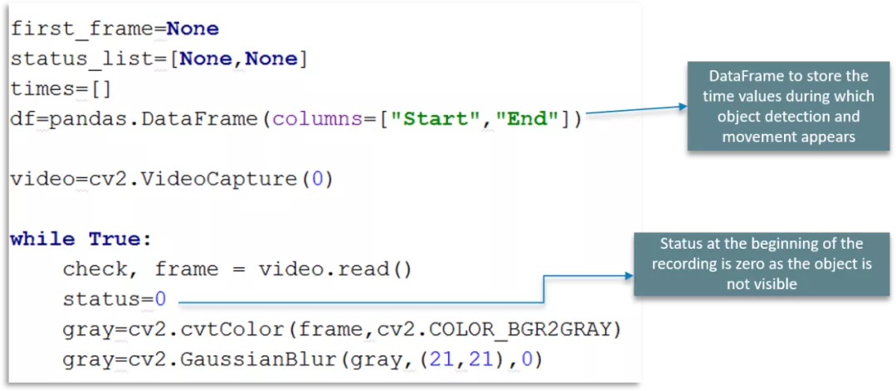<br />使用 DataFrame 来存储对象检测和移动出现在帧中的时间值<br />在这里定义了一个状态标志位，在录制开始时使用此状态为零，因为对象最初不可见<br />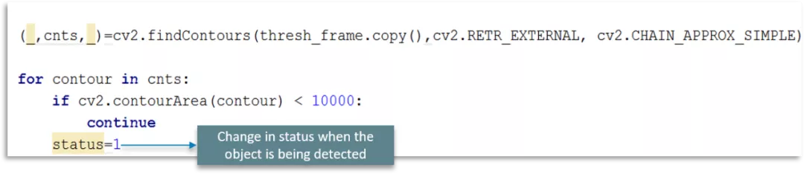<br />当检测到对象时，将状态标志更改为 1<br />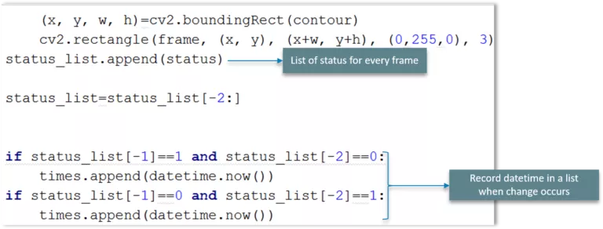<br />将列出每个扫描帧的状态，如果发生更改以及发生更改的位置，则在列表中使用 datetime 记录日期和时间<br />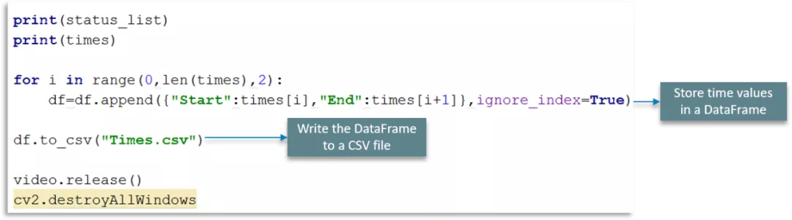<br />将时间值存储在 DataFrame 中并写入 CSV 文件
<a name="NdeJK"></a>
## 绘制运动检测图
最后一步是显示结果<br />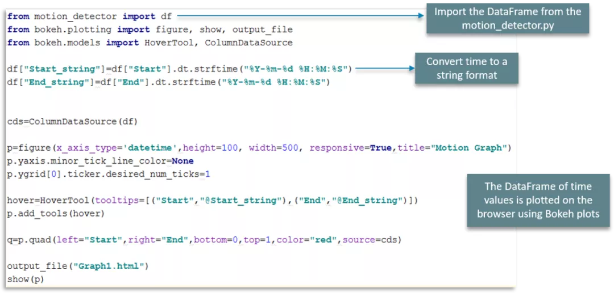<br />首先，从 motion_detector.py 文件中导入DataFrame<br />接下来将时间转换为可以解析的可读字符串格式<br />最后，使用散景图在浏览器上绘制时间值的图表<br />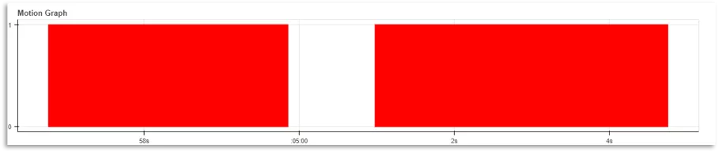
