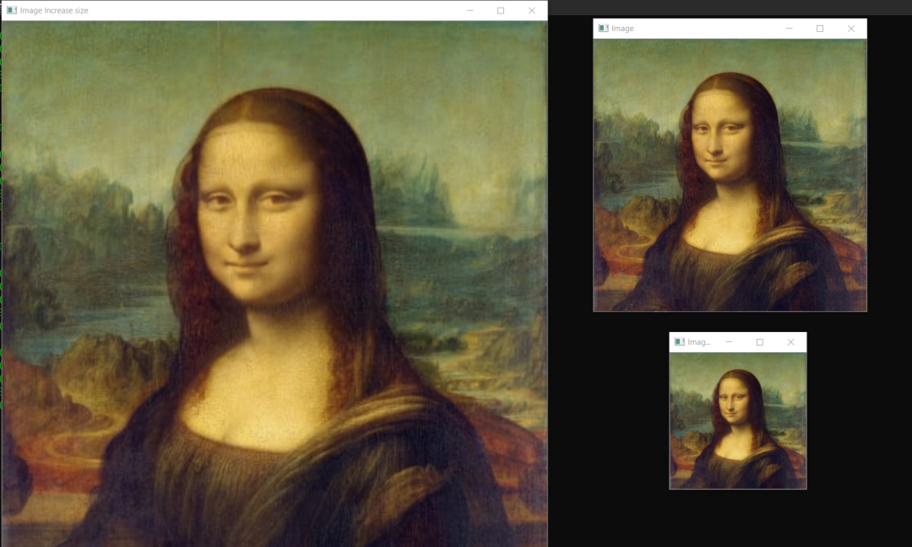
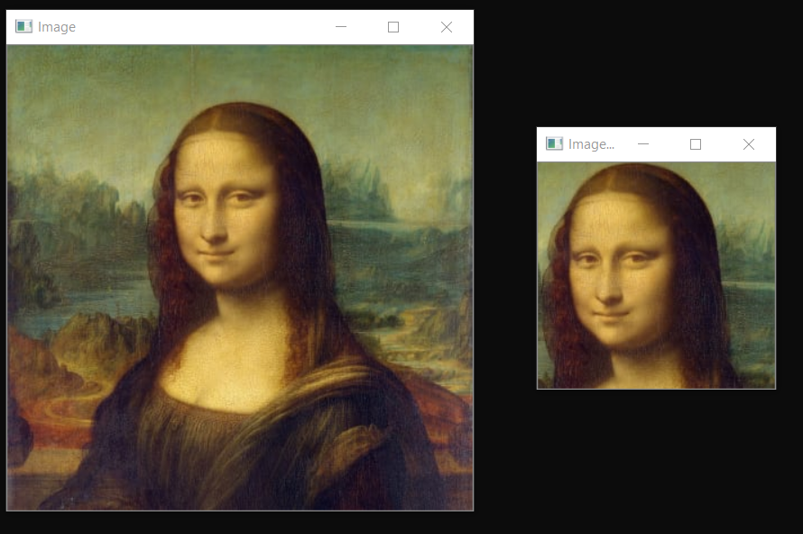
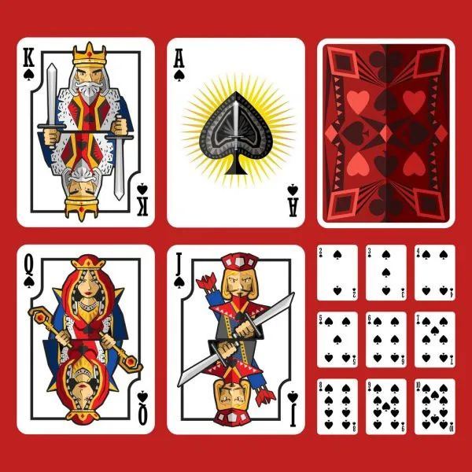
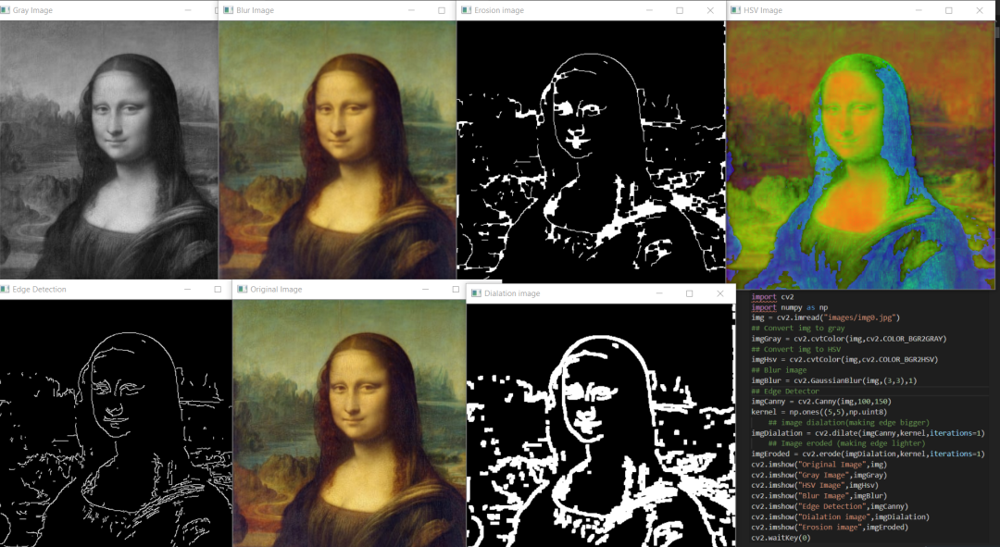
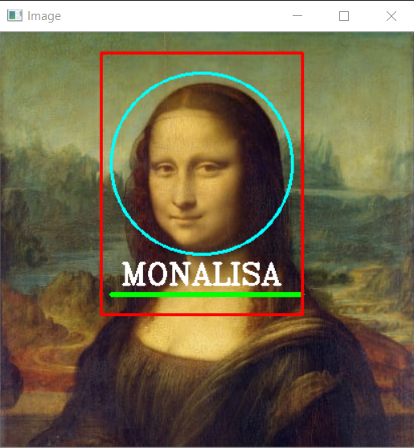
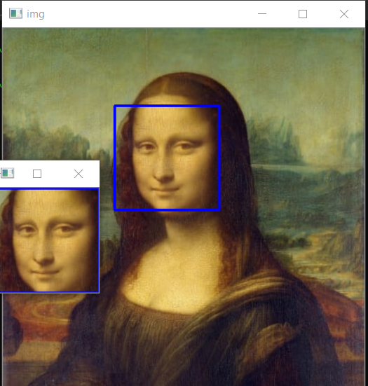

OpenCV
<a name="cg256"></a>
## OpenCV
OpenCV是计算机视觉中最受欢迎的库，最初由intel使用C和C ++进行开发的，现在也可以在python中使用。该库是一个跨平台的开源库，是免费使用的。OpenCV库是一个高度优化的库，主要关注实时应用程序。<br />OpenCV库是2500多种优化算法的组合，可用于检测和识别不同的人脸，实时识别图像中的对象，使用视频和网络摄像头对不同的人类动作进行分类，跟踪摄像机的运动，跟踪运动对象（例如汽车，人等），实时计数对象，缝合图像来产生高分辨率图像，从图像数据库中查找相似的图像，从使用闪光灯拍摄的图像中消除红眼并提高图像质量，跟踪眼睛的运动，跟踪脸部等。<br />它拥有大约4.7万活跃用户社区，下载量超过1800万。谷歌，亚马逊，特斯拉，微软，本田等许多大公司都使用Open cv来改善他们的产品，它更是驱动了AI的发展。
<a name="LddzH"></a>
## 先决条件
在开始编写代码之前，需要在设备上安装opencv。<br />如果是ProIn编程专家，并且熟悉每个IDE，那么请使用Pycharm并从设置中的程序包管理器安装OpenCV-python。<br />如果是初学者或中级程序员，那么将使用代码编辑器而不是IDE。<br />只需转到Visual Studio Code网站并根据操作系统下载最新版本即可。

- [https://code.visualstudio.com/download](https://code.visualstudio.com/download)

现在将创建一个虚拟环境，并在其中安装opencv。打开终端，然后使用cd定位到桌面，使用mkdir 创建一个名为opencv的文件夹，然后运行以下命令。
```bash
python -m venv env
```
现在，使用env\scripts\activate激活环境，会在C:\Users\username\Desktop\opencv之前看到小括号(env)出现。<br />现在，只需使用pip安装OpenCV。
```bash
pip install opencv-python
```
在本文中涵盖7个主题

1. **读，写和显示图像**
2. **读取视频并与网络摄像头集成**
3. **调整大小和裁剪图像**
4. **基本的图像过滤器使用的函数**
5. **绘制不同的形状**
6. **在图像上书写文字**
7. **检测并裁剪脸部**
<a name="XEpL9"></a>
## 读，写和显示图像
要使用Opencv读取图像，有`imread()`函数; 要显示图像，有`imshow()`函数，而对于书写，有`imwrite()`函数。看看它们的语法。
<a name="HRoRh"></a>
### `imread()`：
```python
img = cv2.imread("PATH_TO_IMAGE.jpg/png")
Example
img = imread("images/dog0.jpg")
```
<a name="HmYb7"></a>
### `imshow()`:
```python
cv2.imshow("WINDOW NAME",IMG_VAR)
Example
imshow("Dog Image",img)
```
<a name="svbyn"></a>
### `imwrite()`:
```python
cv2.imwrite(FILENAME, IMAGE)
filename: A string representing the file name. The filename must include image format like .jpg, .png, etc.
image: It is the image that is to be saved.
Example
cv2.imwrite('images/img',img)
```
<a name="EnEhD"></a>
## 读取视频并与网络摄像头集成
读取视频文件与在OpenCV中读取图像文件非常相似，区别在于使用了`cv2.videocapture`。
<a name="Ah1cf"></a>
### 句法
```python
video = cv2.VideoCapture("FILEPATH.mp4")
Example
video = cv2.VideoCapture("video/dog/dog.mp4")
```
视频是许多帧结合在一起的集合，每帧都是一幅图像。要使用OpenCV观看视频，只需要使用while循环显示视频的每一帧。
```python
while True:
   success , img = cap.read()
   cv2.imshow("Video",img)
   if cv2.waitKey(1) & 0xff==ord('q'):##key 'q' will break the loop
       break
```
要与网络摄像头集成，需要传递网络摄像头的端口值而不是视频路径。如果使用的是笔记本电脑，但没有连接任何外部网络摄像头，则只需传递参数0；如果有外部网络摄像头，则传递参数1。
```python
cap = cv2.VideoCapture(0)
cap.set(3,640)  ## Frame width
cap.set(4,480)  ## Frame Height
cap.set(10,100) ## Brightness
while True:
   success, img = cap.read()
   cv2.imshow("Video",img)
   if cv2.waitKey(1) & 0xff == ord('q'):
        break
```
<a name="UweyM"></a>
## 调整大小和裁剪图像
调整大小是更改图像形状的过程。在Opencv中，可以使用`resize`函数调整图像形状的大小。
<a name="Z0zjy"></a>
### 句法
```python
cv2.resize(IMG,(WIDTH,HEIGHT))
IMG: image which we want to resize
WIDTH: new width of the resize image
HEIGHT: new height of the resize image
Example
cv2.resize(img,(224,224))
```
要首先调整图像的大小，需要知道图像的形状。可以使用`shape`来找到任何图像的形状，然后根据图像形状，可以增加或减小图像的大小。看看示例。
```python
import cv2
img = cv2.imread("images/img0.jpg") ##Choose any image
print(img.shape)
imgResize = cv2.resize(img,(224,224)) ##Decrease size
imgResize2 = cv2.resize(img,(1024,1024)) ##Increase size
cv2.imshow("Image",img)
cv2.imshow("Image Resize",imgResize)
cv2.imshow("Image Increase size",imgResize2)
print(imgResize.shape)
cv2.waitKey(0)
```
如果不想对宽度和高度进行硬编码，也可以使用形状，然后使用索引来增加宽度和高度。
```python
import cv2
img = cv2.imread("images/img0.jpg") ##Choose any image
print(img.shape)
shape = img.shape
imgResize = cv2.resize(img,(shape[0]//2,shape[1]//2))##Decrease size
imgResize2 = cv2.resize(img,(shape[0]*2,shape[1]*2)) ##Increase size
cv2.imshow("Image",img)
cv2.imshow("Image Resize",imgResize)
cv2.imshow("Image Increase size",imgResize2)
print(imgResize.shape)
cv2.waitKey(0)
```

<a name="B8rPn"></a>
### 裁剪图像
裁剪是获取图像的一部分过程。在OpenCV中，可以通过定义裁剪后的矩形坐标来执行裁剪。
<a name="hQwv7"></a>
#### 句法
```python
imgCropped = img[y1:y2, x1:x2]
(x1,y1): top-left vertex
(x2,y2): bottom-right vertex
Example
imgCropped = img[0:100,200:200]
```
使用裁剪方法，尝试从图像中获取蒙娜丽莎的脸。
```python
import cv2
img = cv2.imread("images/img0.jpg")
imgCropped = img[50:250,120:330]
cv2.imshow("Image cropped",imgCropped)
cv2.imshow("Image",img)
cv2.waitKey(0)
```
<br />也可以使用`paint`来找到（x1，y1），（x2，y2）的正确坐标。<br />右键单击图像并保存，尝试从图像中获取王卡。<br /><br />提示：使用paint来找到正确的坐标，最后使用调整大小来增加裁剪图像的大小。<br />“在寻求解决方案之前，请尝试自己动手做。”<br />👉解决方案- [https://gist.github.com/Abhayparashar31/9b01473431de765c0a73e81271233d91](https://gist.github.com/Abhayparashar31/9b01473431de765c0a73e81271233d91)
<a name="AMUDy"></a>
## 基本的图像过滤器使用的函数
可以在图像上使用许多基本的滤镜操作，例如将图像转换为灰度图像，模糊图像等等。一一看一下比较重要的操作。
<a name="XJPoK"></a>
### 将图像转为灰度图像
要将图像转换为灰度，可以使用一个函数`cvtColor`，这里将`cv2.COLOR_BGR2GRAY`作为参数传递。
```python
imgGray = cv2.cvtColor(IMG,cv2.CODE)
IMG: Original image
CODE: Conversion code for Gray(COLOR_BGR2GRAY)
Example
imgGray = cv2.cvtColor(img,cv2.COLOR_BGR2GRAY)
```
<a name="PtBAR"></a>
### 将图像转为HSV
要将图像转换为HSV，可以使用函数`cvtColor`，这里将`cv2.COLOR_BGR2HSV`作为参数传递。它主要用于对象跟踪。
```python
imgGray = cv2.cvtColor(IMG,cv2.CODE)
IMG: Original image
CODE: Conversion code for Gray(COLOR_BGR2HSV)
Example
imgHsv = cv2.cvtColor(img,cv2.COLOR_BGR2HSV)
```
<a name="yeLjH"></a>
### 图像模糊
模糊用于去除图像中的多余噪声，也称为平滑，这是对图像应用低通滤波器的过程。要在Opencv中使用模糊，有一个函数`GaussianBlur`。
```python
imgBlur = cv2.GaussianBlur(img,(sigmaX,sigmaY),kernalSize)
kernalsize − A Size object representing the size of the kernel.
sigmaX − A variable representing the Gaussian kernel standard deviation in X direction.
sigmaY - same as sigmaX
Exmaple
imgBlur = cv2.GaussianBlur(img,(3,3),0)
```
<a name="tZnxn"></a>
### 边缘检测
在OpenCV中，使用Canny边缘检测器来检测图像中的边缘，也有不同的边缘检测器，但最著名的是Canny边缘检测器。Canny边缘检测器是一种边缘检测算子，它使用多阶段算法来检测图像中的大范围边缘，它由John F. Canny在1986年开发。
```python
imgCanny = cv2.Canny(img,threshold1,threshold2)
threshold1,threshold2:Different values of threshold different for every images
Example
imgCanny = cv2.Canny(img,100,150)
```
<a name="dB6Pq"></a>
### 膨胀
膨胀是用来增加图像中边缘的大小。首先定义一个大小为奇数(5,5)的核矩阵，然后利用核函数对图像进行放大。对Canny边缘检测器的输出图像进行了放大处理。
```python
kernel = np.ones((5,5),np.uint8) ## DEFINING KERNEL OF 5x5
imgDialation = cv2.dilate(imgCanny,kernel,iterations=1) ##DIALATION
```
<a name="IqmA0"></a>
### 腐蚀
腐蚀是扩张的反面，它用于减小图像边缘的尺寸。首先，定义一个奇数（5,5）的核矩阵大小，然后使用核对图像执行腐蚀。对Canny边缘检测器的输出图像施加腐蚀。
```python
kernel = np.ones((5,5),np.uint8) ## DEFINING KERNEL OF 5x5
imgDialation = cv2.erode(imgCanny,kernel,iterations=1) ##EROSION
```
现在，在同一程序中将所有基础函数应用于Monalisa映像。<br />
<a name="BuP8o"></a>
## 绘制不同的形状
可以使用OpenCV来绘制矩形，圆形，直线等不同的形状。
<a name="B51K8"></a>
### 矩形：
要在图像上绘制矩形，使用矩形函数。在函数中，传递宽度，高度，X，Y，RGB中的颜色，厚度作为参数。
```python
cv2.rectangle(img,(w,h),(x,y),(R,G,B),THICKNESS)
w: width
h: height
x: distance from x axis
y: distance from y axis
R,G,B: color in RGB form (255,255,0)
THICKNESS: thickness of rectangel(integer)
Example
cv2.rectangle(img,(100,300),(200,300),(255,0,255),2)
```
<a name="hmRXB"></a>
### 圆：
要绘制一个圆，使用`cv2.circle`。传递x，y，半径大小，RGB形式的颜色，厚度作为参数。
```python
cv2.circle(img,(x,y),radius,(R,G,B),THICKNESS)
x: distance from x axis
y: distance from y axis
radius: size of radius(integer)
R,G,B: color in RGB form (255,255,0)
THICKNESS: thickness of rectangel(integer)
Example
cv2.circle(img,(200,130),90,(255,255,0),2)
```
<a name="YVnB2"></a>
### 线：
要绘制一条线，使用`cv2.line`，使用起点（x1，y1），终点（x2，y2），RGB形式的颜色，厚度作为参数。
```python
cv2.line(img,(x1,y1),(x2,y2),(R,G,B),THICKNESS)
x1,y1: start point of line (integer)
x2,y2: end point of line (integer)
R,G,B: color in RGB form (255,255,0)
THICKNESS: thickness of rectangel(integer)
Example
cv2.line(img,(110,260),(300,260),(0,255,0),3) 
```
<a name="oCPnq"></a>
## 在图像上书写文字
在OpenCV中，有一个函数`cv2.puttext`, 可以在特定位置的图像上写文本。它以图像，文本，x，y，颜色，字体，字体比例，粗细为输入。
```python
cv2.putText(img,text,(x,y),FONT,FONT_SCALE,(R,G,B),THICKNESS)
img: image to put text on
text: text to put on image
X: text distance from X axis
Y: text distance from Y axis
FONT: Type of FONT (ALL FONT TYPES)
FONT_SCALE: Scale of Font(Integer)
R,G,B: color in RGB form (255,255,0)
THICKNESS: thickness of rectangel(integer)
Example
cv2.putText(img,"HELLO",(120,250),cv2.FONT_HERSHEY_COMPLEX,1,(255,255,255),2)
```
<br />下载Monalisa图片。<br />任务：使用形状和文本为左侧图像中所示的Monalisa脸创建框架。<br />提示：首先是一个圆形，然后是矩形，然后根据圆形和矩形放置文本，最后根据文本放置一行。<br />👉解决方案-  [https://gist.github.com/Abhayparashar31/af36bf25ce61345266db4b54aba33be1](https://gist.github.com/Abhayparashar31/af36bf25ce61345266db4b54aba33be1)
<a name="cBgMV"></a>
## 检测并裁剪脸部
在创建人脸识别系统时，人脸检测是非常有用的。在OpenCV中，提供了许多可用于不同目的的预训练haar级联分类器。在OpenCV GitHub上查看分类器的完整列表。

- [https://github.com/opencv/opencv/tree/master/data/haarcascades](https://github.com/opencv/opencv/tree/master/data/haarcascades)

为了检测OpenCV中的人脸，使用了haarcascade_frontalface_default.xml分类器，它会返回图像的四个坐标（w，h，x，y），使用这些坐标，将在脸部上绘制一个矩形，然后使用相同的坐标来裁剪脸部。现在使用`imwrite`，将裁剪的图像保存在目录中。
```python
import cv2
# Load the cascade
face_cascade = cv2.CascadeClassifier('haarcascade_frontalface_default.xml')
# Read the input image
img = cv2.imread('images/img0.jpg')
# Convert into grayscale
gray = cv2.cvtColor(img, cv2.COLOR_BGR2GRAY)
# Detect faces
faces = face_cascade.detectMultiScale(gray, 1.3, 4)
# Draw rectangle around the faces
for (x, y, w, h) in faces:
    cv2.rectangle(img, (x, y), (x+w, y+h), (255, 0, 0), 2)
    # Cropping Face
    crop_face = img[y:y + h, x:x + w]
    #Saving Cropped Face
    cv2.imwrite(str(w) + str(h) + '_faces.jpg', crop_face)
cv2.imshow('img', img)
cv2.imshow("imgcropped",crop_face)
cv2.waitKey()
```

