图像处理 OpenCV<br />图像处理适用于图像和视频。良好的图像处理结果会为后续的进一步处理带来很大的帮助，例如提取到图像中的直线有助于对图像中物体的结构进行分析，良好的特征提取会优化深度学习的结果等。回顾一下图像处理中的最基础的，但是却非常实用的一些操作。
<a name="7808a68e"></a>
## 图像处理
图像处理始于计算机识别数据。首先，为图像格式的数据创建一个矩阵。图像中的每个像素值都被处理到此矩阵中。例如，为尺寸为200x200的图片创建尺寸为200x200的矩阵。如果此图像是彩色的，则此尺寸变为200x200x3（RGB）。实际上，图像处理中的每个操作都是矩阵运算。假设需要对图像进行模糊操作。特定的过滤器会在整个矩阵上移动，从而对所有矩阵元素或部分矩阵元素进行更改。作为该过程的结果，图像的所需部分或全部变得模糊。<br />在许多情况下都需要对图像进行处理[1]。通常，这些操作应用于将在深度学习模型中使用。例如，使用彩色图像进行训练会导致性能下降。卷积神经网络是图像处理最广泛使用的深度学习结构之一。该网络确定图像上卷积层训练所需的属性。在这一点上，仅图像中将用于训练的某些部分可能需要处理。图片中更圆的线条而不是清晰的线条突出有时可以提高训练的成功率。<br />除上述情况外，相同的逻辑还基于日常生活中使用的图像优化程序的操作。图像处理中有许多过程，例如提高图像质量，对图像进行还原，消除噪声，直方图均衡化。
<a name="5g0UZ"></a>
## OpenCV
OpenCV是用于图像处理的最流行的库之一[2]。有许多使用OpenCV的公司，例如Microsoft，Intel，Google，Yahoo。OpenCV支持多种编程语言，例如Java，C ++，Python和Matlab。以下所有示例都是使用Python编码的。
```python
import cv2
from matplotlib import pyplot as plt
import numpy as np
```
首先，导入库。OpenCV中的某些功能在每个版本中均无法稳定运行。这些功能之一是“ imshow”。此功能可以查看由于操作导致的图像变化。对于有此类问题的人，matplotlib库将用作这项工作的替代解决方案。<br />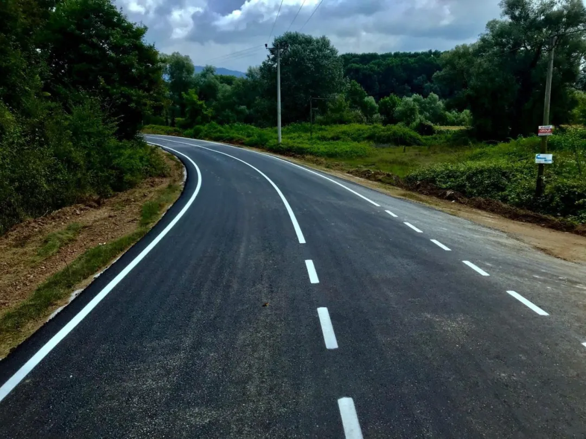<br />图1.标准图像<br />要执行的过程将应用于上面显示的图像（图1）。最初会读取图像，以便对其进行处理。
```python
img_path = "/Users/..../opencv/road.jpeg"
img = cv2.imread(img_path)
print(img.shape)

>>>(960, 1280, 3)
```
图2中图像的尺寸为960 x 1280像素。当要在读取过程后打印尺寸时，看到960x1280x3的结果。因此，根据图像的尺寸创建了一个矩阵，并为该矩阵分配了图像每个像素的值。RGB有3个维度，因为图像是彩色的。<br />如果想将图像转换为黑白图像，则使用cvtColor函数。
```python
gray_image = cv2.cvtColor(img, cv2.COLOR_BGR2GRAY)
```
如果要查看由于该函数而发生的更改，可以使用matplotlib中的imshow函数。
```python
gray_image = cv2.cvtColor(img, cv2.COLOR_BGR2GRAY)
plt.imshow(gray_image)
plt.show()
print(gray_image.shape)

>>>(960, 1280)
```
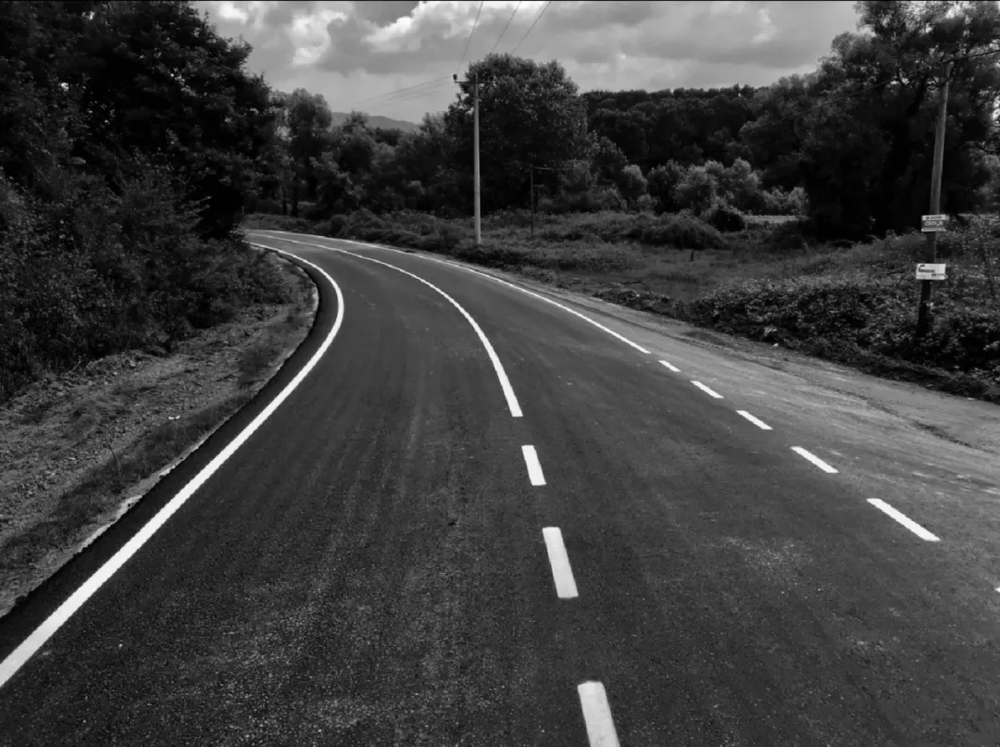<br />图2.黑白图像<br />如图2所示，已将图像转换为黑白图像。检查其尺寸时，不再有3个尺寸。<br />当查看图像的矩阵值时，看到它由0到255之间的值组成。在某些情况下，可能希望此矩阵仅由0到255的值组成[3]。在这种情况下使用阈值功能。
```python
(thresh, blackAndWhiteImage) = cv2.threshold(gray_image, 20, 255, cv2.THRESH_BINARY)
(thresh, blackAndWhiteImage) = cv2.threshold(gray_image, 80, 255, cv2.THRESH_BINARY)
(thresh, blackAndWhiteImage) = cv2.threshold(gray_image, 160, 255, cv2.THRESH_BINARY)
(thresh, blackAndWhiteImage) = cv2.threshold(gray_image, 200, 255, cv2.THRESH_BINARY)
plt.imshow(blackAndWhiteImage)
plt.show()
```
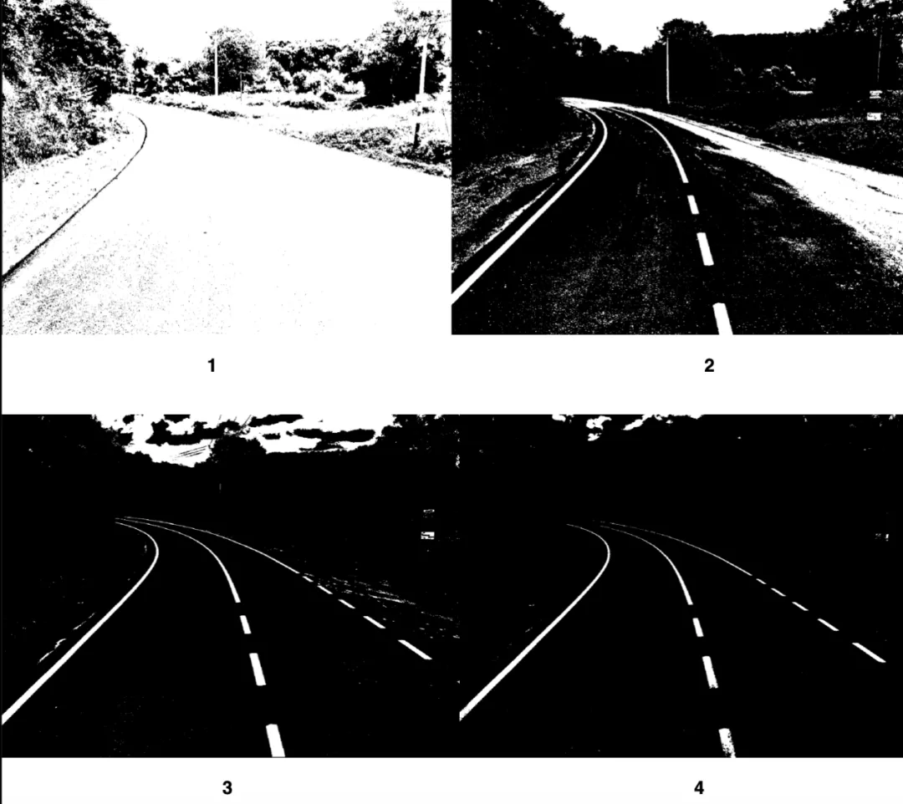<br />图3.应用了阈值功能的图像<br />OpenCV中阈值功能所需的第一个参数是要处理的图像。以下参数是阈值。第三个参数是要分配超出阈值的矩阵元素的值。可以在图3中看到四个不同阈值的影响。在第一张图像（图像1）中，该阈值确定为20.将20之上的所有值分配给255.其余值为设置为0。这仅允许黑色或非常深的颜色为黑色，而所有其他阴影直接为白色。图像2和图像3的阈值分别为80和160.最后，在图像4中将阈值确定为200.与图像1不同，白色和非常浅的颜色被指定为255，而所有在图4中将剩余值设置为0。<br />图像处理中使用的另一种方法是模糊。这可以通过多个功能来实现。
```python
output2 = cv2.blur(gray_image, (10, 10))
plt.imshow(output2)
plt.show()
```
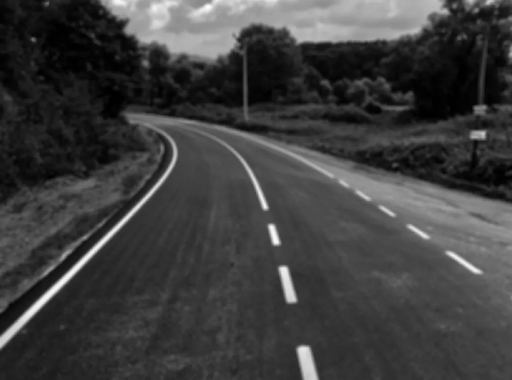<br />图4具有模糊功能的模糊图像
```python
output2 = cv2.GaussianBlur(gray_image, (9, 9), 5)
plt.imshow(output2)
plt.show()
```

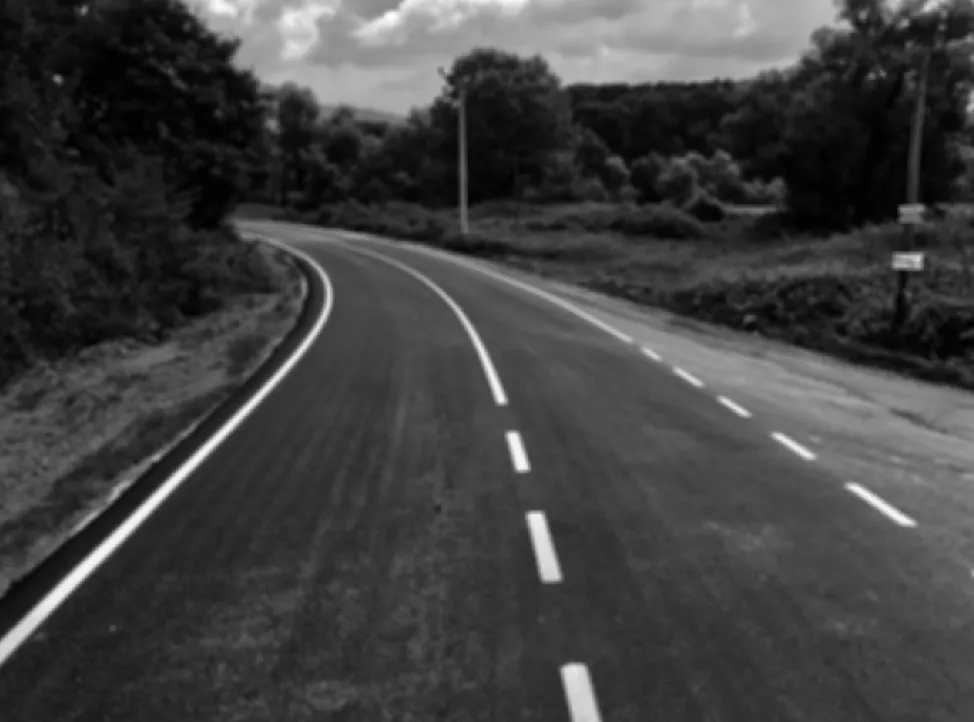<br />图5.具有高斯模糊函数的模糊图像<br />如图4和图5所示，黑白图像使用指定的模糊滤镜和模糊度模糊。此过程通常用于消除图像中的噪点。此外，在某些情况下，由于图像中的线条清晰，训练也会受到严重影响。出于此原因使用它的情况下可用。<br />在某些情况下，可能需要旋转数据以进行扩充，或者用作数据的图像可能会偏斜。在这种情况下，可以使用以下功能。
```python
(h, w) = img.shape[:2]
center = (w / 2, h / 2)
M = cv2.getRotationMatrix2D(center, 13, scale  =1.1)
rotated = cv2.warpAffine(gray_image, M, (w, h))
plt.imshow(rotated)
plt.show()
```
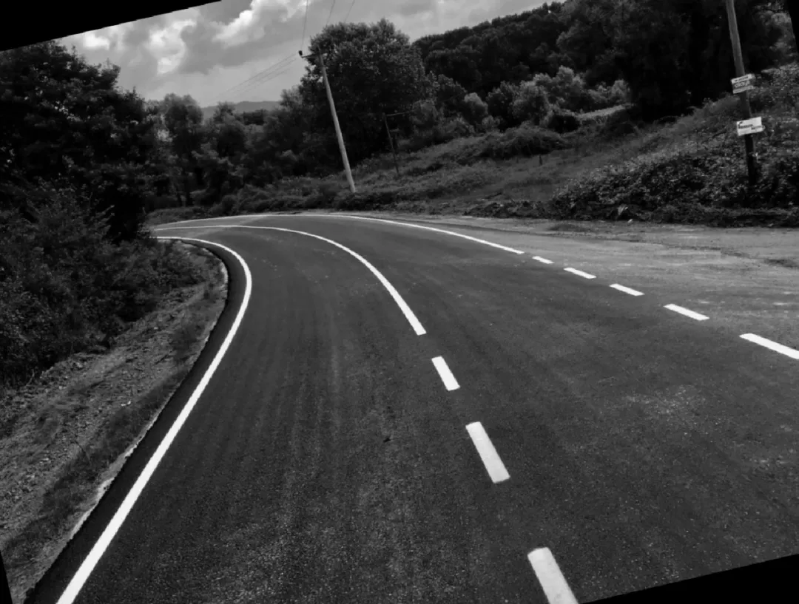<br />图6.具有getRotationMatrix2D函数的旋转图像<br />首先，确定图像的中心，并以此中心进行旋转。getRotationMatrix2D函数的第一个参数是计算出的中心值。第二个参数是角度值。最后，第三个参数是旋转后要应用的缩放比例值。如果将此值设置为1，它将仅根据给定的角度旋转同一图像，而不会进行任何缩放。
<a name="pHvbK"></a>
### 实验1
上述方法通常在项目中一起使用。制作一个示例项目，以更好地了解这些结构和过程。<br />假设要训练车辆的自动驾驶飞行员[4]。当检查图1中的图像以解决此问题时，自动驾驶仪应该能够理解路径和车道。可以使用OpenCV解决此问题。由于颜色在此问题中无关紧要，因此图像将转换为黑白。矩阵元素通过确定的阈值设置值0和255。如上面在阈值功能的解释中提到的，阈值的选择对于该功能至关重要。该问题的阈值设置为200。可以清除其他详细信息，因为这足以专注于路边和车道。为了消除噪声，使用高斯模糊函数执行模糊处理。可以从图1到5详细检查到此为止的部分。<br />这些过程之后，将应用Canny边缘检测。
```python
img = cv2.imread(img_path)
gray_image = cv2.cvtColor(img, cv2.COLOR_BGR2GRAY)
(thresh, output2) = cv2.threshold(gray_image, 200, 255, cv2.THRESH_BINARY)
output2 = cv2.GaussianBlur(output2, (5, 5), 3)
output2 = cv2.Canny(output2, 180, 255)
plt.imshow(output2)
plt.show()
```
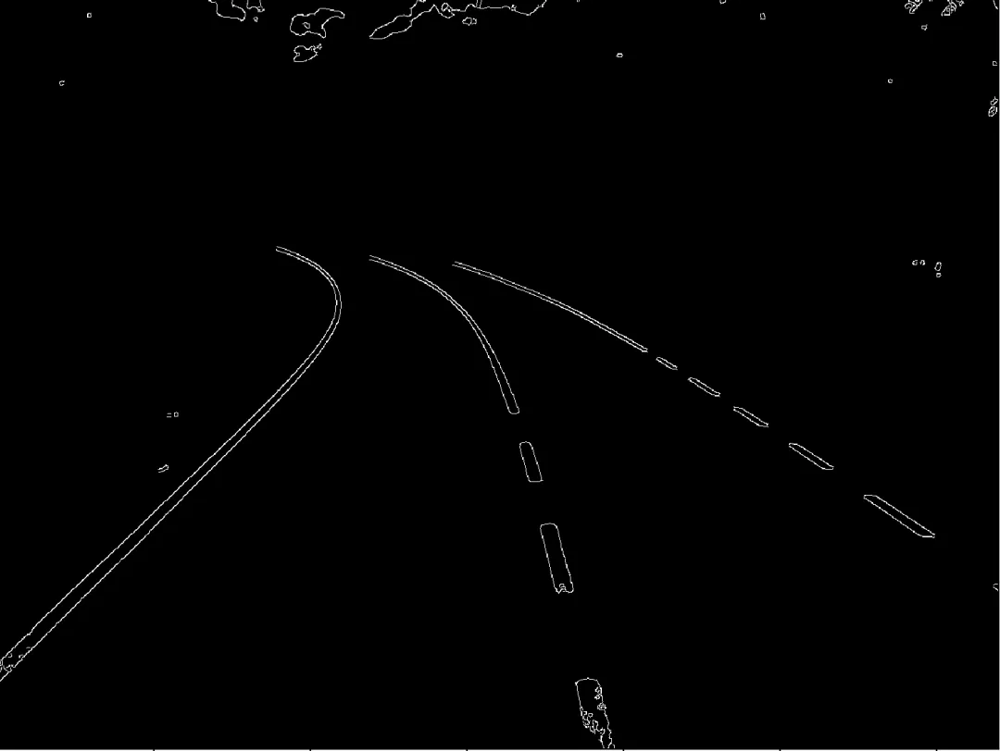<br />图7. Canny函数结果图像<br />Canny函数采用的第一个参数是将对其执行操作的图像。第二参数是低阈值，第三参数是高阈值。逐像素扫描图像以进行边缘检测。一旦存在低于下阈值的值，则检测到边缘的第一侧。当找到一个比较高阈值高的值时，确定另一侧并创建边缘。因此，为每个图像和每个问题确定阈值参数值。为了更好地观察高斯模糊效果，做同样的动作而又不模糊这次。
```python
img = cv2.imread(img_path)
gray_image = cv2.cvtColor(img, cv2.COLOR_BGR2GRAY)
(thresh, output2) = cv2.threshold(gray_image, 200, 255, cv2.THRESH_BINARY)
output2 = cv2.Canny(output2, 180, 255)
plt.imshow(output2)
plt.show()
```
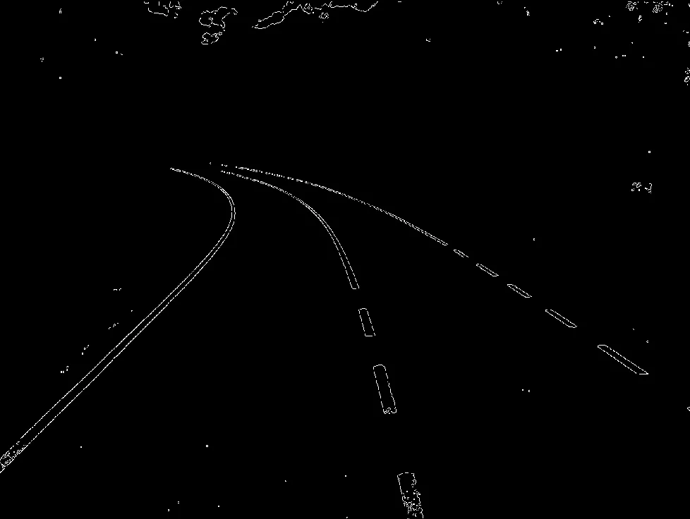<br />图8.非模糊图像<br />如果未实现GaussianBlur函数，则噪声在图8中清晰可见。这些噪声对于项目可能不是问题，但它们将对不同项目和情况下的培训成功产生重大影响。在该阶段之后，基于确定的边缘在真实（标准）图像上执行处理。为此使用HoughLinesP和line函数。
```python
lines = cv2.HoughLinesP(output2, 1, np.pi/180,30)
for line in lines:
   x1,y1,x2,y2 = line[0]
   cv2.line(img,(x1,y1),(x2,y2),(0,255,0),4)
plt.imshow(img)
```
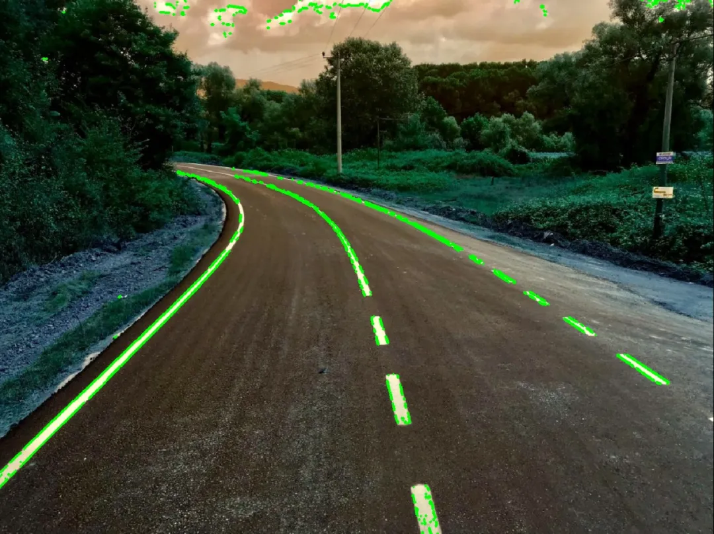<br />图9.应用了HoughLinesP函数的图像<br />如图9所示，可以很好地实现道路边界和车道。但是，当仔细检查图9时，会发现一些问题。尽管确定车道和道路边界没有问题，但云也被视为道路边界。应该使用掩蔽方法来防止这些问题[5]。
```python
def mask_of_image(image):
   height = image.shape[0]
   polygons = np.array([[(0,height),(2200,height),(250,100)]])
   mask = np.zeros_like(image)
   cv2.fillPoly(mask,polygons,255)
   masked_image = cv2.bitwise_and(image,mask)
   return masked_image
```
可以使用mask_of_image函数进行屏蔽过程。首先，将要掩盖的区域确定为多边形。参数值完全是特定于数据的值。<br />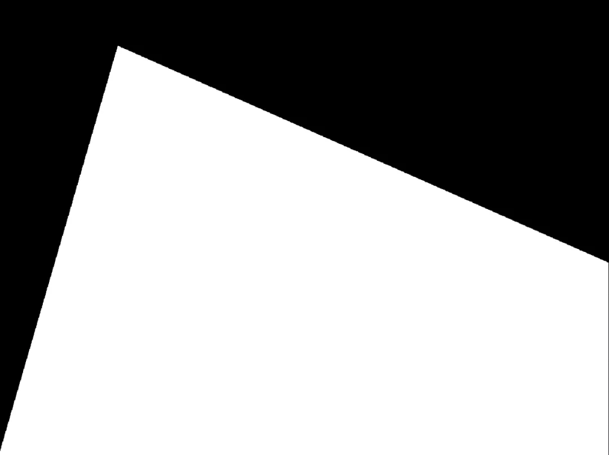<br />图10.确定的遮罩区域<br />蒙版（图10）将应用于真实图片。对与真实图像中黑色区域相对应的区域不进行任何处理。但是，上述所有过程都应用于与白色区域相对应的区域。<br />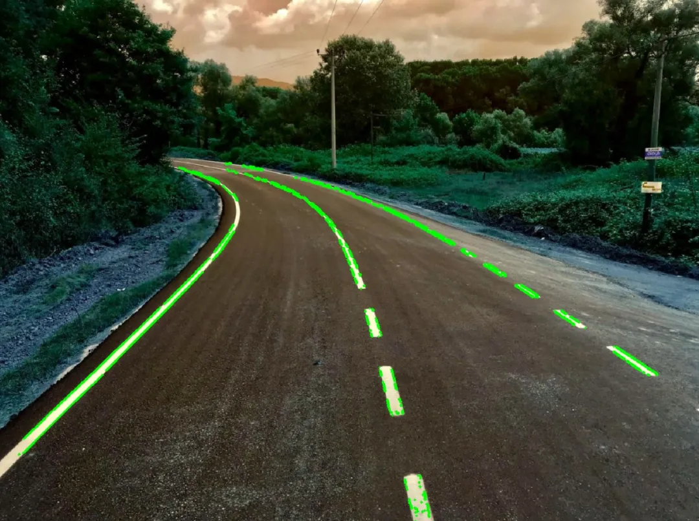<br />图11.遮罩应用的图像<br />如图11所示，通过屏蔽过程，解决了在云中看到的问题。
<a name="4e991d10"></a>
### 实验2
使用HougLinesP解决了车道识别问题。假设这个问题适用于圆形[6]。<br />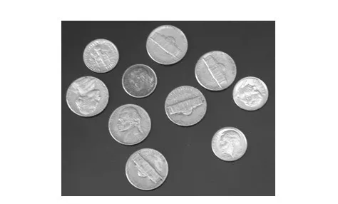<br />图12.硬币图像[8]<br />创建一个识别图12中硬币的图像处理。在这种情况下，这里还将使用车道识别项目中使用的方法。
```python
img = cv2.imread("/Users/.../coin.png")
gray_image = cv2.cvtColor(img, cv2.COLOR_BGR2GRAY)
(thresh, output2) = cv2.threshold(gray_image, 120, 255, cv2.THRESH_BINARY)
output2 = cv2.GaussianBlur(output2, (5, 5), 1)
output2 = cv2.Canny(output2, 180, 255)
plt.imshow(output2, cmap = plt.get_cmap("gray"))circles = cv2.HoughCircles(output2,cv2.HOUGH_GRADIENT,1,10,                       param1=180,param2=27,minRadius=20,maxRadius=60)
circles = np.uint16(np.around(circles))
for i in circles[0,:]:
   # draw the outer circle
   cv2.circle(img,(i[0],i[1]),i[2],(0,255,0),2)
   # draw the center of the circle
   cv2.circle(img,(i[0],i[1]),2,(0,0,255),3)

plt.imshow(img)
```

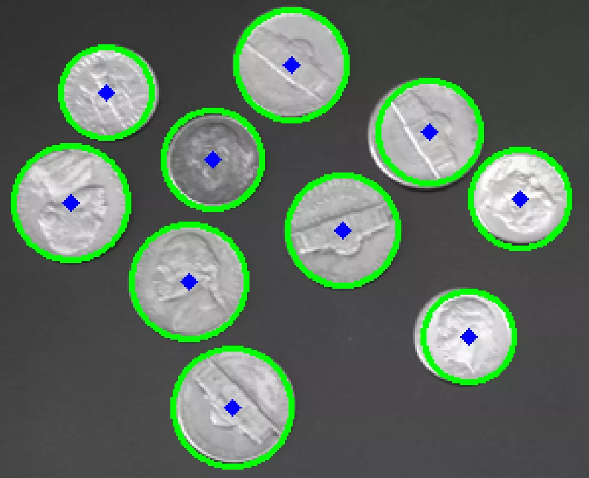<br />图13.最终硬币图片<br />作为图像处理的结果，可以在图13中找到i。图像被转换为黑白图像。然后应用阈值函数。使用了高斯模糊和Canny边缘检测功能。最后，使用HoughCircles函数绘制圆。<br />图像处理也适用于图像格式的文本。<br />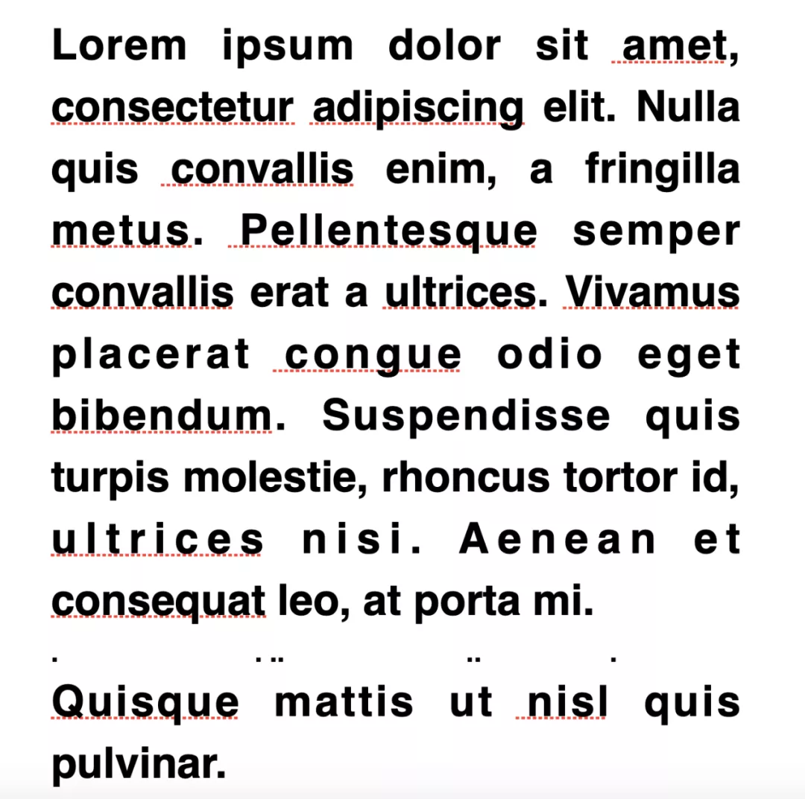<br />图14.图像格式的文本<br />假设要使用图14中所示的文本来训练系统，希望通过训练，模型可以识别所有单词或某些特定单词。可能需要向系统传授单词的位置信息。OpenCV也用于此类问题。首先，图像（在图14中）被转换为文本。为此，使用了一种称为Tesseract的光学字符识别引擎[7]。
```python
data = pytesseract.image_to_data(img, output_type=Output.DICT, config = "--psm 6")
n_boxes = len(data['text'])
for i in range(n_boxes):
   (x, y, w, h) = (data['left'][i], data['top'][i], data['width'][i], data['height'][i])
   cv2.rectangle(img, (x, y), (x + w, y + h), (0, 255, 0), 2)
plt.imshow(img)
plt.show()
```
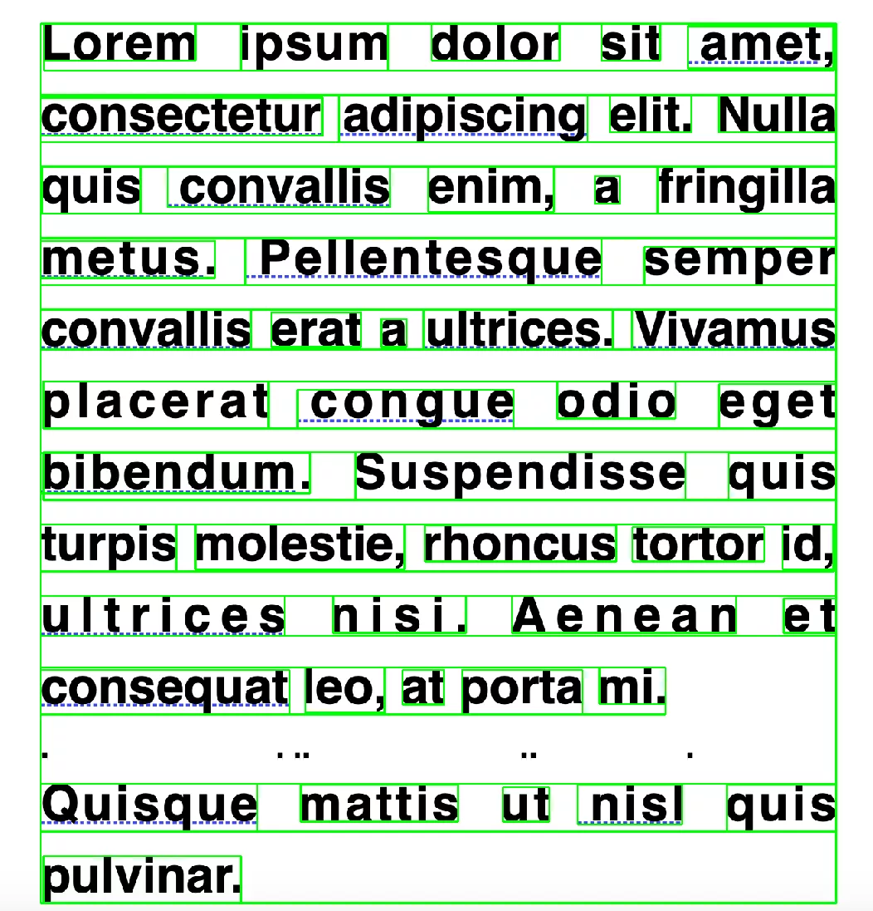<br />图15.单词位置信息的处理<br />通过将在Tesseract的帮助下获得的信息与OpenCV相结合，可以实现图15所示的图像。每个单词和每个单词块都用圆括起来。通过操纵来自Tesseract的信息，也可以只操纵框架中的某些单词。另外，可以应用图像处理以从噪声中清除文本。但是，如果将其他示例中使用的GaussianBlur函数应用于文本，则会对文本的质量和易读性产生不利影响，因此将使用midBlur函数代替GaussianBlur函数。
```python
img = cv2.imread(img_path)
gray_image = cv2.cvtColor(img, cv2.COLOR_BGR2GRAY)
output2 = cv2.medianBlur(gray_image, ksize=5)
plt.imshow(output2)
plt.show()
```
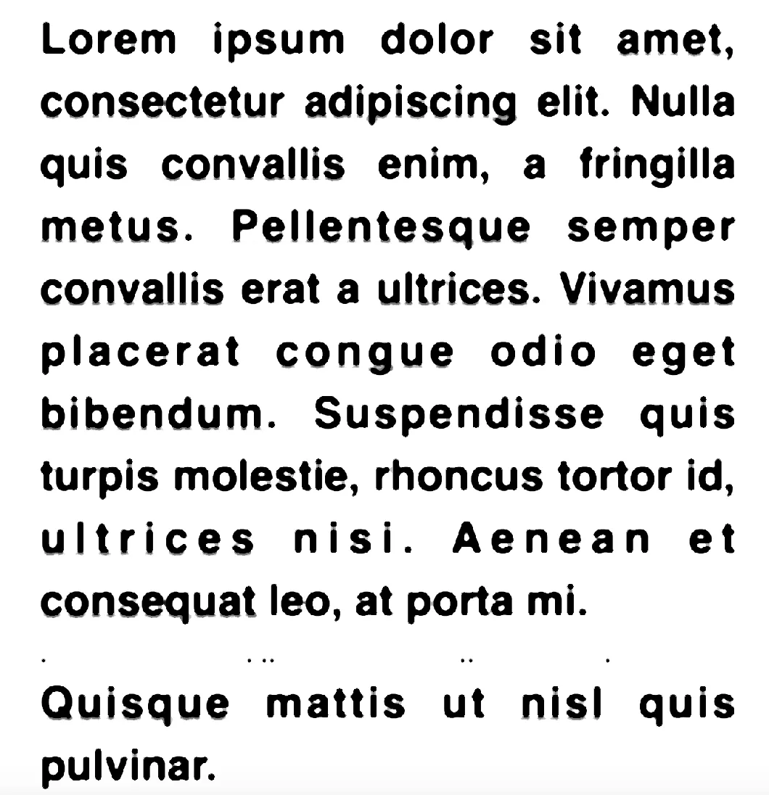<br />图16. meanBlur函数应用的图像

在图14中检查图像时，虚线在某些单词下方清晰可见。在这种情况下，光学字符识别引擎可能会误读某些单词。图16中位数模糊处理的结果是，这些虚线消失了。<br />注意：必须检查黑白图像矩阵的尺寸。大多数情况下，即使是黑白，也有RGB尺寸。这可能会导致在OpenCV的某些函数中出现尺寸错误。<br />侵蚀和膨胀功能也可以用来消除图像格式文本的干扰。
```python
kernel = np.ones((3,3),np.uint8)
output2 = cv2.dilate(gray_image,kernel,iterations = 3)
plt.imshow(output2)
plt.show()
```
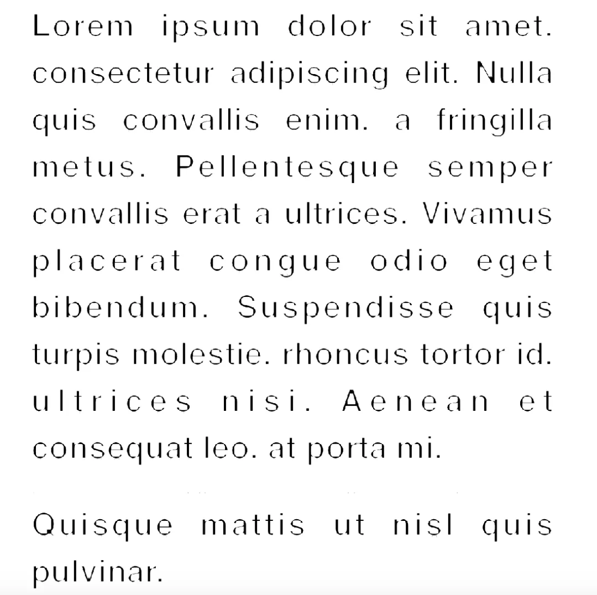<br />图17.膨胀函数产生的图像<br />当查看图14中的文本时，将看到存在一些点形噪声。可以看出，使用图17中的膨胀函数可以大大消除这些噪声。可以通过更改创建的滤波器和迭代参数值来更改制品的稀疏率。必须正确确定这些值，以保持文本的可读性。与扩张功能相反，侵蚀功能使文本变粗。
```python
kernel = np.ones((3,3),np.uint8)
output2 = cv2.erode(gray_image,kernel,iterations = 3)
plt.imshow(output2)
plt.show()
```
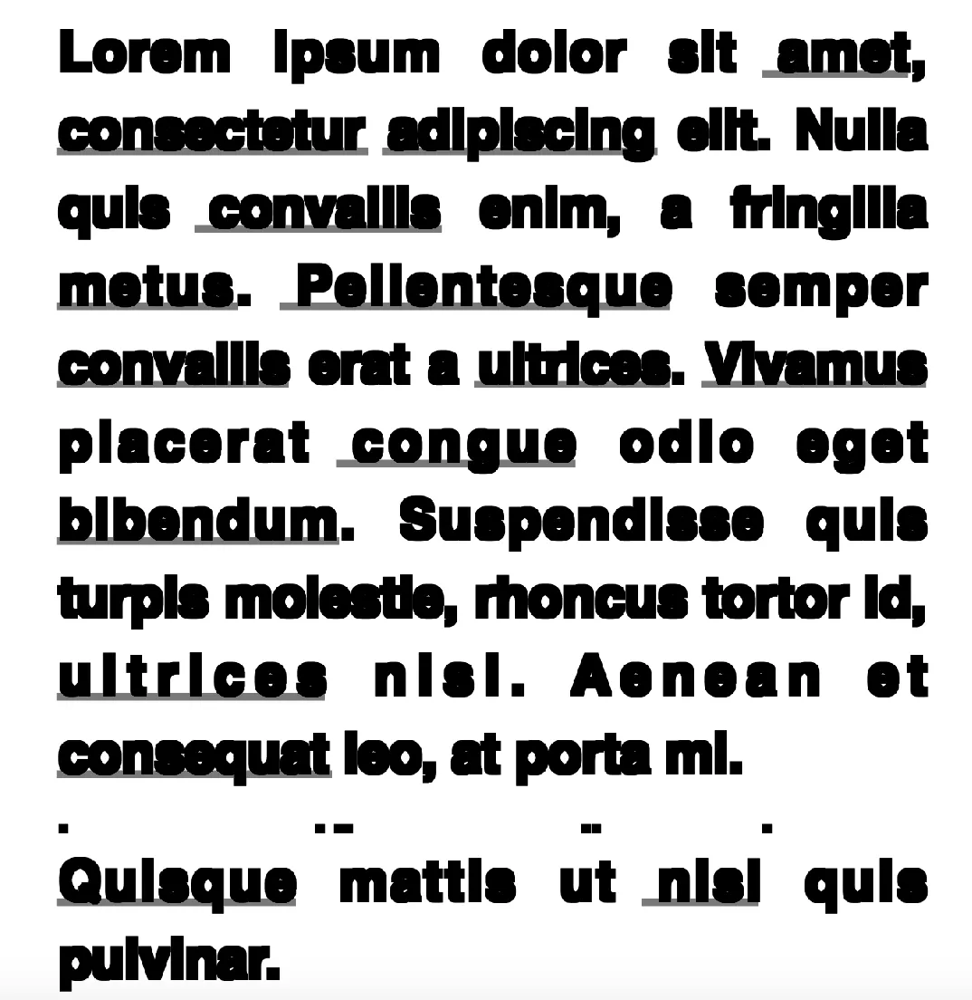<br />图18.侵蚀功能产生的图像<br />如图18所示，使用Erode功能可以增加字体的粗细。这是一种通常用来提高用精细字体书写的文章质量的方法。这里要注意的另一点是，文章为黑色，背景为白色。如果背景为黑色，文本为白色，则将取代这些功能的过程。<br />OpenCV用于提高某些图像的质量。例如对比度差的图像的直方图值分布在狭窄的区域。<br />为了提高该图像的对比度，有必要将直方图值分布在很大的区域上。equalizeHist函数用于这些操作。对图19中的图像进行直方图均衡。<br />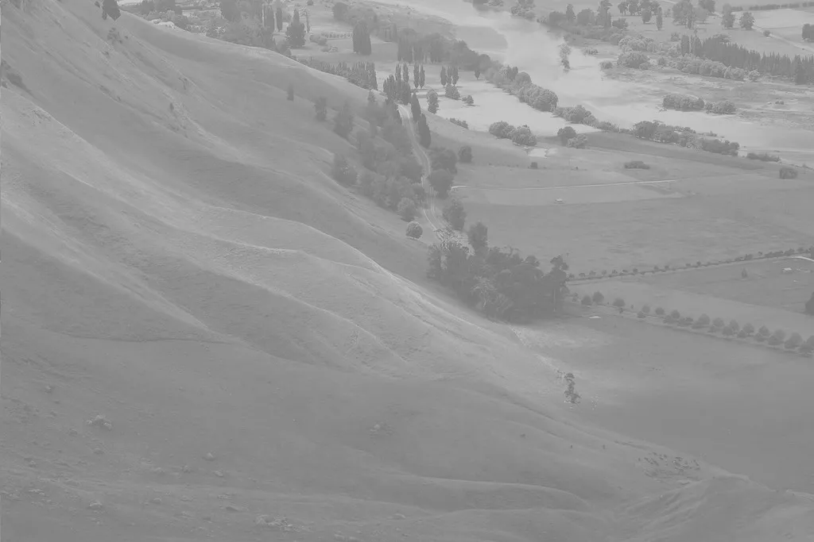<br />图19.直方图值未修改的图像（原始图像）<br />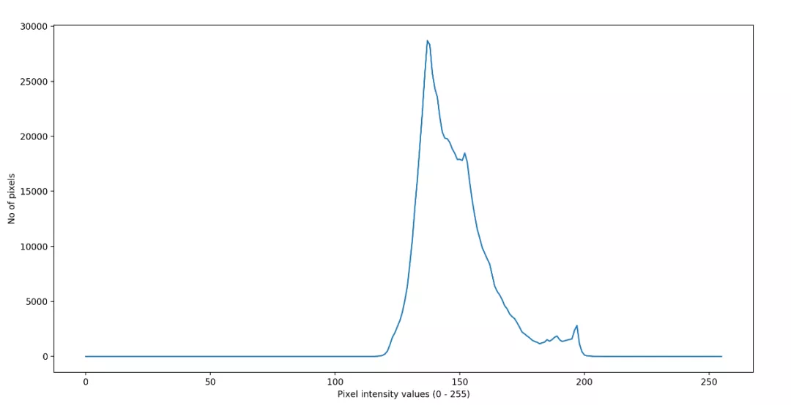<br />图20.原始图像的直方图分布<br />原始图像的直方图（图19）可以在图20中看到。<br />图像中对象的可见性很低。
```python
equ = cv2.equalizeHist(gray_image)
plt.imshow(equ)
```
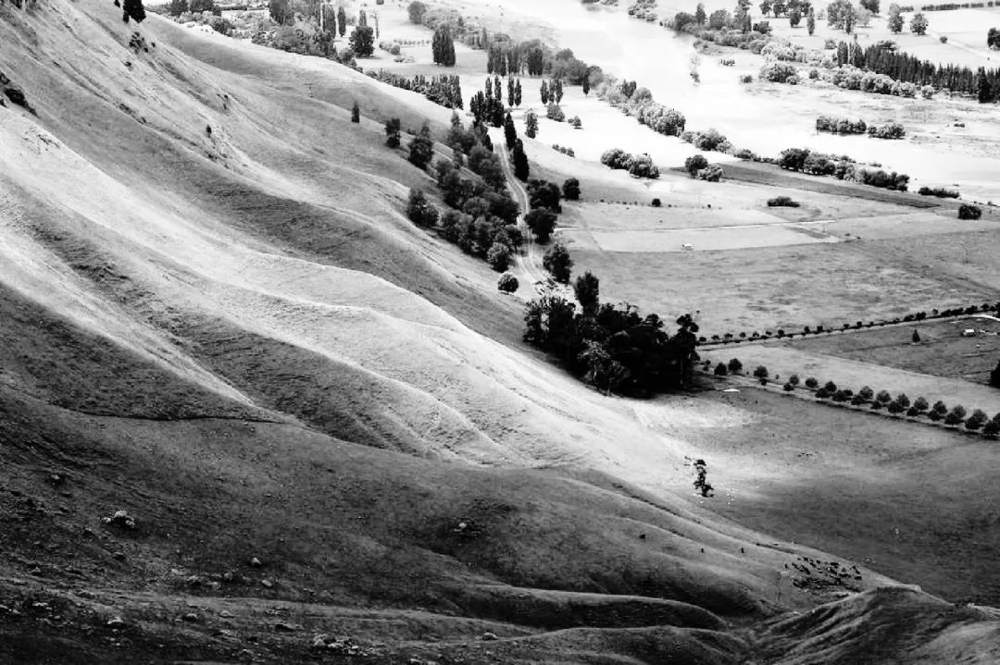<br />图21.直方图均衡图像<br />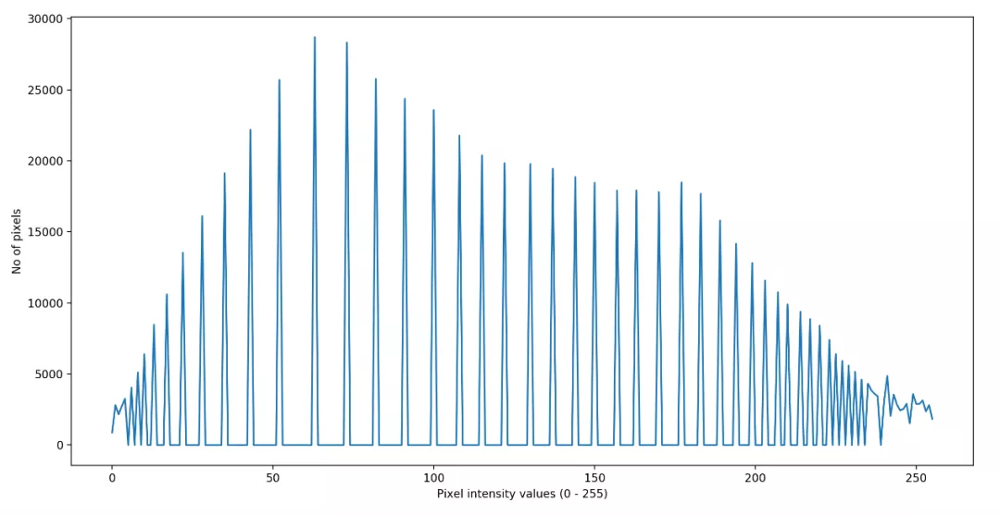<br />图22.直方图均衡图像的直方图分布<br />直方图由equalizeHist函数均衡的图像如图21所示。图像的质量和清晰度得到了提高。此外，在图22中完成了直方图均衡化的图像的直方图图形可以看出，在直方图均衡化之后，图20中一个区域中收集的值分布在更大的区域上。可以为每个图像检查这些直方图值。必要时可以通过使直方图相等来提高图像质量。
