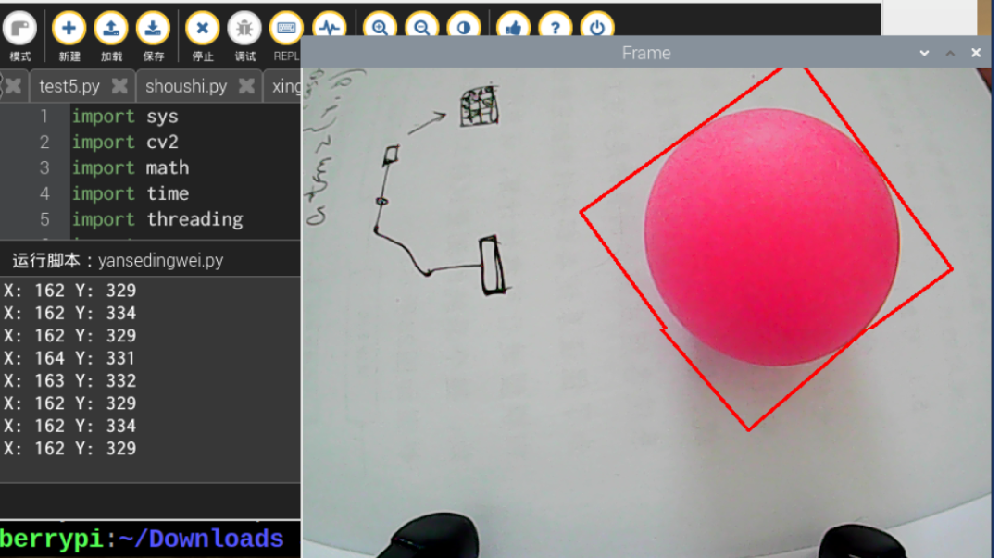
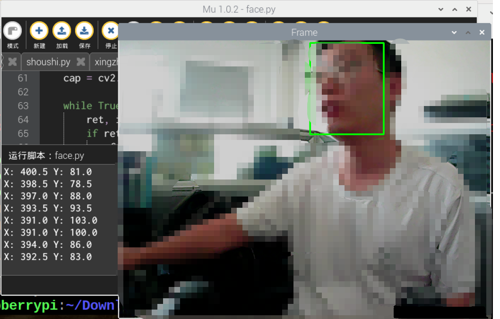
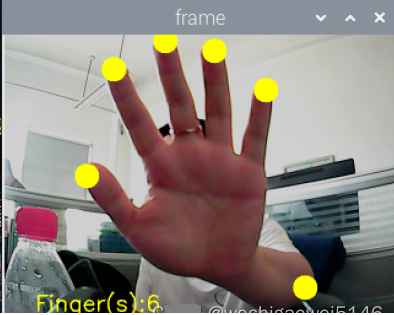
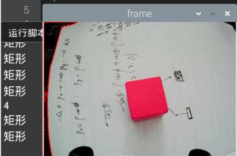
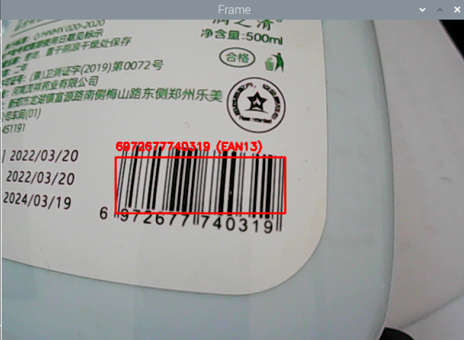
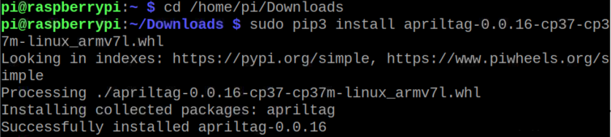
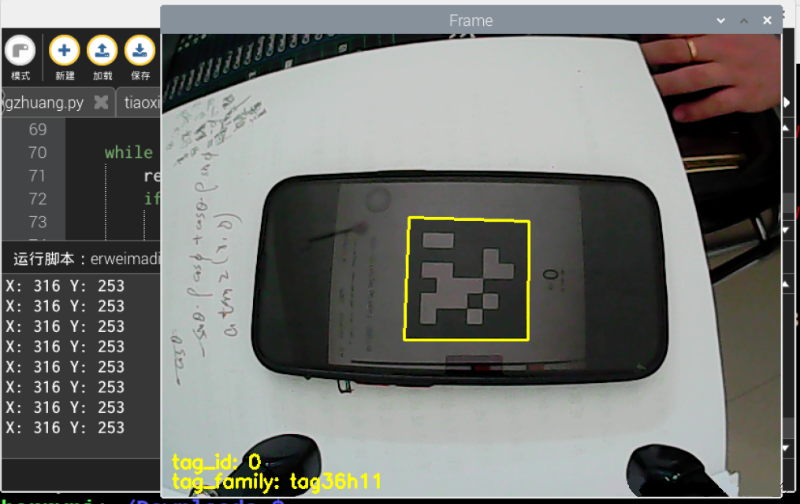

OpenCV
<a name="vmRNF"></a>
## 目录
准备<br />配置<br />测试<br />程序

- 颜色识别跟踪
- 人脸识别
- 手势识别
- 形状识别
- 条码识别
- 二维码识别

故障问题解决

- module 'cv2' has no attribute 'dnn'
- ImportError:numpy.core.multiarray failed to import             1121:error:(-2:Unspecified error)FAILED:fs.is_open(). Can't open
<a name="N1JW2"></a>
## 准备

- 树莓派4B
- USB免驱摄像头
<a name="QWWEG"></a>
## 配置
安装python-opencv<br />安装numpy，`pip3 install -U numpy`<br />安装opencv-python，opencv-contrib-python
<a name="LFYQk"></a>
## 测试
图片：
```python
import cv2
cap = cv2.VideoCapture(0)
while True:
    ret, frame = cap.read()
    cv2.imshow('frame', frame)
    # 这一步必须有，否则图像无法显示
    if cv2.waitKey(1) & 0xFF == ord('q'):
        break

#当一切完成时，释放捕获
cap.release()
cv2.destroyAllWindows()
```
<a name="zxxNT"></a>
## 程序
<a name="z6oww"></a>
### 颜色识别跟踪
```python
import sys
import cv2
import math
import time
import threading
import numpy as np
import HiwonderSDK.yaml_handle as yaml_handle

if sys.version_info.major == 2:
    print('Please run this program with python3!')
    sys.exit(0)

range_rgb = {
    'red':   (0, 0, 255),
    'blue':  (255, 0, 0),
    'green': (0, 255, 0),
    'black': (0, 0, 0),
    'white': (255, 255, 255)}

__target_color = ('red', 'green', 'blue')
lab_data = yaml_handle.get_yaml_data(yaml_handle.lab_file_path)
    
# 找出面积最大的轮廓
# 参数为要比较的轮廓的列表
def getAreaMaxContour(contours):
    
    contour_area_temp = 0
    contour_area_max = 0
    area_max_contour = None

    for c in contours:  # 历遍所有轮廓
        contour_area_temp = math.fabs(cv2.contourArea(c))  # 计算轮廓面积
        if contour_area_temp > contour_area_max:
            contour_area_max = contour_area_temp
            if contour_area_temp > 300:  # 只有在面积大于300时，最大面积的轮廓才是有效的，以过滤干扰
                area_max_contour = c

    return area_max_contour, contour_area_max  # 返回最大的轮廓

detect_color = None
color_list = []
start_pick_up = False
size = (640, 480)
def run(img):
    global rect
    global detect_color
    global start_pick_up
    global color_list
        
    img_copy = img.copy()
    frame_resize = cv2.resize(img_copy, size, interpolation=cv2.INTER_NEAREST)
    frame_gb = cv2.GaussianBlur(frame_resize, (3, 3), 3)
    frame_lab = cv2.cvtColor(frame_gb, cv2.COLOR_BGR2LAB)  # 将图像转换到LAB空间
    color_area_max = None
    max_area = 0
    areaMaxContour_max = 0
    if not start_pick_up:
        for i in lab_data:
            if i in __target_color:
                frame_mask = cv2.inRange(frame_lab,
                                             (lab_data[i]['min'][0],
                                              lab_data[i]['min'][1],
                                              lab_data[i]['min'][2]),
                                             (lab_data[i]['max'][0],
                                              lab_data[i]['max'][1],
                                              lab_data[i]['max'][2]))  #对原图像和掩模进行位运算
                opened = cv2.morphologyEx(frame_mask, cv2.MORPH_OPEN, np.ones((3, 3), np.uint8))  # 开运算
                closed = cv2.morphologyEx(opened, cv2.MORPH_CLOSE, np.ones((3, 3), np.uint8))  # 闭运算
                contours = cv2.findContours(closed, cv2.RETR_EXTERNAL, cv2.CHAIN_APPROX_NONE)[-2]  # 找出轮廓
                areaMaxContour, area_max = getAreaMaxContour(contours)  # 找出最大轮廓
                
                if areaMaxContour is not None:
                    if area_max > max_area:  # 找最大面积
                        max_area = area_max
                        color_area_max = i
                        areaMaxContour_max = areaMaxContour
        
        if max_area > 500:  # 有找到最大面积
            rect = cv2.minAreaRect(areaMaxContour_max)
            box = np.int0(cv2.boxPoints(rect))
            y = int((box[1][0]-box[0][0])/2+box[0][0])
            x = int((box[2][1]-box[0][1])/2+box[0][1])
            print('X:',x,'Y:',y) #打印坐标
            cv2.drawContours(img, [box], -1, range_rgb[color_area_max], 2)
            if not start_pick_up:
                if color_area_max == 'red':  # 红色最大
                    color = 1
                elif color_area_max == 'green':  # 绿色最大
                    color = 2
                elif color_area_max == 'blue':  # 蓝色最大
                    color = 3
                else:
                    color = 0
                color_list.append(color)
                if len(color_list) == 3:  # 多次判断
                    # 取平均值
                    color = int(round(np.mean(np.array(color_list))))
                    color_list = []
                    if color == 1:
                        detect_color = 'red'

                    elif color == 2:
                        detect_color = 'green'

                    elif color == 3:
                        detect_color = 'blue'

                    else:
                        detect_color = 'None'

##    cv2.putText(img, "Color: " + detect_color, (10, img.shape[0] - 10), cv2.FONT_HERSHEY_SIMPLEX, 0.65, detect_color, 2)
    return img

if __name__ == '__main__':
    
    cap = cv2.VideoCapture(-1) #读取摄像头
    __target_color = ('red',)
    while True:
        ret, img = cap.read()
        if ret:
            frame = img.copy()
            Frame = run(frame)           
            cv2.imshow('Frame', Frame)
            key = cv2.waitKey(1)
            if key == 27:
                break
        else:
            time.sleep(0.01)
    cv2.destroyAllWindows()
```
效果：<br />
<a name="TkOV9"></a>
### 人脸识别
利用了Caffe训练的人脸数据集。
```python
import sys
import numpy as np
import cv2
import math
import time
import threading

# 人脸检测
if sys.version_info.major == 2:
    print('Please run this program with python3!')
    sys.exit(0)

# 阈值
conf_threshold = 0.6

# 模型位置
modelFile = "/home/pi/mu_code/models/res10_300x300_ssd_iter_140000_fp16.caffemodel"
configFile = "/home/pi/mu_code/models/deploy.prototxt"
net = cv2.dnn.readNetFromCaffe(configFile, modelFile)

frame_pass = True
x1=x2=y1=y2 = 0
old_time = 0

def run(img):
    global old_time
    global frame_pass
    global x1,x2,y1,y2

    if not frame_pass:
        frame_pass = True
        cv2.rectangle(img, (x1, y1), (x2, y2), (0, 255, 0), 2, 8)
        x1=x2=y1=y2 = 0
        return img
    else:
        frame_pass = False

    img_copy = img.copy()
    img_h, img_w = img.shape[:2]
    blob = cv2.dnn.blobFromImage(img_copy, 1, (100, 100), [104, 117, 123], False, False)
    net.setInput(blob)
    detections = net.forward() #计算识别

    for i in range(detections.shape[2]):
        confidence = detections[0, 0, i, 2]
        if confidence > conf_threshold:
            #识别到的人了的各个坐标转换会未缩放前的坐标
            x1 = int(detections[0, 0, i, 3] * img_w)
            y1 = int(detections[0, 0, i, 4] * img_h)
            x2 = int(detections[0, 0, i, 5] * img_w)
            y2 = int(detections[0, 0, i, 6] * img_h)
            cv2.rectangle(img, (x1, y1), (x2, y2), (0, 255, 0), 2, 8) #将识别到的人脸框出
            
            X = (x1 + x2)/2
            Y = (y1 + y2)/2
            print('X:',X,'Y:',Y)
    return img

if __name__ == '__main__':

    cap = cv2.VideoCapture(-1) #读取摄像头

    while True:
        ret, img = cap.read()
        if ret:
            frame = img.copy()
            Frame = run(frame)
            cv2.imshow('Frame', Frame)
            key = cv2.waitKey(1)
            if key == 27:
                break
        else:
            time.sleep(0.01)
    cv2.destroyAllWindows()
```

<a name="V8nDm"></a>
### 手势识别
```python
import os
import sys
import cv2
import math
import time
import numpy as np
import HiwonderSDK.Misc as Misc

if sys.version_info.major == 2:
    print('Please run this program with python3!')
    sys.exit(0)

__finger = 0
__t1 = 0
__step = 0
__count = 0
__get_finger = False

# 初始位置
def initMove():
    pass

def reset():
    global __finger, __t1, __step, __count, __get_finger
    __finger = 0
    __t1 = 0
    __step = 0
    __count = 0
    __get_finger = False
    
def init():
    reset()
    initMove()

class Point(object):  # 一个坐标点
    x = 0
    y = 0

    def __init__(self, x=0, y=0):
        self.x = x
        self.y = y

class Line(object):  # 一条线
    def __init__(self, p1, p2):
        self.p1 = p1
        self.p2 = p2

def GetCrossAngle(l1, l2):
    '''
    求两直线之间的夹角
    :param l1:
    :param l2:
    :return:
    '''
    arr_0 = np.array([(l1.p2.x - l1.p1.x), (l1.p2.y - l1.p1.y)])
    arr_1 = np.array([(l2.p2.x - l2.p1.x), (l2.p2.y - l2.p1.y)])
    cos_value = (float(arr_0.dot(arr_1)) / (np.sqrt(arr_0.dot(arr_0))
                                            * np.sqrt(arr_1.dot(arr_1))))   # 注意转成浮点数运算
    return np.arccos(cos_value) * (180/np.pi)

def distance(start, end):
    """
    计算两点的距离
    :param start: 开始点
    :param end: 结束点
    :return: 返回两点之间的距离
    """
    s_x, s_y = start
    e_x, e_y = end
    x = s_x - e_x
    y = s_y - e_y
    return math.sqrt((x**2)+(y**2))

def image_process(image, rw, rh):  # hsv
    '''
    # 光线影响，请修改 cb的范围
    # 正常黄种人的Cr分量大约在140~160之间
    识别肤色
    :param image: 图像
    :return: 识别后的二值图像
    '''
    frame_resize = cv2.resize(image, (rw, rh), interpolation=cv2.INTER_CUBIC)
    YUV = cv2.cvtColor(frame_resize, cv2.COLOR_BGR2YCR_CB)  # 将图片转化为YCrCb
    _, Cr, _ = cv2.split(YUV)  # 分割YCrCb
    Cr = cv2.GaussianBlur(Cr, (5, 5), 0)
    
    _, Cr = cv2.threshold(Cr, 135, 160, cv2.THRESH_BINARY +
                          cv2.THRESH_OTSU)  # OTSU 二值化

    # 开运算，去除噪点
    open_element = cv2.getStructuringElement(cv2.MORPH_RECT, (5, 5))
    opend = cv2.morphologyEx(Cr, cv2.MORPH_OPEN, open_element)
    # 腐蚀
    kernel = np.ones((3, 3), np.uint8)
    erosion = cv2.erode(opend, kernel, iterations=3)

    return erosion

def get_defects_far(defects, contours, img):
    '''
    获取凸包中最远的点
    '''
    if defects is None and contours is None:
        return None
    far_list = []
    for i in range(defects.shape[0]):
        s, e, f, d = defects[i, 0]
        start = tuple(contours[s][0])
        end = tuple(contours[e][0])
        far = tuple(contours[f][0])
        # 求两点之间的距离
        a = distance(start, end)
        b = distance(start, far)
        c = distance(end, far)
        # 求出手指之间的角度
        angle = math.acos((b ** 2 + c ** 2 - a ** 2) /
                          (2 * b * c)) * 180 / math.pi
        # 手指之间的角度一般不会大于100度
        # 小于90度
        if angle <= 75:  # 90:
            # cv.circle(img, far, 10, [0, 0, 255], 1)
            far_list.append(far)
    return far_list

def get_max_coutour(cou, max_area):
    '''
    找出最大的轮廓
    根据面积来计算，找到最大后，判断是否小于最小面积，如果小于侧放弃
    :param cou: 轮廓
    :return: 返回最大轮廓
    '''
    max_coutours = 0
    r_c = None
    if len(cou) < 1:
        return None
    else:
        for c in cou:
            # 计算面积
            temp_coutours = math.fabs(cv2.contourArea(c))
            if temp_coutours > max_coutours:
                max_coutours = temp_coutours
                cc = c
        # 判断所有轮廓中最大的面积
        if max_coutours > max_area:
            r_c = cc
        return r_c

def find_contours(binary, max_area):
    '''
    CV_RETR_EXTERNAL - 只提取最外层的轮廓
    CV_RETR_LIST - 提取所有轮廓，并且放置在 list 中
    CV_RETR_CCOMP - 提取所有轮廓，并且将其组织为两层的 hierarchy: 顶层为连通域的外围边界，次层为洞的内层边界。
    CV_RETR_TREE - 提取所有轮廓，并且重构嵌套轮廓的全部 hierarchy
    method  逼近方法 (对所有节点, 不包括使用内部逼近的 CV_RETR_RUNS).
    CV_CHAIN_CODE - Freeman 链码的输出轮廓. 其它方法输出多边形(定点序列).
    CV_CHAIN_APPROX_NONE - 将所有点由链码形式翻译(转化）为点序列形式
    CV_CHAIN_APPROX_SIMPLE - 压缩水平、垂直和对角分割，即函数只保留末端的象素点;
    CV_CHAIN_APPROX_TC89_L1,
    CV_CHAIN_APPROX_TC89_KCOS - 应用 Teh-Chin 链逼近算法. CV_LINK_RUNS - 通过连接为 1 的水平碎片使用完全不同的轮廓提取算法
    :param binary: 传入的二值图像
    :return: 返回最大轮廓
    '''
    # 找出所有轮廓
    contours = cv2.findContours(
        binary, cv2.RETR_EXTERNAL, cv2.CHAIN_APPROX_NONE)[-2]
    # 返回最大轮廓
    return get_max_coutour(contours, max_area)

def get_hand_number(binary_image, contours, rw, rh, rgb_image):
    '''
    :param binary_image:
    :param rgb_image:
    :return:
    '''
    # # 2、找出手指尖的位置
    # # 查找轮廓，返回最大轮廓
    x = 0
    y = 0
    coord_list = []
    new_hand_list = []  # 获取最终的手指间坐标

    if contours is not None:
        # 周长  0.035 根据识别情况修改，识别越好，越小
        epsilon = 0.020 * cv2.arcLength(contours, True)
        # 轮廓相似
        approx = cv2.approxPolyDP(contours, epsilon, True)
        # cv2.approxPolyDP()的参数2(epsilon)是一个距离值，表示多边形的轮廓接近实际轮廓的程度，值越小，越精确；参数3表示是否闭合
        # cv2.polylines(rgb_image, [approx], True, (0, 255, 0), 1)#画多边形

        if approx.shape[0] >= 3:  # 有三个点以上#多边形最小为三角形，三角形需要三个点
            approx_list = []
            for j in range(approx.shape[0]):  # 将多边形所有的点储存在一个列表里
                # cv2.circle(rgb_image, (approx[j][0][0],approx[j][0][1]), 5, [255, 0, 0], -1)
                approx_list.append(approx[j][0])
            approx_list.append(approx[0][0])    # 在末尾添加第一个点
            approx_list.append(approx[1][0])    # 在末尾添加第二个点

            for i in range(1, len(approx_list) - 1):
                p1 = Point(approx_list[i - 1][0],
                           approx_list[i - 1][1])    # 声明一个点
                p2 = Point(approx_list[i][0], approx_list[i][1])
                p3 = Point(approx_list[i + 1][0], approx_list[i + 1][1])
                line1 = Line(p1, p2)    # 声明一条直线
                line2 = Line(p2, p3)
                angle = GetCrossAngle(line1, line2)     # 获取两条直线的夹角
                angle = 180 - angle     #
                # print angle
                if angle < 42:  # 求出两线相交的角度，并小于37度的
                    #cv2.circle(rgb_image, tuple(approx_list[i]), 5, [255, 0, 0], -1)
                    coord_list.append(tuple(approx_list[i]))

        ##############################################################################
        # 去除手指间的点
        # 1、获取凸包缺陷点，最远点点
        #cv2.drawContours(rgb_image, contours, -1, (255, 0, 0), 1)
        try:
            hull = cv2.convexHull(contours, returnPoints=False)
            # 找凸包缺陷点 。返回的数据， 【起点，终点， 最远的点， 到最远点的近似距离】
            defects = cv2.convexityDefects(contours, hull)
            # 返回手指间的点
            hand_coord = get_defects_far(defects, contours, rgb_image)
        except:
            return rgb_image, 0
        
        # 2、从coord_list 去除最远点
        alike_flag = False
        if len(coord_list) > 0:
            for l in range(len(coord_list)):
                for k in range(len(hand_coord)):
                    if (-10 <= coord_list[l][0] - hand_coord[k][0] <= 10 and
                            -10 <= coord_list[l][1] - hand_coord[k][1] <= 10):    # 最比较X,Y轴, 相近的去除
                        alike_flag = True
                        break   #
                if alike_flag is False:
                    new_hand_list.append(coord_list[l])
                alike_flag = False
            # 获取指尖的坐标列表并显示
            for i in new_hand_list:
                j = list(tuple(i))
                j[0] = int(Misc.map(j[0], 0, rw, 0, 640))
                j[1] = int(Misc.map(j[1], 0, rh, 0, 480))
                cv2.circle(rgb_image, (j[0], j[1]), 20, [0, 255, 255], -1)
    fingers = len(new_hand_list)

    return rgb_image, fingers


def run(img, debug=False):

    global __act_map, __get_finger
    global __step, __count, __finger

    binary = image_process(img, 320, 240)
    contours = find_contours(binary, 3000)
    img, finger = get_hand_number(binary, contours, 320, 240, img)
    if not __get_finger:
        if finger == __finger:
            __count += 1
        else:
            __count = 0
        __finger = finger
        
    cv2.putText(img, "Finger(s):%d" % __finger, (50, 480 - 30),
                cv2.FONT_HERSHEY_SIMPLEX, 1.2, (0, 255, 255), 2)#将识别到的手指个数写在图片上
    
    return img 

if __name__ == '__main__':
    
    init()
    cap = cv2.VideoCapture(-1) #读取摄像头
    while True:
        ret, img = cap.read()
        if ret:
            frame = img.copy()
            Frame = run(frame)           
            frame_resize = cv2.resize(Frame, (320, 240))
            cv2.imshow('frame', frame_resize)
            key = cv2.waitKey(1)
            if key == 27:
                break
        else:
            time.sleep(0.01)
    cv2.destroyAllWindows()
```

<a name="l38wH"></a>
### 形状识别
```python
import sys
import cv2
import math
import time
import threading
import numpy as np
import HiwonderSDK.tm1640 as tm
import RPi.GPIO as GPIO

GPIO.setwarnings(False)
GPIO.setmode(GPIO.BCM)

color_range = {
'red': [(0, 101, 177), (255, 255, 255)], 
'green': [(47, 0, 135), (255, 119, 255)], 
'blue': [(0, 0, 0), (255, 255, 115)], 
'black': [(0, 0, 0), (41, 255, 136)], 
'white': [(193, 0, 0), (255, 250, 255)], 
}

if sys.version_info.major == 2:
    print('Please run this program with python3!')
    sys.exit(0)
    
range_rgb = {
    'red': (0, 0, 255),
    'blue': (255, 0, 0),
    'green': (0, 255, 0),
    'black': (0, 0, 0),
    'white': (255, 255, 255),
}

# 找出面积最大的轮廓
# 参数为要比较的轮廓的列表
def getAreaMaxContour(contours):
    contour_area_temp = 0
    contour_area_max = 0
    area_max_contour = None

    for c in contours:  # 历遍所有轮廓
        contour_area_temp = math.fabs(cv2.contourArea(c))  # 计算轮廓面积
        if contour_area_temp > contour_area_max:
            contour_area_max = contour_area_temp
            if contour_area_temp > 50:  # 只有在面积大于50时，最大面积的轮廓才是有效的，以过滤干扰
                area_max_contour = c

    return area_max_contour, contour_area_max  # 返回最大的轮廓

shape_length = 0

def move():
    global shape_length
    
    while True:
        if shape_length == 3:
            print('三角形')
            ## 显示'三角形'
            tm.display_buf = (0x80, 0xc0, 0xa0, 0x90, 0x88, 0x84, 0x82, 0x81,
                              0x81, 0x82, 0x84,0x88, 0x90, 0xa0, 0xc0, 0x80)
            tm.update_display()
            
        elif shape_length == 4:
            print('矩形')
            ## 显示'矩形'
            tm.display_buf = (0x00, 0x00, 0x00, 0x00, 0xff, 0x81, 0x81, 0x81,
                              0x81, 0x81, 0x81,0xff, 0x00, 0x00, 0x00, 0x00)
            tm.update_display()
            
        elif shape_length >= 6:           
            print('圆')
            ## 显示'圆形'
            tm.display_buf = (0x00, 0x00, 0x00, 0x00, 0x1c, 0x22, 0x41, 0x41,
                              0x41, 0x22, 0x1c,0x00, 0x00, 0x00, 0x00, 0x00)
            tm.update_display()
            
        time.sleep(0.01)
               
# 运行子线程
th = threading.Thread(target=move)
th.setDaemon(True)
th.start()

shape_list = []
action_finish = True

if __name__ == '__main__':
    
    cap = cv2.VideoCapture(-1)
    while True:
        ret,img = cap.read()
        if ret:
            img_copy = img.copy()
            img_h, img_w = img.shape[:2]
            frame_gb = cv2.GaussianBlur(img_copy, (3, 3), 3)      
            frame_lab = cv2.cvtColor(frame_gb, cv2.COLOR_BGR2LAB)  # 将图像转换到LAB空间
            max_area = 0
            color_area_max = None    
            areaMaxContour_max = 0

            if action_finish:
                for i in color_range:
                    if i != 'white':
                        frame_mask = cv2.inRange(frame_lab, color_range[i][0], color_range[i][1])  #对原图像和掩模进行位运算
                        opened = cv2.morphologyEx(frame_mask, cv2.MORPH_OPEN, np.ones((6,6),np.uint8))  #开运算
                        closed = cv2.morphologyEx(opened, cv2.MORPH_CLOSE, np.ones((6,6),np.uint8)) #闭运算
                        contours = cv2.findContours(closed, cv2.RETR_EXTERNAL, cv2.CHAIN_APPROX_NONE)[-2]  #找出轮廓
                        areaMaxContour, area_max = getAreaMaxContour(contours)  #找出最大轮廓
                        if areaMaxContour is not None:
                            if area_max > max_area:#找最大面积
                                max_area = area_max
                                color_area_max = i
                                areaMaxContour_max = areaMaxContour
            if max_area > 200:                   
                cv2.drawContours(img, areaMaxContour_max, -1, (0, 0, 255), 2)
                # 识别形状
                # 周长  0.035 根据识别情况修改，识别越好，越小
                epsilon = 0.035 * cv2.arcLength(areaMaxContour_max, True)
                # 轮廓相似
                approx = cv2.approxPolyDP(areaMaxContour_max, epsilon, True)
                shape_list.append(len(approx))
                if len(shape_list) == 30:
                    shape_length = int(round(np.mean(shape_list)))                            
                    shape_list = []
                    print(shape_length)
                    
            frame_resize = cv2.resize(img, (320, 240))
            cv2.imshow('frame', frame_resize)
            key = cv2.waitKey(1)
            if key == 27:
                break
        else:
            time.sleep(0.01)
    my_camera.camera_close()
    cv2.destroyAllWindows()
```
`approxPolyDP()`函数用于将一个连续光滑曲线折线化。<br />以代码`approx=cv2.approxPolyDP(areaMaxContour_max,epsilon,True)`为例，括号内的参数含义如下：<br />第一个参数“`areaMaxContour_max`”是输入的形状轮廓；<br />第二个参数“`epsilon`”是距离值，表示多边形的轮廓接近实际轮廓的程度，值越小，越精确；<br />第三个参数“`True`”表示轮廓为闭合曲线。<br />`cv2.approxPolyDP()`函数的输出为近似多边形的顶点坐标，根据顶点的数量判断形状。<br />
<a name="FWW0Q"></a>
### 条码识别
首先安装pyzbar，`pip3 install pyzbar`
```python
import cv2
import sys
from pyzbar import pyzbar

if sys.version_info.major == 2:
    print('Please run this program with python3!')
    sys.exit(0)

def run(image):
    # 找到图像中的条形码并解码每个条形码
    barcodes = pyzbar.decode(image)
    # 循环检测到的条形码
    for barcode in barcodes:
        # 提取条形码的边界框位置
        (x, y, w, h) = barcode.rect
        # 绘出图像上条形码的边框
        cv2.rectangle(image, (x, y), (x + w, y + h), (0, 0, 255), 2)

        barcodeData = barcode.data.decode("utf-8")
        barcodeType = barcode.type
        # 在图像上绘制条形码数据和条形码类型
        text = "{} ({})".format(barcodeData, barcodeType)
        cv2.putText(image, text, (x, y - 10), cv2.FONT_HERSHEY_SIMPLEX, 0.5, (0, 0, 255), 2)

    return image

if __name__ == '__main__':
    
    cap = cv2.VideoCapture(-1) #读取摄像头
    
    while True:
        ret, img = cap.read()
        if ret:
            frame = img.copy()
            Frame = run(frame)           
            cv2.imshow('Frame', Frame)
            key = cv2.waitKey(1)
            if key == 27:
                break
        else:
            time.sleep(0.01)
    cv2.destroyAllWindows()
```

<a name="nRVGG"></a>
### 二维码识别
安装apriltag，发现安装失败。还是老办法下载到本地以后安装。<br />在[https://www.piwheels.org/simple/apriltag/](https://www.piwheels.org/simple/apriltag/)，这里下载了apriltag-0.0.16-cp37-cp37mlinux_armv7l.whl。<br />使用FileZilla传输到树莓派，打开whl文件所在的树莓派目录，安装whl文件，显示成功安装。
```bash
cd /home/pi/Downloads
sudo pip3 install apriltag-0.0.16-cp37-cp37m-linux_armv7l.whl
```

```python
import sys
import cv2
import math
import time
import threading
import numpy as np
import apriltag

#apriltag检测

if sys.version_info.major == 2:
    print('Please run this program with python3!')
    sys.exit(0)

object_center_x = 0.0
object_center_y = 0.0

# 检测apriltag
detector = apriltag.Detector(searchpath=apriltag._get_demo_searchpath())
def apriltagDetect(img):
    global object_center_x, object_center_y
    
    gray = cv2.cvtColor(img, cv2.COLOR_BGR2GRAY)
    detections = detector.detect(gray, return_image=False)

    if len(detections) != 0:
        for detection in detections:                       
            corners = np.rint(detection.corners)  # 获取四个角点
            cv2.drawContours(img, [np.array(corners, np.int)], -1, (0, 255, 255), 2)

            tag_family = str(detection.tag_family, encoding='utf-8')  # 获取tag_family
            tag_id = int(detection.tag_id)  # 获取tag_id

            object_center_x, object_center_y = int(detection.center[0]), int(detection.center[1])  # 中心点
            
            object_angle = int(math.degrees(math.atan2(corners[0][1] - corners[1][1], corners[0][0] - corners[1][0])))  # 计算旋转角
            
            return tag_family, tag_id
            
    return None, None

def run(img):
    global state
    global tag_id
    global action_finish
    global object_center_x, object_center_y
     
    img_h, img_w = img.shape[:2]
    
    tag_family, tag_id = apriltagDetect(img) # apriltag检测
    
    if tag_id is not None:
        print('X:',object_center_x,'Y:',object_center_y)
        cv2.putText(img, "tag_id: " + str(tag_id), (10, img.shape[0] - 30), cv2.FONT_HERSHEY_SIMPLEX, 0.65, [0, 255, 255], 2)
        cv2.putText(img, "tag_family: " + tag_family, (10, img.shape[0] - 10), cv2.FONT_HERSHEY_SIMPLEX, 0.65, [0, 255, 255], 2)
    else:
        cv2.putText(img, "tag_id: None", (10, img.shape[0] - 30), cv2.FONT_HERSHEY_SIMPLEX, 0.65, [0, 255, 255], 2)
        cv2.putText(img, "tag_family: None", (10, img.shape[0] - 10), cv2.FONT_HERSHEY_SIMPLEX, 0.65, [0, 255, 255], 2)
    
    return img

if __name__ == '__main__':
    
    cap = cv2.VideoCapture(-1) #读取摄像头
    
    while True:
        ret, img = cap.read()
        if ret:
            frame = img.copy()
            Frame = run(frame)           
            cv2.imshow('Frame', Frame)
            key = cv2.waitKey(1)
            if key == 27:
                break
        else:
            time.sleep(0.01)
    cv2.destroyAllWindows()
```

<a name="RE5ne"></a>
## 故障问题解决
<a name="Ag2pz"></a>
### module ‘cv2’ has no attribute ‘dnn’
尝试用一下指令都有问题，一直在报错，或者显示无法识别 python-opencv，更换镜像也没用：
```bash
sudo apt install python-opencv
# 或 
sudo apt install python3-opencv 

sudo apt-get install opencv-python
sudo apt-get install opencv-contrib-python

pip install opencv-contrib-python
pip install opencv-python
```
最后，通过下载本地文件的方式安装成功。<br />首先习惯更新树莓派系统和文件
```bash
sudo apt-get update
sudo apt-get upgrade 
```
若下载速度太慢可以考虑换源。
```bash
1) 使用“ sudo nano /etc/apt/sources.list” 命令编辑 sources.list 文件，注释原文件
所有内容，并追加以下内容：
deb http://mirrors.aliyun.com/raspbian/raspbian/ buster main contrib non-free rpi
deb-src http://mirrors.aliyun.com/raspbian/raspbian/ buster main contrib non-free rpi

使用 Ctrl+O 快捷键保存文件，Ctrl+X 退出文件。

2)使用 “sudo nano /etc/apt/sources.list.d/raspi.list” 命令编辑 raspi.list 文件，注释
原文件所有内容，并追加以下内容：
deb http://mirrors.tuna.tsinghua.edu.cn/raspbian/raspbian/ buster main
deb-src http://mirrors.tuna.tsinghua.edu.cn/raspbian/raspbian/ buster main

使用 Ctrl+O 快捷键保存文件，Ctrl+X 退出文件。

3)执行“sudo apt-get update” 命令。

4) 为加速 Python pip 安装速度，特更改 Python 软件源，操作方法：打开树莓派命令行，
输入下面命令：
pip config set global.index-url https://pypi.tuna.tsinghua.edu.cn/simple
pip install pip -U

5) 最后输入指令“sudo reboot”，重新启动树莓派即可。
```
下载whl文件并传到树莓派上，在电脑上打开 [https://www.piwheels.org/simple/opencv-python/](https://www.piwheels.org/simple/opencv-python/)<br />下载与自己python版本相对的whl文件，这里下载的是opencv_python-3.4.10.37-cp37-cp37m-linux_armv7l.whl<br />cp37表示python的版本，armv7表示处理器的架构，树莓派4B选择armv7<br />将其使用FileZilla传输到树莓派，打开whl文件所在的树莓派目录，安装whl文件，显示成功安装opencv-python
```bash
cd /home/pi/Downloads
sudo pip3 install opencv_python-3.4.10.37-cp37-cp37m-linux_armv7l.whl
```
<a name="VRFOY"></a>
### ImportError:numpy.core.multiarray failed to import
先卸载低版本的numpy，再安装新版本的numpy，即
```bash
pip uninstall numpy
pip install -U numpy
```
**无效。**
```bash
pip install numpy --upgrade --force
```
**无效。**<br />查看本地numpy版本：
```bash
pip show numpy
```
在安装opencv-python时，其对应numpy版本为：<br />所以对numpy进行版本降级处理即可：
```bash
pip install -U numpy==1.14.5 -i https://pypi.mirrors.ustc.edu.cn/simple/
```
**无效。**<br />最后，用`pip3 install -U numpy`成功。所以用python3的最好还是用pip3。<br />网上有很多尝试方法，有升级版本的，有降级版本的，各种诡异的现象层出不穷，说法不一。<br />**1121:error:(-2:Unspecified error) FAILED: fs.is_open(). Can’t open**<br />找了半天发现多了个点在开头。
