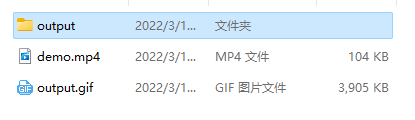
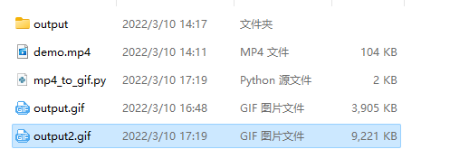

Python<br />mp4转gif的原理其实很简单，就是将mp4文件的帧读出来，然后合并成一张gif图。用cv2和PIL这两个库就可以轻松搞定
```python
import glob

import cv2
from PIL import Image


def convert_mp4_to_jpgs(input_file):
    # 先将mp4文件的所有帧读取出保存为图片
    video_capture = cv2.VideoCapture(input_file)
    still_reading, image = video_capture.read()
    frame_count = 0
    while still_reading:
        cv2.imwrite(f"output/frame_{frame_count:03d}.jpg", image)
        # read next image
        still_reading, image = video_capture.read()
        frame_count += 1


def convert_images_to_gif(output_file):
    # 读取目录下图片，用Pillow模块的Image和所有图片合并
    # 成一张gif
    images = glob.glob(f"output/*.jpg")
    images.sort()
    frames = [Image.open(image) for image in images]
    frame_one = frames[0]
    frame_one.save(output_file, format="GIF", append_images=frames[1:],
                   save_all=True, duration=40, loop=0)


def convert_mp4_to_gif(input_file, output_file):
    convert_mp4_to_jpgs(input_file)
    convert_images_to_gif(output_file)


if __name__ == "__main__":
    convert_mp4_to_gif("demo.mp4", "output.gif")
```
执行完成后，发现gif文件大小暴增<br /><br />可以尝试通过减少帧的数量来优化gif的大小，比如这个视频一共有60帧，只取30帧，大小就会减半
```python
frame_one.save(output_file, format="GIF", append_images=[f for i, f in enumerate(frames[1:]) if i % 2 == 0],
                   save_all=True, duration=40, loop=0)
```
实现逻辑是用`enumerate`函数过滤取偶数张图片来合成，最小大小从3.9M压缩到2M。<br />还有另一个牛逼的库moviepy，2行代码就可以搞定
```python
def mp4_to_gif2():
    clip = VideoFileClip("demo.mp4")
    clip.write_gif("output2.gif")
```
moviepy把实现细节已经封装非常简约了，然后提供了一大堆参数可以让开发者自行配置。但使用moviepy转的文件有9M，可以用参数来优化调整。<br /><br />当然，也可以将gif转回成MP4格式，比如看到一些搞笑的gif将它转换成mp4放到短视频平台。
```python
import moviepy.editor as mp

def convert_gif_to_mp4():
    clip = mp.VideoFileClip("demo.gif")
    clip.write_videofile("output.mp4")
```
