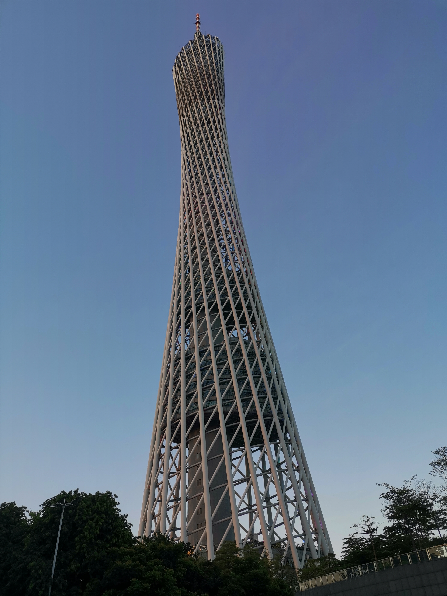
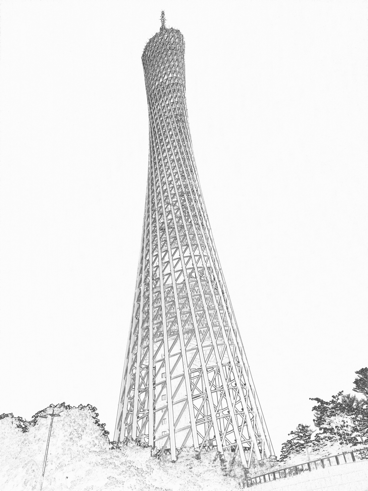
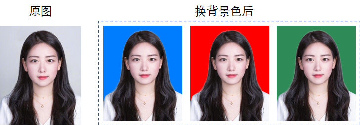
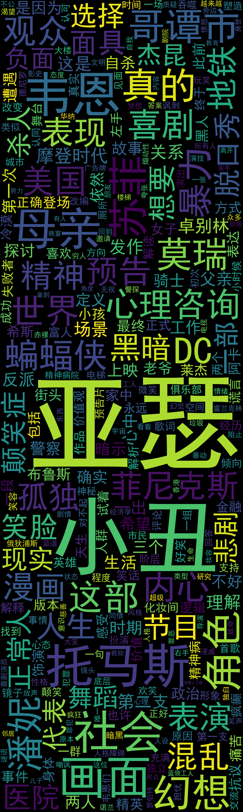
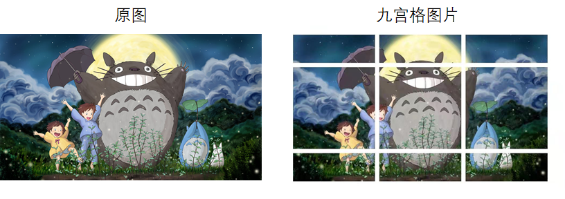

Python
<a name="g4c6y"></a>
## 1、生成手绘图片
现在很多软件可以将照片转换成手绘形式，python也可以实现，而且定制化更强，可批量转换。<br />这里用到pillow库，这是非常牛逼且专业的Python图像处理库<br />原图：<br /><br />生成手绘后：<br /><br />代码：
```python
# -*- coding: UTF-8 -*-
from PIL import Image
import numpy as np

# 原始图片路径
original_image_path = "D:\\LinkSpace\\Picture\\Saved Pictures\\img\\IMG_20210708_185708.jpg"
# 要生成的手绘图片路径，可自定义
handdrawn_image_path = "D:\\LinkSpace\\Picture\\Saved Pictures\\img\\IMG_20210708_185708-手绘.jpg"

# 加载原图，将图像转化为数组数据
a = np.asarray(Image.open(original_image_path).convert('L')).astype('float')
depth = 10.

# 取图像灰度的梯度值
grad = np.gradient(a)

# 取横纵图像梯度值
grad_x, grad_y = grad
grad_x = grad_x * depth / 100.
grad_y = grad_y * depth / 100.
A = np.sqrt(grad_x ** 2 + grad_y ** 2 + 1.)
uni_x = grad_x / A
uni_y = grad_y / A
uni_z = 1. / A

# 光源的俯视角度转化为弧度值
vec_el = np.pi / 2.2

# 光源的方位角度转化为弧度值
vec_az = np.pi / 4.

# 光源对x轴的影响
dx = np.cos(vec_el) * np.cos(vec_az)
dy = np.cos(vec_el) * np.sin(vec_az)
dz = np.sin(vec_el)

# 光源归一化，把梯度转化为灰度
b = 255 * (dx * uni_x + dy * uni_y + dz * uni_z)

# 避免数据越界，将生成的灰度值裁剪至0-255内
b = b.clip(0, 255)

# 图像重构
im = Image.fromarray(b.astype('uint8'))

print('完成')
im.save(handdrawn_image_path)
```
这里可以做成批量处理的转手绘脚本，大家试试。
<a name="DtrNb"></a>
## 2、生成证件照
这里用到pillow和removebg，分别用于修改照片尺寸和抠图。<br />这里removebg用到了AI技术，抠图边缘很柔和，效果挺不错的。<br /><br />代码：
```python
# encoding=utf-8
from PIL import Image
from removebg import RemoveBg

# removebg涉及到api_key,需要到其官网申请
api_key = 'PysKLJueeoyK9NbJXXXXXXXXX'


def change_bgcolor(file_in, file_out, api_key, color):
    '''
        #必须为png格式
    '''
    p, s = file_in.split(".")
    rmbg = RemoveBg(api_key, 'error.log')
    rmbg.remove_background_from_img_file(file_in)
    file_no_bg = "{}.{}_no_bg.{}".format(p, s, s)
    no_bg_image = Image.open(file_no_bg)
    x, y = no_bg_image.size
    new_image = Image.new('RGBA', no_bg_image.size, color=color)
    new_image.paste(no_bg_image, (0, 0, x, y), no_bg_image)
    new_image.save(file_out)


# 修改照片尺寸
def change_size(file_in, file_out, width, height):
    image = Image.open(file_in)
    resized_image = image.resize((width, height), Image.ANTIALIAS)
    resized_image.save(file_out)


if __name__ == "__main__":
    file_in = 'E:\\girl.png'
    file_out = 'E:\\girl_cutout.png'
    # 尺寸可按需求自修改
    # change_size(file_in, file_out, width, height)

    # 换背景色
    color = (0, 125, 255)
    change_bgcolor(file_in, file_out, api_key, color)
```
<a name="mPp2j"></a>
## 3、生成艺术二维码
现在有不少二维码生成工具，python也有一款二维码生成库-myqr，可以给二维码加上图片背景，看起来很炫，效果如下<br /><br />使用pip安装`myqr`，非常简单。<br />该库可以在命令行中运行，只需要传递网址链接、图片地址等参数，就可以生成相应的二维码，二维码图片默认保存在当前目录下面。<br />命令行输入格式：
```bash
myqr 网址链接
```
比如：
```bash
myqr https://www.yuque.com/fcant/python
```
再按enter键执行，就能生成对应链接的二维码了。<br />怎么融合图片呢？很简单，传入图片地址参数'`-p`'<br />比如说d盘有一张海绵宝宝的图片，地址是：d:\hmbb.jpg即传入参数'`-p d:\hmbb.jpg`'在命令行键入：
```bash
myqr https://www.yuque.com/fcant/python -p d:\hmbb.jpg -c
```
执行就能生成上图的海绵宝宝主题二维码了。
<a name="OEiKe"></a>
## 4、生成词云图
词云图一般用来凸显文本关键词，产生视觉上的焦点，利用好词云会让数据更加有说服力。<br />python也有专门制作词云的库-wordcloud，能自定义颜色和形状。<br />比如用小丑的豆瓣评论做成一张词云图。<br /><br />作词云图，首先要对收集文本，然后对文本做分词处理，最后生成词云。<br />这里不对前两步做详细解析，只给出词云代码：
```python
def wordCloudImage(wordlist,width,height,bgcolor,savepath):
    # 可以打开你喜欢的词云展现背景图
    # cloud_mask = np.array(Image.open('nezha.png'))
    # 定义词云的一些属性
    wc = WordCloud(
        width=width,  # 图幅宽度 900
        height=height,  # 图幅高度 3000
        background_color=bgcolor,  # 背景图分割颜色为白色 "black"
        # mask=cloud_mask,  # 背景图样
        max_words=300,  # 显示最大词数
        font_path='./fonts/simhei.ttf',  # 显示中文
        collocations=False,
        # min_font_size=5,  # 最小尺寸
        # max_font_size=100,  # 最大尺寸
    )

    # wordfile是分词后的词汇列表
    x = wc.generate(wordlist)
    # 生成词云图片
    image = x.to_image()
    # 展示词云图片
    image.show()
    # savepath是图片保存地址，保存词云图片
    wc.to_file(savepath)
```
<a name="hZ624"></a>
## 5、生成微信九宫格图片
朋友圈比较流行九宫格图片，就是一张图分割成九张图，看着似乎很文艺。<br />这个可以用很多软件来做，python当然也能实现，只需不到50行代码。<br /><br />代码：
```python
# 朋友圈九宫格图片制作
# encoding=utf-8
from PIL import Image
import sys


# 先将input image 填充为正方形
def fill_image(image):
    width, height = image.size
    # 选取原图片长、宽中较大值作为新图片的九宫格半径
    new_image_length = width if width > height else height
    # 生产新图片【白底】
    new_image = Image.new(image.mode, (new_image_length, new_image_length), color='white')
    # 将原图粘贴在新图上，位置为居中
    if width > height:
        new_image.paste(image, (0, int((new_image_length - height) / 2)))
    else:
        new_image.paste(image, (int((new_image_length - width) / 2), 0))
    return new_image


# 将图片切割成九宫格
def cut_image(image):
    width, height = image.size
    # 一行放3张图
    item_width = int(width / 3)
    box_list = []
    for i in range(0, 3):
        for j in range(0, 3):
            box = (j * item_width, i * item_width, (j + 1) * item_width, (i + 1) * item_width)
            box_list.append(box)
    image_list = [image.crop(box) for box in box_list]
    return image_list


# 保存图片
def save_images(image_list):
    index = 1
    for image in image_list:
        image.save('e:\\图片\\'+str(index) + '.png', 'PNG')
        index += 1


if __name__ == '__main__':
    file_path = "e:\\图片\\龙猫.jpg"
    image = Image.open(file_path)
    # image.show()
    image = fill_image(image)
    image_list = cut_image(image)
    print(len(image_list))
    save_images(image_list)
```
