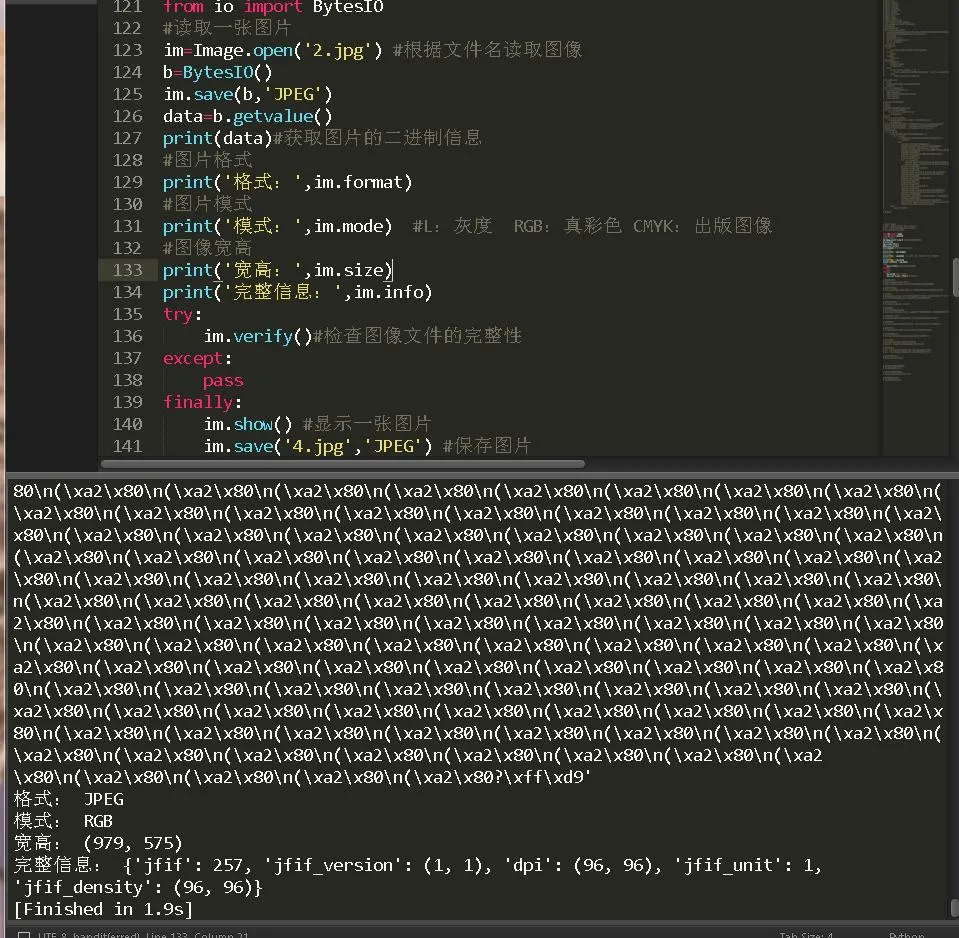
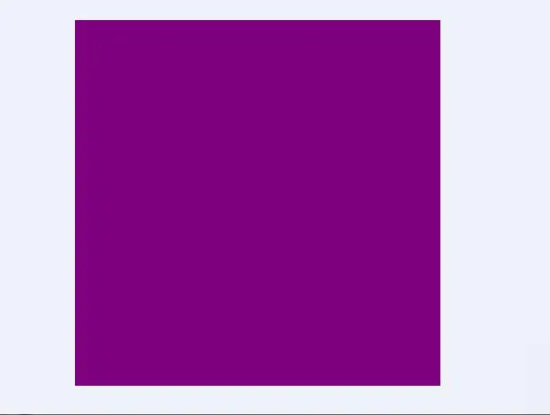
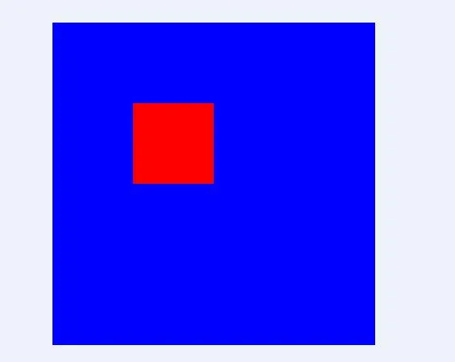
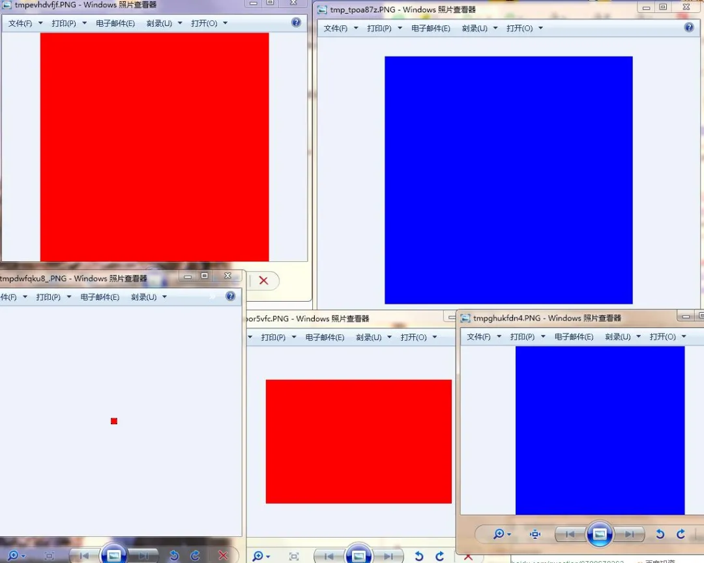
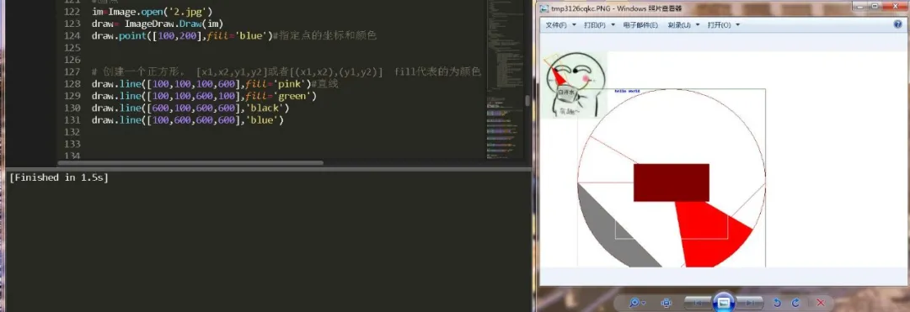
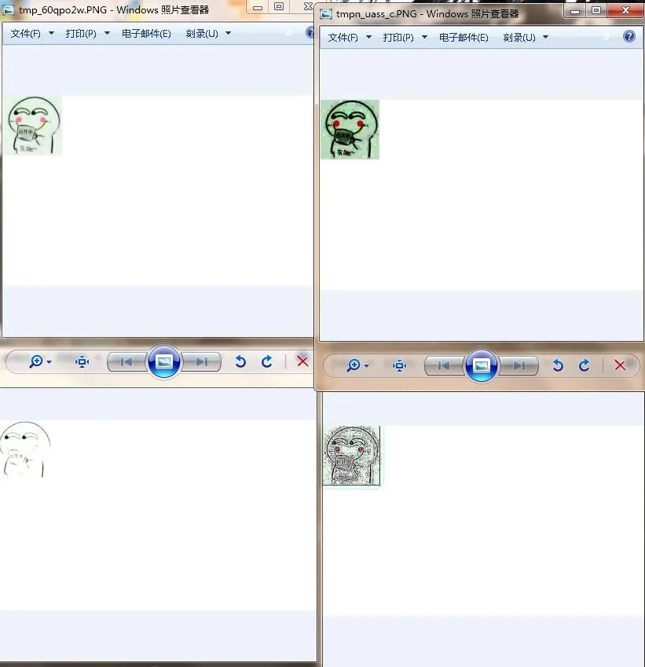
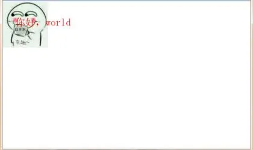
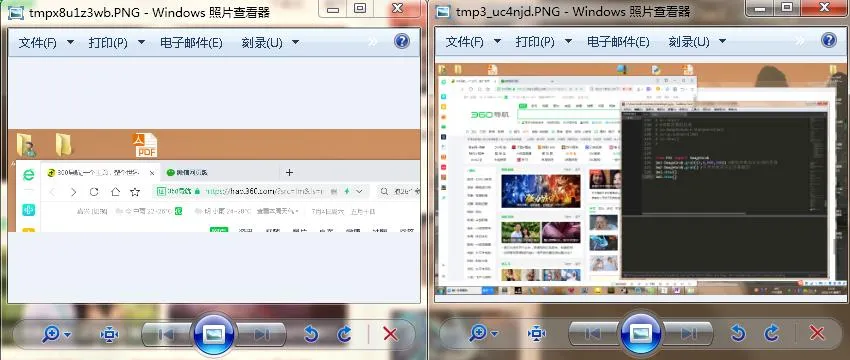
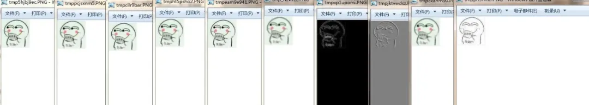
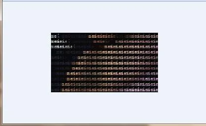

Python Pillow<br />Pillow作为一个图片模块。可谓是真的简便强大，它的前身是PIL，后来将他取代，现在的pillow 可谓是一家独大，好了，来看看具体用法。<br />介绍pillow 常用六大模块：

1. Image
2. ImageDraw
3. ImageEnhance
4. ImageFont
5. ImageGrab
6. ImageFilter
<a name="jjLNX"></a>
## 一、Image
```python
from PIL import Image
from io import BytesIO
#读取一张图片
im=Image.open('2.jpg') #根据文件名读取图像
b=BytesIO()
im.save(b,'JPEG')
data=b.getvalue()
print(data)#获取图片的二进制信息
#图片格式
print('格式：',im.format)
#图片模式
print('模式：',im.mode)  #L：灰度  RGB：真彩色 CMYK：出版图像
#图像宽高
print('宽高：',im.size)
print('完整信息：',im.info)
try:
    im.verify()#检查图像文件的完整性
except:
    pass
finally:
    im.show() #显示一张图片
    im.save('4.jpg','JPEG') #保存图片
```

```python
from PIL import Image
from io import BytesIO
import requests
#创建新图片：
im1=Image.new('RGBA',(400,400),'red')
#从二进制中读取图片
res=requests.get('http://pic.sc.chinaz.com/files/pic/pic9/202003/zzpic24077.jpg').content
im2=Image.frombytes('RGB',(100,100),data=res)#只能解析纯二进制图片
#从网页中读取图片
im2=Image.open(BytesIO(res))
b=BytesIO()
im2.save(b,format="PNG")
im2.show()

#两张图片相加：
im1=Image.new('RGBA',(400,400),'red')
im2=Image.new('RGBA',(400,400),'blue')
Image.blend(im1,im2,0.5) #两个图片大小一定要一样(效果见图4)

#点操作：
im1.point(lambda x:x*1.2)


#图片裁剪：
box=(100,100,200,200)
region=im.crop(box)#设置要裁剪的区域

#图片粘贴(合并）
im1.paste(region,box)#粘贴box大小的region到原先的图片对象中。(见图5)


im1=Image.new('RGB',(400,400),'red')
im2=Image.new('RGBA',(400,400),'blue')

#通道分离：
r,g,b=im1.split()#分割成三个通道，此时r,g,b分别为三个图像对象。
print(r,g,b)
#通道合并：
im3=Image.merge("RGB",(b,g,r))#将b,r两个通道进行翻转。


#改变图片的大小：
im4=im1.resize((300,200))
im4.show()


#图片翻转
im5=im1.transpose(Image.FLIP_LEFT_RIGHT)  #左右翻转
im6=im2.transpose(Image.FLIP_TOP_BOTTOM)  #上下翻转
im5.show()
im6.show()


#获取某个像素位置的值
im1.getpixel((43,23))


#写某个像素位置的值
im1.putpixel((10,20),(255,32,43))


#创建图像缩略图
im1.thumbnail((10,20))#图片大小为（10,20）
im1.show()

#旋转图像
im8=im1.rotate(45) #逆时针旋转45度
im8.show()
注：RGB有三个通道，RGBA有四个通道，以上图片显示效果都在图6中


#图片模式转换
im3.convert('RGBA')
modes       Description
 1      1位像素，黑白图像，存成8位像素
 L      8位像素，黑白
 P      9位像素，使用调色板映射到任何其他模式
RGB     3*8位像素，真彩
RGBA4*8位像素，真彩+透明通道
CMYK4*8位像素，印刷四色模式或彩色印刷模式
YCbCr3*8位像素，色彩视频格式
 I      32位整型像素
 F      33位浮点型像素
```
<br /><br />
<a name="nM93x"></a>
## 二、ImageDraw
这个模块主要就是画图和打水印时用的，具体方法请看下面：
```python
from PIL import Image,ImageDraw
#画点
im=Image.open('2.jpg')
draw= ImageDraw.Draw(im)
draw.point([100,200],fill='blue')#指定点的坐标和颜色


# 创建一个正方形。[x1,x2,y1,y2]或者[(x1,x2),(y1,y2)]  fill代表的为颜色
draw.line([100,100,100,600],fill='pink')#直线
draw.line([100,100,600,100],fill='green')
draw.line([600,100,600,600],'black')
draw.line([100,600,600,600],'blue')


# 弧形 [x1,x2,y1,y2]  弧度 颜色
draw.arc([100,100,600,600],0,360,fill='black')
draw.arc([200,100,500,600],0,360,fill='yellow')


# 画圆  [x1,x2,y1,y2] outline边框颜色 fill填充颜色
draw.ellipse([100,100,600,600],outline='black',fill='white')


# 画半圆 [x1,x2,y1,y2]  弧度 outline弦线颜色 fill填充颜色
draw.chord([100,100,600,600],0,360,outline=125)
draw.chord([100,100,600,600],0,90,outline=158)
draw.chord([100,100,600,600],90,180,outline=99,fill='gray')


# 扇形 [x1,x2,y1,y2]  弧度 outline弦线颜色 fill填充颜色
draw.pieslice([100,100,600,600],180,210,outline=255)
draw.pieslice([100,100,600,600],30,80,fill=255)


# 多边形
draw.polygon([10,23,45,6,77,87],outline='orange')
draw.polygon([10,20,30,40,50,90,70,80,90,100],fill='red')


# 矩形
draw.rectangle((200,200,500,500),outline = "white")
draw.rectangle((250,300,450,400),fill = 128)


# 文字
text = 'hello world '
# 颜色
draw.ink = 0 + 0 * 256 + 255 * 256 * 256
# 加载到图片上
draw.text([200,100],text)
im.show()
```
<br />这里每个图形基本都一览无余，如果图片像素太小的话，所绘制的图形是不会完整显示在上面的。
<a name="x5x7r"></a>
## 三、ImageEnhance
主要是设置图片的颜色对比度亮度锐度啥的，增强图像。
```python
from PIL import  ImageEnhance       
im1=Image.open('4.jpg')   
#调整图像的颜色平衡
cl=ImageEnhance.Color(im1)
ce=cl.enhance(1.2)#对选择的属性数值增强1.3倍
ce.show()
#调整图像的对比度
ct=ImageEnhance.Contrast(im1)
ch=ct.enhance(3.4)
ch.show()
#调整图像的亮度
br=ImageEnhance.Brightness(im1)
be=br.enhance(2.2)
be.show()
#调整图像的锐度
sp=ImageEnhance.Sharpness(im1)
se=sp.enhance(200)
se.show()
```

<a name="nBT5n"></a>
## 四、ImageFont
字体模块，主要是读取系统内字体以及给图片添加水印效果
```python
from PIL import Image
from PIL import ImageDraw
from PIL import ImageFont
font=ImageFont.truetype(r'C:\Windows\Fonts\simsun.ttc',size=40)
im=Image.open('4.jpg')
dw=ImageDraw.Draw(im)
dw.text((50,60),'你好，world',fill='red',font=font)
im.show()
```

<a name="XXPxF"></a>
## 五、ImageGrab
```python
from PIL import ImageGrab 
im1=ImageGrab.grab((0,0,800,200)) #截取屏幕指定区域的图像 
im2=ImageGrab.grab() #不带参数表示全屏幕截图
im1.show()
im2.show()
```

<a name="jVr4l"></a>
## 六、ImageFilter
过滤图像的效果。
```python
from PIL import Image, ImageFilter 
im = Image.open('4.jpg') 
# 高斯模糊 
im1=im.filter(ImageFilter.GaussianBlur) 
im1.show()
# 普通模糊 
im2=im.filter(ImageFilter.BLUR) 
im2.show()
# 边缘增强 
im3=im.filter(ImageFilter.EDGE_ENHANCE) 
im3.show()
# 找到边缘 
im4=im.filter(ImageFilter.FIND_EDGES) 
im4.show()
# 浮雕 
im5=im.filter(ImageFilter.EMBOSS) 
im5.show()
# 轮廓 
im6=im.filter(ImageFilter.CONTOUR) 
im6.show()
# 锐化 
im7=im.filter(ImageFilter.SHARPEN) 
im7.show()
# 平滑 
im8=im.filter(ImageFilter.SMOOTH) 
im8.show()
#阙值平滑
im9=im.filter(ImageFilter.SMOOTH_MORE) 
im9.show()
# 细节 
im10=im.filter(ImageFilter.DETAIL)
im10.show()
```
<br />pillow 还算是比较强大的一个 模块，他可以轻松实现截屏 水印效果，并且还可以制作字符画，下面请看：
```python

from PIL import Image
from PIL import ImageDraw
from PIL import ImageFont
txt = 'meimei'
font = ImageFont.truetype(r'C:\Windows\Fonts\simsun.ttc',9)  #9为字体大小
im_path = '1.jpg'  #原图路径
im = Image.open(im_path)
width, height = im.size 
newImg = Image.new("RGBA",(width, height),(10,10,10))  #背景色rgb，偏黑显示好一些
x=0
for i in range(0,height,9):   #需要与字体大小一致
    for j in range(0,width,9): #需要与字体大小一致
        a,b,c=im.getpixel((j,i)) #获取像素
        draw = ImageDraw.Draw(newImg)
        draw.text( (j,i), (txt[x%(len(txt)):x%(len(txt))+3]), fill=(a,b,c),font=font)
        x+=3
        del draw
newImg.save('00.png','PNG')
```

