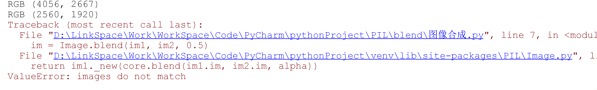
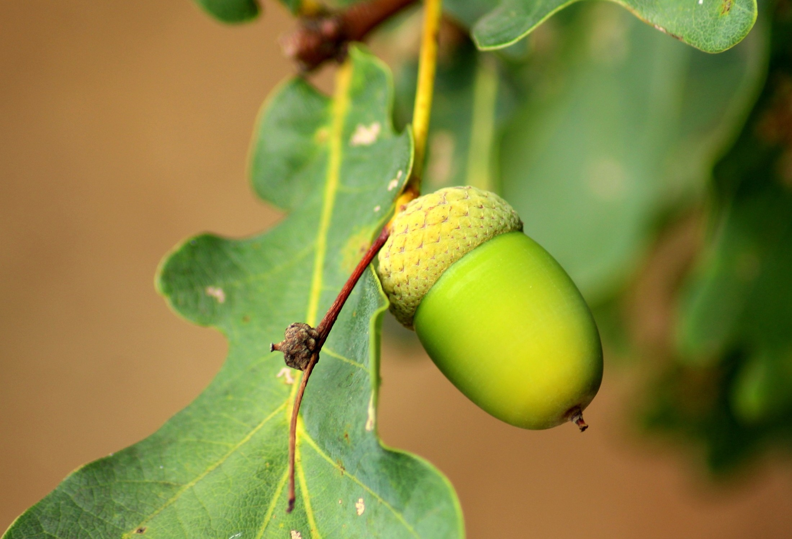
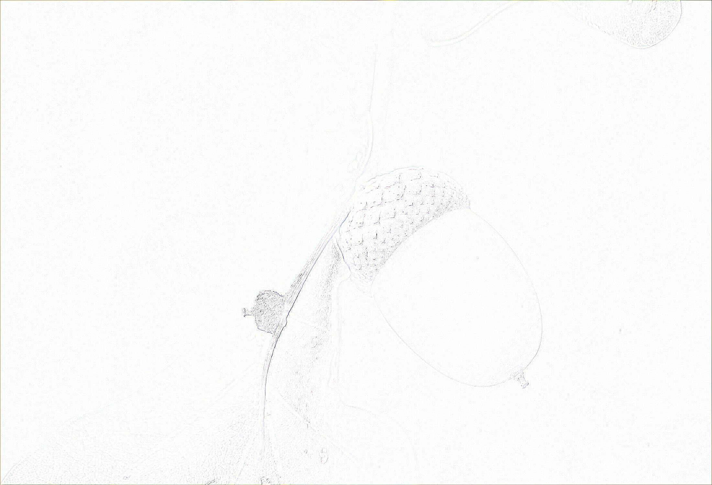
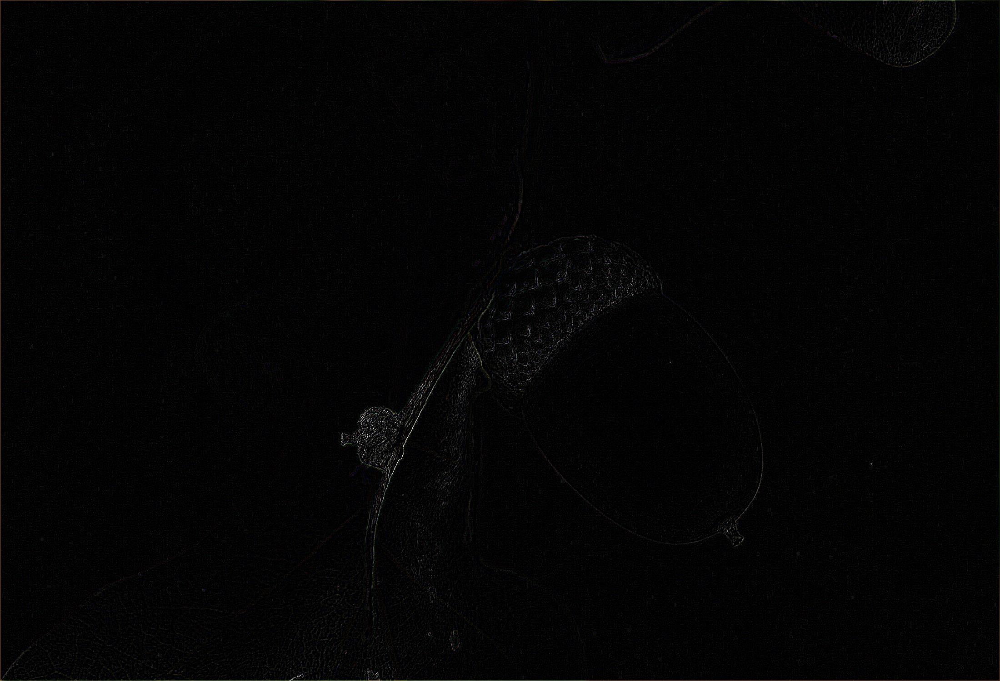

Python PIL<br />PIL库是是一个具有强大图像处理能力的第三方库。Image是PIL库中代表一个图像的类（对象）。
<a name="Erj5S"></a>
## 安装PIL
:::tips
PIL较多用于2.7版本的Python中，到Python3版本已经用Pillow代替PIL了。<br />所以，应该安装Pillow库，引入的命令方式也从：`import image` 变为：`from PIL import Image`
:::
```bash
pip3 install Pillow
```
<a name="86xk8"></a>
## PIL的使用案例
PIL可以用来做什么呢？第一，可以将两张图片合并在一起
<a name="9cf32b88"></a>
### Image.blend(image1,image2,alpha)
合成公式为：out=image1(1.0- alpha)+image2alpha
:::warning
需要合成的两张图片大小应该保持一致，否则报错图像不匹配<br />
:::
```python
from PIL import Image
im1 = Image.open("1.jpg")
im2 = Image.open("2.jpg")
print(im1.mode,im1.size)  # RGB (500, 300)
print(im2.mode,im2.size)   # RGB (500, 300)
im = Image.blend(im1, im2, 0.5)
im.save('3.jpg')
```
<a name="XL1LD"></a>
#### 初始图像
<a name="Q1jcq"></a>
##### 1.jpg

<a name="O5edF"></a>
##### 2.jpg

<a name="Wt5gK"></a>
#### 合成后的图像
<a name="IUv5i"></a>
##### 3.jpg

<a name="kg72p"></a>
### Composite
当然除了上面的方法还可以使用Composite类 `Image.composite(image1,image2, mask) ⇒ image` 复合类使用给定的两张图像及mask图像作为透明度，插值出一张新的图像。变量mask图像的模式可以为“1”，“L”或者“RGBA”。所有图像必须有相同的尺寸。
```python
from PIL import Image
im1 = Image.open("1.jpg")
im2 = Image.open("2.jpg")
r,g,b = im1.split()
print(b.mode)
print(im1.mode,im1.size)
print(im2.mode,im2.size)
im = Image.composite(im1,im2,mask=b)
im.save('4.jpg')
```
4.jpg<br />
<a name="l9LUC"></a>
### Filter类
`im.filter(filter) ⇒ image`<br />返回一个使用给定滤波器处理过的图像的拷贝。在该模块中，预先定义了很多增强滤波器，可以通过 `filter()` 函数使用，预定义滤波器包括：

- BLUR
- CONTOUR
- DETAIL
- EDGE_ENHANCE
- EDGE_ENHANCE_MORE
- EMBOSS
- FIND_EDGES
- SMOOTH
```python
from PIL import Image
from PIL import ImageFilter                         ## 调取ImageFilter
img = Image.open("1.jpg")
blu = img.filter(ImageFilter.BLUR)                ##均值滤波
con = img.filter(ImageFilter.CONTOUR)             ##找轮廓
edge = img.filter(ImageFilter.FIND_EDGES)         ##边缘检测
blu.save('均值滤波.jpg')
con.save('找轮廓.jpg')
edge.save('边缘检测.jpg')
```
均值滤波.jpg<br /><br />找轮廓.jpg<br /><br />边缘检测.jpg<br />
