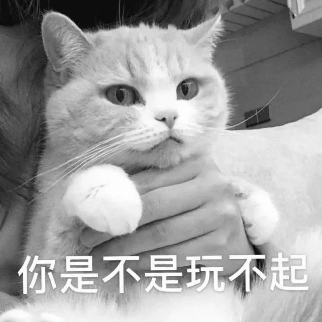
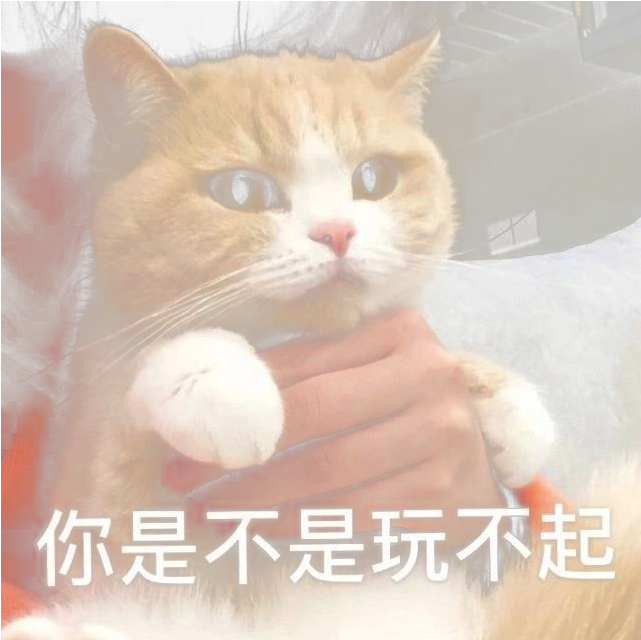
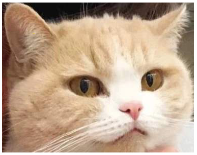
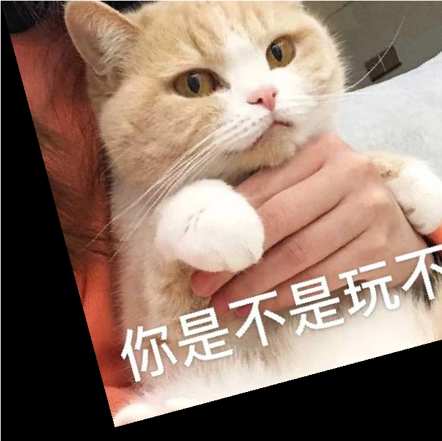
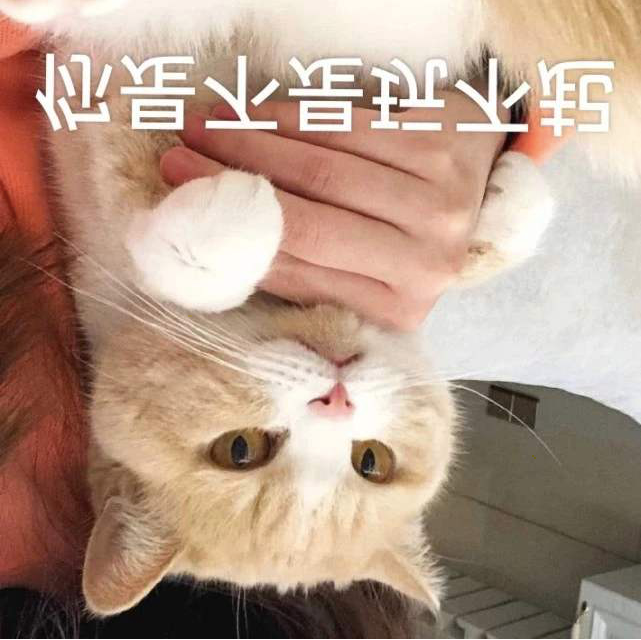
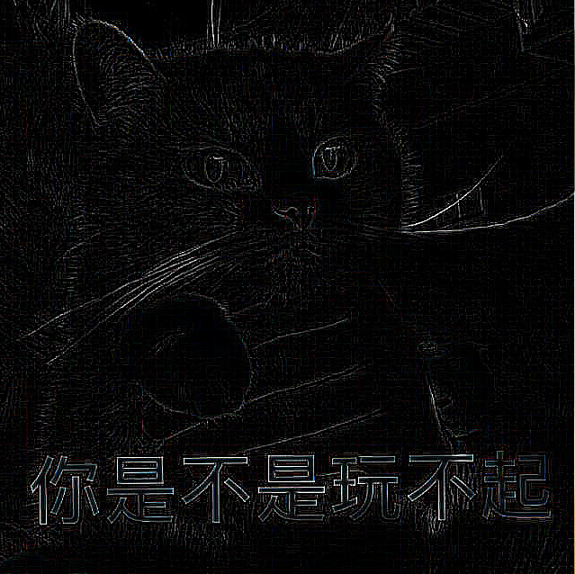
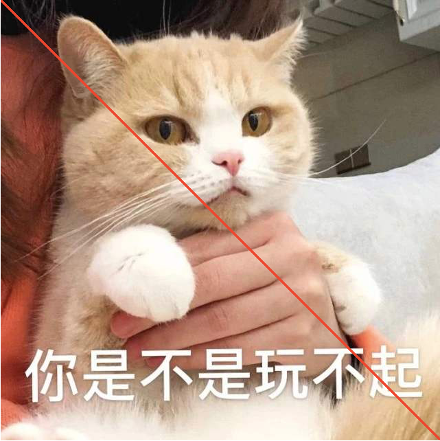
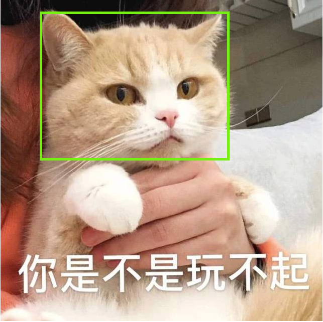
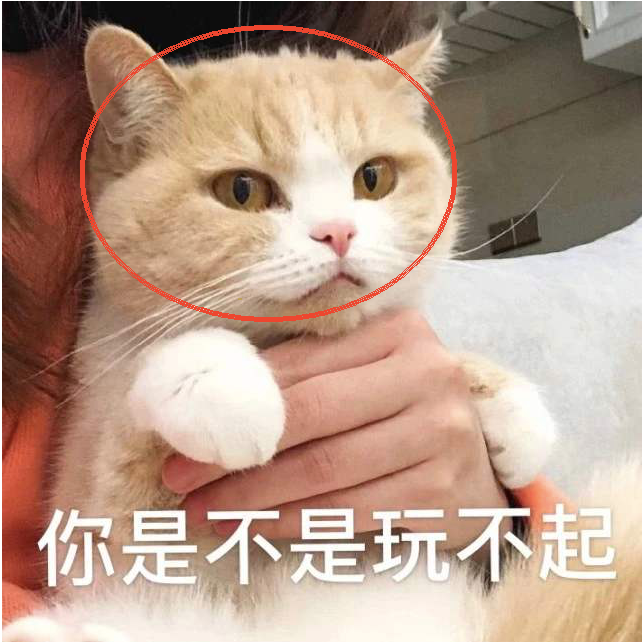

Python 图像处理<br />安装pillow非常简单。
```bash
pip install pillow
```
<a name="RblTY"></a>
## 一、图片读写
```python
import numpy as np 
from PIL import Image,ImageFilter,ImageDraw,ImageFont

# 读取图片
img = Image.open("./data/猫咪图片.jpg")
print(img.format, img.size, img.mode)
print(img.info)
img 

JPEG (641, 641) RGB
{'jfif': 257, 'jfif_version': (1, 1), 'dpi': (72, 72), 'jfif_unit': 1, 'jfif_density': (72, 72)}
```

```python
# 保存图片
img.save("./data/猫咪图片.png") 
```
<a name="ISunp"></a>
## 二、图片与array互转
```python
# Image转np.array
img = Image.open("./data/猫咪图片.jpg")
arr = np.array(img)
print(arr.shape)  
print(arr.dtype)

(641, 641, 3)
uint8

# np.array转Image

arr = (np.ones((256,256))*np.arange(0,256)).astype(np.uint8)
img = Image.fromarray(arr)
img 
```

<a name="L5tjn"></a>
## 三、图片与string互转
```python
# Image转string 

import base64
from io import BytesIO

img = Image.open("./data/猫咪图片.jpg")
buffer = BytesIO()
img.save(buffer, 'PNG')
b = buffer.getvalue()
s = base64.b64encode(b).decode("utf-8") 

print(s[0:1000])

iVBORw0KGgoAAAANSUhEUgAAAoEAAAKBCAIAAACnMebvAAEAAElEQVR4nOz96bMtSXIfiLl7ROR2lru+raqrqxsEQBAkRuKMRHI0kj6OSTLJ9M+KRumTTJwxyWZGJm6DIQguAHqp7lree3c5S2ZGhLs+eIbfOOe+V13dKGxjCHt27b5z82RGRnj4z3fHT69fJB3CiEhEDCIi5H1KKQt775umEYRpmsZx/PGnn3Vd94tf/OLu7u7y8lJExnG8uro6Ho/ee+ccMwNA13UXFxebzeZnP/uZcw4R53k+Ho/TNIkIIiIiMxMREaWUcs6bzebm5mae5/1+H2NsmiaEkHOe55mZvfcAkFKa5xkA9OL1er3ebv/oj/7IOSciOUbv/cPDAwr0fb/uh5ubmxDCeDgi4vF4/NnPfjYHBAAsQ38HgJxzSklEiAgARKRt22EYmqaZpul4PM7zbDMXEfgbMnSqurP2EwDGcaz/axf/DXq1aZq6rgMAEfmd3/mdm5ubn/3sZz//+c9TSgCgJCEiIYS+7+d5nqYp5+y9R8Scs4g45z5287NdtrUaOdknKICIZNfI8tOWlABczuv1uuu6lNI0TXo6mFkncHZ/AEhxdM7ps5TenHPOuZTSarXquo6Z7eAw80wZAHJMMUZP5L3PMY2Ho3Nuu1oPfS8iHJOIcMoxRiYnIjlnvQ8UCsk5O+dCCCEEXRb9PMWdnt+cc4wx50xEeuXxeBSRYRj6vnfO6XmJhwcqQ99UxzAMIqK/1y8ukpUVzPOsR7tt26ZphmGwZdEn6jQaDHoHRBTCnPM4juM89X2/Px6dcxcXF74JMcYQwna7TeCULyknSSkhovfezoWus1F+hFnXvGmapml0bjlnKIxCr0TEEIL3fjelpml0xexk7ff74/GoX1TmZqv9W3/3d66vr5l5HMfNsOr7npkJMMYoOSsnzjEpt5znOca42+2Ucg6HwzzPV1dXn3766YsXL0IIXdc1TQMA8zyP4xhj

# string转Image 

b = base64.b64decode(s.encode("utf-8")) 
buffer = BytesIO(b) 
img = Image.open(buffer)
img 
```

<a name="fawlW"></a>
## 四、图片由彩色转灰度
```python
# 转成灰度
img = Image.open("./data/猫咪图片.jpg")
img.convert("L")
```

<a name="ti5LK"></a>
## 五、图片通道分离与合并
```python
# 分离通道
img = Image.open("./data/猫咪图片.jpg")
r,g,b = img.split() 
b 
```

```python
# 合并通道
Image.merge(mode = "RGBA", bands = [r,g,b,r])
```

<a name="qQQLE"></a>
## 六、调整图片尺寸
```python
# 调整大小
img = Image.open("./data/猫咪图片.jpg")
print(img.size)
img_resized = img.resize((300,300))
print(img_resized.size)
img_resized 

(641, 641)
(300, 300)
```

<a name="i2rFJ"></a>
## 七、截取图片部分区域
```python
img = Image.open("./data/猫咪图片.jpg")
img_croped = img.crop(box = [78,24,455,320]) 
print(img_croped.size)
img_croped

(377, 296)
```

<a name="ZMDaH"></a>
## 八、图片旋转
```python
img = Image.open("./data/猫咪图片.jpg")
img_rotated = img.rotate(15,center = (0,0)) #以center为中心逆时针旋转
img_rotated
```

<a name="XNRtP"></a>
## 九、图片翻转
```python
img = Image.open("./data/猫咪图片.jpg")

# 左右翻转
img_left_right = img.transpose(Image.FLIP_LEFT_RIGHT)
img_left_right 
```

```python
# 上下翻转
img_top_bottom = img.transpose(Image.FLIP_TOP_BOTTOM)
img_top_bottom
```

<a name="P4nAj"></a>
## 十、提取图片边缘
```python
img = Image.open("./data/猫咪图片.jpg")

img_edges = img.filter(ImageFilter.FIND_EDGES)
img_edges 
```

<a name="hT0RW"></a>
## 十一、图片高斯模糊
```python
img = Image.open("./data/猫咪图片.jpg")
img_blur = img.filter(ImageFilter.GaussianBlur(radius=3))
img_blur 
```

<a name="nsZdy"></a>
## 十二、在图片上绘制文字
```python
img = Image.open("./data/猫咪图片.jpg")
draw = ImageDraw.Draw(img)
arial = ImageFont.truetype('./data/simsun.ttc', 46)
draw.text((250,450),"敢梭哈吗?",font =arial, fill="white")
img
```

<a name="YvtN4"></a>
## 十三、在图片上绘制直线
```python
img = Image.open("./data/猫咪图片.jpg")
draw = ImageDraw.Draw(img)

draw.line([0,0,641,641],fill = "red",width = 5)
img
```

<a name="MkgZ6"></a>
## 十四、在图片上绘制矩形
```python
img = Image.open("./data/猫咪图片.jpg")
draw = ImageDraw.Draw(img)

draw.rectangle([78,24,455,320], fill=None, outline ='lawngreen',width = 5)
img
```

<a name="ET9Ed"></a>
## 十五、在图片上绘制椭圆
```python
img = Image.open("./data/猫咪图片.jpg")
draw = ImageDraw.Draw(img)
draw.arc(xy = [78,24,455,320],start = 0,end = 360,fill="red",width=5)
img
```

<a name="cHIq4"></a>
## 十六、在图片上粘贴其他图片
```python
img = Image.open("./data/猫咪图片.jpg")
img_resized = img.resize((150,150))
img.paste(img_resized,box = [460,50])
img
```

