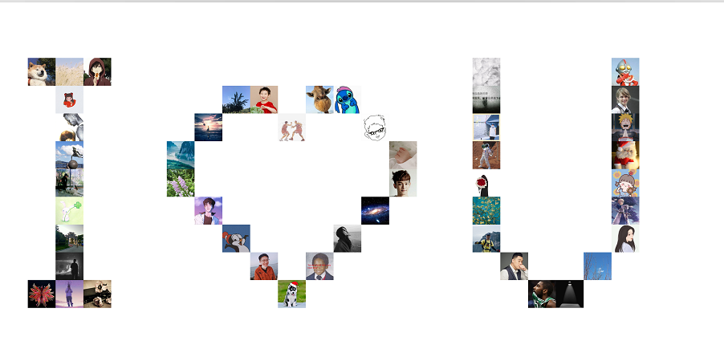

Python 
<a name="KbY9j"></a>
## 一、效果
先来看下效果图，了解接下来要做的事情，效果图如下：<br />
<a name="uiMlI"></a>
## 二、思路
先来理清下思路，只有过程理清楚了，才能得到自己的想要的结果<br />制作这个最难的地方就在于每个图片的位置该怎么计算，才能凑成一个心型。采用土办法，直接把它位置写死，虽然稍微有点麻烦，但是灵活~<br />Excel里面的表格是由一个个单元格组合而成，把上面的图想象成表格，是由很多单元格组成的，单元格的大小就是图片的尺寸，并且去掉了边框。那么制作这个心型，只要在单元格内添加单个图片，然后凑成心的形状就完成了。这就是整体的思路，接下来用代码去实现这个思路
<a name="hcD5F"></a>
## 三、准备
先说下制作过程要使用哪些Python库：<br />1、pillow：用来处理图片的库，属于第三方库，需要额外安装 `pip install pillow`<br />2、os：用来获取图片，python自带，不用额外安装<br />3、math：用来计算图片数量，python自带，不用额外安装<br />有上面三个库就可以了，接下代码走起。
<a name="d9jiB"></a>
## 四、代码
<a name="QILFI"></a>
### 1、导库
```python
from PIL import Image
import os
import math
```
<a name="m5c7W"></a>
### 2、制作形状
通过二维数组确定图片的位置，每个元素相当于excel中的单元格：1代表空白，0代表图片。看到由0组成的爱心了嘛？这里纯手打(所以可以自由改动，做出想要的形状，这就是灵活的地方~)<br />因为图片有500张，所以做大一点，放更多的图片，所以元素的个数会比较多，下面是21x21的大小。
:::tips
注意：0的个数一定要比图片数量少或刚好相等，否则就不是一个完整的爱心了！
:::
```python
map = [
    [1, 1, 1, 1, 1, 1, 1, 1, 1, 1, 1, 1, 1, 1, 1, 1, 1, 1, 1, 1, 1],
    [1, 1, 1, 1, 1, 1, 1, 1, 1, 1, 1, 1, 1, 1, 1, 1, 1, 1, 1, 1, 1],
    [1, 1, 1, 1, 1, 0, 0, 0, 1, 1, 1, 1, 1, 0, 0, 0, 1, 1, 1, 1, 1],
    [1, 1, 1, 1, 0, 0, 0, 0, 0, 1, 1, 1, 0, 0, 0, 0, 0, 1, 1, 1, 1],
    [1, 1, 1, 0, 0, 0, 0, 0, 0, 0, 1, 0, 0, 0, 0, 0, 0, 0, 1, 1, 1],
    [1, 1, 0, 0, 0, 0, 0, 0, 0, 0, 0, 0, 0, 0, 0, 0, 0, 0, 0, 1, 1],
    [1, 1, 0, 0, 0, 0, 0, 0, 0, 0, 0, 0, 0, 0, 0, 0, 0, 0, 0, 1, 1],
    [1, 1, 1, 0, 0, 0, 0, 0, 0, 0, 0, 0, 0, 0, 0, 0, 0, 0, 1, 1, 1],
    [1, 1, 1, 1, 0, 0, 0, 0, 0, 0, 0, 0, 0, 0, 0, 0, 0, 1, 1, 1, 1],
    [1, 1, 1, 1, 1, 0, 0, 0, 0, 0, 0, 0, 0, 0, 0, 0, 1, 1, 1, 1, 1],
    [1, 1, 1, 1, 1, 1, 0, 0, 0, 0, 0, 0, 0, 0, 0, 1, 1, 1, 1, 1, 1],
    [1, 1, 1, 1, 1, 1, 1, 0, 0, 0, 0, 0, 0, 0, 1, 1, 1, 1, 1, 1, 1],
    [1, 1, 1, 1, 1, 1, 1, 1, 0, 0, 0, 0, 0, 1, 1, 1, 1, 1, 1, 1, 1],
    [1, 1, 1, 1, 1, 1, 1, 1, 1, 0, 0, 0, 1, 1, 1, 1, 1, 1, 1, 1, 1],
    [1, 1, 1, 1, 1, 1, 1, 1, 1, 1, 0, 1, 1, 1, 1, 1, 1, 1, 1, 1, 1],
    [1, 1, 1, 1, 1, 1, 1, 1, 1, 1, 1, 1, 1, 1, 1, 1, 1, 1, 1, 1, 1],
    [1, 1, 1, 1, 1, 1, 1, 1, 1, 1, 1, 1, 1, 1, 1, 1, 1, 1, 1, 1, 1],
]
```
<a name="ntMZv"></a>
### 3、导入图片
位置确定好了，开始获取所有的图片：
```python
# 这个是图片的所在路径
img_dir = r"C:\Users\admin\Desktop\头像"
# 获取这个文件下的所有文件，因为没有过滤其他类型文件，所以不要放非图片文件
# 返回的是一个列表
imgs = os.listdir(img_dir)
# 设置图片的尺寸，所有图片尺寸要保持统一，要有组织有纪律
img_h = img_w = 192
# 计算行数，即子列表的个数
rows = len(map)
# 计算列数，即子列表中元素的个数
columns = len(map[0])
```
<a name="FCyyG"></a>
### 4、画图
接下来就是准备一个白色的背景，当作画布。有了行数、列数和图片的宽高，就可以计算出整个画布的尺寸了
```python
# 第一个参数照着写
# 第二个参数需要传入一个元组，元组的第一个参数是画布的宽，第二个是高
# 第三个参数传入的是画布的颜色
# 使用Image.new()方法创建一个画布
figure = Image.new("RGB", (img_w*columns, img_h*rows),"white")
```
到目前为止，图片和画布都已经准备好了，现在就是将图片放置在画布对应的位置上了，即数组中元素为0的位置。
```python
# 表示图片的下标
count = 0
# 遍历行
for i in range(len(map)):
    # 遍历每行中的所有元素
    for j in range(len(map[i])):
        # 如果元素是1，就不管它
        if map[i][j] == 1:
            continue
        # 如果元素是非1，即0就放图片上去
        else:
            # 做个异常处理，防止有些图片打开失败，导致程序中断
            try:
                # 使用Image.open("图片路径")方法获取图片对象
                image = Image.open(os.path.join(img_dir, imgs[count]))
            except:
                continue
            # resize((新的宽，新的高))用来改变图片的尺寸,接收一个元组
            image = image.resize((img_w, img_h))
            # 将修改尺寸后的图片(image)粘贴(paste)到画布(figure)上
            # 第一个参数 是图片对象
            # 第二个参数是 图片在画布上的位置，相当于单元格的位置
            figure.paste(image, (img_w*j, img_h*i))
            # 使用完一张图片就要记录下来，并开始使用下一张图片
            count += 1

# 当循环结束，即表示心型照片图已经完成
# 将画好的画布显示出来，给你看到
figure.show()
# 不满意在调整二维数组中0的位置，满意可以保存到本地，用来装逼
# 需要告知程序图片保存的路径
figure.save('心型照片墙.png')
```
到此，心型照片墙就制作出来了，也可以写个i love you~（图如下）。<br />
