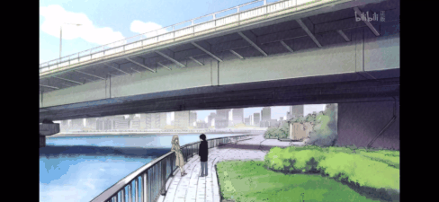
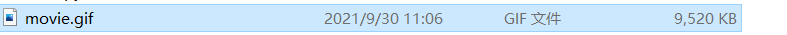

Python
<a name="CiMc1"></a>
## 1、安装必备库moviepy
```bash
pip install moviepy -i https://pypi.tuna.tsinghua.edu.cn/simple
```
<a name="oTCkK"></a>
## 2、写入代码
```python
from moviepy.editor import *
clip = (VideoFileClip("movie.mp4"))  # 需要转为GIF的视频文件路径
clip.write_gif("movie.gif")
```
<a name="hkJC2"></a>
## 3、转换效果
<br />刚刚的GIF图虽然只有几秒，但大小却有9M之多！(还是已经缩放了分辨率的情况下)<br /><br />如果需要转换的视频有几十秒，那文件大小就得上百兆甚至更多！<br />那该怎么解决呢？
<a name="J0MEQ"></a>
## 4、GIF很大的解决方案
除了设置缩放分辨率`resize`外，还可以通过设置`fps`参数抽帧来减少大小
```python
from moviepy.editor import *
clip = (VideoFileClip("movie.mp4").resize((488,225)))
clip.write_gif("movie.gif",fps=15)  #设置为每秒15帧
```
设置为每秒15帧后，文件大小只有2m多，一下缩小了4倍之多！<br /><br />而且视觉效果也没有多大的区别<br />
<a name="xskGS"></a>
## 5、截取视频长度转换
还可以通过设置`subclip`参数来指定转换的视频范围：<br />`subclip`：截取原视频中的自`t_start`至`t_end`间的视频片段<br />将视频1-2秒片段转化为Gif
```python
from moviepy.editor import *
clip = (VideoFileClip("movie.mp4").subclip(t_start=1, t_end=2).resize((488, 225)))
clip.write_gif("movie.gif", fps=15)
```
<a name="wVV9O"></a>
## 6、指定转换后的图片大小（分辨率）
`resize`参数可指定转换后的图片大小<br />接受的参数为：

1. 以像素或浮点表示的(width,height)
2. 缩放百分比，如 0.5

示例

1. 设置转换后的图片为600*400
```python
clip = (VideoFileClip("movie.mp4").resize((600, 400)))
```

2. 原视频缩放50%
```python
clip = (VideoFileClip("movie.mp4").resize(0.5))
```
