Python 图像处理 今天的世界充满了数据，图像是这些数据的重要组成部分。但是，在使用它们之前，必须对这些数字图像进行处理 - 分析和操作，以提高其质量或提取一些可以使用的信息。 常见的图像处理任务包括显示；基本操作如裁剪，翻转，旋转等;；图像分割，分类和特征提取；图像恢复；图像识别。Python是这些图像处理任务的绝佳选择，因为它作为一种科学编程语言日益普及，并且在其生态系统中免费提供许多最先进的图像处理工具。 本文着眼于10个最常用的Python库，用于图像处理任务。这些库提供了一种简单直观的方法来转换图像并理解底层数据。

### 1、scikit-image
scikit-image是一个与NumPy数组一起使用的开源Python包。它实现了用于研究，教育和行业应用的算法和实用程序。它是一个相当简单直接的库，即使对那些不熟悉Python生态系统的人也是如此。代码质量高，经过同行评审，由一个活跃的志愿者社区编写。

#### **资源**
scikit-image文档丰富，有很多示例和实际使用方法。

#### **用法**
该包通过**skimage**导入，大多数功能可以在子模块中找到。 图像过滤： 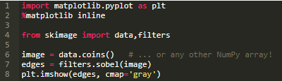 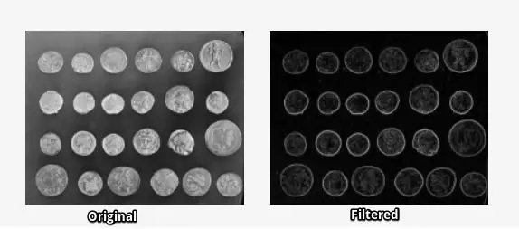 使用`match_template`函数进行模板匹配： 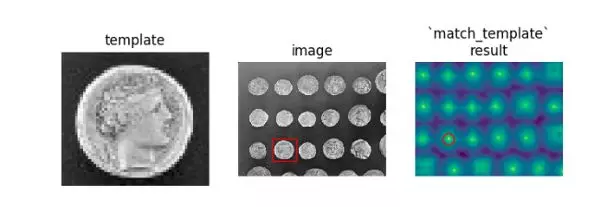 你可以在gallery中找到更多的例子。

### 2、NumPy
NumPy是Python编程中的核心库之一，并为数组提供支持。图像本质上是包含数据点像素的标准NumPy数组。因此，通过使用基本的NumPy操作（如slicing，masking和fancy indexing），您可以修改图像的像素值。可以使用** skimage**加载图像并使用 Matplotlib显示。

#### **资源**
NumPy的官方文档页面提供了完整的资源和文档列表。

#### **用法**
使用Numpy来mask图片： 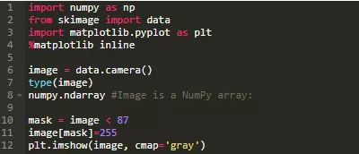 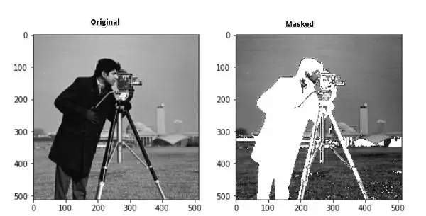

### 3、SciPy
SciPy是Python的另一个核心科学模块（如NumPy），可用于基本的图像操作和处理任务。特别是，子模块 `scipy.ndimage`（在SciPy v1.1.0中）提供了在n维NumPy数组上运行的函数。该软件包目前包括线性和非线性滤波，二进制形态，B样条插值和对象测量等功能。

#### **资源**
有关`scipy.ndimage`包所提供的完整功能列表，请参阅文档。

#### **用法**
使用SciPy通过高斯滤波器进行模糊 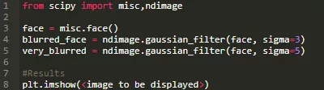 

### 4、PIL/Pillow
**PIL**（Python Imaging Library）是一个免费的Python编程语言库，它增加了对打开，操作和保存许多不同图像格式的支持。然而，它的发展停滞不前，其最后一版发布于2009年。幸运的是，Pillow是一个积极开发的PIL分支，它更易于安装，可在所有主流操作系统上运行，并支持Python 3。该库包含基本图像处理功能，包括点操作，使用一组内置卷积内核进行过滤以及颜色空间转换。

#### **资源**
文档包含安装说明以及涵盖库的每个模块的示例。

#### **用法**
使用`ImageFilter`增强Pillow中的图像： 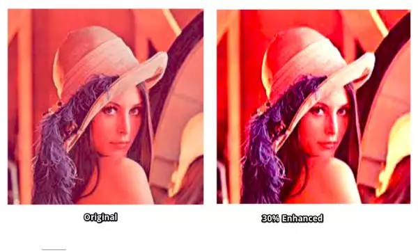

### 5、OpenCV-Python
**OpenCV**（Open Source Computer Vision Library）是计算机视觉应用中使用最广泛的库之一。OpenCV-Python是OpenCV的Python API。因为后台由C / C ++编写的代码组成，OpenCV-Python速度很快快，但它也很容易编码和部署（由于前端的Python包装器）。这使其成为执行计算密集型计算机视觉程序的绝佳选择。

#### **资源**
通过OpenCV2-Python-Guide可以很容易上手OpenCV-Python

#### **用法**
使用OpenCV-Python中的 _Image Blending using Pyramids_创建一个“Orapple”： 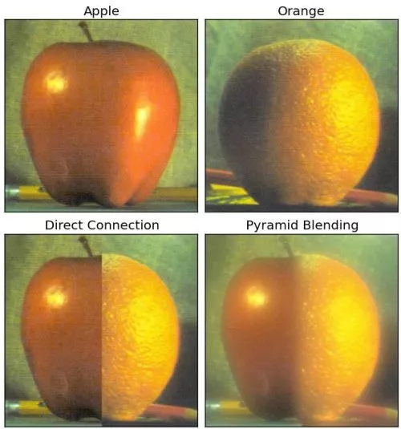

### 6、SimpleCV
SimpleCV是另一个用于构建计算机视觉应用程序的开源框架。它提供访问几个高性能计算机视觉库，如OpenCV，的接口，但无需了解位深度，文件格式，色彩空间等。它的学习曲线远小于OpenCV，并且（如其标语所示），“它令计算机视觉变得简单。”支持SimpleCV的一些观点是：

- 即使是初学者也可以编写简单的机器视觉测试
- 摄像机，视频文件，图像和视频流都可以互操作

#### **资源**
很容易按照官方文档的指导进行操作，并有大量的示例和用例可供遵循。

#### **用法**
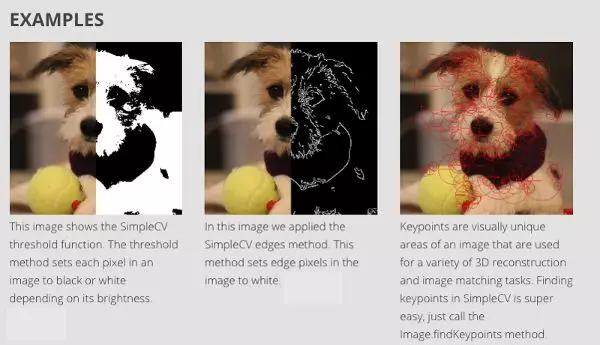

### 7、Mahotas
Mahotas是另一个用于Python的计算机视觉和图像处理库。它包含传统的图像处理功能，如过滤和形态操作，以及用于特征计算的更现代的计算机视觉功能，包括兴趣点检测和局部描述符。使用Python编写接口，适用于快速开发，但算法是用C ++实现的，并且针对速度进行了优化。Mahotas库运行快速，代码简约，依赖性小。阅读其官方文章以获得更多了解。

#### **资源**
文档包含安装说明，示例，甚至一些教程帮助您轻松开始使用Mahotas。

#### **用法**
Mahotas库依靠简单的代码来完成工作。例如，使用最少量的代码Finding Wally问题就可以很好地解决。 解决Finding Wally问题: 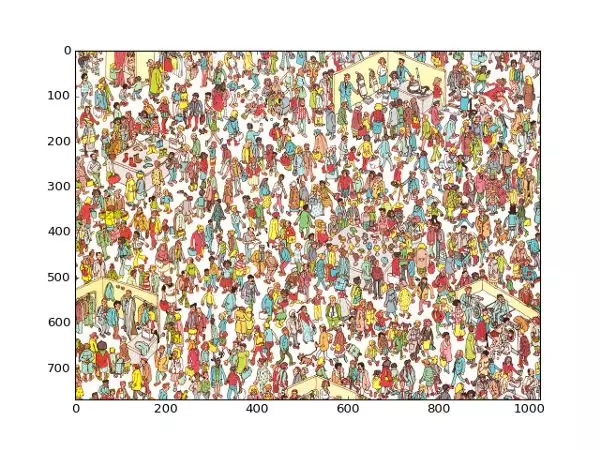 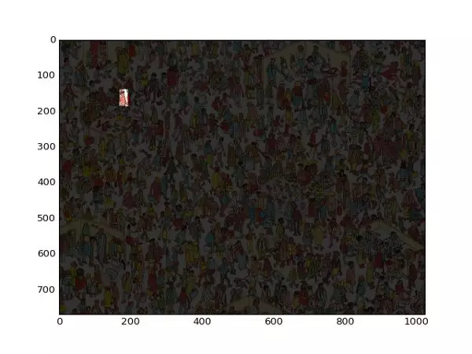

### 8、SimpleITK
ITK（Insight Segmentation and Registration Toolkit）是一个“开源，跨平台系统，为开发人员提供了一套用于图像分析的广泛软件工具。SimpleITK是一个基于ITK构建的简化层，旨在促进其在快速原型设计，交易以及解释语言方面的应用。”它也是一个图像分析工具包，具有大量组件，支持一般过滤操作，图像分割和配准。SimpleITK是用C ++编写的，但它可用包括Python在内的大量编程语言进行操作。

#### **资源**
有大量的Jupyter Notebook说明了SimpleITK在教育和研究活动中的应用。Notebooks使用Python和R编程语言演示如何使用SimpleITK进行交互式图像分析。

#### **用法**
使用SimpleITK和Python创建可视化的严格CT / MR配准过程： 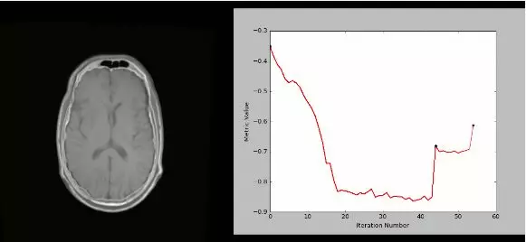

### 9、pgmagick
pgmagick是基于Python的GraphicsMagick库的包装器。GraphicsMagick图像处理系统，有时也被称为图像处理的瑞士军刀。其强大而高效的工具和库集合支持在超过88种主要格式（包括DPX，GIF，JPEG，JPEG-2000，PNG，PDF，PNM和TIFF）上读取，写入和操作图像。

#### **资源**
pgmagick的GitHub respository有安装说明和要求。还有一个详细的用户指南。

#### **用法**
图像缩放：  边缘提取： 

### 10、Pycairo
Pycairo是Cairo图形库的一组Python绑定。Cairo是一个用于绘制矢量图形的2D图形库。矢量图形很有趣，因为它们在调整大小或变换时不会失去清晰度。Pycairo可以从Python调用Cairo命令。

#### 资源
Pycairo GitHub respository是一个很好的资源，包含有关安装和使用的详细说明。还有一个入门指南，有一个关于Pycairo的简短教程。

#### **用法**
用Pycairo绘制线条，基本形状和径向渐变： 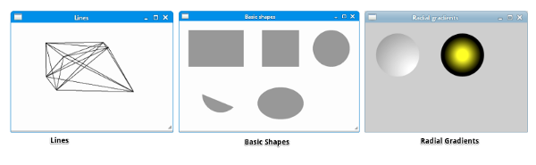
