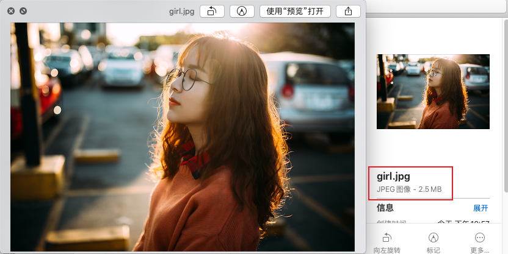
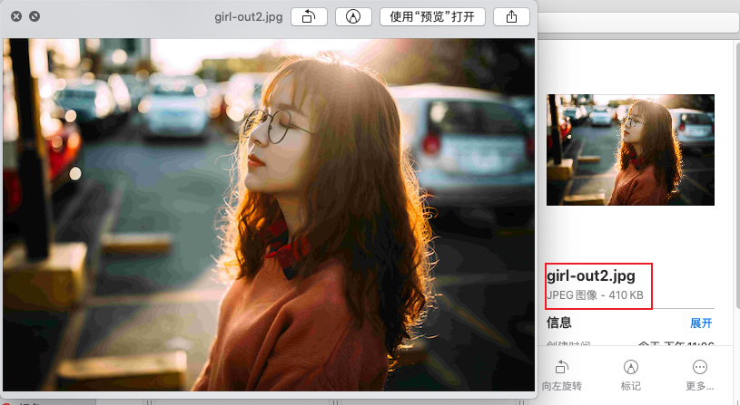
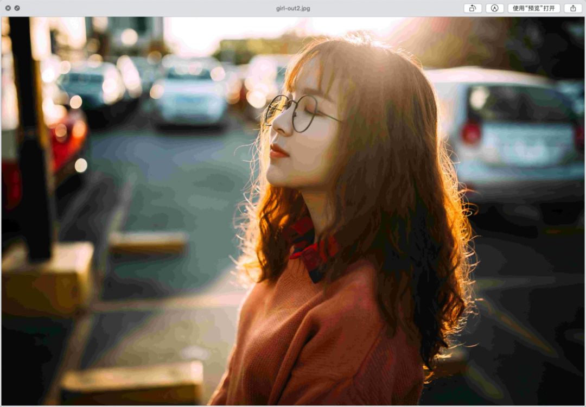
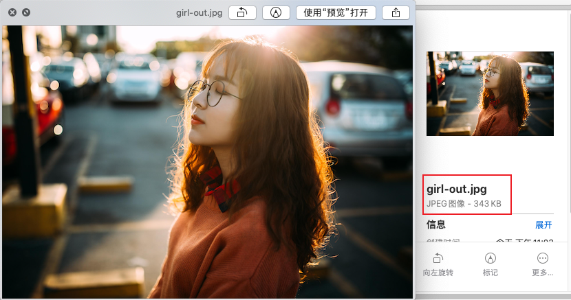
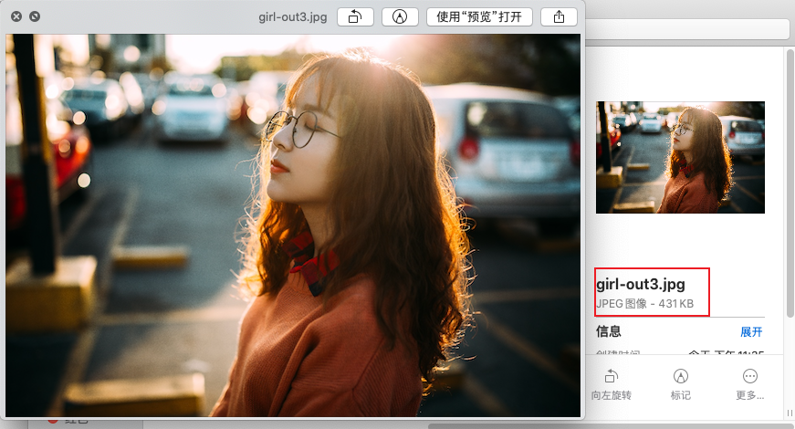

Python
<a name="qvON8"></a>
## PIL
PIL 是 Python Image Library 的简称，其功能非常强大，短短三行代码即可实现图像的压缩。<br />先来看下原图。<br />
```python
from PIL import Image

im = Image.open("girl.jpg")
im.save("girl-out2.jpg", quality=10) # quality 是压缩比率
```
来看下压缩之后的。<br /><br />从以上压缩结果来看，quality 设置为 10 时从 2.5MB 压缩到了 400KB，整体效果还是不错的。但整体来看图片是有一定的失真的，尤其是突然将图片放大之后，失真更明显。<br /><br />经过多次实验，发现将 quality 设置为 20 效果最佳。此时图像最终大小压缩到了 500KB，而且图片也不会失真。<br />事实上，PIL 提供了很多方法对图片进行缩放，下面再试试另外一种办法。
```python
from PIL import Image

im = Image.open("girl.jpg")
w, h = im.size
im.thumbnail((w // 2, h // 2))
im.save("girl-out.jpg")
```
<br />在上面的代码中，先获得了图片的原始尺寸，然后直接将图片缩放至原来的百分之五十。最终图片大小为 343KB，而且图片看起来也不会失真。<br />由此可见，`thumbnail()` 的效果要比设定 quality 的效果要好一些。<br />当然，PIL 还提供了 `resize()` 函数来对图片进行缩放，可以自行尝试下。
<a name="uj2Lb"></a>
## OpenCV
OpenCV 也是一个比较好用的操作图像的库，四行代码实现图片缩放。
```python
import cv2 as cv

img = cv.imread("girl.jpg")
resize_img = cv.resize(img, (0, 0), fx=0.25, fy=0.25, interpolation=cv.INTER_NEAREST)
cv.imwrite('girl-out3.jpg', resize_img)
```
<br />在以上的代码中，先将原始图片读入进来，之后缩放至原图的四分之一。从结果来看，效果还算可以。大小合适，图像没有明显的失真。
