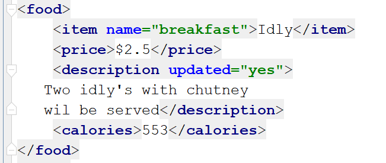
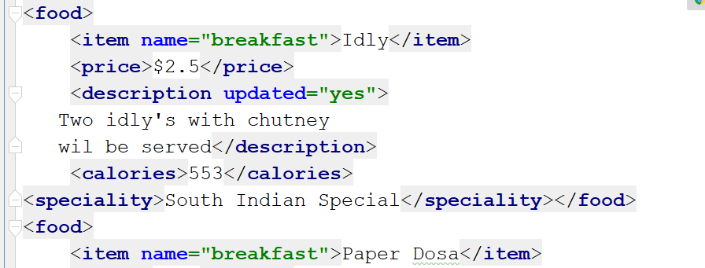
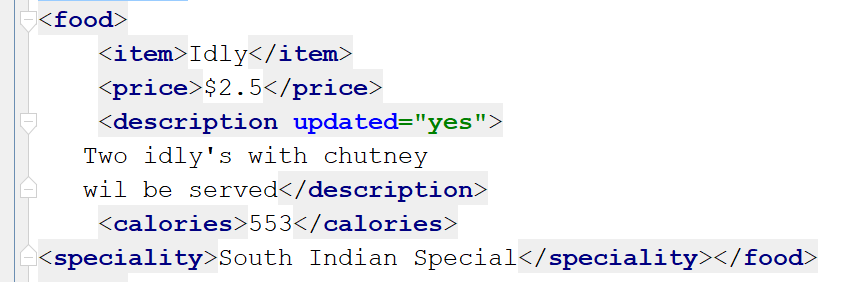
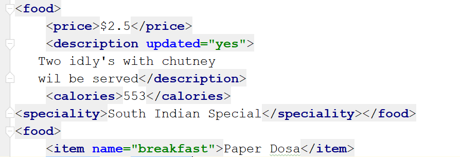

Python<br />经常需要解析用不同语言编写的数据，Python 提供了许多第三方库来解析或拆分用其他语言编写的数据，来学习下 Python XML 解析器的相关功能。
<a name="Oec61"></a>
# 什么是 XML？
XML 是可扩展标记语言，它在外观上类似于 HTML，但 XML 用于数据表示，而 HTML 用于定义正在使用的数据。XML 专门设计用于在客户端和服务器之间来回发送和接收数据。看看下面的例子：
```xml
<?xml version="1.0" encoding="UTF-8"?>
<metadata>
<food>
    <item name="breakfast">Idly</item>
    <price>$2.5</price>
    <description>
   Two idly's with chutney
   </description>
    <calories>553</calories>
</food>
<food>
    <item name="breakfast">Paper Dosa</item>
    <price>$2.7</price>
    <description>
    Plain paper dosa with chutney
    </description>
    <calories>700</calories>
</food>
<food>
    <item name="breakfast">Upma</item>
    <price>$3.65</price>
    <description>
    Rava upma with bajji
    </description>
    <calories>600</calories>
</food>
<food>
    <item name="breakfast">Bisi Bele Bath</item>
    <price>$4.50</price>
    <description>
   Bisi Bele Bath with sev
    </description>
    <calories>400</calories>
</food>
<food>
    <item name="breakfast">Kesari Bath</item>
    <price>$1.95</price>
    <description>
    Sweet rava with saffron
    </description>
    <calories>950</calories>
</food>
</metadata>
```
上面的示例显示了命名为“Sample.xml”的文件的内容，后面的代码示例都会基于此 XML 例子来进行。
<a name="nEQRW"></a>
# Python XML 解析模块
Python 允许使用两个模块解析这些 XML 文档，即 xml.etree.ElementTree 模块和 Minidom（最小 DOM 实现）。解析意味着从文件中读取信息，并通过识别特定 XML 文件的各个部分将其拆分为多个片段。进一步了解如何使用这些模块来解析 XML 数据。
<a name="fBbuZ"></a>
## `xml.etree.ElementTree` 模块：
该模块可以将 XML 数据格式化为树结构，这是分层数据的最自然表示。元素类型允许在内存中存储分层数据结构，并具有以下属性：

| Property | Description |
| --- | --- |
| Tag | 一个字符串，表示正在存储的数据类型 |
| Attributes | 由存储为字典的许多属性组成 |
| Text String | 包含需要显示的信息的文本字符串 |
| Tail String | 如有必要，也可以有尾弦 |
| Child Elements | 由许多存储为序列的子元素组成 |

ElementTree 是一个封装元素结构并允许与 XML 相互转换的类，现在来尝试使用 python 模块解析上述 XML 文件。<br />有两种方法可以使用`ElementTree`模块解析文件。<br />第一个是使用 `parse()` 函数，第二个是 `fromstring()` 函数。 `parse()` 函数解析作为文件提供的 XML 文档，而 `fromstring` 在作为字符串提供时解析 XML，即在三引号内。
<a name="Tn2ri"></a>
### 使用 `parse()` 函数：
如前所述，该函数采用文件格式的 XML 进行解析，看看下面的例子：
```python
import xml.etree.ElementTree as ET
mytree = ET.parse('sample.xml')
myroot = mytree.getroot()
```
需要做的第一件事是导入 `xml.etree.ElementTree` 模块，然后使用 `parse()` 方法解析“Sample.xml”文件，`getroot()` 方法返回“Sample.xml”的根元素。<br />当执行上述代码时，不会看到返回的输出，但只要不会有错误就表明代码已成功执行。要检查根元素，可以简单地使用 print 语句，如下所示：
```python
import xml.etree.ElementTree as ET
mytree = ET.parse('sample.xml')
myroot = mytree.getroot()
print(myroot)
```
Output：
```python
<Element ‘metadata’ at 0x033589F0>
```
上面的输出表明 XML 文档中的根元素是“元数据”。
<a name="Ybp0w"></a>
### 使用 `fromstring()` 函数
还可以使用 `fromstring()` 函数来解析字符串数据，需要将 XML 作为三引号内的字符串传递，如下所示：
```python
import xml.etree.ElementTree as ET
data='''<?xml version="1.0" encoding="UTF-8"?>
<metadata>
<food>
    <item name="breakfast">Idly</item>
    <price>$2.5</price>
    <description>
   Two idly's with chutney
   </description>
    <calories>553</calories>
</food>
</metadata>
'''
myroot = ET.fromstring(data)
#print(myroot)
print(myroot.tag)
```
上面的代码将返回与前一个相同的输出，用作字符串的 XML 文档只是“Sample.xml”的一部分，已将其用于提高可见性，也可以使用完整的 XML 文档。<br />还可以使用“标签”对象检索根标签，如下所示：
```python
print(myroot.tag)
```
Output：
```python
metadata
```
还可以通过仅指定要在输出中看到的字符串部分来对标记字符串输出进行切片。
```python
print(myroot.tag[0:4])
```
Output：
```python
meta
```
如前所述，标签也可以具有字典属性。要检查根标签是否有任何属性，可以使用“attrib”对象，如下所示：
```python
print(myroot.attrib)
```
Output：
```python
{}
```
可以看到，输出是一个空字典，因为根标签没有属性。
<a name="Nfz5p"></a>
### 寻找感兴趣的元素
根也由子标签组成，要检索根标签的子标签，可以使用以下命令：
```python
print(myroot[0].tag)
```
Output：
```python
food
```
现在，如果要检索根的所有第一个子标记，可以使用 for 循环对其进行迭代，如下所示：
```python
for x in myroot[0]:
    print(x.tag, x.attrib)
```
Output：
```python
item {‘name’: ‘breakfast’}
price {}
description {}
calories {}
```
返回的所有项目都是食物的子属性和标签。<br />要使用 ElementTree 从 XML 中分离出文本，可以使用 text 属性。 例如，如果想检索关于第一个食物的所有信息，应该使用以下代码：
```python
for x in myroot[0]:
    print(x.text)
```
Output：
```python
Idly
$2.5
Two idly’s with chutney
553
```
可以看出，第一项的文本信息已作为输出返回。现在如果想以特定价格显示所有商品，可以使用 `get()` 方法，此方法访问元素的属性。
```python
for x in myroot.findall('food'):
    item =x.find('item').text
    price = x.find('price').text
    print(item, price)
```
Output：
```python
Idly $2.5
Paper Dosa $2.7
Upma $3.65
Bisi Bele Bath $4.50
Kesari Bath $1.95
```
上面的输出显示了所有必需的项目以及每个项目的价格，使用 ElementTree，还可以修改 XML 文件。
<a name="EADQq"></a>
### 修改 XML 文件
XML 文件中的元素是可以被操纵的，为此，可以使用 `set()` 函数。先来看看如何在 XML 中添加一些东西。
<a name="fsLTi"></a>
#### 添加到 XML：
以下示例显示了如何在项目描述中添加内容。
```python
for description in myroot.iter('description'):
     new_desc = str(description.text)+'wil be served'
     description.text = str(new_desc)
     description.set('updated', 'yes')
 
mytree.write('new.xml')
```
`write()` 函数有助于创建一个新的 xml 文件并将更新的输出写入该文件，但是也可以使用相同的功能修改原始文件。执行上述代码后，将能够看到已创建一个包含更新结果的新文件。<br /><br />上图显示了食品项目的修改描述。要添加新的子标签，可以使用 `SubElement()` 方法。例如，如果想在第一项 Idly 中添加新的专业标签，可以执行以下操作：
```python
ET.SubElement(myroot[0], 'speciality')
for x in myroot.iter('speciality'):
     new_desc = 'South Indian Special'
     x.text = str(new_desc)
 
mytree.write('output5.xml')
```
Output：<br /><br />就像见到的，在第一个食物标签下添加了一个新标签。可以通过在 `[]` 括号内指定下标来在任意位置添加标签。<br />下面看看如何使用这个模块删除项目。
<a name="iB2AM"></a>
#### 从 XML 中删除：
要使用 `ElementTree` 删除属性或子元素，可以使用 `pop()` 方法，此方法将删除用户不需要的所需属性或元素。
```python
myroot[0][0].attrib.pop('name', None)
 
# create a new XML file with the results
mytree.write('output5.xml')
```
Output：<br /><br />上图显示 name 属性已从 item 标记中删除。要删除完整的标签，可以使用相同的 `pop()` 方法，如下所示：
```python
myroot[0].remove(myroot[0][0])
mytree.write('output6.xml')
```
Output：<br /><br />输出显示食品标签的第一个子元素已被删除。如果要删除所有标签，可以使用 `clear()` 函数，如下所示：
```python
myroot[0].clear()
mytree.write('output7.xml')
```
执行上述代码时，food 标签的第一个子标签将被完全删除，包括所有子标签。<br />到目前为止，一直在使用 Python XML 解析器中的 `xml.etree.ElementTree` 模块。现在看看如何使用 Minidom 解析 XML。
<a name="jnW8o"></a>
## `xml.dom.minidom Module`
该模块基本上是由精通DOM（文档对象模块）的人使用的，DOM 应用程序通常首先将 XML 解析为 DOM。在 `xml.dom.minidom` 中，可以通过以下方式实现
<a name="FfZuO"></a>
### 使用 `parse()` 函数：
第一种方法是通过提供要解析的 XML 文件作为参数来使用 `parse()`函数。例如：
```python
from xml.dom import minidom
p1 = minidom.parse("sample.xml")
```
执行此操作后，将能够拆分 XML 文件并获取所需的数据。还可以使用此函数解析打开的文件。
```python
dat=open('sample.xml')
p2=minidom.parse(dat)
```
在这种情况下，存储打开文件的变量作为参数提供给 parse 函数。
<a name="Kge2X"></a>
### 使用 `parseString()` 方法：
当要提供要作为字符串解析的 XML 时使用此方法。
```python
p3 = minidom.parseString('<myxml>Using<empty/> parseString</myxml>')
```
可以使用上述任何方法解析 XML，现在尝试使用这个模块获取数据
<a name="SON23"></a>
### 寻找感兴趣的元素
在文件被解析后，如果尝试打印它，返回的输出会显示一条消息，即存储解析数据的变量是 DOM 的对象。
```python
dat=minidom.parse('sample.xml')
print(dat)
```
Output:
```python
<xml.dom.minidom.Document object at 0x03B5A308>
```
<a name="koo8a"></a>
### 使用 `GetElementsByTagName` 访问元素
```python
tagname= dat.getElementsByTagName('item')[0]
print(tagname)
```
如果尝试使用 `GetElementByTagName` 方法获取第一个元素，将看到以下输出：
```python
<DOM Element: item at 0xc6bd00>
```
请注意，只返回了一个输出，因为为方便起见，这里使用了 `[0]` 下标，这将在进一步的示例中被删除。<br />要访问属性的值，将不得不使用 value 属性，如下所示：
```python
dat = minidom.parse('sample.xml')
tagname= dat.getElementsByTagName('item')
print(tagname[0].attributes['name'].value)
```
Output：
```python
breakfast
```
要检索这些标签中存在的数据，可以使用 data 属性，如下所示：
```python
print(tagname[1].firstChild.data)
```
Output：
```python
Paper Dosa
```
还可以使用 value 属性拆分和检索属性的值。
```python
print(items[1].attributes['name'].value)
```
Output：
```python
breakfast
```
要打印出菜单中的所有可用项目，可以遍历这些项目并返回所有项目。
```python
for x in items:
    print(x.firstChild.data)
```
Output：
```python
Idly
Paper Dosa
Upma
Bisi Bele Bath
Kesari Bath
```
要计算菜单上的项目数，可以使用 `len()` 函数，如下所示：
```python
print(len(items))
```
Output：
```python
5
```
输出指定菜单包含 5 个项目。
