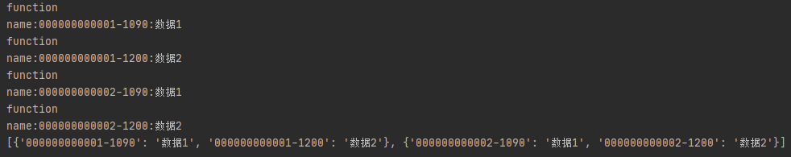
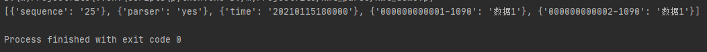
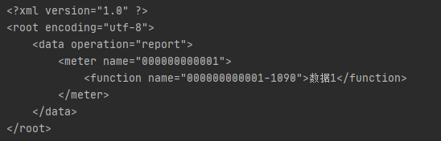
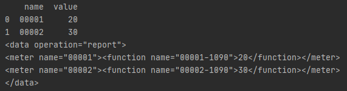
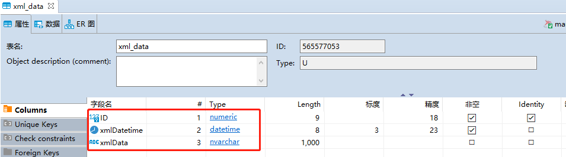
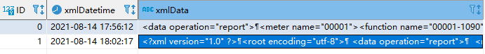

Python
<a name="R3DSJ"></a>
## 前言
物联网应用过程中，设备采集数据后，一般通过终端采集器网关转发或web server服务打包成xml或json数据格式传输到数据中心或云平台，最后经数据解析、数据分析及数据可视化。开发环节涉及末端设备数据采集、数据转发、数据解析等流程。<br />实际业务场景：主要介绍两种常见的数据包格式及使用方法，这里主要介绍xml实际应用，包括对采集数据如何打包、入库、解析。结合实际代码示例演示。
<a name="mBu17"></a>
## JSON与XML简介
JSON是一种轻量级的数据交换格式，易于阅读和编写。同时便于机器解析和生成。xml作为常见的数据格式，物联网应用中依然常见。XML可扩展标记性语言是一种非常常用的文件类型，主要用于存储和传输数据。

1. XML是web中交换和传输数据中最常用的格式之一，很多的web server协议都是基于XML进行定义。
2. JSON和XML是web传输中常见的两种文本格式。相比JSON，XML格式严格规范，更容易传输更加复杂的数据。
3. XML天生有很好的扩展性；XML有丰富的编码工具，Python解析xml常见的三种方法：DOM、sax及ElementTree。DOM将整个xml读入内存并解析为树，缺点占用内存大且解析慢，优点可以任意遍历树的节点。SAX是流模式，边读边解析，占用内存小，解析快，缺点需要自己处理事件。
4. JSON具有简单直观；可以直接与JavaScript、Python等语言中的对象兼容；作为数据包格式传输的时候具有更高的效率（不像XML有闭合标签，节省资源）。
<a name="eNrDl"></a>
## JSON与XML数据格式
<a name="PRLmg"></a>
### Json数据格式
名称/值对，数据由逗号分隔，花括号保存对象，方括号保存数组。Json的值可以为数字、字符串、逻辑值、数组（在方括号中）、对象（在花括号中）、null<br /> json对象在花括号中书写，可以包含多个名称、值对，如
```python
{"name"："server1"，"value"：30}
```
json的数组在方括号中书写，可包含多个对象，如
```python
{"server":
 [
     {"name":"server2","value":30},
     {"name":"server2","value":40},
     {"name":"server3","value":50}
 ]
}
```
<a name="ln5Dm"></a>
#### json模块操作JSON格式
Python的json模块序列化和反序列化的过程分别为`encoding`和`decoding`。序列化`serialization`就是将对象的状态信息转换为可以存储或可以通过网络传输的过程，传输的格式可以为JSON、xml等。反序列化就是从存储区域读取反序列化对象的状态，并重新创建该对象。
<a name="hrxCZ"></a>
##### 1、`encoding`编码：把一个Python对象编码转换为JSON字符串。
<a name="eFIIK"></a>
###### 1）`json.dumps()`
格式化数据：`**indent**`**参数缩进**，是的存储数据格式更优雅，增强可读性。<br />压缩数据：JSON主要作为一种数据通信的格式存在，网络数据很在乎数据大小的，无用的空格会占据很多通信带宽，所以需要对数据进行压缩。`separator`参数，该参数传递的是一个元组，包含分隔对象的字符串。<br />Python数据类型转JSON转换对照表
```python
dict--->object,list
tuple--->array,str
unicode--->string,int
float--->number
True--->true
False--->false
None--->null
```
<a name="FWpMK"></a>
###### 2）`json.dump()`
将Python的数据对象转换成JSON数据并写入文件。
```python
import json
data = {"a": 1, "b": 2}
with open('dump.json','w')as f:
    json.dump(data,f)
```
<a name="iJB1P"></a>
##### 2、`decoding`解码：把JSON格式化字符串编码转换为Python对象。
<a name="kQ5S3"></a>
###### 1）`json.loads()`
解码JSON数据并返回Python字段的数据类型。
```python
import json

org_json='{"a": 1，"b": 2}'

decode_json=json.loads(org_json)

decode_json["a"]
```
<a name="hUtGK"></a>
###### 2、`json.load()`
从json数据文件中读取数据，并将Json编码的字符串转换为Python的数据结构。
```python
import json

with open（"dump.json",'r'）as f:
   data= json.load（f）
```
<a name="xzC1Y"></a>
### xml数据格式
```xml
<root>
    <animal id='1'>
         <name>dog</name>
         <age>2</age>
    </animal>
    <animal id='2'>
         <name>tiger</name>
         <age>3</age>
    </animal>
</root>
```
XML具有以下特征：<br />1、由标签对组成：`<root></root>`<br />2、标签可以有属性：`<animal id='1'>`<br />3、标签对可以嵌入数据：`<name>tiger</name>`<br />4、标签可以注入子标签，具有层次关系
```xml
<root>
    <animal >
    </animal>
</root>
```
<a name="YKogU"></a>
## 扩展1：已有xml包+指定节点解析
测试xml数据包
```xml
<?xml version="1.0" encoding="UTF-8"?> 
<root> 
  <common> 
    <building_id>xxxxxx</building_id>  
    <gateway_id>01</gateway_id>  
    <type>report</type> 
  </common> 

  <data operation="report"> 
    <sequence>25</sequence>  
    <parser>yes</parser>  
    <time>20210115180000</time> 
    
    <meter id="1" name="000000000001" conn="conn">
      <function id="1" name="000000000001-1090" coding="01A10" error="192" sample_time="20210115175909">数据1</function> 
      <function id="2" name="000000000001-1200" coding="XXX" error="XXX" sample_time="YYYYMMDDHHMMSS">数据2</function>
    </meter>  
    
    <meter id="2" name="000000000002" conn="conn"> 
      <function id="1" name="000000000002-1090" coding="01A10" error="192" sample_time="20210115175900">数据1</function> 
      <function id="2" name="000000000002-1200" coding="XXX" error="XXX" sample_time="YYYYMMDDHHMMSS">数据2</function>
    </meter>

  </data> 
</root>
```
解析代码
```python
#导入解析模块
import xml.etree.ElementTree as ET
#加载xml文件
root=ET.parse("test.xml")
# animal_node=root.getiterator("meter")  #过时
#获取指定节点
meter_node=root.getroot().iter(tag="meter")

def iter_records(meter_node):

    for node in meter_node:
        # 保存字典
        temp_dict = {}
        # animal_node_child = node.getchildren()[0]   #方法过时
        for i in range(len(node)):
            #方法一：
            meter_node_child=[i for i in node][i]
            #方法二
            # meter_node_child=list(node)[i]
            # print(meter_node_child)
            print(meter_node_child.tag+"\n"+"name:"+meter_node_child.attrib["name"]+":"+meter_node_child.text)

            temp_dict[meter_node_child.attrib['name']] = meter_node_child.text

            # 生成值
        yield temp_dict

print(list(iter_records(meter_node)))
```

<a name="AljDB"></a>
## 扩展2：已有xml包+所有节点解析
```python
import xml.etree.ElementTree as ET
# # #加载xml文件
root=ET.parse("test.xml")

# #获取指定节点
meter_node=root.findall("data")

for meter in meter_node:
    # 保存字典
    lst=[{i.tag: i.text} for i in meter[0:3]]
    for node in meter[3:]:
        meter_node_child = list(node)
        k=[{meter_node_child[i].attrib["name"]:meter_node_child[i].text} for i in range(len(node))][0]
        lst.append(k)
print(lst)
```

<a name="iVQTq"></a>
## 扩展3：xml包创建+格式化输出
```python
import xml.etree.ElementTree as ET
#格式化数据包
def write_xml():
    # 创建elementtree对象，写入文件
    root=xml_encode()
    tree = ET.ElementTree(root)
    tree.write("new1.xml")
    with open(r'new1.xml', 'r', encoding="utf-8") as file:
        with open(r'new2.xml', 'w+', encoding="utf-8") as xml_file:
            # 用open()将XML文件中的内容读取为字符串再转成UTF-8
            xmlstr = file.read().encode('utf-8')
            import xml.dom.minidom
            xml = xml.dom.minidom.parseString(xmlstr)
            xml_pretty_str = xml.toprettyxml()
            print(xml_pretty_str)
            xml_file.write(xml_pretty_str)
    return xml_pretty_str
    
#创建xml
def xml_encode():
    # 创建根节点
    root=ET.Element("root",encoding="utf-8")
    #创建子节点sub1，并为其添加属性
    sub1=ET.SubElement(root,"data")
    sub1.attrib={"operation":"report"}

    #创建子节点sub2，并为其添加数据
    sub2=ET.SubElement(sub1,"meter")
    sub2.attrib={"name":"000000000001"}

    #创建子节点sub3，并为其添加数据
    sub3=ET.SubElement(sub2,"function")
    sub3.attrib={"name":"000000000001-1090"}
    sub3.text="数据1"

    return root

write_xml()
```

<a name="DPM2v"></a>
## 扩展4：外部数据+xml创建
```python
import pandas as pd

def write_xml(data):

    # 以写入打开文件
    with open("new2.xml", 'w') as xmlFile:
        # 写入头部
        xmlFile.write('<?xml version="1.0" encoding="UTF-8"?>\n')

        xmlFile.write('<root>\n')
        body=xml_encode(data)

        # 写数据
        xmlFile.write(body)

        # 写尾部
        xmlFile.write('\n</root>')

def xml_encode(data):
    # 标记data节点开始标签
    xmlItem = ['<data operation="report">']
    # 列表追加，回车成多行
    for i in data.index:
        coding = data.iloc[i][0]
        value = data.iloc[i][1]
        #输入替换的模板：给行中每个字段加固定xml格式
        str_xml = """<meter name="{0}"><function name="{0}-1090">{1}</function></meter>""".format(coding,value)
        xmlItem.append(str_xml)
    # 标记data节点结束标签
    xmlItem.append('</data>')
    # 返回字符串
    xml_str = '\n'.join(xmlItem)  # list 更新成str
    print(xml_str)
    return xml_str

if __name__ == '__main__':
    #测试数据
    data=pd.DataFrame({"name":["00001","00002"],"value":[20,30]})
    #生成数据包
    write_xml(data)
```

<a name="YFkzZ"></a>
## 扩展5：外部数据+xml入库
首先在数据库建立测试表xml_data，三个字段ID：记录id、xmlDatetime：插入时间、xmlData：xml数据包内容<br /><br />将xml插入数据库。
<a name="bmqGE"></a>
## [跨库数据备份还原、迁移工具](https://mp.weixin.qq.com/s?__biz=MzI0NzY2MDA4MA==&mid=2247498197&idx=1&sn=4d0ef699f48482e48c1ed2c111efad3c&scene=21#wechat_redirect)
```python
from datetime import datetime
from tools import get_conn

#数据导入
def xml_sync_to_sqlserver():
    """
    xml数据同步到sqlserver数据库里面
    """
    xmlDatetime = datetime.now()
    conn = None
    try:
        conn = get_conn('LOCAL')
        with conn:
            # 数据文件导入
            with conn.cursor() as cur:
                with open(f'new2.xml', mode='r', encoding='utf-8') as file:
                    xmlData = file.read().rstrip()
                    sql = """insert into xml_data(xmlDatetime,xmlData) values (%s,%s)"""
                    print("插入成功")
                    cur.execute(sql,(xmlDatetime,xmlData))
            conn.commit()

    finally:
        if conn:
            conn.close()
        end =datetime.now()
        s = (end - xmlDatetime).total_seconds()
        print('数据导入: %s, 耗时: %s 秒' % (xmlDatetime, s))
```

