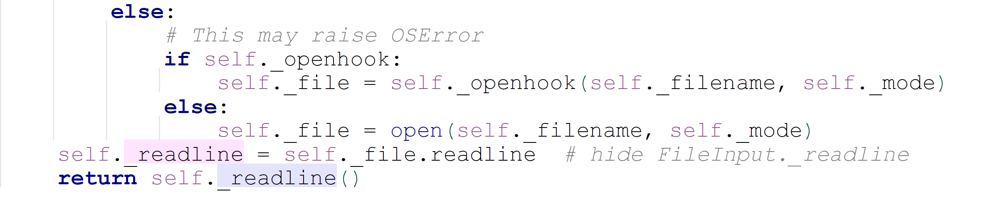

Python open fileinput<br />推荐一个比 `open` 更好用、更优雅的读取文件方法 -- 使用 `fileinput`。`fileinput` 是 Python 的内置模块。
<a name="vUQpw"></a>
## 1、从标准输入中读取
当 Python 脚本没有传入任何参数时，`fileinput` 默认会以 `stdin` 作为输入源
```python
# demo.py
import fileinput
for line in fileinput.input():
    print(line)
```
效果如下，不管输入什么，程序会自动读取并再打印一次，像个复读机一样。
```bash
$ python demo.py 
hello
hello
python
python
```
<a name="lRxk4"></a>
## 2、单独打开一个文件
单独打开一个文件，只需要在 files 中输入一个文件名即可
```python
import fileinput
with fileinput.input(files=('a.txt',)) as file:
    for line in file:
        print(f'{fileinput.filename()} 第{fileinput.lineno()}行: {line}', end='')
```
其中 `a.txt` 的内容如下
```
hello
world
```
执行后就会输出如下
```bash
$ python demo.py
a.txt 第1行: hello
a.txt 第2行: world
```
需要说明的一点是，`fileinput.input()` 默认使用 `mode='r'` 的模式读取文件，如果文件是二进制的，可以使用`mode='rb'` 模式。`fileinput` 有且仅有这两种读取模式。
<a name="XBabf"></a>
## 3、批量打开多个文件
从上面的例子也可以看到，在 `fileinput.input` 函数中传入了 `files` 参数，它接收一个包含多个文件名的列表或元组，传入一个就是读取一个文件，传入多件就是读取多个文件。
```python
import fileinput
with fileinput.input(files=('a.txt', 'b.txt')) as file:
    for line in file:
        print(f'{fileinput.filename()} 第{fileinput.lineno()}行: {line}', end='')
```
`a.txt` 和 `b.txt` 的内容分别是
```bash
$ cat a.txt
hello
world
$ cat b.txt
hello
python
```
运行后输出结果如下，由于 `a.txt` 和 `b.txt` 的内容被整合成一个文件对象 `file` ，因此 `fileinput.lineno()` 只有在读取一个文件时，才是原文件中真实的行号。
```bash
$ python demo.py
a.txt 第1行: hello
a.txt 第2行: world
b.txt 第3行: hello
b.txt 第4行: python
```
如果想要在读取多个文件的时候，也能读取原文件的真实行号，可以使用 `fileinput.filelineno()` 方法
```python
import fileinput
with fileinput.input(files=('a.txt', 'b.txt')) as file:
    for line in file:
        print(f'{fileinput.filename()} 第{fileinput.filelineno()}行: {line}', end='')
```
运行后，输出如下
```python
$ python demo.py
a.txt 第1行: hello
a.txt 第2行: world
b.txt 第1行: hello
b.txt 第2行: python
```
这个用法和 `glob` 模块简直是绝配
```python
import fileinput
import glob
for line in fileinput.input(glob.glob("*.txt")):
    if fileinput.isfirstline():
        print('-'*20, f'Reading {fileinput.filename()}...', '-'*20)
    print(str(fileinput.lineno()) + ': ' + line.upper(), end="")
```
运行效果如下
```bash
$ python demo.py
-------------------- Reading b.txt... --------------------
1: HELLO
2: PYTHON
-------------------- Reading a.txt... --------------------
3: HELLO
4: WORLD
```
<a name="a4Ux4"></a>
## 4、读取的同时备份文件
`fileinput.input` 有一个 `backup` 参数，可以指定备份的后缀名，比如 `.bak`
```python
import fileinput
with fileinput.input(files=("a.txt",), backup=".bak") as file:
    for line in file:
        print(f'{fileinput.filename()} 第{fileinput.lineno()}行: {line}', end='')
```
运行的结果如下，会多出一个 `a.txt.bak` 文件
```bash
$ ls -l a.txt*
-rw-r--r--  1 MING  staff  12  2 27 10:43 a.txt
$ python demo.py
a.txt 第1行: hello
a.txt 第2行: world
$ ls -l a.txt*
-rw-r--r--  1 MING  staff  12  2 27 10:43 a.txt
-rw-r--r--  1 MING  staff  42  2 27 10:39 a.txt.bak
```
<a name="4KGi5"></a>
## 5、标准输出重定向替换
`fileinput.input` 有一个 `inplace` 参数，表示是否将标准输出的结果写回文件，默认不取代<br />请看如下一段测试代码
```python
import fileinput
with fileinput.input(files=("a.txt",), inplace=True) as file:
    print("[INFO] task is started...") 
    for line in file:
        print(f'{fileinput.filename()} 第{fileinput.lineno()}行: {line}', end='') 
    print("[INFO] task is closed...")
```
运行后，会发现在 `for` 循环体内的 `print` 内容会写回到原文件中了。而在 `for` 循环体外的 `print` 则没有变化。
```bash
$ cat a.txt
hello
world
$ python demo.py
[INFO] task is started...
[INFO] task is closed...
$ cat a.txt 
a.txt 第1行: hello
a.txt 第2行: world
```
利用这个机制，可以很容易的实现文本替换。
```python
import sys
import fileinput
for line in fileinput.input(files=('a.txt', ), inplace=True):
    #将Windows/DOS格式下的文本文件转为Linux的文件
    if line[-2:] == "\r\n":  
        line = line + "\n"
    sys.stdout.write(line)
```
附：实现 DOS 和 UNIX 格式互换以供程序测试，使用 vim 输入如下指令即可
```
DOS转UNIX：:setfileformat=unix
UNIX转DOS：:setfileformat=dos
```
<a name="AmrZy"></a>
## 6、其他方法
如果只是想要 `fileinput` 当做是替代 open 读取文件的工具，那么以上的内容足以满足要求。
<a name="L70FQ"></a>
### `fileinput.filenam()`返回当前被读取的文件名
在第一行被读取之前，返回 `None`。
<a name="5DqWA"></a>
### `fileinput.fileno()`返回以整数表示的当前文件“文件描述符”
当未打开文件时（处在第一行和文件之间），返回 `-1`。
<a name="RDzC5"></a>
### `fileinput.lineno()`返回已被读取的累计行号
在第一行被读取之前，返回 `0`。在最后一个文件的最后一行被读取之后，返回该行的行号。
<a name="uwrQ0"></a>
### `fileinput.filelineno()`返回当前文件中的行号
在第一行被读取之前，返回 `0`。在最后一个文件的最后一行被读取之后，返回此文件中该行的行号。<br />但若要想基于 fileinput 来做一些更加复杂的逻辑，也许会需要用到如下这几个方法
<a name="Q7c6p"></a>
### `fileinput.isfirstline()`
如果刚读取的行是其所在文件的第一行则返回 `True`，否则返回 `False`。
<a name="ee7262fe"></a>
### `fileinput.isstdin()`
如果最后读取的行来自 `sys.stdin` 则返回 `True`，否则返回 `False`。
<a name="72610b8e"></a>
### `fileinput.nextfile()`
关闭当前文件以使下次迭代将从下一个文件（如果存在）读取第一行；不是从该文件读取的行将不会被计入累计行数。直到下一个文件的第一行被读取之后文件名才会改变。在第一行被读取之前，此函数将不会生效；它不能被用来跳过第一个文件。在最后一个文件的最后一行被读取之后，此函数将不再生效。
<a name="QTb9V"></a>
### `fileinput.close()`关闭文件流
<a name="ms3qn"></a>
## 7. 进阶一点的玩法
在 `fileinput.input()` 中有一个 `openhook` 的参数，它支持用户传入自定义的对象读取方法。<br />若没有传入任何的勾子，`fileinput` 默认使用的是 `open` 函数。<br /><br />`fileinput`  内置了两种勾子供开发者使用

1. `fileinput.hook_compressed(*filename*, *mode*)`<br />使用 `gzip` 和 `bz2` 模块透明地打开 gzip 和 bzip2 压缩的文件（通过扩展名 `'.gz'` 和 `'.bz2'` 来识别）。如果文件扩展名不是 `'.gz'` 或 `'.bz2'`，文件会以正常方式打开（即使用 `open()` 并且不带任何解压操作）。使用示例: `fi = fileinput.FileInput(openhook=fileinput.hook_compressed)`
2. `fileinput.hook_encoded(*encoding*, *errors=None*)`<br />返回一个通过 `open()` 打开每个文件的钩子，使用给定的 _encoding_ 和 _errors_ 来读取文件。使用示例: `fi = fileinput.FileInput(openhook=fileinput.hook_encoded("utf-8", "surrogateescape"))`

如果遇到比较特殊的场景，以上的三种勾子都不能满足要求，也可以自定义。<br />举个例子来抛砖引玉下<br />假如想要使用 `fileinput` 来读取网络上的文件，可以这样定义勾子。

1. 先使用 `requests` 下载文件到本地
2. 再使用 `open` 去读取它
```python
def online_open(url, mode):
    import requests
    r = requests.get(url) 
    filename = url.split("/")[-1]
    with open(filename,'w') as f1:
        f1.write(r.content.decode("utf-8"))
    f2 = open(filename,'r')
    return f2
```
直接将这个函数传给 `openhook` 即可
```python
import fileinput
file_url = 'https://www.csdn.net/robots.txt'
with fileinput.input(files=(file_url,), openhook=online_open) as file:
    for line in file:
        print(line, end="")
```
运行后按预期一样将 CSDN 的 robots 的文件打印了出来
```
User-agent: * 
Disallow: /scripts 
Disallow: /public 
Disallow: /css/ 
Disallow: /images/ 
Disallow: /content/ 
Disallow: /ui/ 
Disallow: /js/ 
Disallow: /scripts/ 
Disallow: /article_preview.html* 
Disallow: /tag/
Disallow: /*?*
Disallow: /link/
Sitemap: https://www.csdn.net/sitemap-aggpage-index.xml
Sitemap: https://www.csdn.net/article/sitemap.txt
```
<a name="M08aG"></a>
## 8、列举一些实用案例
<a name="1efadf1a"></a>
### 案例一：读取一个文件所有行
```python
import fileinput
for line in fileinput.input('data.txt'):
    print(line, end="")
```
<a name="Ax7Wb"></a>
### 案例二：读取多个文件所有行
```python
import fileinput
import glob
for line in fileinput.input(glob.glob("*.txt")):
    if fileinput.isfirstline():
        print('-'*20, f'Reading {fileinput.filename()}...', '-'*20)
    print(str(fileinput.lineno()) + ': ' + line.upper(), end="")
```
<a name="8vKAf"></a>
### 案例三：利用fileinput将CRLF文件转为LF
```python
import sys
import fileinput
for line in fileinput.input(files=('a.txt', ), inplace=True):
    #将Windows/DOS格式下的文本文件转为Linux的文件
    if line[-2:] == "\r\n":  
        line = line + "\n"
    sys.stdout.write(line)
```
<a name="d6f57526"></a>
### 案例四：配合 `re` 做日志分析：取所有含日期的行
样本文件：error.log
```
aaa
1970-01-01 13:45:30  Error: **** Due to System Disk spacke not enough...
bbb
1970-01-02 10:20:30  Error: **** Due to System Out of Memory...
ccc
```
```python
#---测试脚本---
import re
import fileinput
import sys
pattern = '\d{4}-\d{2}-\d{2} \d{2}:\d{2}:\d{2}'
for line in fileinput.input('error.log',backup='.bak',inplace=1):
    if re.search(pattern,line):
        sys.stdout.write("=> ")
        sys.stdout.write(line)
```
测试结果
```python
=> 1970-01-01 13:45:30  Error: **** Due to System Disk spacke not enough...
=> 1970-01-02 10:20:30  Error: **** Due to System Out of Memory...
```
<a name="EEC1x"></a>
### 案例五：利用`fileinput`实现类似于`grep`的功能
```python
import sys
import re
import fileinput
pattern= re.compile(sys.argv[1])
for line in fileinput.input(sys.argv[2]):
    if pattern.match(line):
        print(fileinput.filename(), fileinput.filelineno(), line)
$ ./demo.py import.*re *.py
#查找所有py文件中，含import re字样的
addressBook.py  2   import re
addressBook1.py 10  import re
addressBook2.py 18  import re
test.py         238 import re
```
<a name="tWFQh"></a>
## 9、总结
`fileinput` 是对 `open` 函数的再次封装，在仅需读取数据的场景中， `fileinput` 显然比 `open` 做得更专业、更人性化，当然在其他有写操作的复杂场景中，fileinput 就无能为力啦，本身从 fileinput 的命名上就知道这个模块只专注于输入（读）而不是输出（写）。
