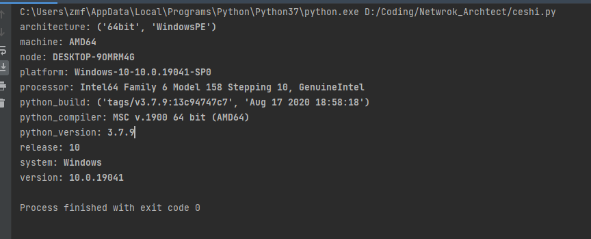
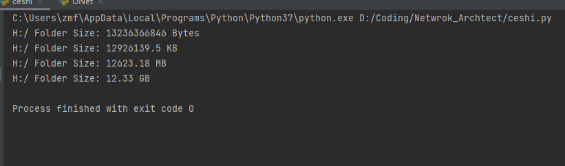

Python
<a name="S2rOT"></a>
## 1、批量修改文件名
日常工作中，可能会有这样的需求：把一个文件夹下所有 jpg 图片转化为 png ；假设文件夹下只有4、5 张，手动修改的话是没问题，但如果数量达到上百张，就有点让人头疼，这个代码块正是用来解决此类问题的
```python
import os

def batch_rename(work_dir, old_ext, new_ext):
    # files = os.listdir(work_dir)
    for filename in os.listdir(work_dir):
        # Get the file extension
        split_file = os.path.splitext(filename)
        # Unpack tuple element
        root_name, file_ext = split_file
        # Start of the logic to check the file extensions, if old_ext = file_ext
        if old_ext == file_ext:
            # Returns changed name of the file with new extention
            newfile = root_name + new_ext

            # Write the files
            os.rename(
                os.path.join(work_dir, filename),
                os.path.join(work_dir, newfile)
            )
    print("rename is done!")
    print(os.listdir(work_dir))
```
<a name="N9wRR"></a>
## 2、返回文件夹下所有指定文件名
有时需要统计一下当前文件夹下中包含全部的 png 文件或者说含有 png 图片数量，此功能常用于文件检索；标准库 os 虽然有一些很强大的函数，但没有一个能满足这个需求，那么下面的这个代码块能够起作用。
```python
def get_filename(path,filetype):  # 输入路径、文件类型 例如'.csv'
    name = []
    for root,dirs,files in os.walk(path):
        for i in files:
            if filetype+' ' in i+' ':    # 这里后面不加一个字母可能会出问题，加上一个（不一定是空格）可以解决99.99%的情况
                name.append(i)        
    return name            # 输出由有后缀的文件名组成的列表
```
<a name="DRSBm"></a>
## 3、文件夹不存在时自动创建
这个功能在日常开发办公中会经常用到，主要用到了 os 模块的两个函数

- `os.path.exists(path)` 判断文件夹是否存在；
- `os.makedirs(path)` 创建文件夹
```python
import os  # Import the OS module

MESSAGE = 'The directory already exists.'
TESTDIR = 'testdir'
try:
    home = os.path.expanduser("~")  
    print(home)  # Print the location

    if not os.path.exists(os.path.join(home, TESTDIR)):  # os.path.join() for making a full path safely
        os.makedirs(os.path.join(home, TESTDIR))  # If not create the directory, inside their home directory
    else:
        print(MESSAGE)
except Exception as e:
    print(e)
```
<a name="vskWQ"></a>
## 4、打印当前运行环境
如果想利用 Python 脚本快速查看当前电脑的系统(Linux、Windows)、架构(32位还是 64 位)、处理器、Python 版本及运行环境等信息，下面这个代码块能够起作用。
```python
import platform as pl

profile = [
    'architecture',
    'machine',
    'node',
    'platform',
    'processor',
    'python_build',
    'python_compiler',
    'python_version',
    'release',
    'system',
    'version',
]


class bcolors:
    HEADER = '\033[95m'
    OKBLUE = '\033[94m'
    OKGREEN = '\033[92m'
    WARNING = '\033[93m'
    FAIL = '\033[91m'
    ENDC = '\033[0m'
    BOLD = '\033[1m'
    UNDERLINE = '\033[4m'


for key in profile:
    if hasattr(pl, key):
        print(key + bcolors.BOLD + ": " + str(getattr(pl, key)()) + bcolors.ENDC)
```

<a name="Ipbzl"></a>
## 5、获取指定文件夹下内存大小
日常工作中这个模块可能用不到，查看文件大小的话用代码跑还不如直接鼠标右键查看该文件的属性信息；但是，对于以后开发工作中，可以将此功能镶嵌到开发的软件中，作为一个 监控文件夹内存大小 的功能存在
```python
import os
import sys  # Load the library module and the sys module for the argument vector'''

try:
    directory = "H:/" # Set the variable directory to be the argument supplied by user.
except IndexError:
    sys.exit("Must provide an argument.")

dir_size = 0  # Set the size to 0
fsizedicr = {'Bytes': 1,
             'KB': float(1) / 1024,
             'MB': float(1) / (1024 * 1024),
             'GB': float(1) / (1024 * 1024 * 1024)}
for (path, dirs, files) in os.walk(
        directory):
    for file in files:  # Get all the files
        filename = os.path.join(path, file)
        dir_size += os.path.getsize(filename)  # Add the size of each file in the root dir to get the total size.

fsizeList = [str(round(fsizedicr[key] * dir_size, 2)) + " " + key for key in fsizedicr]  # List of units

if dir_size == 0:
    print("File Empty")  # Sanity check to eliminate corner-case of empty file.
else:

    for units in sorted(fsizeList)[::-1]:  # Reverse sort list of units so smallest magnitude units print first.
        print("{} Folder Size: ".format(directory)+ units)
```

<a name="ZGGeN"></a>
## 6、定时关机或重启
os 中 system 函数可通过设定一些参数，实现开关机包含定时命令；另外声明一下，此代码块仅供科普，如果正在用电脑的话请勿尝试。
```python
import os
from os import system

# 关机
# os.system("shutdown -s -t  60 ")

# 重启
system("shutdown -r -t 100")
```
