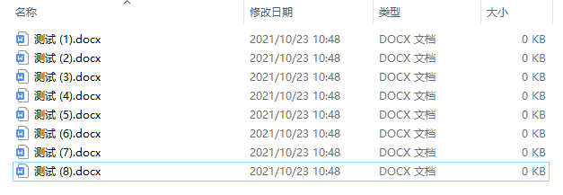
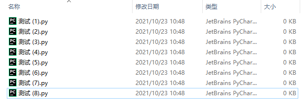
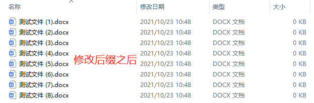

Python<br />Python创建读取和写出的文件对象，用`open()`方法来搞定，他有两个参数，第一个就是读取的文件名称，第二个是可选的，指的是打开文件的模式，默认是读取文件。
```python
# 读取文件对象
fin = open('data.json')

# 写出文件对象
fout = open('data.json', 'w')
```
当获取到读取文件对象fin之后就可以读取文件内容了，这里介绍两种方式。
```python
# 读取文件全部内容
all_data = fin.read()

# 按行读取文件内容
for line in fin:
    print(line)
```
第一种是直接读取文件内容，第二种是按行读取文件内容。<br />区别在于如果文件非常大，如果直接读取效率会非常低下，甚至会撑爆内存。所以按行读取按行处理就不会因为文件过大而产生问题了，文件读取完成之后写出文件有如下方式：
```python
# 写出一行数据到文件
fout.write('abc\n')
```
`'\n'`的意思是手动换行，最后关闭文件有两种方式，为什么要关闭文件呢？<br />如果不关闭他就会持续打开状态，琐事其他进程后者线程要操作它的时候就会报错，有时候写入非常大的数据的时候打开文件后会发现数据不是最新的？这是因为Python在写出文件是先写到内存中，等到一定的事件之后或者文件到达一定的数量之后才会写入到磁盘，所以如果想要看最新的数据，可直接调用如下方法
```python
# 写出大文件刷新到内存
fout.flush()
```
接下来使用数据进行测试。
<a name="B8sJw"></a>
## 1、文件读操作
文件读、写操作比较常见。读取文件，要先判断文件是否存在。若文件存在，再读取；不存在，抛出文件不存在异常。<br />文件存在情况：
```python
def read_file(fileName):
    # 检查文件是否存
    if not os.path.exists(fileName):
        raise FileNotFoundError(f'{fileName} not found!')
    fin = open(fileName)
    data = fin.read()
    print(data)
    fin.close()
    return data

if __name__ == '__main__':
    read_file(fileName='input.txt')
    
  '''
  47
  27
  91
  58
  45
  55
  58
  '''
```
文件不存在情况：
```python
def read_file(fileName):
    # 检查文件是否存
    if not os.path.exists(fileName):
        raise FileNotFoundError(f'{fileName} not found!')
    fin = open(fileName)
    data = fin.read()
    print(data)
    fin.close()
    return data

'''
FileNotFoundError: input666.txt not found!
'''
```
`open` 后，务必要 `close`，这种写法有些繁琐，还容易出错。借助 `with` 语法，同时实现 `open` 和 `close` 功能，这是更常用的方法。
```python
import os

file_path = r'.\输出到这里'
file_name = 'output.txt'

# 判断文件夹是否存在
def write_to_file(file_path,file_name):
    if os.path.exists(file_path) is False:
        os.mkdir(file_path)


    whole_path_filename = os.path.join(file_path, file_name)
    print(whole_path_filename)

    to_write_content = ''' 
                        You got your tongue pierced once
                        And you say you got another
                        That you can't show anyone unless it's under covers
                        But you're running around showing everyone your new tattoo
                        You got an A in class and you hope no one would notice
                        You're the smartest kid in school and it makes you self conscious
                        And your loser boyfriend's smoking out in the boy's room
                        I wish someone would tell you
                        You're a star the way you are
                        You know you're not fooling anyone, no
                        You got the eyes of an angel
                        Don't try to change, yeah
                        '''
    with open(whole_path_filename, mode="w", encoding='utf-8') as f:
        f.write(to_write_content)
    print('-------数据写入完毕！--------')
```
<a name="QiPgr"></a>
## 2、获取文件的后缀名
如何优雅地获取文件后缀名？`os.path` 模块，`splitext` 能够优雅地提取文件后缀。
```python
def find_file(work_dir):
    file_extension = os.path.splitext(work_dir)

    file_path = file_extension[0]

    file_suff = file_extension[1]

    ic(file_path)
    ic(file_suff)

if __name__ == '__main__':

    file = find_file(r'Z:\test\测试文件.docx')
    
'''
ic| file_path: 'Z:\\test\\测试文件'
ic| file_suff: '.docx'
'''
```
<a name="qcSGD"></a>
## 3、批量修改文件后缀名
修改之前<br /><br />修改文件后缀名的文件方法如下：
```python
def find_file(work_dir, extension):
    lst = []
    for filename in os.listdir(work_dir):
        splits = os.path.splitext(filename)
        ext = splits[1] 
        if ext == '.'+extension:
            lst.append(filename)
    return lst

if __name__ == '__main__':
    
    file = find_file(r'Z:\test','docx')
    print(file)
  
'''
['测试文件 (2).docx', '测试文件 (3).docx', '测试文件 (4).docx', '测试文件 (5).docx', '测试文件 (6).docx', '测试文件 (7).docx', '测试文件 (8).docx', '测试文件.docx']
'''
```
从修改之后：<br />
<a name="pSVbU"></a>
## 4、获取文件名
有时拿到一个文件名时，名字带有路径。这时，使用 `os.path`、`split` 方法实现路径和文件的分离。
```python
import os

def exact_suff(file_path_name):

    file_ext = os.path.split(file_path_name)
    ipath, ifile = file_ext

'''
ic| ipath: 'Z:\\write1.txt'
ic| ifile: 'python.txt'
'''
```
还可以直接使用使用`os.path` 模块，`splitext` 提取文件后缀名。
```python
import os

def exact_suff(file_path_name):

    file_ext = os.path.splitext(file_path_name)
    file_name = file_ext[0]
    file_suff = file_ext[1]

'''
ic| file_name: 'Z:\\write1.txt\\python'
ic| file_suff: '.txt'
'''
```
<a name="dxzlI"></a>
## 5、获取以指定后缀结尾的文件
当想要查询某路径下所有以固定后缀结尾的文件时，可以使用如下方法
```python
import os

def find_file(work_dir, exten_name):
    # 存储文件列表
    lst = []
    # 便利指定路径所以文件
    for filename in os.listdir(work_dir):
        # 获取文件扩展名
        splits = os.path.splitext(filename)
        ext = splits[1]

        # 如果是指定结尾的文件则加入列表
        if ext == '.' + exten_name:
            lst.append(filename)
    return lst

if __name__ == '__main__':
    # 找出当前路径下的所有以py结尾的文件
    file = find_file('.', 'py')
    ic(file)  # 返回所有目录下的 md 文件
    
  '''
  ic| file: ['test.py', '__init__.py']
  '''
```
<a name="zMU9x"></a>
## 6、批量修改文件后缀名
后缀名批量修改，实现思路：

1. 遍历目录下的所有文件
2. 获取文件的后缀名
3. 如果后缀名命中为 old_ext，rename 重命名


```python
def batch_rename(work_dir, old_ext, new_ext):
    """
    传递当前目录，原来后缀名，新的后缀名后，批量重命名后缀
    """
    for filename in os.listdir(work_dir):
        # 获取得到文件后缀
        split_file = os.path.splitext(filename)
        file_ext = split_file[1]
        ic(file_ext)
        if old_ext == file_ext: # 定位后缀名为old_ext 的文件
            newfile = split_file[0] + new_ext # 修改后文件的完整名称
            ic(newfile)
            # 实现重命名操作
            os.rename(
                os.path.join(work_dir, filename),
                os.path.join(work_dir, newfile)
            )
    print("完成重命名！")
    print(os.listdir(work_dir))

if __name__ == '__main__':
    batch_rename(r'Z:\test', '.py', '.docx')
```

<a name="gzCSU"></a>
## 7、批量获取文件修改时间
`os.walk` 生成文件树结构，`os.path.getmtime` 返回文件的最后一次修改时间：
```python
print(f"当前时间：{datetime.now().strftime('%Y-%m-%d %H:%M:%S')}")

def get_modify_time(indir):
    for root, _, files in os.walk(indir):  # 循环目录和子目录
        for file in files:
            whole_file_name = os.path.join(root, file)
            modify_time = os.path.getmtime(whole_file_name) # 1581164725.991523，这种时间格式太不人性化
            nice_show_time = datetime.fromtimestamp(modify_time) # 转化为人性化的时间显示格式：2020-02-08 20:25:25.991523
            print('文件 %s 最后一次修改时间：%s' %(file,nice_show_time))


if __name__ == '__main__':
    get_modify_time(r'Z:\test')
  
'''
当前时间：2021-10-23 11:24:19
文件 测试文件 (1).docx 最后一次修改时间：2021-10-23 10:48:16.313513
文件 测试文件 (2).docx 最后一次修改时间：2021-10-23 10:48:16.313513
文件 测试文件 (3).docx 最后一次修改时间：2021-10-23 10:48:16.313513
文件 测试文件 (4).docx 最后一次修改时间：2021-10-23 10:48:16.313513
文件 测试文件 (5).docx 最后一次修改时间：2021-10-23 10:48:16.313513
文件 测试文件 (6).docx 最后一次修改时间：2021-10-23 10:48:16.313513
文件 测试文件 (7).docx 最后一次修改时间：2021-10-23 10:48:16.313513
文件 测试文件 (8).docx 最后一次修改时间：2021-10-23 10:48:16.313513
'''
```

