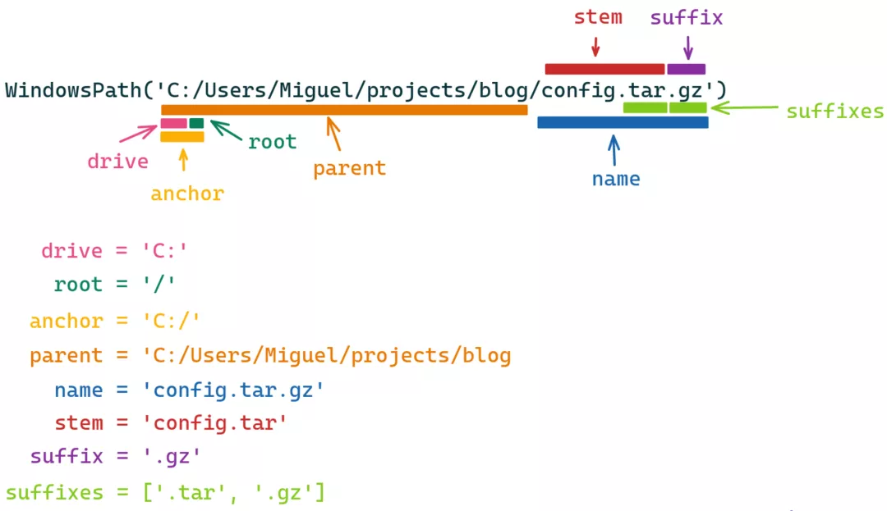
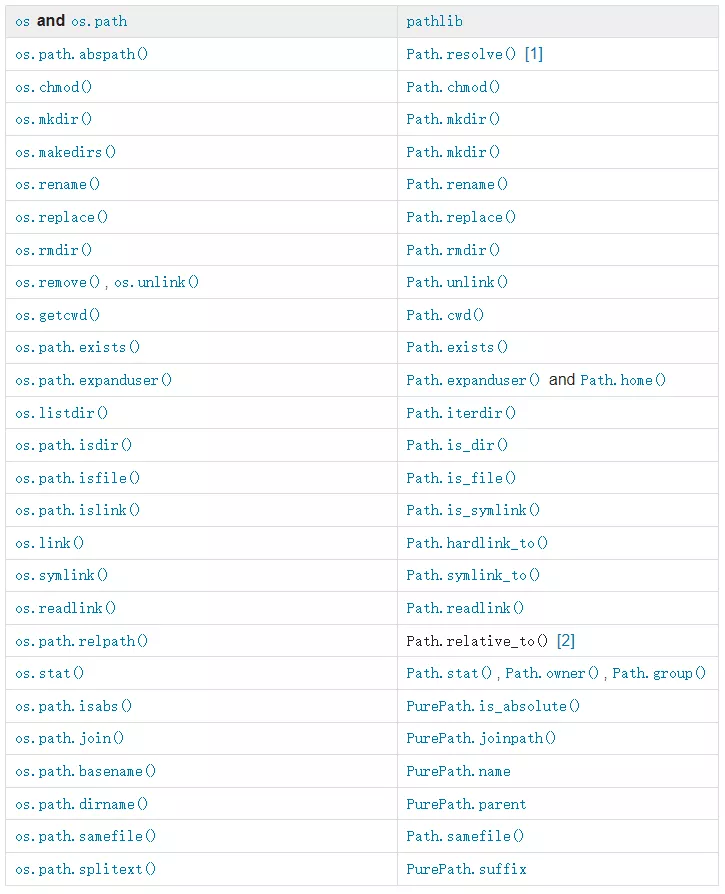
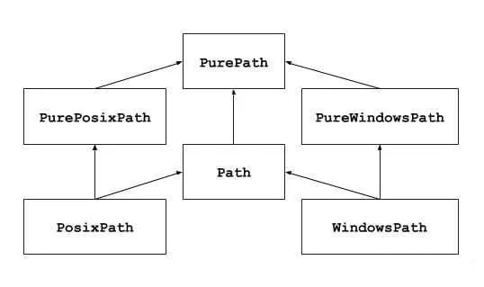

Python <br />在进行文件操作和数据处理时，经常会处理路径问题。最常用和常见的是 `os.path` 模块，它将路径当做字符串进行处理，如果使用不当可能导致难以察觉的错误，而且代码很难跨平台复用。`pathlib` 就是一个非常棒的Python标准库，超级好用。<br />`pathlib`模块提供了一种在 POSIX 系统（如 Linux 和 Windows）下运行良好的高级抽象，它抽象了资源路径和资源命名结构，把文件系统接口从os模块中隔离出来，将操作作为方法提供，使用更简单。<br />下面这张图，完美诠释`pathlib`的核心<br /><br />pathlib 基本组件
```python
>>> from pathlib import Path

>>> path = Path(r'C:/Users/Miguel/projects/blog/config.tar.gz')

>>> path.drive
'C:'

>>> path.root
'/'

>>> path.root
'C:/'

>>> path.parent
WindowsPath('C:/Users/Miguel/projects/blog')

>>> path.name
'config.tar.gz'

>>> path.stem
'config.tar'

>>> path.suffix
'.gz'

>>> path.suffixes
['.tar', '.gz']
```
<a name="sJQow"></a>
### 常用属性和基本方法
<a name="C5tup"></a>
#### `pathlib`的常用属性
```python
Path.parents  # 返回所有上级目录的列表

Path.parts  # 分割路径 类似os.path.split(), 不过返回元组

Path.suffix   # 返回文件后缀
```
<a name="jMw8V"></a>
#### `pathlib`的常用基本方法
```python
Path.is_dir()  # 判断是否是目录

Path.is_file()  # 是否是文件

Path.exists()  # 判断路径是否存在

Path.open()  # 打开文件(支持with)

Path.resolve()  # 返回绝对路径

Path.cwd()  # 返回当前目录

Path.iterdir()  # 遍历目录的子目录或者文件

Path.mkdir()  # 创建目录

Path.rename()  # 重命名路径

Path.unlink()  # 删除文件或目录(目录非空触发异常)

Path.joinpath()  # 拼接路径
```
<a name="Pru1z"></a>
### `os` and `os.path` VS `pathlib`
pathlib 可替代 os 和 `os.path` 的常用功能：<br />
<a name="tTnsu"></a>
### `pathlib` vs `os`
先看下使用对比：比如说
<a name="CL215"></a>
#### 打印当前的路径
使用 `os`：
```python
In [13]: import os

In [14]: os.getcwd()
Out[14]: '/Users/aaron'
```
使用 `pathlib`:
```python
In [15]: from pathlib import Path

In [16]: Path.cwd()
Out[16]: PosixPath('/Users/aaron')
In [17]: print(Path.cwd())
/Users/aaron
```
使用 `print` 打印的结果是一样的，但 `os.getcwd()` 返回的是字符串，而 `Path.cwd()` 返回的是 `PosixPath` 类，还可以对此路径进行后续的操作，会很方便。
<a name="k9Z4j"></a>
#### 判断路径是否存在
使用 `os`:
```python
In [18]: os.path.exists("/Users/aaron/tmp")
Out[18]: True
```
使用 `pathlib`:
```python
In [21]: tmp = Path("/Users/aaron/tmp")

In [22]: tmp.exists()
Out[22]: True
```
可以看出 `pathlib` 更易读，更面向对象。
<a name="Nn9L5"></a>
#### 显示文件夹的内容
```python
In [38]: os.listdir("/Users/aaron/tmp")
Out[38]: ['.DS_Store', '.hypothesis', 'b.txt', 'a.txt', 'c.py', '.ipynb_checkpoints']

In [39]: tmp.iterdir()
Out[39]: <generator object Path.iterdir at 0x7fa3f20d95f0>

In [40]: list(tmp.iterdir())
Out[40]:
[PosixPath('/Users/aaron/tmp/.DS_Store'),
 PosixPath('/Users/aaron/tmp/.hypothesis'),
 PosixPath('/Users/aaron/tmp/b.txt'),
 PosixPath('/Users/aaron/tmp/a.txt'),
 PosixPath('/Users/aaron/tmp/c.py'),
 PosixPath('/Users/aaron/tmp/.ipynb_checkpoints')]
```
可以看出 `Path().iterdir` 返回的是一个生成器，这在目录内文件特别多的时候可以大大节省内存，提升效率。
<a name="xOOXZ"></a>
#### 通配符支持
`os` 不支持含有通配符的路径，但 `pathlib` 可以：
```python
In [45]: list(Path("/Users/aaron/tmp").glob("*.txt"))
Out[45]: [PosixPath('/Users/aaron/tmp/b.txt'), PosixPath('/Users/aaron/tmp/a.txt')]
```
<a name="yi8Lx"></a>
#### 便捷的读写文件操作
这是 `pathlib` 特有的：
```python
f = Path('test_dir/test.txt'))
f.write_text('This is a sentence.')
f.read_text()
```
也可以使用 `with` 语句：
```python
>>> p = Path('setup.py')
>>> with p.open() as f: f.readline()
...
'#!/usr/bin/env python3\n'

```
<a name="Qx73t"></a>
#### 获取文件的元数据
```python
In [56]: p = Path("/Users/aaron/tmp/c.py")

In [57]: p.stat()
Out[57]: os.stat_result(st_mode=33188, st_ino=35768389, st_dev=16777221, st_nlink=1, st_uid=501, st_gid=20, st_size=20, st_atime=1620633580, st_mtime=1620633578, st_ctime=1620633578)

In [58]: p.parts
Out[58]: ('/', 'Users', 'aaron', 'tmp', 'c.py')

In [59]: p.parent
Out[59]: PosixPath('/Users/aaron/tmp')

In [60]: p.resolve()
Out[60]: PosixPath('/Users/aaron/tmp/c.py')

In [61]: p.exists()
Out[61]: True

In [62]: p.is_dir()
Out[62]: False

In [63]: p.is_file()
Out[63]: True

In [64]: p.owner()
Out[64]: 'aaron'

In [65]: p.group()
Out[65]: 'staff'

In [66]: p.name
Out[66]: 'c.py'

In [67]: p.suffix
Out[67]: '.py'

In [68]: p.suffixes
Out[68]: ['.py']

In [69]: p.stem
Out[69]: 'c'
```
<a name="GogCk"></a>
#### 路径的连接 `join`
相比 `os.path.join`，使用一个 / 是不是更为直观和便捷？
```python
>>> p = PurePosixPath('foo')
>>> p / 'bar'
PurePosixPath('foo/bar')
>>> p / PurePosixPath('bar')
PurePosixPath('foo/bar')
>>> 'bar' / p
PurePosixPath('bar/foo')
```
当然，也可以使用 `joinpath` 方法
```python
>>> PurePosixPath('/etc').joinpath('passwd')
PurePosixPath('/etc/passwd')
>>> PurePosixPath('/etc').joinpath(PurePosixPath('passwd'))
PurePosixPath('/etc/passwd')
>>> PurePosixPath('/etc').joinpath('init.d', 'apache2')
PurePosixPath('/etc/init.d/apache2')
>>> PureWindowsPath('c:').joinpath('/Program Files')
PureWindowsPath('c:/Program Files')
```
<a name="jTCzb"></a>
#### 路径匹配
```python
>>> PurePath('a/b.py').match('*.py')
True
>>> PurePath('/a/b/c.py').match('b/*.py')
True
>>> PurePath('/a/b/c.py').match('a/*.py')
False
```
<a name="o1DOD"></a>
### `pathlib` 出现的背景和要解决的问题
`pathlib` 目的是提供一个简单的类层次结构来处理文件系统的路径，同时提供路径相关的常见操作。那为什么不使用 `os` 模块或者 `os.path` 来实现呢？<br />许多人更喜欢使用 `datetime` 模块提供的高级对象来处理日期和时间，而不是使用数字时间戳和 time 模块 API。同样的原因，假如使用专用类表示文件系统路径，也会更受欢迎。<br />换句话说，`os.path` 是面向过程风格的，而 `pathlib` 是面向对象风格的。Python 也在一直在慢慢地从复制 C 语言的 API 转变为围绕各种常见功能提供更好，更有用的抽象。<br />其他方面，使用专用的类处理特定的需求也是很有必要的，例如 Windows 路径不区分大小写。<br />在这样的背景下，`pathlib` 在 Python 3.4 版本加入标准库。
<a name="j6htU"></a>
### `pathlib` 的优势和劣势分别是什么
`pathlib` 的优势在于考虑了 Windows 路径的特殊性，同时提供了带 I/O 操作的和不带 I/O 操作的类，使用场景更加明确，API 调用更加易懂。<br />先看下 `pathlib` 对类的划分：<br /><br />图中的箭头表示继承自，比如 Path 继承自 `PurePath`，`PurePath` 表示纯路径类，只提供路径常见的操作，但不包括实际 I/O 操作，相对安全；Path 包含 PurePath 的全部功能，包括 I/O 操作。<br />`PurePath` 有两个子类，一个是 `PureWindowsPath`，表示 Windows 下的路径，不区分大小写，另一个是 `PurePosixPath`，表示其他系统的路径。有了 `PureWindowsPath`，可以这样对路径进行比较：
```python
from pathlib import PureWindowsPath
>>> PureWindowsPath('a') == PureWindowsPath('A')
True
```
`PurePath` 可以在任何操作系统上实例化，也就是说与平台无关，可以在 unix 系统上使用 `PureWindowsPath`，也可以在 Windows 系统上使用 `PurePosixPath`，他们还可以相互比较。
```python
>>> from pathlib import PurePosixPath, PureWindowsPath, PosixPath  
>>> PurePosixPath('a') == PurePosixPath('b')
False
>>> PurePosixPath('a') < PurePosixPath('b')
True
>>> PurePosixPath('a') == PosixPath('a')
True
>>> PurePosixPath('a') == PureWindowsPath('a')
False
```
可以看出，同一个类可以相互比较，不同的类比较的结果是 False。<br />相反，包含 I/O 操作的类 `PosixPath` 及 `WindowsPath` 只能在对应的平台实例化：
```python
In [8]: from pathlib import PosixPath,WindowsPath

In [9]: PosixPath('a')
Out[9]: PosixPath('a')

In [10]: WindowsPath('a')
---------------------------------------------------------------------------
NotImplementedError                       Traceback (most recent call last)
<ipython-input-10-cc7a0d86d4ed> in <module>
----> 1 WindowsPath('a')

/Library/Frameworks/Python.framework/Versions/3.8/lib/python3.8/pathlib.py in __new__(cls, *args, **kwargs)
   1038         self = cls._from_parts(args, init=False)
   1039         if not self._flavour.is_supported:
-> 1040             raise NotImplementedError("cannot instantiate %r on your system"
   1041                                       % (cls.__name__,))
   1042         self._init()

NotImplementedError: cannot instantiate 'WindowsPath' on your system

In [11]:
```
要说劣势，如果有的话，那就是在选择类时会比较困惑，到底用哪一个呢？其实如果不太确定的话，用 Path 就可以了，这也是它的名称最短的原因，因为更加常用，短点的名称编写的更快。
<a name="IL2aw"></a>
### 适用的场景
如果要处理文件系统相关的操作，选 `pathlib` 就对了。
<a name="IICLK"></a>
### 一些关键点
<a name="P3nTz"></a>
#### 获取家目录
```python
In [70]: from pathlib import Path

In [71]: Path.home()
Out[71]: PosixPath('/Users/aaron')
```
<a name="JT18i"></a>
#### 父目录的层级获取
```python
>>> p = PureWindowsPath('c:/foo/bar/setup.py')
>>> p.parents[0]
PureWindowsPath('c:/foo/bar')
>>> p.parents[1]
PureWindowsPath('c:/foo')
>>> p.parents[2]
PureWindowsPath('c:/')
```
<a name="SuyNF"></a>
#### 获取多个文件后缀
```python
>>> PurePosixPath('my/library.tar.gar').suffixes
['.tar', '.gar']
>>> PurePosixPath('my/library.tar.gz').suffixes
['.tar', '.gz']
>>> PurePosixPath('my/library').suffixes
[]
```
<a name="BxROv"></a>
#### Windows 风格转 Posix
```python
>>> p = PureWindowsPath('c:\\windows')
>>> str(p)
'c:\\windows'
>>> p.as_posix()
'c:/windows'

获取文件的 uri：
>>> p = PurePosixPath('/etc/passwd')
>>> p.as_uri()
'file:///etc/passwd'
>>> p = PureWindowsPath('c:/Windows')
>>> p.as_uri()
'file:///c:/Windows'
```
<a name="FPncG"></a>
#### 判断是否绝对路径
```python
>>> PurePosixPath('/a/b').is_absolute()
True
>>> PurePosixPath('a/b').is_absolute()
False

>>> PureWindowsPath('c:/a/b').is_absolute()
True
>>> PureWindowsPath('/a/b').is_absolute()
False
>>> PureWindowsPath('c:').is_absolute()
False
>>> PureWindowsPath('//some/share').is_absolute()
True
```
<a name="kR5ef"></a>
#### 文件名若有变化
```python
>>> p = PureWindowsPath('c:/Downloads/pathlib.tar.gz')
>>> p.with_name('setup.py')
PureWindowsPath('c:/Downloads/setup.py')
```
<a name="SOAYE"></a>
### 技术的底层原理和关键实现
`pathlib` 并不是基于 str 的实现，而是基于 object 设计的，这样就严格地区分了 Path 对象和字符串对象，同时也用到了一点 `os` 的功能，比如 `os.name`，`os.getcwd` 等，这一点可以看 `pathlib` 的源码了解更多。
<a name="PREx1"></a>
### 结语
虽然 `pathlib` 比 `os` 库更高级，更方便并且提供了很多便捷的功能，但是仍然需要知道如何使用 `os` 库，因为 `os` 库是 Python 中功能最强大且最基本的库之一，但是，在需要一些文件系统操作时，强烈建议使用 pathlib。
